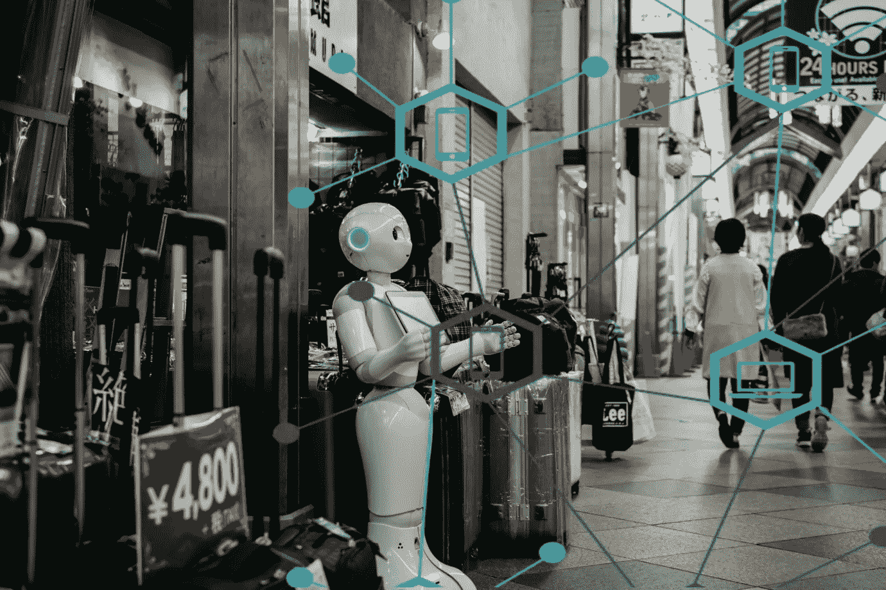
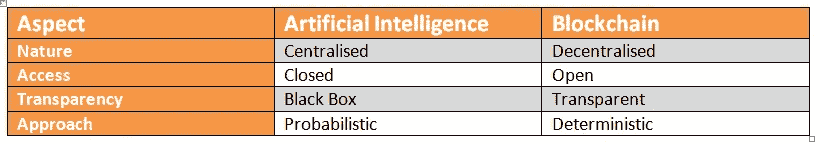

# 人工智能和区块链的融合:提高效率和安全性

> 原文：<https://medium.com/quick-code/convergence-of-ai-and-blockchain-increased-efficiency-and-security-46c481066be9?source=collection_archive---------4----------------------->

人工智能和区块链这两种技术在本质上是矛盾的，它们工作在完全不同的范式上，但将它们融合起来听起来很有希望？不是吗？

如今，公司正在寻求开发结合人工智能和区块链的现实世界商业应用。

## 例如:

JD.com——中国电子商务巨头为人工智能和区块链初创企业推出了一款名为 AI Catapult 的新加速器，以测试支持其技术基础设施的现实应用。

**保时捷**——这家豪华汽车制造商正在利用区块链和人工智能技术，在智能汽车上进行测试，并致力于充电、停车等方面的研究。

**硅谷**——硅谷分析软件公司 Fico 的首席分析官 Scott Zoldi 博士说:*“除了与加密货币的关联，区块链技术将很快记录‘事件的时间链’，应用于合同、互动和事件，”* [ [FICO 博客](http://www.fico.com/en/blogs)。

上面的例子听起来是不是很吸引人？但是这次合并真的有助于做出有效的商业决策吗？或者这只是一个实验？

## 让我们找出答案。

在这篇博客中，我们将尝试并理解区块链如何赞美人工智能。但是，在我们深入这个主题之前，让我们快速了解一下这些技术是如何工作的，以及它们是如何对抗彼此的基本范式的:

# 人工智能和区块链

显而易见，这两种技术是完全相反的，但合并将标志着一个全新范式的开始。

# 融合人工智能和区块链:我们为什么要关心？

AI 使人们理解和分析海量的数据，但数据误用或黑客攻击的机会总是存在的。区块链无法分析数据；但由于它提供了分散的数据库，它可以保护每一个与人工智能有关的数据，从而提高安全性和更快更透明的操作。

***比如说，*** *你有一个人脸检测系统，它作为一个认证器为你开门。如果这个系统中的数据丢失、被复制或被盗怎么办？你可以尝试所有可能的方法，不同的点认证来恢复数据，但不知何故你不能。
然而，做到这一点是一项相当困难的任务，这就是像区块链这样的分布式系统出现的情况。如果你把密钥加密和人工智能算法结合在一起，你就能确保数据的安全，并为你打开大门。*

然而，这两种技术都是相互依赖的，并且都拥有解决对方问题的能力。

# AI 有什么问题？区块链如何克服？

人工智能的问题在于它自身的自由裁量性质。因为它是一个黑匣子，即使是人工智能的所有者也不能完全控制他们自己的创造。由于它是基于概率的，人工智能有可能犯错误，因为错误的数据会导致灾难。因此，为了让人工智能在不久的将来充分发挥潜力，它需要有一定程度的透明度和能力来开发一种安全的方法来获取真实数据，而区块链可以克服这一点

# 区块链有什么问题？AI 如何克服？

根据德勤的数据，验证和分享区块链交易的成本约为 6 亿美元。运行该硬件所消耗的能量导致高成本，浪费是另一个问题。每当任何交易发生时，多个矿工试图验证它，这意味着浪费了大量的能源。人工智能有可能优化这一过程并降低采矿成本。

此外，区块链保留了启动时的所有信息，这导致了更长更重的链。在这种情况下，人工智能可以通过利用机器学习算法，帮助区块链在数据存储和维护方面做出更明智的决定。

**听起来很酷？**

**让我们进一步看看这次合并能带来什么结果？**

# AI 和区块链的合并:结果如何？

## 1)数据的安全积累:

当人工智能与区块链集成时，人们会毫不犹豫地与人工智能分享他们的 PII，因为他们可以确保数据是安全的，不会被黑客渗透。

## 2)人工智能的透明度:

通过集成区块链，人工智能程序可以以可控的方式进行监控，专家和数据科学家可以访问人工智能中输入和处理的数据，而不必担心数据受到干扰或篡改。

## 3)分散的人工智能市场:

市场上有很多成功的人工智能，像人工智能的沃森，谷歌的人工智能，阿里巴巴的鲁班等等！但是，目前的问题是由于其集中的性质，人工智能不能相互竞争和恭维！

数据是保密的，由于隐私法，在人工智能之间共享数据是不可能的。但是，随着区块链保护数据并确保其隐私，人工智能可以有能力合并和互动，以及相互竞争，从而打开无数可能性的大门！

## 4)欺诈交易的实时标记:

在签订电子合同时，人工智能伴随着区块链，数据所有者拥有程序的完全透明性，人工智能监控这一过程，如果插入和处理的数据中有违规或欺诈行为，它可以立即通知和标记。

## 5)人工智能机器人网络:

目前，人工智能机器人被分配执行单独的任务。但由于区块链的去中心化性质，深度学习算法有可能被部署来结合不同的机器人，并可以创建一个像大脑一样工作并同步运行的网络。

虽然这些看起来有点吸引人，但在融合这些技术时也存在一定的挑战。

**让我们讨论一下可能阻碍人工智能和区块链融合的几个挑战:**

# 融合人工智能和区块链的挑战:

->区块链的基础设施是去中心化的，区块链节点本质上是异构的，因此如果区块链是公开和开源的，机器学习的输出几乎不可能成为单个点。

->此外，人工智能消耗的数据是巨大的，区块链形成的数据库不可扩展，无法消耗这么多数据。因此，在当前状态下，不可能与区块链集成。

->此外，还有许多人工智能未能显示其威力的例子。比如:优步的自动驾驶汽车会避开红灯。在这种情况下，如果人工智能是分散的，就很难控制它将造成的损害！

尽管面临这些挑战，人工智能和区块链解决方案可以使企业:

*   释放资本流动
*   降低交易成本
*   加快流程

# 区块链和人工智能的使用案例:行业如何受益？

-> **精准医疗:**谷歌 [DeepMind](https://deepmind.com/) 正在使用这两种技术的结合，让医院、NHS 甚至患者实时跟踪数据发生了什么。他们已经开发了可验证的数据审计系统来创建一个特殊的数字分类帐来跟踪每一笔与病人相关的数据。区块链将使系统保持安全，人工智能将允许员工从患者的个人资料中获得医疗预测的分析。

-> **网络安全:**当 AI 和区块链一起使用时，它为网络攻击提供了额外的防护。人工智能可以被训练来自动进行实时盗窃检测，而区块链则负责处理分散数据库中的漏洞。

-> **自动驾驶汽车:**虽然自动驾驶汽车正在成为主流，但并不是每个人都买得起人工智能驾驶的汽车；汽车租赁是选择之一。区块链技术可以通过减少参与人数、同步数据和提供审计线索来简化租赁过程。

很少有人类大脑成功地融合了这两种技术；让我们看看这种合并有哪些应用:

# 人工智能和区块链合并的一些值得注意的项目:

[**singularity net:**](https://singularitynet.io/)singularity net 将 AI 和区块链结合在一起，为 AI 打造一个去中心化的开放市场。它使任何人都能将 AI 货币化，使公司、组织和开发者能够规模化买卖 AI 算法；从而提高人工智能的能力。

**索菲亚:**世界上最具表现力的机器人是首批用例之一；开发机器人 Sophia 的 Hanson Robotics 必须手动管理关于她所知道的信息，然后确定她的反应和交互。SingualrityNET 使用区块链和人工智能作为数据存储库来获取他们需要的信息和数据。今天，索菲亚使用多个人工智能模块来看，听，并着重做出反应。

[**【纳玛赫 AI-供应链:**](https://namahe.io/) 一般来说，我们购买的产品都有很长的价值链，对产品和涉及的工人进行跟踪可能相当具有挑战性。这导致了误用。Namahe AI 将部署在供应链组合中，并将实时监控流程，报告系统中的异常、延迟和欺诈，并将这些数据标记出来，以供当局审查。在下一阶段，他们将部署机器学习，并允许人工智能预测未来的市场和异常情况。

Namahe AI 旨在引入透明度并连接价值链的各种元素。

[**numeri Hedge Funds:**](https://numer.ai/homepage)与其他将人工智能保存在黑匣子中的对冲基金不同，他们正在使用区块链基础设施向世界各地的数据科学家开放人工智能，允许他们为机器学习算法做出贡献，帮助这些机构指导他们的对冲基金程序。

# **区块链与人工智能:未来是什么？**

人工智能和区块链技术之间的协同作用仍处于未被发现的阶段。虽然这两者的交集已经得到了公平的份额，但它仍处于试验阶段。

然而，目前世界上有许多这样的开发和部署！而这还不是冰山一角！人工智能和区块链每天都在增长，我们仍然要见证它们如何为我们的社会提供无限的创新和革命。