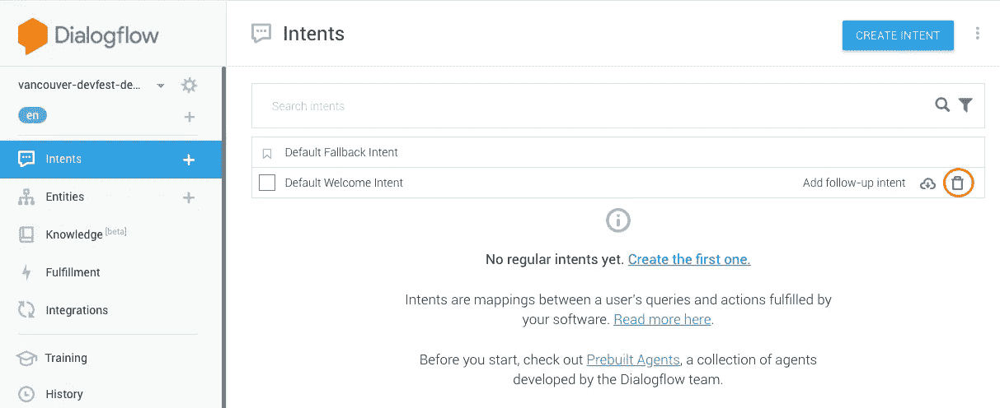
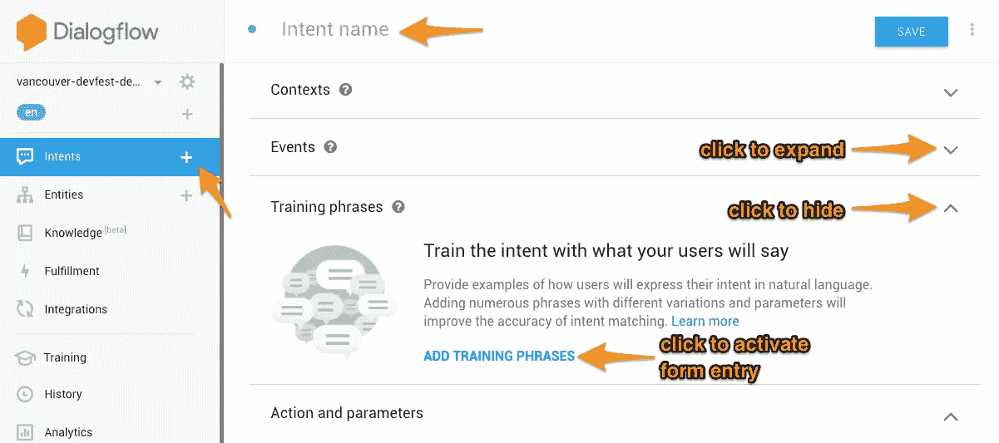
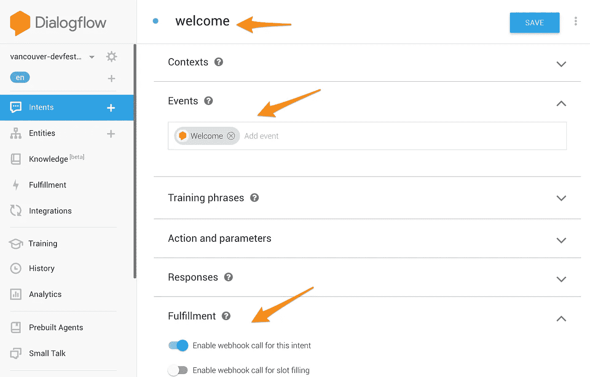
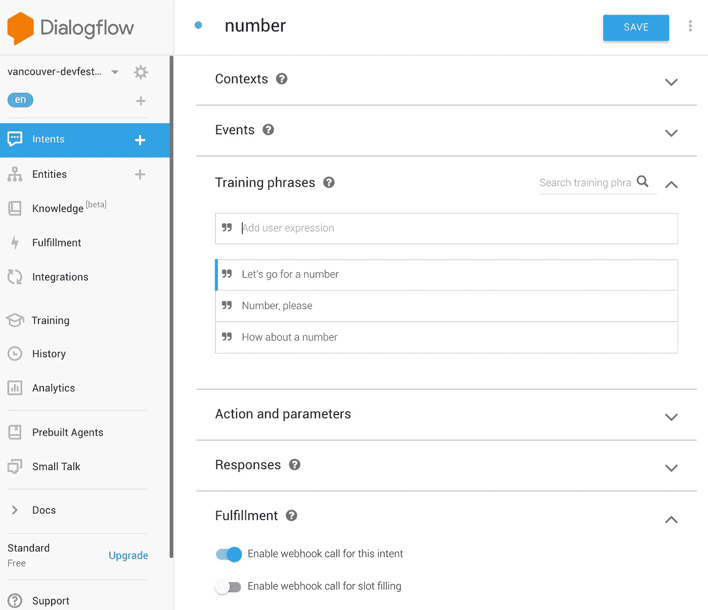
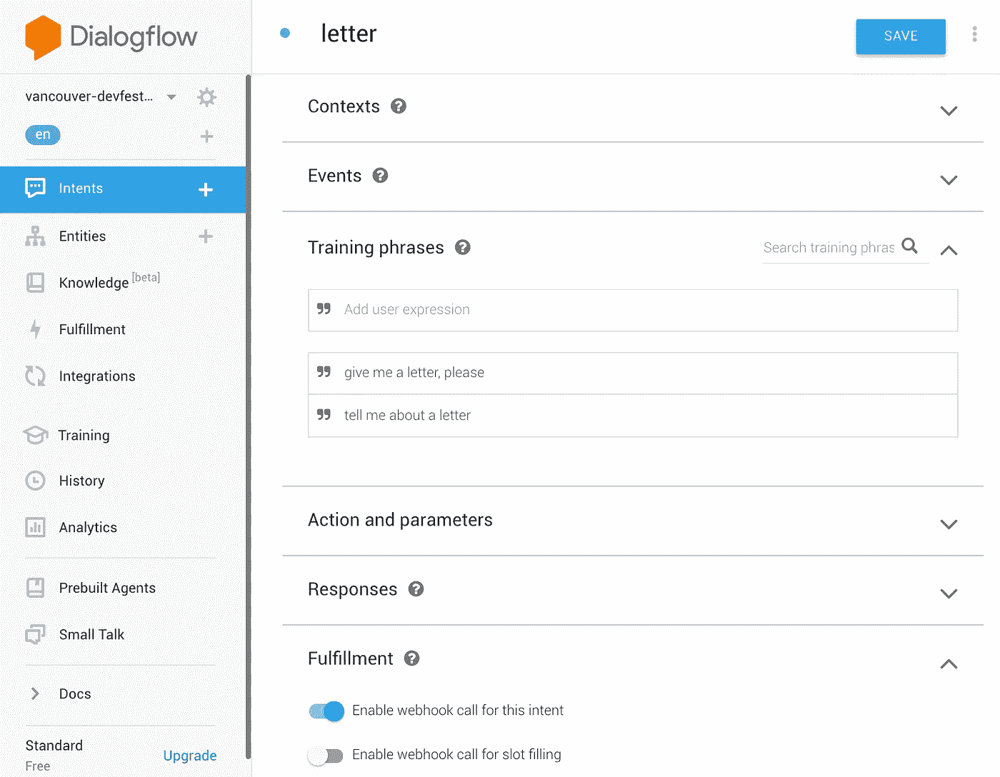
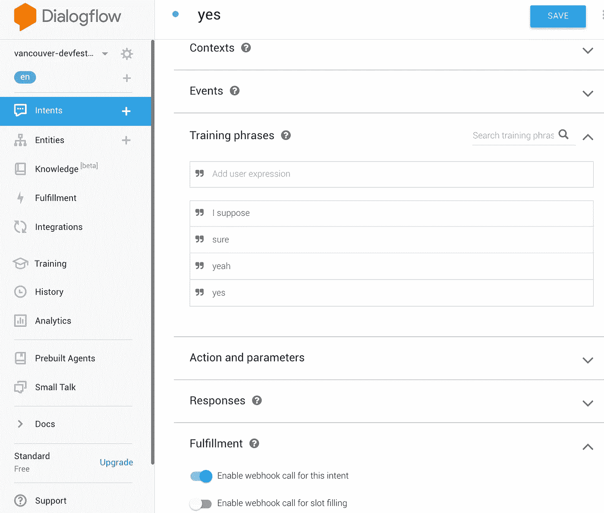
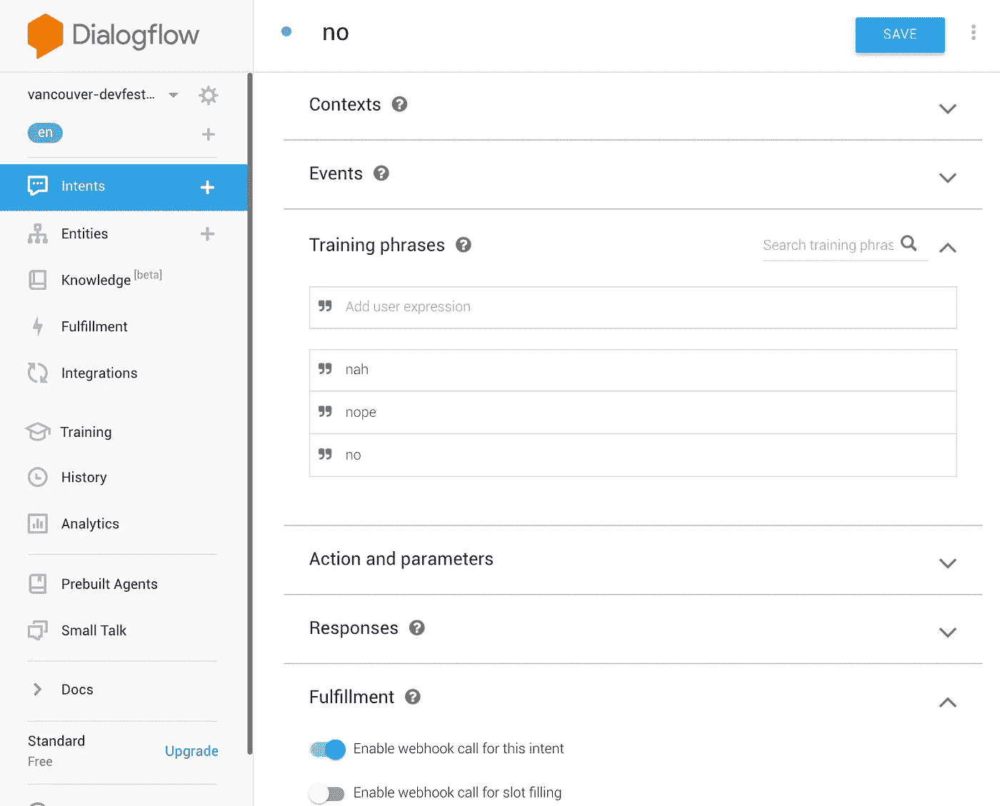
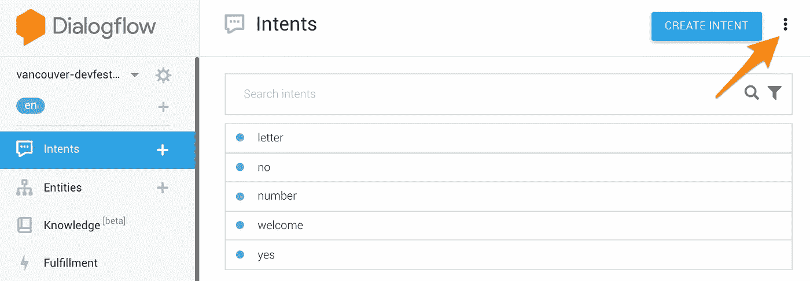
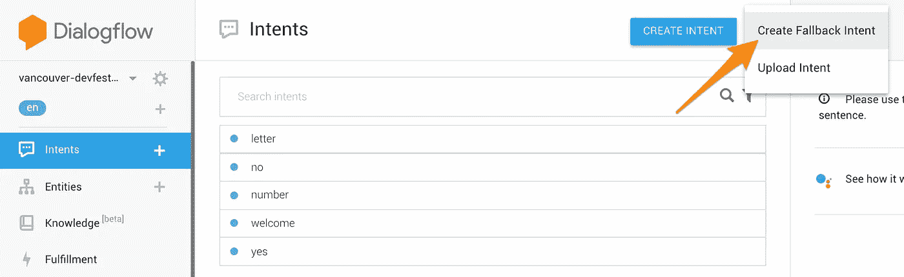
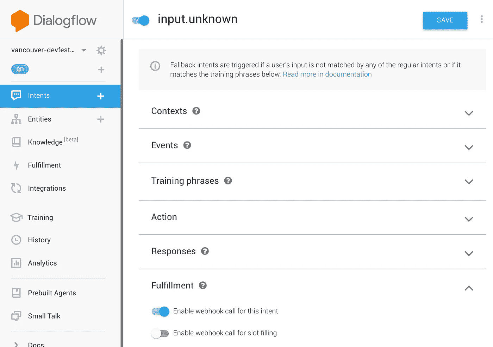

# 代码对话(第 1 部分)

> 原文：<https://medium.com/google-developer-experts/conversation-to-code-part-1-3e4584371783?source=collection_archive---------4----------------------->

*在上一篇文章《* [*为声音而思考:设计对话，而不是逻辑*](/@afirstenberg/thinking-for-voice-design-conversations-not-logic-7c60869451f1) *》中，我们谈到了创建对话界面的最佳第一步是如何构建对话。令人震惊，我知道。但是很快我们会想把这个设计变成更具体的东西。在本文中，我们采取下一步，使用一个工具将用户可能说的短语转换成代表其意思的“意图”。下一次，我们将讨论如何在这个处理过程中加入一些逻辑来返回结果，以后的文章将讨论一些我们可以用来改进语音代理的其他编码。*

当我们设计我们的对话时，我们开始识别用户所说的模式以及他们打算用这些短语做什么。为此，我们根据所谓的**意图**对它们进行了分组。

获取短语并将其转化为意图的过程被称为**自然语言理解** (NLU)或**自然语言处理** (NLP)。如果您是熟悉正则表达式的程序员，您可能会尝试将一个或多个正则表达式映射到一个意图。如果你这样做了，你会很快发现实际上很好地映射短语并长时间保持它们是多么痛苦。

相反，您应该使用当前可用的 NLP 系统之一。Google 上的 Actions 可以使用其中的任何一个，但是它被很好地调整为使用一个名为 Dialogflow 的，它可以为 AoG 之外的各种其他客户端提供 NLP。虽然我们讨论的许多概念也适用于其他 NLP，但是我们将集中讨论在我们的 NLP 中使用 Dialogflow。

## 动作和对话流入门

我们不会详细讨论如何在 Google 项目上启动一个 Actions，或者用它来启动一个 Dialogflow 项目。如果您不熟悉该流程，请查看 Google 上的[文档，并点击左侧导航栏的“开始”。](https://developers.google.com/actions/extending-the-assistant)

但是，默认情况下，Dialogflow 提供了两个默认意图，我们将删除它们:

*   默认回退意图
*   默认欢迎意图

您可以删除它们，方法是转到意向列表，将鼠标悬停在每个意向名称上，然后单击出现在每个名称右侧的垃圾桶。

为什么删除它们？它们有一些默认的设置，最好在我们的讨论中去掉(以及在构建它们时的操作)，所以最好从一个干净的石板和一个更好的命名方案开始。

这样一来，我们就可以开始将我们的对话转化为意图了。

## 构建我们的意图描述

我们已经谈过了。我们已经清理了我们的项目。是时候建立这些意图了！

我们可以单击左侧菜单中 Intents 旁边的+号。这将打开我们的意图编辑器，分为几个部分。当你开始时，它会提供一些有用的文本，后面是一个蓝色的链接，可以“添加”该部分的内容。您可能需要通过单击右侧的向下箭头来展开某些部分，并且您可以通过在同一位置单击向上箭头来折叠这些部分。

首先，您需要为意图设置一个名称。我们在写对话的时候已经用过一些，所以我们就用这些。然后我们需要设置什么将触发这个意图(一个事件或者一些示例短语)以及我们将如何响应用户(在我们的例子中，我们希望一个 webhook 来处理代码中的所有逻辑)。

对于我们的 *welcome* 意图，我们需要设置触发它的事件。最普通的事件是“欢迎”事件，当我们开始输入它时，我们看到它是下拉框的顶部选项。我们不需要设置任何训练短语或收集任何参数，因为谷歌助手会为我们处理这一部分。我们不需要在 Dialogflow 中设置任何响应，因为我们的 webhook 会处理这一部分，但是我们确实需要启用 Fulfillment 并为此启用 webhook 调用。然后确保你点击“保存”。

我们的其他意图都将有训练短语，而不是事件。这些短语将来自我们设计的对话，加上我们在编辑时可能想到的其他短语。我们将用几个短语构建我们的*号* Intent，一次输入一个，在每个短语之间按回车键，并确保在保存之前我们已经打开了实现功能。

我们的*信*意图大同小异。你可能想知道如果用户没有准确说出我们训练 Dialogflow 听什么会发生什么。幸运的是，Dialogflow 使用了一个人工智能模型，该模型使用我们的短语来训练用户可能会说的话。当涉及到短语的模糊匹配时，它通常是相当宽容的，但是你应该尽可能多地帮助它。

当我们输入我们的 *yes* 意图时，想想用户可以说的其他短语来确认某事。我们的脚本确定了一些，但尝试一下回应短语并大声说出来是有意义的，甚至可能与之前没有听到提示的人一起，看看他们如何回应。除了我们在这里确定的四个，您当然还可以添加更多。

不要忘记在每一个之后点击“保存”。如果您忘记了，您将收到一条浏览器警告消息，询问您是否要放弃您在页面上所做的更改。

当我们进入*不*意图的培训时，你可能想知道为什么我们不在这里设置回答，而是依靠实现来处理它们。虽然我们的响应相当简单，但我们将在下一次看到，在 webhook 中处理甚至简单的响应意味着我们可以让它们做一些相当复杂的逻辑。这样做可以清楚地将我们的请求处理与我们处理响应的方式分开。那么，为什么 Dialogflow 提供了作为意图配置的一部分发送响应的能力呢？因为有些情况下这样做更容易，而且可以更快。我们更喜欢通过履行来以同样的方式处理每件事。

我们还需要建立一个意图来处理一些在我们设计对话时没有出现的情况。如果用户说了完全出乎意料的话呢？例如，如果他们宣称“我喜欢香蕉”。或者他们什么都没说。我们该如何处理？我们之前已经讨论过这些“不太愉快”的路径，我们将在后面的文章中详细介绍，但是现在，我们将设计一个**回退意图**，它将在其他定义的意图都不匹配用户所说的情况下被调用。

要创建回退意图，请选择左侧导航栏中的意图菜单。然后选择右上角的三点菜单。

然后，您将选择“创建回退意图”选项。

后备意向与常规意向非常相似，但也有一些显著的区别。例如，您仍然需要给它起一个名字，但是训练短语是可选的，用于后备目的。如果你给出任何训练短语，它们代表不会匹配其他意图的短语。

我们将我们的回退意图命名为 *input.unknown* ，以表明用户的反应有些奇怪。我们不一定要强迫任何短语在其他地方被忽略，我们只是需要这个意图像其他意图一样被处理。

## 准备起飞！

随着我们所有意图的建立和保存，我们都准备好了，对吗？

嗯……都准备好进行下一步了。写逻辑想出这些回应！这一点我们下次会讲到。

值得花点时间回顾一下我们在这里做了什么。这看起来并不多，但是在设计对话式用户界面时，聚焦和建立对话是最重要的一步。

一个好的策略是测试你的对话，甚至在你建立逻辑之前。我们可以在上面的每个步骤中关闭 webhook 实现，添加一些示例响应，然后进行测试。我们可能会发现一些我们漏掉的短语，或者在某些情况下想出一些好的应对方法。测试一个 UI，甚至是一个 VUI，是这个过程中非常重要的一部分。

在我们的[下一篇文章](/@afirstenberg/conversation-to-code-part-2-39b74b0e7b0f)中，我们将看看如何构建我们的履行 webhook，这样我们就可以响应我们的用户。对此有许多不同的方法，但我们将专注于我们在设计对话时概述的一种方法。如果我们使用 node.js 构建，有几个库可以帮助我们完成这项任务，我们将研究它们。如果我们使用另一种编程语言，我们也将大致了解如何适应这一点。