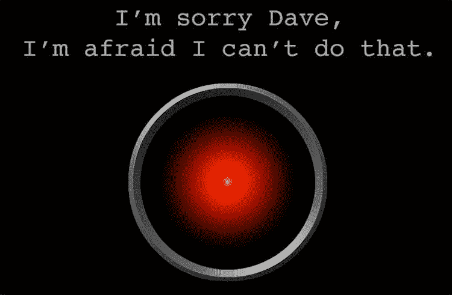
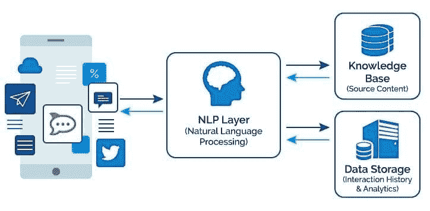
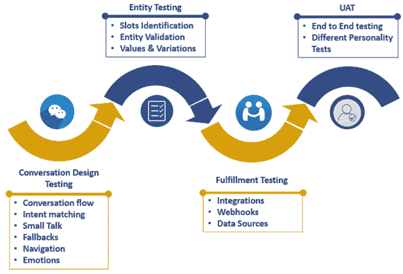

# 对话用户界面(CUI)测试策略

> 原文：<https://medium.com/globant/conversational-user-interfaces-cui-testing-strategies-adb08b97fc50?source=collection_archive---------0----------------------->

电影《2001，太空漫游》中的计算机 HAL 9000，能够与人类对立，拒绝接受的命令。

# 崔是什么？

**对话式用户界面(CUI)** 是一种数字界面，使用户能够按照人与人对话的原则与软件进行交互。崔更像是**的社交和自然**，就用户“消息”、“询问”、“同意”或“不同意”而言，而不是“导航”或“浏览”

换句话说，用户可以告诉软件他们需要什么，软件会提供给他们，而不是在结构化的图形界面中搜索信息**。它的特点是比传统的图形用户界面有更宽松和灵活的结构。崔的主要卖点是没有学习曲线，因为不成文的会话“规则”被所有人下意识地采纳和遵守。**

# 对话界面的类型

对话式 UI 有两个分支:聊天机器人和语音助手。

## 聊天机器人

聊天机器人是可以出现在桌面和移动设备上的视觉界面。机器人和用户之间的对话采用消息应用程序中聊天气泡的**形式。**

聊天机器人有不同的类型:

*   人工智能驱动的机器人

人工智能驱动的[机器人使用**自然语言处理**](https://landbot.io/blog/natural-language-processing-chatbot/) **(NLP)** 和(有时)**机器学习**来分析和理解人类用户输入界面的请求。一个理想的人工智能驱动的机器人应该能够理解人类语言的细微差别。它应该识别各种响应，并能够从含义中推导出含义，而不仅仅是理解特定语法的命令。

使用机器学习的聊天机器人能够提高其准确性。用得越多，它就变得越聪明。

*   **基于规则的机器人**

一个基于规则的聊天机器人根据其程序员概述的规则回答用户的问题。

规则可以非常简单，也可以非常复杂。然而，与人工智能聊天机器人不同，这种机器人永远不会回答任何不是硬编码的事情。

为所有可能的场景编写规则非常耗时(也是不可能的)，因此，用户很快就会发现基于规则的机器人的缺点。

*   选择你的冒险机器人

“选择你的冒险”机器人是对话界面的“游戏化”版本。交互不依赖人工智能，也不依赖机器学习。相反，它以快速回答、按钮、表情符号或其他视觉媒体的形式向用户提供**建议的回应。**

对话流是预设的，并从一个响应分支到另一个响应。同样，它可以是**简单和线性** (A 到 Z)或相当**复杂和非线性** (A 到 D 到 B 到 M)，这都取决于负责对话的设计师。

一些出版物在谈到对话界面时没有提到这种聊天机器人，因为它没有给用户完全的自由来请求和反应。然而，机器人确实使用对话作为实现目标的手段，并遵守对话原则，因此不应被排除在外。

## 语音助手

语音助手是允许交流的机器人**不需要任何图形界面**仅仅依靠声音。VUIs(语音用户界面)由人工智能、机器学习和语音识别技术驱动。

当谈到语音界面时，深刻的自然语言理解甚至更为关键，因为它真的把我们置于与计算机对话而不是打字的位置。

由于创建一个可行的 VUI 所需的技术如此复杂，语音助手掌握在谷歌(Ok Google Assistant)、微软(嘿 Cortana)、苹果(嘿 Siri)和亚马逊(Echo)等科技巨头手中。他们不仅向世界介绍了 VUI，还努力改善它，因为它还有很长的路要走。

# 对话平台和测试

这种平台背后的核心技术是自然语言处理能力。它必须能够执行语义分析，并有一定程度的理解。

平台提供许多服务，崔坐在前端，使用按钮、卡片、文本或口语进行对话。除了利用 CUI 与用户交流之外，公司还开发机器人来研究用户行为。一些例子包括微软聊天框架或类似 Alexa 和 Siri 的服务。

测试必须创建并运行各种使用场景，以验证端到端的测试行为。它通常从测试用户开始，目标是那些具有不同级别对话平台使用体验的用户。

它继续验证平台，因此聊天机器人能够解释用户意图并生成适当的响应。由于输入是自由形式的，平台必须能够理解任何类型的输入，包括脏话。如果 CUI 是多语言的，则需要进行本地化测试。

一组测试场景将针对平台错误消息，以验证这些消息是否可以理解和礼貌。其他测试场景将要求聊天机器人跳回并修改之前的主题或已完成的请求。

平台必须能够按照用户的期望处理重复的请求。在整个测试过程中，必须监控平台回复的速度，以确保对话以恒定的速度进行。

# 可能的测试方法

无论要测试的 CUI 类型如何，大多数都可以按照类似的方法进行测试，这可以定义如下:

*   确定您的主要使用案例 CUI
*   确定每个用例中所需的所有流程或脚本
*   确定**意图**

一个**意图**是用户的意图，并且对应于流中每个短语中使用的主要动词。例如，如果用户键入“显示昨天的金融新闻”，用户的意图是检索金融标题列表。意图有一个名称，通常是一个动词和一个名词，比如“showNews”。

*   确定**实体**

一个**实体**代表一个与你的意图相关的术语或对象，并为意图提供一个特定的上下文。

*   识别 S **ynonyms**

**同义词**对应所有与实体相似的词。

最重要的是了解聊天必须经过的所有流程，并拥有所有脚本，因为机器人将根据这些信息进行训练。

这意味着，当错误发生时，流程还应该包括负面场景。

一些建议，

●在某些情况下，在每个场景对应一个特定流程的场景下进行测试可能更容易。

●当你认为合适的时候，你可以在每个流程中创建尽可能多的测试用例。

●不要忘记包括每个流程的所有可能路径，这意味着快乐和不快乐的路径

●当出现许多错误时，不要感到沮丧。应该通过使用更多的单词来更好地训练机器人

●针对受挫的情况，从机器人那里找出一个可能的答案。例如:“对不起，我现在没有这方面的信息”或“尽量把你的要求说得更具体些”

基于 IA 的 CUI 要点，

鉴于存在几个故障点的事实，任何人工智能系统的测试策略都必须仔细构建，以降低故障风险。首先，组织必须首先理解人工智能框架中的各个阶段。

有了这样的理解，他们将能够定义一个全面的测试策略，在整个框架中使用特定的测试技术。

这里有两个关键的 AI 用例，必须进行测试以确保 AI CUI 正常工作:

*自然语言处理*

测试关键字的“精确”返回，即 NLP 检索实例总数中相关实例的分数

测试“召回”,即检索实例占可用检索实例总数的比例

测试真阳性(TPs)、真阴性(TNs)、假阳性(FPs)和假阴性(FNs)。确保 FPs 和 FNs 在规定的误差/后果范围内

*聊天机器人测试框架*

使用语义等同的句子测试聊天机器人框架，并为此创建一个自动化库

维护基本和高级语义等价句子的配置，包括正式和非正式语气以及复杂单词

*   自动化端到端场景(请求聊天机器人，获得响应，并用接受的输出验证响应动作)

# CUI 测试的关键组件

*   **对话设计测试**

自然语言理解工具说明了用户的输入、机器人的响应和对外部资源的调用，使我们能够对整个对话有一个概述。NLP 从用户的输入中提取意图和实体，并向用户提供精确的响应。

从测试的角度来看，对话设计测试有以下几个关键方面:

*   **谈话流程**

从技术上讲，会话是两个说话者通过有意义的句子进行交流的过程。这种词语的来回交换也被称为对话。由于聊天机器人也基于类似的对话概念，因此，测试对话流是聊天机器人测试中的一个重要步骤。

我们可以通过在对话流中添加愉快路径场景(通常的谈话)和消极路径场景(意外的谈话)来测试对话流。此外，我们可以添加“是”(同意)和“否”(拒绝)表情来测试机器人的行为。一个合适的对话流应该有技巧地说话，让用户参与相关的回复，同时保持消息长度和其含义之间的平衡。

*   **意图匹配、培训短语和回应**

意图是用户输入的目标或目的，或者我们可以称之为“句子集合”聊天机器人通常有多个意图，我们创建这些意图来定义应用程序的范围。为了更好地理解这一点，我们可以考虑一个简单的例子“点一杯咖啡”我们可以向机器人发出“制作咖啡”的命令，并期待订单确认。所以，我们可以通过添加更多的匹配意图或训练短语来测试这个场景，看看机器人是否能够清楚地理解用户的输入。

*   **闲聊**

闲聊基本上是用户和机器人之间的随意对话。示例:

***用户*** *:你好吗？*

***Bot*** *:一如既往的精彩。谢谢关心。*

我们可以通过添加越来越多的小型随意对话来执行这方面的测试，随后，我们需要将响应与机器人对这些对话的回复进行比较。一组小对话可以极大地改善用户在与机器人对话时的体验。闲聊可以让机器人对问候或笑话等随意的话题做出反应，从而变得更有会话性。而不是将用户重定向到回退响应。

*   **回退**

回退是测量 CUI 对不匹配输入的响应的过程。

例如:在点咖啡的时候，如果用户突然向机器人提出任何不匹配的问题，比如“你穿的是什么颜色的衬衫？”。按照人类的对话，预期的反应应该是“对不起，我没听懂。”对于崔，我们也期待机器人能有同样的人类语言反应。我们可以通过编写适当的测试用例来测试这些场景，使聊天机器人回退。

*   **导航**

在对话式界面中，没有后退按钮或搜索框这样的选项来帮助用户从交互的某些部分切换到其他部分。然而，用户的需求与他们过去对传统界面的需求是一样的；他们改变主意，想要返回，他们想要跳过步骤，等等。我们需要在测试中测试这样的导航场景，以使机器人理解并适当地处理这样的需求。

*   **情绪**

情感是语言的基调，包括愤怒、恐惧、喜悦、悲伤和厌恶。一些聊天机器人平台在其聊天机器人信使中利用这一点来理解用户的情绪，并将文本消息处理到聊天窗口中。需要编写测试用例来理解用户的情绪，并对用户的情绪做出适当的反应。

*   **实体/插槽**

实体是从训练短语中提取的关键字。当用户说话或打字时，聊天机器人将从对话的上下文中寻找它需要的各种实体的值。我们使用实体从用户所说的话中自动提取信息。示例:

*“我是安迪，请给我一杯加两块糖的卡布奇诺”*

所以，这里的**意图**是**“点一杯咖啡”**

**实体**是:

安迪 —名

**卡布奇诺** —咖啡类型

**两个**——糖的计数

为了执行命令，机器人首先需要理解意图，然后从意图中提取实体。从那里机器人会问什么类型，多少等等。从技术上讲，这被称为槽填充。这是相当基本的对话，对用户来说相当费力。

这些实体可以在对话的上下文中的任何时间被说出

示例:

***用户*** *:能给我来个平白*

***Bot*** *:需要什么糖吗？*

*断言:*如果未提及牛奶类型，则默认为“常规”。

测试需要覆盖所有的实体，它的值和变化以及断言。

*   **履行**

一旦接收到来自用户的要求(以及将与请求一起发送的实体值);机器人需要请求信息来满足用户的请求。

现在，这些数据将被发送到 web-hook，以便获取所需的信息。一旦 web-hook 获取了所需的信息，它就会以所需的方式将响应发送回用户。

响应是在完成请求后将交付给用户的内容。

**示例:**咖啡订单需要传递给现有的 POS，以便咖啡师接收订单。

履行测试应该覆盖所有的集成点和数据源。

*   **UAT**

确保 CUI 的质量是产品成功的关键，不可掉以轻心。因此，首要任务是测试 CUI 功能是否符合要求和目标。

在向市场发布聊天机器人之前，在聊天机器人上进行用户测试是非常重要的。还有，用不同的用户和不同性格的人来测试聊天机器人是非常重要的。

UAT 应在 bot 的全面实施完成后进行，包括意图、实体、小型会谈、回退和履行的整合。

# **为你的 AI CUI 确定关键指标**

一旦你定义了你的 CUI 的目标和范围，它的性能的主要测量应该是什么很快就会变得清晰。

转化率增加，低附加值的新客户减少，平均处理时间减少…我们建议您设定一个或两个与项目原始战略利益密切相关的指标的目标数字(即使会有许多其他统计数据)。

## 客户服务特定指标:

*   一级调用率下降
*   CUI 生成的呼叫持续时间(通过网络回拨)
*   电子邮件缩减率
*   升级率

## 营销特定指标:

*   转换率(针对与机器人互动过的用户)
*   会话的平均持续时间(针对已与机器人交互的用户)
*   与机器人互动过的访问者浏览的页面数量
*   篮子废弃率

## 人力资源特定指标:

*   每月问题量
*   升级率
*   常见主题

## CUI 用户体验指标

其他指标可能与交叉分析相关，但它们可能数量众多，因此很容易迷失或无法将它们提供的知识关联起来。

为了更好地了解你的用户以及你的 AI CUI 的影响，我们在这里总结了要遵循的 10 个指标。

1.  **Self-service rate:** 使用 bot 后未以联系人操作结束的用户会话的百分比。
2.  **执行率:**正确答案数除以活跃会话数(一个正确答案是在多选的情况下由 bot 建议并被用户点击的答案——或者在强语义匹配的情况下即时打开)。
3.  **每次登录的使用率:**CUI 上的活跃用户会话量。来平衡你网站的平均会话数。
4.  **跳出率:**CUI 已打开但未使用的会话数量
5.  **满意率:**对崔的回答进行评价时给出的平均分数(与评价率相平衡)。
6.  **评价率:**至少对 CUI 的回答进行过一次评价的用户会话的百分比。
7.  **平均聊天时间:**允许您评估用户对您的 CUI 的兴趣。
8.  **平均互动次数:**用于评估 CUI 上的客户努力分数，必须与满意度相关。如果后者非常低，机器人可能会让用户参与太多的分支和步骤来满足他们的需求。在这种情况下，解决方案可以是修正决策树或知识库架构。
9.  **目标完成率:**如果您的机器人包含像 CTA、表单或一些交叉销售这样的目标行为，这就是通过 CUI 达到特定行为的用户比率。
10.  **未响应率:**CUI 在用户提问后未能推送某些内容的次数(由于缺少内容或误解)。

## 最后的话

测试一个 CUI 是微妙的，艰巨的，需要不断的训练，但绝不是不可能的。

新的方法或现有方法的发展将使这项任务更简单，效果更好。

毫无疑问，在不久的将来，Cui 将在所有类型的系统和业务中显著增加，并将成为我们测试中的常见组件。

因此，让我们训练、调查并思考如何改进我们的测试堆栈！