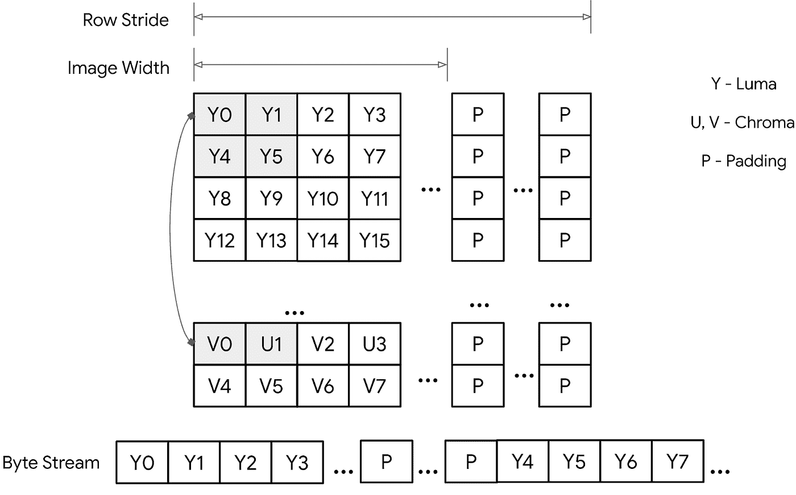
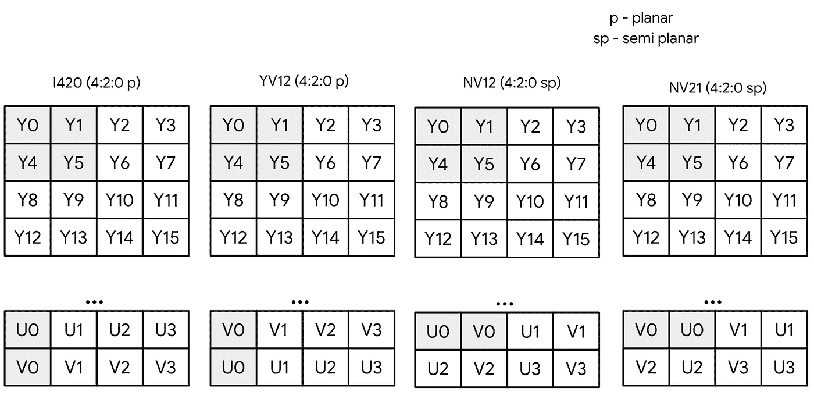
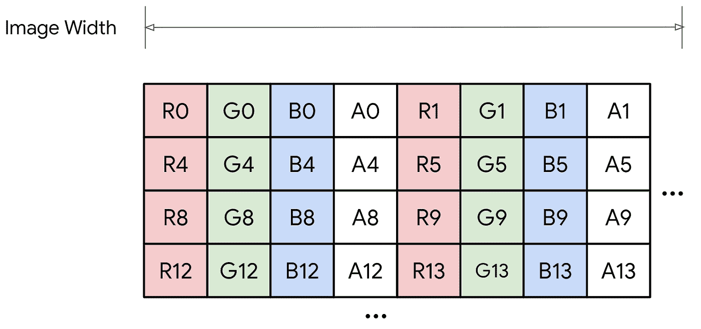
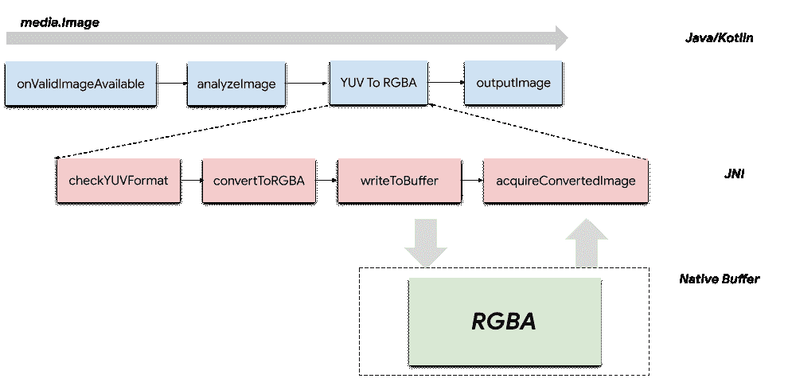
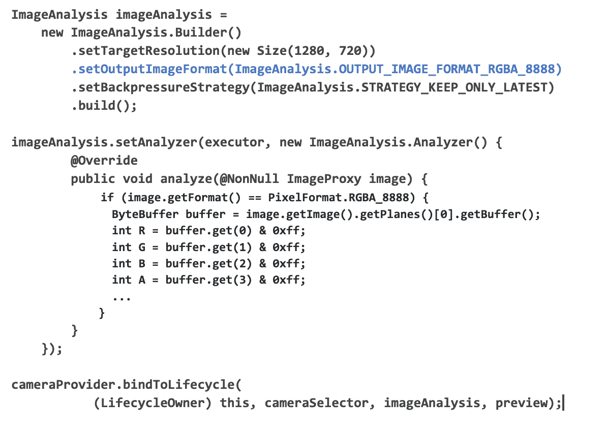
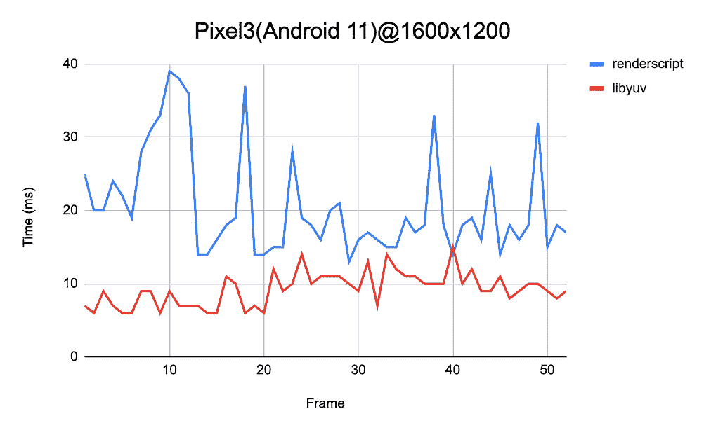
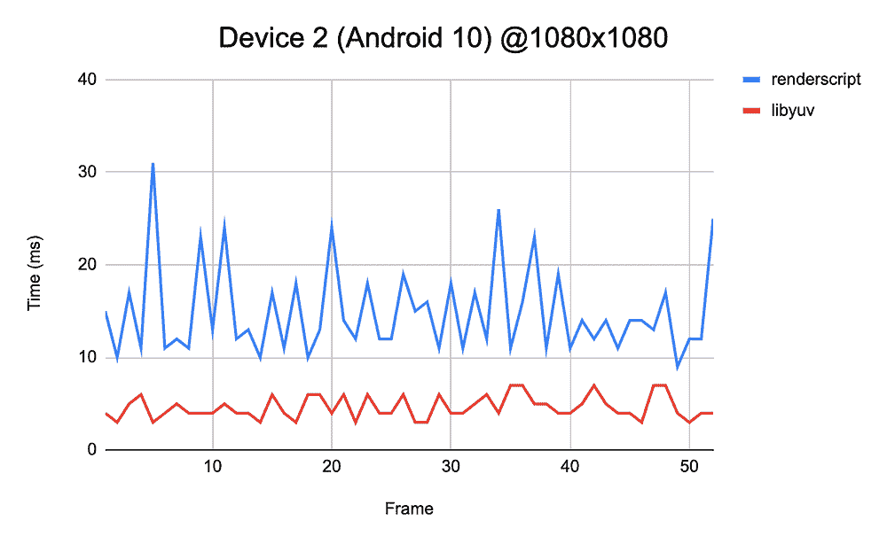
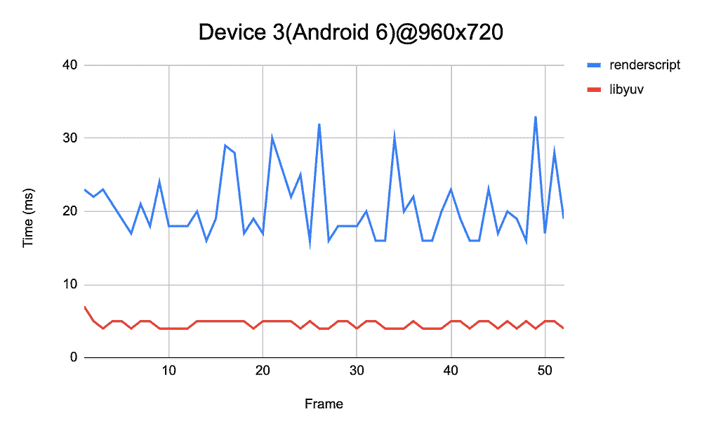
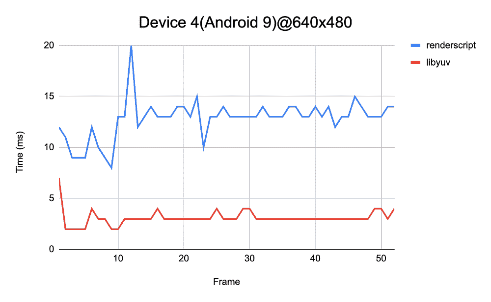

# 将 YUV 转换为 RGB 用于 CameraX 图像分析

> 原文：<https://medium.com/androiddevelopers/convert-yuv-to-rgb-for-camerax-imageanalysis-6c627f3a0292?source=collection_archive---------2----------------------->

CameraX 是一个 Jetpack 支持库，旨在帮助简化相机应用程序的开发。它支持图像捕获、预览和图像分析等不同用例，可以与 [ML 套件](https://developers.google.com/ml-kit)或 [TensorFlow Lite](https://www.tensorflow.org/lite) 无缝结合。这为创建文本识别、图像标记等应用程序，甚至使用您自己训练的 TensorFlow Lite 模型检测和识别对象提供了许多可能性。然而，CameraX 和这些库之间的图像格式转换并不简单，有时非常耗时。在这篇博客中，我们将讨论我们最近为支持 CameraX ImageAnalysis 的 YUV 到 RGB 转换而构建的一个新功能，包括我们为什么要构建它以及如何只用少量代码来使用它。

# **背景**

CameraX 使用 [YUV420_888](https://developer.android.com/reference/android/graphics/ImageFormat#YUV_420_888) 生成图像，每个通道具有 8 位亮度(Y)、色度(U，V)和填充(P)。YUV 是一种通用而灵活的格式，它允许不同设备上的 OEM 变体，涵盖了许多图像分析用例。然而，许多应用程序仍然依赖于 RGB 格式。在我们的开发人员社区中，YUV 到 RGB 的转换是最受欢迎的功能之一，因为 RGB 格式很受欢迎，易于使用，有时也是必需的，例如 TensorFlow Lite 模型)。我们先来看看 YUV 和 RGB 格式。

# YUV_420_888 格式

YUV 格式也可以称为“YCbCr”。它包括平面(如 I420)、半平面(如 NV21/NV12)和封装格式(如 UYVY)。YUV_420_888 是一种通用 YCbCr 格式，能够描述任何 4:2:0 色度二次采样平面或半平面缓冲器(但不是完全交错的)，每个颜色样本 8 位。Y 平面保证不会与 U/V 平面交错(特别是，像素跨度始终为 1)。U/V 平面保证具有相同的行间距和像素间距。

# RGBA_8888 格式

[RGBA_8888](https://en.wikipedia.org/wiki/RGBA_color_model) 是标准的 RGB 格式，有红色、绿色、蓝色和 alpha 通道，每个通道有 8 位。转换的主要目标是 RGB 色彩空间。RGB 更简单，变化更少。

# **API 实现**

我们已经评估了 3 种 YUV 到 RGB 转换的方法

1.  Java/Kotlin
2.  渲染脚本
3.  本机(C/C++和 NDK)

图像处理的 Java/Kotlin 实现伴随着长的计算时间和垃圾收集压力。Renderscript 是计算密集型任务的候选，例如 YUV 到 RGB。不过从 Android 12 开始就已经[弃用](https://developer.android.com/guide/topics/renderscript/migrate#scripts)了。

考虑到未来的可扩展性和兼容性，我们决定使用原生方式(libyuv + NDK)。 [Libyuv](https://chromium.googlesource.com/libyuv/libyuv/) 是一个开源项目，包括 yuv 缩放、转换和旋转功能。考虑到所有因素，CameraX 色彩转换管道可以在较高层次上进行查看，如下所示:

我们的管道仍然产生 [ImageProxy](https://developer.android.com/reference/androidx/camera/core/ImageProxy) 作为向后兼容的输出。ImageProxy 是媒体的包装类。Image，是 Android 框架产生的图像缓冲区。为了生成转换后的图像，Java/Kotlin 层可以通过 [dequeueInputImage()](https://developer.android.com/reference/android/media/ImageWriter#dequeueInputImage()) 从[表面](https://developer.android.com/reference/android/view/Surface)获取输入图像，然后使用 [ImageReader](https://developer.android.com/reference/android/media/ImageReaderhttps://developer.android.com/reference/android/media/ImageReader) 和 [ImageWriter](https://developer.android.com/reference/android/media/ImageWriter) 将图像数据写入其中。由于 ImageWriter 是在 API 23 中添加的，我们使用 [ANativeWindow](https://developer.android.com/ndk/reference/group/a-native-window?hl=en) 及其缓冲区来生成 RGBA 格式的输出图像，以支持更多的 API 级别。

对于输入，我们支持 YUV_420_888 格式的不同变体(I420、NV12、NV21 等。)在 CameraX 内部。对于输出，我们现在支持 RGBA 格式，但将来可能会扩展到其他 RGB 格式的支持。

由于我们使用 [libyuv](https://chromium.googlesource.com/libyuv/libyuv/) 作为新的依赖项，我们库的大小增加了大约 **50 KB** 。

# **API 用法**

从 [CameraX 1.1.0-alpha08](https://developer.android.com/jetpack/androidx/releases/camera#1.1.0-alpha08https://developer.android.com/jetpack/androidx/releases/camera#1.1.0-alpha08) 开始，应用程序可以通过在 ImageAnalysis 配置中使用 setOutputImageFormat 来选择 YUV_420_888 或 RGBA_8888 格式的输出图像。

一旦选择了 RGBA_8888，输出图像格式将是[像素格式。RGBA_8888](https://developer.android.com/reference/android/graphics/PixelFormat#RGBA_8888) ，它只有一个带有填充的图像平面(R，G，B，一个像素接一个像素)。传统上，Android 框架支持带有 PixelFormat 和 ImageFormat 子集的图像缓冲格式。

相比之下，如果选择 YUV_420_888，输出图像将是 [ImageFormat。YUV_420_888](https://developer.android.com/reference/android/graphics/ImageFormat#YUV_420_888) ，它有 3 个独立的图像平面(Y，U，V)。

# **性能**

我们测量了速度，并将结果与不同 Android 版本和设备上的 [Renderscript](https://github.com/android/camera-samples/blob/master/CameraUtils/lib/src/main/java/com/example/android/camera/utils/YuvToRgbConverter.kt) 进行了比较。总体而言，我们的 libyuv 管道在不同分辨率和 Android 操作系统版本的不同设备上优于我们的参考 Renderscript 实现。

# **总结**

我们支持 CameraX ImageAnalysis 管道中的 YUV 到 RGB 转换。用户现在只需为 ImageAnalysis 用例选择输出格式(YUV_420_888 或 RGBA_8888)即可与其他库连接。这是一个激动人心的旅程的开始，我们正在考虑在我们的 CameraX ImageAnalysis 管道中添加更多的图像处理功能，并将其扩展到其他用户案例(图像捕捉或预览等)。).如果您有任何功能需求，请告诉我们。

YUV 到 RGB 转换的示例代码可从 GitHub 上的[获得。要了解更多关于 CameraX 的信息，请参考](https://github.com/android/camera-samples/blob/main/CameraXTfLite/app/src/main/java/com/example/android/camerax/tflite/CameraActivity.kt#L170)[官方文档](https://developer.android.com/training/camerax)。为了跟上 CameraX 的最新发展，加入 [CameraX 讨论组](https://groups.google.com/a/android.com/g/camerax-developers)。反馈是非常有价值和受欢迎的:请随意在这里留下您的回复，在[CameraX 讨论组](https://groups.google.com/a/android.com/g/camerax-developers)与我们交流，或者通过[官方问题跟踪器](https://issuetracker.google.com/issues/new?component=618491&template=1257717)创建 CameraX 问题。

敬请期待！

# **其他参考文献**

*   [CameraX 发布说明](https://developer.android.com/jetpack/androidx/releases/camera)
*   [CameraX 入门](https://developer.android.com/codelabs/camerax-getting-started#0)
*   [CameraX Github 样本](https://github.com/android/camera-samples)
*   [YUV 格式维基](https://wiki.videolan.org/YUV)