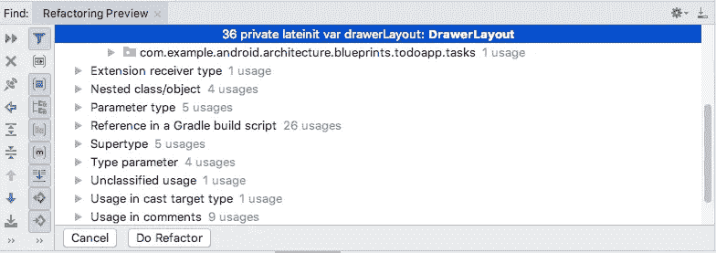

# 将您的 Android 应用程序转换为 Jetpack

> 原文：<https://medium.com/google-developer-experts/converting-your-android-app-to-jetpack-85aecfce34d3?source=collection_archive---------0----------------------->

Google 已经将他们的支持库重新命名为 Jetpack(又名 AndroidX)。开发人员需要对此进行修改。

本文将解释这意味着什么，以及如何开始转换您的项目以使用新的组件。


Jetpack to the future

# 什么是 Jetpack？

Android Jetpack 是一套库、工具和架构指南，旨在简化 Android 应用的构建。它旨在提供通用的基础设施代码，以便开发人员可以专注于编写使应用程序独一无二的东西。

这是一项大规模的工作，旨在改善开发人员的体验，并将有用的工具和框架收集到一个有凝聚力的单元中。

这句来自 [Alan Viverette](https://twitter.com/alanviverette) (Android 框架团队)的话是一个很好的总结:

> “Jetpack 是一项旨在改善开发人员体验的更大规模的努力，但 AndroidX 构成了技术基础。从技术角度来看，它仍然是您在“支持库和体系结构组件”下看到的那些库。”

# 为什么？

为什么谷歌要经历所有这些麻烦(并给开发者制造所有这些麻烦)？

*   创建一个一致的名称空间( *androidx)。** )为支持库
*   更好地支持工件的[语义版本](https://semver.org/)(从 1.0.0 开始)。这使得它们可以独立更新。
*   创建一个通用的保护伞来开发下的所有支持组件。

值得一提的是，当前版本的 AppCompat(v28.x)是最终版本。这段代码的下一个版本将专门使用 Jetpack。开发人员必须意识到这一点，并尽早进行转换。

Alan Viverette 的这段话很好地总结了这一点:

> “不会有 29.0.0，所以 Android Q APIs 只会在 AndroidX 中”

# 喷气背包里有什么？

答案是:一切。

Jetpack 是我们一直在使用的许多现有库(如 AppCompat、Permissions、Notifications 或 Transitions)和近年来引入的新架构组件(如 LiveData、Room、WorkManager 或 ViewModel)的集合。

开发人员可以期待从 AppCompat 获得同样的好处，包括向后兼容性和不依赖于制造商操作系统更新的发布周期。


Jetpack Components

# 你必须现在升级吗？能否只更新部分代码？

今天不一定要更新，但是近期某个时候一定要更新。

当前版本的 AppCompat (v28.x)与 AndroidX (v1.x)完全相同。事实上，AppCompat 库是通过改变 maven 坐标和 AndroidX 代码库的包名而由机器生成的。

例如，旧的坐标和包是:

```
implementation *“***com.android.support:appcompat-v7:*28.0.0****"*
import **android.support.v4**.widget.DrawerLayout
```

现在是:

```
implementation **'androidx.appcompat:appcompat:1.0.2'**
import **androidx.drawerlayout.**widget.DrawerLayout
```

需要注意的是，不能在同一个项目中混合使用 AppCompat 和 Jetpack。如果要升级，您必须转换所有内容以使用 Jetpack。

# 第一步—将您的应用升级到最新的支持库

当您准备好更新到 Jetpack 时，请确保您的应用程序已升级到 Gradle 和 AppCompat 的最新版本。这将确保重构仅仅是*改变包名，而不是*与库更新相关的更大问题*。*

更新你的项目是非常重要的，它会暴露出你前进过程中遇到的任何问题，比如对旧版本库的长期依赖。如果您无法更新到最新版本，则需要先解决这些问题，然后才能继续。

不要忘记查看:[https://maven.google.com](https://maven.google.com)最新的 Gradle 依赖信息。

# 使用重构工具更新您的项目

一旦您升级了您的项目，您将使用 Android Studio (AS)实用程序来进行重构。

从菜单中运行:*Refactor \ Refactor to Android x:*


Android Studio AndroidX refactor tool

该工具将扫描您的应用，并显示必要更改的预览:



如果您对更改感到满意，请选择“Do Refactor”按钮，转换工具将执行以下三项操作:

*   更新您的导入以反映新的包名:


Only the package names changed, everything else is exactly the same

*   更新您的依赖关系的梯度坐标


Note: I replaced “compile” with “implementation” manually, the tool didn’t do that part

*   向您的 *gradle.properties* 文件添加 2 个标志。第一个标志告诉 Android 插件使用 *AndroidX* 包，而不是 *AppCompat* ，第二个标志将启用 *Jetifier* ，这是一个帮助使用外部库的工具(详见下一节):

```
**android.useAndroidX**=**true
android.enableJetifier**=**true**
```

一般来说，这些变化应该只局限于这三个方面，但是根据我的经验，我已经看到 refactor 工具还做了其他的变化。在我的例子中，工具添加了代码来解释 Kotlin 的可空性(它添加了一些*！！在我的源代码中)，但可能会有其他变化。密切监视该工具所做的所有更改，并确保您对它们感到满意，这确实是一个好主意。*

# 喷射器

AS refactor 工具只对项目中的源代码进行更改。它不会对库或外部依赖项进行任何更改。

为此，谷歌创建了一个名为 *Jetifier* 的工具，旨在自动转换传递依赖关系，以便在构建时使用 AndroidX 库。如果我们没有这个工具，我们将需要等待每一个第三方库更新，然后才能使用它(并推迟我们的更新，直到它准备好)。

除了使用 gradle 标志启用这个工具之外，没有多少关于使用它的知识，因为这是一个自动化的过程，不需要任何配置。

谷歌最近宣布了一个运行 Jetifier 的独立选项。你甚至可以运行一个“反向模式”来“去 jetify 化”代码(这对调试非常有用)。

# 你可能遇到的问题

您可能会发现需要更新的第三方库。例如，有人发现当前版本的 SqlDelight 需要旧版本的 Room 持久性库。他们要求更新，Square 已经提供了库的更新版本。如果您发现了一个问题，越早向开发人员请求更新越好。Room 的最新版本(v2.1)已经需要 AndroidX，这可能会导致许多人升级。在撰写本文时，脸书 SDK 还没有更新，这可能会成为许多人的障碍。

将您的项目更新到 AppCompat 的最新版本可能并不容易。您可能在代码中找到了以前错误的解决方法，或者遇到了需要大量返工的升级。提前计划好这项工作。

Jetifier 不修改源文件，所以在使用文档时这可能会令人困惑。

你不能通过模块 Jetify，所以这是你代码库上的一个“全有或全无”的操作。这可能需要阻止正在进行的开发，直到这个问题得到解决——否则您可能会遇到巨大的合并噩梦。

映射工具可能会将 *alpha* 依赖项插入到您的代码中(例如添加了 ConstraintLayout alpha)。

Android Studio 可能不知道 Jetifier 和显示错误(红色曲线)。执行无效缓存并重启应该可以解决这个问题。

Jetifier 不修改生成的代码，这可能需要额外的返工。

一些替换名称没有正确映射(这些似乎主要来自*设计*库)。重构工具不适用于这些情况，您的代码将无法编译。要解决这些问题，您需要手动解决导入问题。希望随着时间的推移，随着工具的成熟和重构工具中的错误被修复，这些问题将被最小化。

**有用提示**:
Jetpack 的标准命名约定是将包名复制到 Maven 坐标中。在 Jetpack 中，包将*总是*匹配 groupid。

例如，如果您知道包名是` **androidx.webkit** `,那么依赖项将映射到:`***androidx . WebKit***:WebKit:version `。

# 摘要

提前计划迁移到 Jetpack 所需的更改，这是继续前进所必需的。升级最困难的部分可能是将您的项目更新到最新的依赖项。

可能有第三方库尚未更新。尽早发现这些问题并要求开发人员对其进行更新是非常重要的。

# 资源

旧类名到新类名的完整映射，如果你有自动化重构的问题，或者需要找出一个具体的变化，这是很有用的。

丹·卢的伟大的[文章](https://blog.danlew.net/2018/11/14/the-reality-of-migrating-to-androidx/)，强调了他重构项目的经历(和遇到的问题)。

来自 Android 开发者的 Jetpack [博客文章](https://android-developers.googleblog.com/2018/05/google-io-2018-whats-new-in-android.html)介绍。

感谢[埃利奥特·米切尔](https://medium.com/u/eb4fea6f1f11?source=post_page-----85aecfce34d3--------------------------------)的校对和启发！

