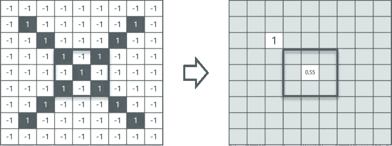
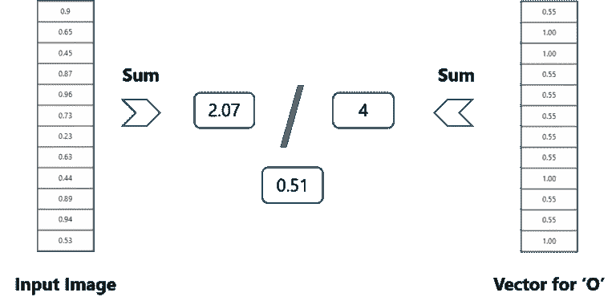

# 卷积神经网络(CNN) —使用 TensorFlow 在 Python 中开发图像分类器

> 原文：<https://medium.com/edureka/convolutional-neural-network-3f2c5b9c4778?source=collection_archive---------2----------------------->


Convolutional Neural Network — Edureka

在这篇文章中，让我们讨论什么是卷积神经网络(CNN)以及卷积神经网络背后的**架构**——卷积神经网络旨在**解决** **图像识别**系统和**分类**问题。卷积神经网络在图像和视频识别、推荐系统和自然语言处理中有广泛的应用。

我们将检验以下概念:

*   计算机如何读取图像？
*   为什么不是完全连接的网络？
*   什么是卷积神经网络？
*   卷积神经网络的起源
*   卷积神经网络是如何工作的？

1.  一个示例卷积神经网络
2.  图像的卷积
3.  ReLu 层
4.  汇集层
5.  堆叠这些层
6.  使用卷积神经网络预测图像

*   用例:CIFAR10 图像分类器

# 计算机如何读取图像？

考虑一下这张纽约天际线的图片，第一眼你会看到许多建筑和颜色。那么计算机**是如何处理**这张图像的呢？


图像被**分解**成三个颜色通道，分别是**红色、绿色**和**蓝色。**这些颜色通道中的每一个都被**映射**到**图像的像素。**


然后，**计算机识别**与每个像素和**相关联的值，确定**图像的**大小**。

然而对于**黑白**图像，只有**一个通道**并且**概念**与**相同。**

# 为什么不是完全连接的网络？

我们**不能**利用全连接网络，当谈到**卷积神经网络时，**下面是原因！

考虑下面的图像:


这里，我们将**视为**一个**输入**大小为 **28x28x3** 像素的图像。如果我们**输入**这个到我们的卷积神经网络，我们将有大约 **2352 个权重**在**第一个**隐藏层本身。

但是这个案例**并不实用**。现在，看看这个:


任何**普通**输入**图像**将**至少**具有 **200x200x3 像素**大小。第一个隐藏层的大小就变成了一个**哇哇十二万**。如果这只是第一个**隐藏层，想象一下处理一个**完整的**复杂的**图像集需要的**数量的神经元**。****

这导致**过度装配**并且不实用。因此，我们不能利用完全连接的网络。

# 什么是卷积神经网络？

卷积神经网络和神经网络一样，都是由**个神经元**组成，具有**个可学习的** **个权重**和**个偏差**。每个**神经元**接收几个**输入**，对它们进行加权**求和**，**将其通过**激活** **功能**传递给**，并以**输出**响应。

整个网络有一个**损失** **函数**，我们为神经网络开发的所有提示和技巧仍然适用于**卷积神经网络。**

很简单，对吧？

**神经网络**顾名思义，是一种模仿**大脑**结构的**机器学习技术**。它由称为神经元的学习单元网络组成。

这些**神经元**学习如何将**输入信号**(例如一只猫的图片)转换成相应的**输出信号**(例如标签“猫”)，形成自动识别的基础。

我们以**自动图像识别为例。**判断一张**图片**是否包含一只**猫**的过程涉及到一个**激活函数**。如果图片类似于神经元之前**见过的先前猫图像，**标签**“猫”**将被**激活。**

**因此，**神经元接触的**标记的图像**越多**接触的**图像，**越好**它学习如何识别其他未标记的图像。我们称之为**训练**神经元的过程。

# 卷积神经网络的起源

神经网络的智能不可思议。虽然人工神经网络早在**20 世纪 60 年代**就由**Rosenblatt**研究过**，但是使用神经网络**的深度学习只是在 2000 年代**后期**才开始起步。**关键的**促成因素**是**计算能力**和**数据集**的规模**谷歌**对深度学习的开创性研究。2012 年 7 月，**谷歌**的研究人员将一个**高级神经网络**暴露在一系列**未标记的、**静态**图像**中，这些图像来自 **YouTube** 视频。**

令他们【40】惊讶的是，【41】他们发现神经网络**自主学习了【43】一个【44】猫探测【45】神经元，【47】支持了【48】“互联网是由猫组成的”这一流行论断。**


# 卷积神经网络是如何工作的？

卷积神经网络中有**四个**分层**概念**我们应该了解:

1.  卷积，
2.  雷鲁，
3.  共享和
4.  完全连接(完全连接层)。

让我们从一个简单的例子**开始:**

## CNN 的例子:

考虑下图:


这里，有 X 和 O 的多种翻译。这使得计算机很难识别。但是目标是，如果**输入信号**看起来像它以前见过的**先前的**图像，那么**“图像”参考**信号将被混合到**输入**信号中，或者**与**输入**信号卷积。产生的**输出**信号然后被传递到下一层**。****


所以，**电脑理解**每一个像素。在这种情况下，**白色**像素称为 **-1** ，而**黑色**像素称为 **1。**这就是我们在基本二进制分类中实现**区分像素**的方式。


现在，如果我们仅仅**正常搜索**并且**比较**正常图像和另一个**‘x’再现**之间的**值**，我们将得到**缺失像素的**批次**。**

**那么，我们如何解决这个问题呢？**


我们取称为**过滤器**的像素的**小块**并尝试**匹配**它们在附近的相应**位置，看看我们是否得到一个**匹配。**通过这样做，卷积神经网络**在查看**相似度**方面比直接尝试匹配**整个图像要好得多**。****

## 图像的卷积

卷积具有良好的平移不变性。直观地，这意味着**每个**卷积滤波器代表感兴趣的**特征**(例如字母中的**像素)**，并且卷积神经网络**算法**学习哪些**特征**包括**结果参考**(即字母)。

我们有 **4 个步骤**用于卷积:

*   **对齐**特征和图像
*   **将每个**图像的**像素乘以相应的**特征**像素**
*   **将**的值相加，得到**和**
*   **用**除以**特征**中的总**像素数**

考虑上面的图像——正如你所看到的，我们已经完成了前两个步骤。我们考虑一个**特征图像**和**距离它一个像素**。我们**将**与**现有图像**相乘，结果存储在另一个**缓冲特征图像**中。


有了这张**，**图像，我们完成了 l **ast 2 步骤。**我们将**值**相加，得到**和。**然后，**将**这个**数**除以**特征图像中的**总像素数。完成后，得到的**最终值**被放置在**滤波图像**的**中心**，如下图所示:



现在，我们可以**移动**这个**滤镜**并对图像中的任意像素做同样的**操作**。为了**更清晰，**让我们考虑**的另一个例子:**


如你所见，在执行了前 4 步后，我们得到的值是 0.55！我们取这个值，并把它放在图像中，如前所述。这是在下图中完成的:


类似地，我们将该特征移动到图像中的每一个其他位置，并查看该特征如何匹配该区域。这样做之后，我们将得到如下输出:


这里我们只考虑一个滤波器。同样，我们将对每隔一个滤波器执行相同的卷积，以获得该滤波器的卷积。

**输出**信号**强度**不取决于**特征**的位置，而仅仅取决于**特征**是否存在**。**因此，一个字母可以位于**不同的位置**并且**卷积神经网络**算法仍然能够**识别它。**

## ReLU 层

ReLU 是一个激活函数。但是，什么是激活函数呢？

**整流线性单元** (ReLU)变换函数只在输入在一定量以上时才激活一个节点，而输入在零以下时，输出为零，但当输入上升到一定阈值以上时，与因变量成线性关系。

考虑下面的例子:


我们已经考虑了一个具有上述值的简单函数。因此，如果该值是由因变量获得的，则该函数只执行一次运算。对于此示例，获得了以下值:


***为什么我们这里要求 ReLU？***


主要目的是从卷积中去除所有负值。所有正值保持不变，但所有负值都变为零，如下所示:


因此，在我们处理了这个特定的特性之后，我们得到了以下输出:


现在，类似地，我们对所有其他特征图像也进行相同的处理:


来自卷积层的**输入**可以被**【平滑】**到**降低****滤波器的**灵敏度****到**噪声**和**变化。**该平滑过程被称为**子采样**，并且可以通过对信号的**样本**取**平均值**或取**最大值**来**实现。**

## 汇集层

在这一层，我们**将**图像**堆栈**缩小为**更小的尺寸。**在通过**激活**层后**完成汇集。我们通过实施以下 4 个步骤来实现这一点:**

*   选择一个**窗口大小**(通常为 2 或 3)
*   选择一个**步幅**(通常为 2)
*   **走过**你的窗口**跨过**你的**过滤过的**图像
*   从每个**窗口中，**取**最大值**

让我们用一个例子来理解这一点。考虑执行窗口大小为 2、步幅也为 2 的池。


因此，在这种情况下，我们将**窗口大小**设为 **2** ，并从中选择 **4** 和**值**。从这 4 个值中，**最大值**为 1，因此我们选择 1。此外，请注意，我们**从**开始时使用的是 **7×7** 矩阵，但现在在**合并**后，相同的矩阵下降到了 **4×4。**

但是我们需要**移动**窗口穿过整个图像。这个过程和上面完全一样，我们需要对整个图像重复这个过程。


请注意，这是针对**一个过滤器的。**我们还需要对另外两个过滤器进行同样的操作。这样做后，我们得到了以下结果:


这个**过程**的**容易部分**已经**结束了。接下来，我们需要把所有这些层叠加起来！**

## 堆叠这些层

因此，为了在一张图片中获得**时间帧**，我们在这里使用了一个来自 **7×7** 矩阵的 **4×4** 矩阵，在此之前，输入经过了 3 层处理，即**卷积、ReLU** 和**合并**，如下所示:


但是我们能不能进一步把图片从 T2 的 4×4 缩小到 T4 的更小的尺寸呢？

是的，我们可以！在第一遍之后，我们需要在迭代中执行 3 个操作。所以在第二遍之后，我们得到一个 2×2 的矩阵，如下所示:


网络中的最后几层是**完全连接的，**意味着前几层的神经元是**连接到**到**后续**层中的每个神经元。

该**模仿高级推理**，其中考虑了从**输入**到**输出**的所有可能的**路径**。

此外，全连通层是分类实际发生的最后一层。这里，我们将过滤和缩小后的图像放入一个列表中，如下所示:


所以**接下来，**当我们馈入，**‘X’**和**‘O’**矢量中会有**某个元素**会为**高。**考虑下图，如你所见，对于“X”有**不同的元素**为高**和**类似地，**对于**“O”**我们有**不同的元素**为高**:****


那么，我们从上面的**图片中**理解了**什么？**

当**第 1、第 4、第 5、第 10**和**第 11**值为**高时，**我们可以将图像分类为**‘x’。**这个概念对于其他**字母**也是类似的——当某些**值**按照它们的方式排列时，它们可以被**映射**到一个**实际的**字母或者一个我们**需要的**数字**，简单吧？**

## 用卷积神经网络预测图像——全连接层

此时，**我们完成了对**网络的训练，我们可以开始预测和**检查**分类器**的**工作**。让我们看一个简单的例子:**


在上图中，我们有一个 **12 元素**向量，它是在**通过**网络的所有**层**将一个**随机字母**的**输入**传递给**后获得的。**

但是，**我们如何**检查以知道我们得到的**是对的还是错的**？

我们**根据**输出的**数据，通过将**获得的值**与列表中的‘x’和‘o’进行比较，做出预测**！


嗯，这真的很简单。我们只是将**从 **X** 的**向量表**中找到的最高值(第 1、第 4、第 5、第 10 和第 11)与**相加，我们得到的总和为 **5。**我们对**输入图像**做了**完全相同的事情**，得到的值**为 4.56** 。

当我们**用**除以**值**时，我们有一个**概率匹配**为 **0.91！**现在用**【o】**的**向量表**做**同样的**:



我们用此表将**输出**作为 **0.51** 。嗯，概率是 **0.51** 小于 **0.91** 不是吗？

所以我们可以断定**产生的输入图像**是一个**‘x’！**

# 用例:使用 TensorFlow 通过卷积神经网络实现 CIFAR10

让我们**训练**一个**网络**使用卷积神经网络内置 TensorFlow 对来自 **CIFAR10 数据集**的图像进行分类。


考虑下面的**流程图**到**来理解用例的**和**工作**:


## **安装必要的软件包:**

```
pip3 install numpy tensorflow pickle
```

## **训练网络:**

```
import numpy as np
import tensorflow as tf
from time import time
import math

from include.data import get_data_set
from include.model import model, lr

train_x, train_y = get_data_set("train")
test_x, test_y = get_data_set("test")
tf.set_random_seed(21)
x, y, output, y_pred_cls, global_step, learning_rate = model()
global_accuracy = 0
epoch_start = 0

# PARAMS
_BATCH_SIZE = 128
_EPOCH = 60
_SAVE_PATH = "./tensorboard/cifar-10-v1.0.0/"

# LOSS AND OPTIMIZER
loss = tf.reduce_mean(tf.nn.softmax_cross_entropy_with_logits_v2(logits=output, labels=y))
optimizer = tf.train.AdamOptimizer(learning_rate=learning_rate,
                                   beta1=0.9,
                                   beta2=0.999,
                                   epsilon=1e-08).minimize(loss, global_step=global_step)

# PREDICTION AND ACCURACY CALCULATION
correct_prediction = tf.equal(y_pred_cls, tf.argmax(y, axis=1))
accuracy = tf.reduce_mean(tf.cast(correct_prediction, tf.float32))

# SAVER
merged = tf.summary.merge_all()
saver = tf.train.Saver()
sess = tf.Session()
train_writer = tf.summary.FileWriter(_SAVE_PATH, sess.graph)

try:
    print("\nTrying to restore last checkpoint ...")
    last_chk_path = tf.train.latest_checkpoint(checkpoint_dir=_SAVE_PATH)
    saver.restore(sess, save_path=last_chk_path)
    print("Restored checkpoint from:", last_chk_path)
except ValueError:
    print("\nFailed to restore checkpoint. Initializing variables instead.")
    sess.run(tf.global_variables_initializer())

def train(epoch):
    global epoch_start
    epoch_start = time()
    batch_size = int(math.ceil(len(train_x) / _BATCH_SIZE))
    i_global = 0

    for s in range(batch_size):
        batch_xs = train_x[s*_BATCH_SIZE: (s+1)*_BATCH_SIZE]
        batch_ys = train_y[s*_BATCH_SIZE: (s+1)*_BATCH_SIZE]

        start_time = time()
        i_global, _, batch_loss, batch_acc = sess.run(
            [global_step, optimizer, loss, accuracy],
            feed_dict={x: batch_xs, y: batch_ys, learning_rate: lr(epoch)})
        duration = time() - start_time

        if s % 10 == 0:
            percentage = int(round((s/batch_size)*100))

            bar_len = 29
            filled_len = int((bar_len*int(percentage))/100)
            bar = '=' * filled_len + '>' + '-' * (bar_len - filled_len)

            msg = "Global step: {:>5} - [{}] {:>3}% - acc: {:.4f} - loss: {:.4f} - {:.1f} sample/sec"
            print(msg.format(i_global, bar, percentage, batch_acc, batch_loss, _BATCH_SIZE / duration))

    test_and_save(i_global, epoch)

def test_and_save(_global_step, epoch):
    global global_accuracy
    global epoch_start

    i = 0
    predicted_class = np.zeros(shape=len(test_x), dtype=np.int)
    while i < len(test_x): j = min(i + _BATCH_SIZE, len(test_x)) batch_xs = test_x[i:j, :] batch_ys = test_y[i:j, :] predicted_class[i:j] = sess.run( y_pred_cls, feed_dict={x: batch_xs, y: batch_ys, learning_rate: lr(epoch)} ) i = j correct = (np.argmax(test_y, axis=1) == predicted_class) acc = correct.mean()*100 correct_numbers = correct.sum() hours, rem = divmod(time() - epoch_start, 3600) minutes, seconds = divmod(rem, 60) mes = "\nEpoch {} - accuracy: {:.2f}% ({}/{}) - time: {:0>2}:{:0>2}:{:05.2f}"
    print(mes.format((epoch+1), acc, correct_numbers, len(test_x), int(hours), int(minutes), seconds))

    if global_accuracy != 0 and global_accuracy < acc: summary = tf.Summary(value=[ tf.Summary.Value(tag="Accuracy/test", simple_value=acc), ]) train_writer.add_summary(summary, _global_step) saver.save(sess, save_path=_SAVE_PATH, global_step=_global_step) mes = "This epoch receive better accuracy: {:.2f} > {:.2f}. Saving session..."
        print(mes.format(acc, global_accuracy))
        global_accuracy = acc

    elif global_accuracy == 0:
        global_accuracy = acc

    print("###########################################################################################################")

def main():
    train_start = time()

    for i in range(_EPOCH):
        print("\nEpoch: {}/{}\n".format((i+1), _EPOCH))
        train(i)

    hours, rem = divmod(time() - train_start, 3600)
    minutes, seconds = divmod(rem, 60)
    mes = "Best accuracy pre session: {:.2f}, time: {:0>2}:{:0>2}:{:05.2f}"
    print(mes.format(global_accuracy, int(hours), int(minutes), seconds))

if __name__ == "__main__":
    main()

sess.close()
```

**输出:**

```
Epoch: 60/60Global step: 23070 - [>-----------------------------]   0% - acc: 0.9531 - loss: 1.5081 - 7045.4 sample/sec
Global step: 23080 - [>-----------------------------]   3% - acc: 0.9453 - loss: 1.5159 - 7147.6 sample/sec
Global step: 23090 - [=>----------------------------]   5% - acc: 0.9844 - loss: 1.4764 - 7154.6 sample/sec
Global step: 23100 - [==>---------------------------]   8% - acc: 0.9297 - loss: 1.5307 - 7104.4 sample/sec
Global step: 23110 - [==>---------------------------]  10% - acc: 0.9141 - loss: 1.5462 - 7091.4 sample/sec
Global step: 23120 - [===>--------------------------]  13% - acc: 0.9297 - loss: 1.5314 - 7162.9 sample/sec
Global step: 23130 - [====>-------------------------]  15% - acc: 0.9297 - loss: 1.5307 - 7174.8 sample/sec
Global step: 23140 - [=====>------------------------]  18% - acc: 0.9375 - loss: 1.5231 - 7140.0 sample/sec
Global step: 23150 - [=====>------------------------]  20% - acc: 0.9297 - loss: 1.5301 - 7152.8 sample/sec
Global step: 23160 - [======>-----------------------]  23% - acc: 0.9531 - loss: 1.5080 - 7112.3 sample/sec
Global step: 23170 - [=======>----------------------]  26% - acc: 0.9609 - loss: 1.5000 - 7154.0 sample/sec
Global step: 23180 - [========>---------------------]  28% - acc: 0.9531 - loss: 1.5074 - 6862.2 sample/sec
Global step: 23190 - [========>---------------------]  31% - acc: 0.9609 - loss: 1.4993 - 7134.5 sample/sec
Global step: 23200 - [=========>--------------------]  33% - acc: 0.9609 - loss: 1.4995 - 7166.0 sample/sec
Global step: 23210 - [==========>-------------------]  36% - acc: 0.9375 - loss: 1.5231 - 7116.7 sample/sec
Global step: 23220 - [===========>------------------]  38% - acc: 0.9453 - loss: 1.5153 - 7134.1 sample/sec
Global step: 23230 - [===========>------------------]  41% - acc: 0.9375 - loss: 1.5233 - 7074.5 sample/sec
Global step: 23240 - [============>-----------------]  43% - acc: 0.9219 - loss: 1.5387 - 7176.9 sample/sec
Global step: 23250 - [=============>----------------]  46% - acc: 0.8828 - loss: 1.5769 - 7144.1 sample/sec
Global step: 23260 - [==============>---------------]  49% - acc: 0.9219 - loss: 1.5383 - 7059.7 sample/sec
Global step: 23270 - [==============>---------------]  51% - acc: 0.8984 - loss: 1.5618 - 6638.6 sample/sec
Global step: 23280 - [===============>--------------]  54% - acc: 0.9453 - loss: 1.5151 - 7035.7 sample/sec
Global step: 23290 - [================>-------------]  56% - acc: 0.9609 - loss: 1.4996 - 7129.0 sample/sec
Global step: 23300 - [=================>------------]  59% - acc: 0.9609 - loss: 1.4997 - 7075.4 sample/sec
Global step: 23310 - [=================>------------]  61% - acc: 0.8750 - loss: 1.5842 - 7117.8 sample/sec
Global step: 23320 - [==================>-----------]  64% - acc: 0.9141 - loss: 1.5463 - 7157.2 sample/sec
Global step: 23330 - [===================>----------]  66% - acc: 0.9062 - loss: 1.5549 - 7169.3 sample/sec
Global step: 23340 - [====================>---------]  69% - acc: 0.9219 - loss: 1.5389 - 7164.4 sample/sec
Global step: 23350 - [====================>---------]  72% - acc: 0.9609 - loss: 1.5002 - 7135.4 sample/sec
Global step: 23360 - [=====================>--------]  74% - acc: 0.9766 - loss: 1.4842 - 7124.2 sample/sec
Global step: 23370 - [======================>-------]  77% - acc: 0.9375 - loss: 1.5231 - 7168.5 sample/sec
Global step: 23380 - [======================>-------]  79% - acc: 0.8906 - loss: 1.5695 - 7175.2 sample/sec
Global step: 23390 - [=======================>------]  82% - acc: 0.9375 - loss: 1.5225 - 7132.1 sample/sec
Global step: 23400 - [========================>-----]  84% - acc: 0.9844 - loss: 1.4768 - 7100.1 sample/sec
Global step: 23410 - [=========================>----]  87% - acc: 0.9766 - loss: 1.4840 - 7172.0 sample/sec
Global step: 23420 - [==========================>---]  90% - acc: 0.9062 - loss: 1.5542 - 7122.1 sample/sec
Global step: 23430 - [==========================>---]  92% - acc: 0.9297 - loss: 1.5313 - 7145.3 sample/sec
Global step: 23440 - [===========================>--]  95% - acc: 0.9297 - loss: 1.5301 - 7133.3 sample/sec
Global step: 23450 - [============================>-]  97% - acc: 0.9375 - loss: 1.5231 - 7135.7 sample/sec
Global step: 23460 - [=============================>] 100% - acc: 0.9250 - loss: 1.5362 - 10297.5 sample/secEpoch 60 - accuracy: 78.81% (7881/10000)
This epoch receive better accuracy: 78.81 > 78.78\. Saving session...
###########################################################################################################
```

## **对测试数据集运行网络:**

```
import numpy as np
import tensorflow as tf

from include.data import get_data_set
from include.model import model

test_x, test_y = get_data_set("test")
x, y, output, y_pred_cls, global_step, learning_rate = model()

_BATCH_SIZE = 128
_CLASS_SIZE = 10
_SAVE_PATH = "./tensorboard/cifar-10-v1.0.0/"

saver = tf.train.Saver()
sess = tf.Session()

try:
    print("\nTrying to restore last checkpoint ...")
    last_chk_path = tf.train.latest_checkpoint(checkpoint_dir=_SAVE_PATH)
    saver.restore(sess, save_path=last_chk_path)
    print("Restored checkpoint from:", last_chk_path)
except ValueError:
    print("\nFailed to restore checkpoint. Initializing variables instead.")
    sess.run(tf.global_variables_initializer())

def main():
    i = 0
    predicted_class = np.zeros(shape=len(test_x), dtype=np.int)
    while i < len(test_x):
        j = min(i + _BATCH_SIZE, len(test_x))
        batch_xs = test_x[i:j, :]
        batch_ys = test_y[i:j, :]
        predicted_class[i:j] = sess.run(y_pred_cls, feed_dict={x: batch_xs, y: batch_ys})
        i = j

    correct = (np.argmax(test_y, axis=1) == predicted_class)
    acc = correct.mean() * 100
    correct_numbers = correct.sum()
    print()
    print("Accuracy on Test-Set: {0:.2f}% ({1} / {2})".format(acc, correct_numbers, len(test_x)))

if __name__ == "__main__":
    main()

sess.close()
```

**简单输出:**

```
Trying to restore last checkpoint ...
Restored checkpoint from: ./tensorboard/cifar-10-v1.0.0/-23460Accuracy on Test-Set: 78.81% (7881 / 10000)
```

**训练时间**

在这里你可以看到 60 个纪元需要多少时间:


# 结论

卷积神经网络是一种**流行的**深度学习技术，用于当前的**视觉识别任务。**像所有深度学习技术一样，卷积神经网络非常依赖于训练数据的**大小**和**质量**。

给定一个准备充分的**数据集，**卷积神经网络能够在视觉识别任务中**超越人类**。然而，它们仍然**对诸如眩光和噪声等视觉伪像不够鲁棒**，而人类**能够**应对这些伪像。****

卷积神经网络的**理论**仍在**开发中**，研究人员正致力于赋予其属性，如**主动注意**和**在线记忆**，允许卷积神经网络**评估**与它们所接受的训练完全不同的新项目。

这种更好的**模仿**的**哺乳动物视觉系统，**从而走向**更智能的人工**视觉识别**系统。**

*这就把我们带到了“卷积神经网络”这篇文章的结尾。我希望这篇文章对你有所帮助，并增加了你的知识价值。*

如果你想查看更多关于人工智能、DevOps、道德黑客等市场最热门技术的文章，那么你可以参考 [Edureka 的官方网站。](https://www.edureka.co/blog/?utm_source=medium&utm_medium=content-link&utm_campaign=convolutional-neural-network)

请留意本系列中的其他文章，它们将解释深度学习的各个其他方面。

> 1. [TensorFlow 教程](/edureka/tensorflow-tutorial-ba142ae96bca)
> 
> 2. [PyTorch 教程](/edureka/pytorch-tutorial-9971d66f6893)
> 
> 3.[感知器学习算法](/edureka/perceptron-learning-algorithm-d30e8b99b156)
> 
> 4.[神经网络教程](/edureka/neural-network-tutorial-2a46b22394c9)
> 
> 5.[什么是反向传播？](/edureka/backpropagation-bd2cf8fdde81)
> 
> 6.[tensor flow 中的物体检测](/edureka/tensorflow-object-detection-tutorial-8d6942e73adc)
> 
> 7.[胶囊神经网络](/edureka/capsule-networks-d7acd437c9e)
> 
> 8.[递归神经网络](/edureka/recurrent-neural-networks-df945afd7441)
> 
> 9.[自动编码器教程](/edureka/autoencoders-tutorial-cfdcebdefe37)
> 
> 10.[受限玻尔兹曼机教程](/edureka/restricted-boltzmann-machine-tutorial-991ae688c154)
> 
> 11. [PyTorch vs TensorFlow](/edureka/pytorch-vs-tensorflow-252fc6675dd7)
> 
> 12.[用 Python 进行深度学习](/edureka/deep-learning-with-python-2adbf6e9437d)
> 
> 13.[人工智能教程](/edureka/artificial-intelligence-tutorial-4257c66f5bb1)
> 
> 14.[张量流图像分类](/edureka/tensorflow-image-classification-19b63b7bfd95)
> 
> 15.[人工智能应用](/edureka/artificial-intelligence-applications-7b93b91150e3)
> 
> 16.[如何成为一名人工智能工程师？](/edureka/become-artificial-intelligence-engineer-5ac2ede99907)
> 
> 17.[问学习](/edureka/q-learning-592524c3ecfc)
> 
> 18. [Apriori 算法](/edureka/apriori-algorithm-d7cc648d4f1e)
> 
> 19.[用 Python 实现马尔可夫链](/edureka/introduction-to-markov-chains-c6cb4bcd5723)
> 
> 20.[人工智能算法](/edureka/artificial-intelligence-algorithms-fad283a0d8e2)
> 
> 21.[机器学习的最佳笔记本电脑](/edureka/best-laptop-for-machine-learning-a4a5f8ba5b)
> 
> 22.[12 大人工智能工具](/edureka/top-artificial-intelligence-tools-36418e47bf2a)
> 
> 23.[人工智能(AI)面试问题](/edureka/artificial-intelligence-interview-questions-872d85387b19)
> 
> 24. [Theano vs TensorFlow](/edureka/theano-vs-tensorflow-15f30216b3bc)
> 
> 25.[什么是神经网络？](/edureka/what-is-a-neural-network-56ae7338b92d)
> 
> 26.[模式识别](/edureka/pattern-recognition-5e2d30ab68b9)
> 
> 27.[人工智能中的阿尔法贝塔剪枝](/edureka/alpha-beta-pruning-in-ai-b47ee5500f9a)

最初发表于 2018 年 11 月 27 日[www.edureka.co](https://www.edureka.co/blog/convolutional-neural-network/)。