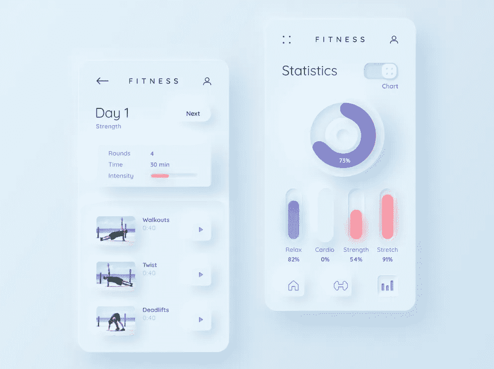
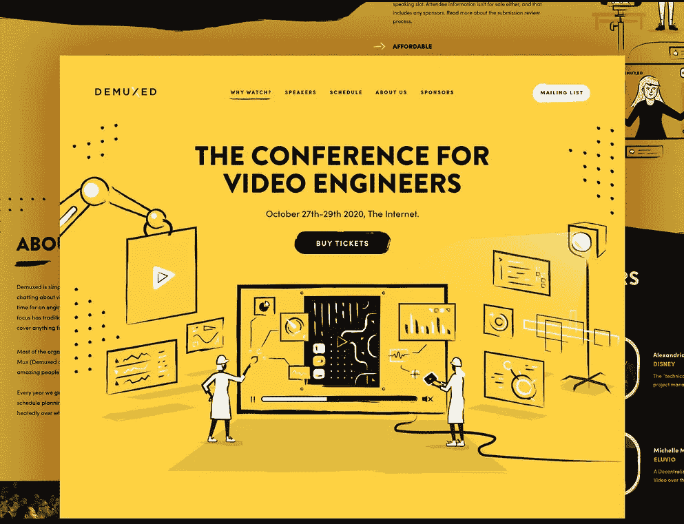
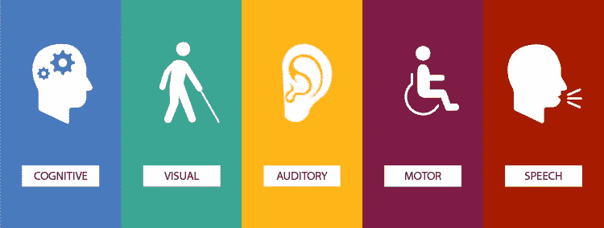

# 2022 年最酷的 25+网页设计趋势，将震撼世界😎

> 原文：<https://medium.com/quick-code/coolest-25-web-design-trends-in-2021-thatll-rock-the-world-388eb1144b7e?source=collection_archive---------0----------------------->

> ***“设计胜于雄辩。”***

嗯，网页设计行业在不断变化，并朝着超越传统方法的方向发展。此外，网页设计已经达到了一个水平，向用户呈现高度吸引人和面向交流的网站以满足他们的需求变得至关重要*。因此，不可否认的事实是，这些现代网站设计趋势在商业转换中起着举足轻重的作用。*

因此，有必要找出什么样的网站设计趋势最适合你的业务类型。

正如我们所说，网页设计行业是不断变化的..！！每年，这个行业都会展示各种类型的趋势，这让网页设计者很困惑，他们很难从长长的列表中找到最好的。

***那么，问题来了，2021 年最好的网站设计趋势有哪些？***

好吧，你可以在这里休息一下，看看这篇关于 2022 年网页设计趋势的详细文章。我们已经涵盖了大多数重要的趋势，尽管我们可能会错过一些。所以，请告诉我们，并在评论区提出你最喜欢的。

在设计你的下一个项目时，你可以使用一些 UI 套件，如 [**免费 Figma Bootstrap 5 UI 套件**](https://themeselection.com/item/free-figma-bootstrap-ui-kit/) 和 [**免费 Sketch Bootstrap 5 UI 套件**](https://themeselection.com/item/free-sketch-bootstrap-ui-kit/) **。**

现在，让我们开始骑行...！！

Credit: Tumblr

## 1.用户界面中的神经形态

Credit: By [Mary Tokar](https://dribbble.com/mary_tokar) on [Dribbble](https://dribbble.com/shots/11202391-Fitness-neumorphism)

神经形态现在越来越受欢迎，它将成为 2021 年最好的网页设计趋势之一。新造型结合了两个概念，造型和材料设计。它采用了极简主义的方法，同时以按钮和其他元素的形式给人一种三维的感觉。

这是关于整个屏幕的颜色，并为用户提供一个完全开箱即用的体验。在选择要使用的颜色时，你需要选择一种颜色来赞美新形态设计上的阴影。它会给人一种体面而独特的感觉。

By [PikiSuperstar](https://www.freepik.com/pikisuperstar) on Freepik

这一趋势在很大程度上被扁平化设计所取代，这种设计简化了图标和颜色，不太真实，但更统一，更容易识别。

神经形态的设计资源

*   [神经变形](https://neumorphism.io/)
*   [AdobeXD](https://www.adobe.com/in/products/xd.html)
*   [视觉](https://www.invisionapp.com/studio)
*   [草图](https://www.sketch.com/)

您可以查看一些示例:

*   [Gavrisov Dmitri 的特斯拉智能应用](https://dribbble.com/shots/10196092-Tesla-Smart-App)
*   [Sergi Mi 的健身设备应用](https://dribbble.com/shots/9800109-Fitness-Device-App)
*   [Spotify By Unfriend rabi](https://dribbble.com/shots/14286744-spootifyLogin)
*   [神经形态用户界面](https://demo.themesberg.com/neumorphism-ui/)
*   [Vuse](https://vuse-dark-preview.hexesis.com/dashboard/operational)
*   [钢 UI](https://www.bootstrapdash.com/demo/steelui/template/demo/vertical-default-light/index.html)

检查全新的 [**Sneat MUI React NextJS 管理模板**](https://themeselection.com/item/sneat-mui-react-nextjs-admin-template/)

一个终极[**React Admin Dashboard**](https://themeselection.com/item/category/react-admin-templates/)有 TypeScript 和 JavaScript 两个版本。

## 2.磨砂玻璃效果

Credit: [Study Call 3D](https://dribbble.com/shots/14260341-Study-Call-3D-Landing-Page) By [Ceptari Tyas](https://dribbble.com/ceptarityas)

在当今时代，这是一个广受欢迎的趋势。此外，它是最容易创建和实现的效果之一。玻璃般的外观为场景增添了令人敬畏的感觉。它使一个元素在另一个元素后面呈现半透明和模糊的外观。

Credit: By [Herdetya Priambodo](https://dribbble.com/shots/14650014-Frosted-Glass-Credit-Card) on [Dribbble](https://dribbble.com/shots/14650014-Frosted-Glass-Credit-Card)

web 技术的最新进展使得在网站上实现毛玻璃效果变得很容易。磨砂玻璃覆盖层后面的元素的模糊外观有助于为某个区域添加颜色，同时还允许文本或对象出现在图像上并保持可读。

对于设计师来说，这是一个受欢迎的选择，它已经被用作背景来代替渐变。

请点击此处查看一些示例:

*   [穆尼金融应用仪表板](https://dribbble.com/shots/14538026-Mooney-Finance-App-Dashboard)
*   [个人中心界面](https://dribbble.com/shots/6083702-Personal-center-interface)
*   [钱包](https://dribbble.com/shots/14693117-Wallet-Hero-Header)
*   [任务经理](https://dribbble.com/shots/14735446-QERJA-Task-Manager)
*   [美食手机 app](https://dribbble.com/shots/12998351-Food-Mobile-APP-Landing-UX-UI-Design)

Get the Sketch UI Kit of Sneat [**Admin Panel Template**](https://themeselection.com/item/category/admin-templates/)

## 3.舒适的颜色

Credit: By [Davina Spriggs](https://dribbble.com/davinaspriggs) on [Dribbble](https://dribbble.com/shots/14403398-Tea-detox-wellness-web-design)

“任何过度都是有害的”。

嗯，不能不同意。戏剧性的创新，如不必要的使用字体，颜色，过于明亮的支出等。会给你的网站减分。

所以，网页设计者已经考虑到这一点，用更容易被眼睛看到的配色方案。

按照这个趋势，在 2022 年，网页设计师将会跳出黑暗和光明这两个极端来思考。他们走中间路线，像柔和的调色板，例如，健康的绿色，柔和的蓝色，温暖的棕色，或浅粉色。这些不仅使网站的颜色比纯黑或纯白不那么不和谐，它们自然地诱导平静和放松。

Credit: By [Davina Spriggs](https://dribbble.com/davinaspriggs) on [Dribbble](https://dribbble.com/shots/14525362-Organic-skincare-website-design)

“平衡——理应如此。”灭霸。😁

所以，总体来说，这种趋势是未来的网页设计师可能更关心可访问性和舒适性，而不是过度使用颜色。

看看下面的一些例子，你会有更好的想法:

*   [网站视觉](https://dribbble.com/shots/6983598-Website-Visual)
*   [美食网站](https://dribbble.com/shots/14471510-Food-Website-Design)
*   [思慕雪餐饮网站](https://dribbble.com/shots/12020793-Smoothiely-Food-and-Beverage-Webiste) [网上书店](https://dribbble.com/shots/14240831-Booksy-Online-Book-Shop)
*   [新潮](https://demo2.pavothemes.com/freshio/home-2/)

一些使用舒适颜色的网站:

*   [Deeponde](http://deeponde.com/)
*   [Mysa 护肤](https://mysa-skincare.com/)
*   [Swiggy](https://www.swiggy.com/)
*   [46 水货酒](https://46parallel.wine/)
*   [野蛮的火花](http://www.savagesparkles.co.za/)

## 4.三维颜色

Credit: [Apple](https://www.apple.com/in/macos/big-sur/)

一切都在转向 3D。从电影，图像，甚至颜色…！！

嗯，网页设计中的渐变配色方案已经流行了一段时间，2022 年的趋势感觉像是下一次进化，颜色过渡变得比以往更加逼真。

从苹果的大冲浪操作系统中汲取他们的想法，我们可以期待饱和的三维颜色，就像从屏幕上摘下的新鲜水果一样。飞溅…！！✨

Credit: By [Mike](https://dribbble.com/creativemints) On [Dribbble](https://dribbble.com/shots/8555640-GRAND-Graphic-Design)

并排的两种颜色可能会突然涂抹在一起，或者它们可能会保留绘制对象的深度和阴影。最后，这种趋势表明，2022 年的网页设计趋势是追求更高的现实主义境界。🤠

## 5.渐变配色方案

Credit: [Chameleon Admin Template](https://dribbble.com/shots/11399195-Chameleon-Admin-Modern-Bootstrap-4-WebApp-Dashboard-Template) By [Themeselection](https://themeselection.com/)

在设计中提供多样性是一件伟大的事情。人们喜欢独特的、有创意的设计。

说到颜色，每种颜色都有数百种色调。渐变只是以一种非常独特的方式提供这些阴影。现在为什么这种趋势越来越流行？🙄

首先，他们为创造力提供了更多的空间。其次，用户不确定。一方面，他们喜欢极简主义，另一方面，他们倾向于认为当设计师只看到两种颜色时，他没有试图将作品融入设计中！！所以，使用渐变是一个非常好的选择，即使你正在设计一个简约的设计。第三，渐变创造了一种运动的错觉。简而言之，你可以称之为运动设计的模拟，没有动画。

Credit: [Instagram](https://www.instagram.com/)

这种平面设计的趋势在 2018 年卷土重来，Instagram 的渐变 logo。从那时起，它就在创造力和互动性方面树立了新的标准。民调结果和专家评论显示，到目前为止，这种趋势还没有消失。所以是 2022 年最好的网页设计趋势之一。

创建渐变的一些技巧:

1.  不要随意选择颜色。它必须服务于页面或产品的特定元素的情绪。如果你不确定该选什么，使用 [Adobe 色轮](https://color.adobe.com/en/create)。
2.  使用大自然的颜色。绿色、黄色、蓝色等。它吸引任何人的目光。看到产品上这样的颜色，用户一定会印象深刻。

以下是一些令人惊叹的渐变颜色生成器:

*   [色彩空间](https://mycolor.space/)
*   [渐变猎奇](https://gradienthunt.com/)
*   [网页渐变](https://webgradients.com/)
*   [Gradienta](https://gradienta.io/)
*   [用户界面渐变](https://uigradients.com/#SweetMorning)
*   [CSS 渐变](https://cssgradient.io/)

一些使用渐变方案的网站:

*   最困的
*   [已休息](https://rested.co/)
*   [除帚](https://delibroom.com/)

## 6.交互式 3d 内容

Credit: [Xeniac](https://www.uplabs.com/xeniac) on [Uplabs](https://www.uplabs.com/)

3D 绝对是网页设计的热门趋势。这是迷人的，迷人的，令人兴奋的，给游客一种可怕的感觉。

嗯，由于现代网络技术，网页设计师可以实现他们的愿望，使一个可怕的网站脱颖而出。

Credit: By [Ilham Maulana](https://dribbble.com/shots/14600147-Remote-Working-Landing-Page) On [Dribbble](https://dribbble.com/shots/14600147-Remote-Working-Landing-Page)

3D 元素已经流行了很长时间，并且是不会很快消失的常青树趋势之一。因此，使用令人惊叹的 3D 元素释放您的创造力。😍

Credit: [Avatarz](https://www.avatarz.design/)

以下是一些很好的例子:

*   [食品配送](https://dribbble.com/shots/14707666-Delivery-Landing-page-UI-UX-Design)
*   [网站 3d 插图](https://dribbble.com/shots/14510815-Web-site-3D-illustration)
*   [登陆页面设计](https://dribbble.com/shots/12031525-Landing-Page-UX-UI-Design)

查看一些使用 3d 内容的网站:

*   [Zenly](https://zen.ly/)
*   [智人](https://sapiens.ui8.net/6f3c3c2)
*   [GetUniq](https://getuniq.me/en/)

## 7.材料设计

Credit: [Materialize Admin Template](https://pixinvent.com/materialize-material-design-admin-template/landing/) by [Pixinvent](https://pixinvent.com/)

[材料设计](https://material.io/design/)是谷歌早在 2014 年推出的一种设计语言。大多数时候，传统的网页设计看起来很单调。现在，正如你在上面的图片中看到的，材质设计允许使用颜色和阴影来模仿物理世界及其纹理。

Credit: By [Jovie Brett Bardoles](https://dribbble.com/jbbardoles) on [Dribbble](https://dribbble.com/)

这实际上是过去几年设计界最大趋势的自然延续:扁平化设计。此外，Material 可以做 flat 做不到的事情，它添加了足够的修饰来增强可用性。材料设计的目标是可用性，而不是拿走一切去迎合视觉吸引力。

它肯定会像过去一样主导 2022 年的网页设计趋势。

## 8.黑暗模式和低光 UX 网页设计趋势

[Sneat Asp.NET Core Admin Template](https://themeselection.com/item/sneat-aspnet-core-admin-template/) By [Themeselection](https://themeselection.com/)

2022 年最热门的网页设计趋势之一是黑暗模式。

你可能喜欢黑暗模式吧？无论是剧院还是任何应用程序，黑暗都是你喜欢的东西！！你确定你不是吸血鬼。？😁

无论如何，黑暗模式、夜班和你在上面的[**Asp.Net 管理面板**](https://themeselection.com/item/category/asp-net-dashboard/) 中看到的另一个低光用户界面是流行的，因为它们为用户提供了一个低对比度的网站或应用程序，在低光环境下更容易看。

Credit: [Vuexy Vuejs Admin Template](https://pixinvent.com/demo/vuexy-vuejs-admin-dashboard-template/demo-4/dashboard/ecommerce) by [Pixinvent](https://pixinvent.com/)

此外，黑色是一种特别强烈的颜色，可以激发人们强烈的情绪，如果过度，很容易征服一个人。当您想要突出显示特定类型的内容时，暗模式特别有用。 [Spotify](https://www.spotify.com/) 、[网飞](https://www.netflix.com/)、 [Steam](https://store.steampowered.com/) 均为黑暗模式设计。而 [Instagram](https://www.instagram.com/) 、 [Twitter](https://twitter.com/) 、 [Apple](https://www.apple.com/in/) 和 [Android](https://www.android.com/intl/en_in/) 是一些最受欢迎的提供黑暗模式的应用和服务。

Credit: [Imgflip](https://imgflip.com/)

这一趋势的主要原因如下:

*   它给人一种超现代和酷的感觉
*   它可以节省设备电池电量(在有机发光二极管/AMOLED 屏幕的情况下)
*   它允许弹出和突出显示其他设计元素
*   它可以减少弱光条件下的眼睛疲劳。

尽管如此，人们不应该忽视这样一个事实，任何过量的东西都是有害的。所以，小心使用…！！

> 这里有一篇关于[为什么要用深色背景](https://wpamelia.com/dark-background/)的详细文章？

## 9.极简主义(平面设计)

Credit: [Sneat Bootstrap 5 HTML Admin Template](https://themeselection.com/item/sneat-bootstrap-html-admin-template/) By [Themeselection](https://themeselection.com/)

“不是数量的问题，是质量的问题。”

当今时代正在对极简主义方法产生兴趣。无论是关于布料还是家具，甚至是网页设计..！！简单和复杂的服装更吸引人，因为它简化了用户体验。过多使用物体、字体，动画可能会毁了它。所以，要留住你网站的访问者，记住一件事:网站越干净，体验越好，跳出率越低。

我们在 ThemeSelection 努力保持所有模板的设计简洁，尤其是 [**引导管理模板**](https://themeselection.com/item/category/bootstrap-admin-templates/) 。

Credit: [Materio Vuetify Vuejs Admin Template](https://themeselection.com/item/materio-vuetify-vuejs-admin-template/) by [Themeselection](https://themeselection.com/)

在设计时，你应该知道你在设计中使用的每一个项目，无论是字体、图像还是副本，都必须有一个目的；除非有必要清楚地传递信息，否则不应该使用它。但是，要确保你没有通过删除或隐藏用户需要的内容来使他们的主要任务变得更加复杂。目的是让信息清晰，而不是隐藏。

网页设计中极简主义的主要方面:

*   隐藏导航
*   用户友好的界面
*   导航空间
*   创造性地使用字体
*   一次最多三种颜色
*   避免过多的细节:颜色过渡，阴影，纹理

设计简约的网站:

*   [coaxsoft](https://coaxsoft.com/)
*   [斯佩里](https://www.sperry.com/en/home)
*   [耐克](https://www.nike.com/)
*   [卡姆](https://www.kamu-breda.nl/)

> 你可以查看这篇详细的文章作为参考:[极简网站设计的最佳实践](https://medium.muz.li/best-practices-for-minimalist-website-design-9e8ea07e17c2)。

Sneat Figma Dashboard Builder and UI

在 [**下一个 js Dashboard**](https://themeselection.com/item/category/next-js-admin-template/) 版本中也可以获得这个 [Admin Dashboard UI](https://themeselection.com/item/category/ui-kits/) 。

## 10.手绘元素

Credit: By [Oli Lisher](https://dribbble.com/olilish) On [Dribbble](https://dribbble.com/shots/14240446-Demuxed-conference-2020)

“一幅画胜过千言万语”这句老话仍然适用于今天的经历。视觉比文字更容易吸引人，照片、插图或草图的这种自然属性使它们对视觉设计非常有用。因为任何网页设计师的主要动机都是以一种时尚有趣的方式来展示网站，以吸引流量。为了抓住用户的注意力，设计师在他们的项目中尝试新的想法，最终导致手绘元素的引入。

Credit: By [Angela Santos](https://dribbble.com/BySitges) On [Dribbble](https://dribbble.com/shots/14337052-Digital-Marketing-Landing-Page)

由于手绘是图形艺术家、设计师和插画师的典型特征，并且经常与创造力和灵感联系在一起，因此它经常用于作品集和展示中。

如果我们看到一个新的趋势(当然不是太新)，设计师们正在把草图作为一种设计形式带回来。当然，手绘艺术是网页设计中最受欢迎的风格之一。使用这些粗略的设计来传达和反映个人风格肯定是一个好主意。

看看一些追随这一趋势的网站:

*   [手动按钮](https://www.handwrytten.com/)
*   [元音乐](https://metamusic.ca/)
*   [Equalparts](https://www.equalparts.studio/)

## 11.聊天机器人

Credits: By [Vic Bell](https://dribbble.com/vicbell) on [Dribbble](https://dribbble.com/)

机器人已经成为所有人的娱乐。让人们着迷的是，机器或程序可以完成任务，甚至可以交流..！！它给人一种高级的感觉。

显然，聊天机器人是一个非常棒的交互式功能，已经流行了几年，在 2022 年也将继续相关。随着对人工智能和机器学习的需求增加，聊天机器人将成为简单客户服务请求和个人购物的规范。

例如，如果客户访问您的网站，寻找特定的产品，聊天机器人知道他们有这些产品。聊天机器人可以让他们知道这件事。这种体验可以给客户留下积极的印象，并且可以在没有真人的情况下在客户支持下处理业务。这样你也可以让你的网站更受全球所有客户和访问者的青睐。

以下是一些最好的聊天机器人提供商:

*   [漂移](https://www.drift.com/)
*   [ManyChat](https://manychat.com/)
*   [聊天燃料](https://chatfuel.com/)
*   [焦油](https://hellotars.com/)
*   [蒂迪奥](https://www.tidio.com/)

Get this [Laravel Admin](https://themeselection.com/item/category/laravel-admin-templates/) in Both TypeScript and JavaScript.

优势:

*   改善客户服务
*   更容易进入全球市场
*   提高客户参与度
*   跟上潮流:出现在信息平台上
*   监控消费者数据并获得洞察力
*   更好的销售线索生成、资格认定和培养
*   成本节约

## 12.语音用户界面(VUIs)

Credit: [Echo show Play](https://dribbble.com/shots/5339502-Echo-Show-Play-Video) by [Theron Benson](https://dribbble.com/theronb)

语音用户界面(vui)允许用户通过语音命令与系统进行交互。虚拟助手，如 Siri、谷歌助手和 Alexa，都是 vui 的例子。

还记得我们在谷歌上搜索后要等很久才能得到信息的日子吗？现在我们只需要命令…！！我们变懒了吗..！？😂

嗯，从你的一个命令中获取信息确实很有趣..！！？你所要做的就是问问你在想什么，然后结果马上就出来了。现在是新的常态。与服务互动的方式正在改变，甚至网页设计也在调整，以跟上语音聊天机器人和虚拟助手的流行。

优势:

*   免提的
*   直觉的
*   迅速的
*   相互作用的

它们简化了我们搜索信息、做笔记等的方式。苹果、安卓和谷歌等品牌在他们的用户界面/UX 设计过程中实现了这一趋势

虽然声控界面对大多数网站来说并不常见，但这一新兴趋势不容忽视…

我们可以期待看到越来越多的网站将语音搜索作为传统文本搜索的一个选项。所以，记住这一点。✌

> 你可以查看这篇文章了解更多细节:[设计 VUI 语音用户界面](https://www.toptal.com/designers/ui/designing-a-vui)

## 13.网页可访问性

Credit: [Google Images](https://www.google.com/imghp)

全球目前有超过[**20 亿残疾人**](https://www.inclusivecitymaker.com/disabled-people-in-the-world-in-2019-facts-and-figures/) ，占全球人口的 37.5%。所以你的设计必须让这些观众也能访问你的网站。

因此，从根本上说，网页可访问性意味着网站、工具和技术的设计和开发要让所有人都能使用，包括残疾人。更具体地说，人们可以:

*   理解、感知、浏览网络并与之互动
*   为网络做贡献

提高可访问性的要素包括:

*   在文本和背景之间创造合适的颜色对比；
*   焦点指示器，例如，使用键盘导航时显示在链接周围的矩形轮廓；
*   对表单域使用标签和说明，而不是上下文无关的占位符文本；
*   对图像使用功能性 alt 标签(这也提升了 SEO！)

网页可访问性不仅仅是一种趋势，它还是一个重要因素，因为网络和互联网已经成为我们生活的重要部分。网页可访问性使残疾人能够平等地获得网络提供的重要服务/功能，如网上购物、教育、医疗服务、娱乐等。这也增加了转化率，提高了你的搜索引擎优化，并帮助你接触到更多的观众。

> 你可以查看文章[关于网页可访问性的介绍](https://www.w3.org/WAI/fundamentals/accessibility-intro/)。这里有一个免费教程，你可以查看:[https://www.udacity.com/course/web-accessibility-ud 891](https://www.udacity.com/course/web-accessibility--ud891)

## 14.交互性

Credit: By [Cuberto](https://dribbble.com/cuberto) on [Dribbble](https://dribbble.com/shots/14679084-Software-Developer-Website-Interaction)

如果你打开一个网站，发现它一点都不互动，你会有什么感觉..！！你可能不会再去了。对吗？

这就是为什么交互设计是设计师必不可少的一部分。像问题、测验、投票和其他吸引人的图形这样的互动元素将有助于保持人们对你的网站的兴趣。这也有助于降低跳出率，因为访问者更有可能留在你的网站上。

这是一个为访问者提供价值，让他们参与你的网站，并了解他们更多的好方法。如果你的设计是交互式的，它会自动引起人们对你的公司的好奇和兴趣。在设计你的新网站时，一定要检查这一点。！！

互动营销的例子包括:

*   像测验这样的评估
*   民意测验和调查
*   反馈部分
*   复习

以下是一些交互式网站的例子:

*   [Webflow](https://webflow.com/ix2)
*   [波兰](http://www.polishchristmasguide.com/)
*   [圣诞节](http://www.polishchristmasguide.com/)
*   [指南](http://www.polishchristmasguide.com/)
*   [Cyclemon](http://www.cyclemon.com/mobile/)
*   [攀登者](http://www.climber.io/)

## 15.虚拟现实

Credit: [Volodymyr Kurbatov](https://dribbble.com/V_Kurbatov) on [Dribbble](https://dribbble.com/shots/11547006-Home-Office-in-Mixed-Reality)

在电影《钢铁侠》里看起来有多酷..！！？很花哨。😎

嗯，不是那么先进，但仍然，虚拟现实正在成为所有领域的趋势。无论是游戏、电子商务还是网页设计，都不例外。

大多数时候，游客会对某件特定的东西、布料或产品的走向感到困惑..！！即使他们喜欢这个产品，他们也想确定或者了解它将如何设置。这就是 VR 或 AR 的帮助所在..！！

未来几年，网站上的虚拟现实体验将不断增加。想想像宜家这样的家具网站，展示你房间里的家具是什么样子..！！

虚拟现实肯定是一个强大的工具，网站可以向网站访问者传达有意义的、互动的和有用的内容，帮助他们更容易地做出购买决定。

## 16.微观互动

Credit: By [Pedro Aquino](https://dribbble.com/pedroaquinofx) on [Dribbble](https://dribbble.com/)

微动画就是小动画。但是在这里不要认为小是无关紧要的..！！微型动画在引导用户与你的网站互动时非常有用。

这就是为什么对于网页设计师来说，微型动画是 2022 年网页设计的趋势之一。电子商务网站正在使用微型动画来增强用户体验，并让购物者体验他们的产品。

微互动有 4 个基本部分:

*   引发
*   规则
*   反馈
*   循环和模式

> 更多详细信息，请查看[概述和正确利用微交互来增强网站用户体验设计](/@KrishaWeb/overview-and-proper-utilization-of-micro-interactions-to-enhance-a-websites-ux-design-7155c9179c52)。

## **17。微型动画**

Credit: [Micro Animations](https://dribbble.com/shots/12332587-Dashboard-Micro-animations) By [Aleks Faure](https://dribbble.com/AleksFaure)

顾名思义，微动画就是小动画。但在这种情况下，小不代表无足轻重。在引导用户与你的网站互动时，它们非常有用。微型动画已经流行了几年，但在 2022 年，它将是关于有机地使用它们。

当前电子商务网站的网页设计趋势之一是使用微型动画来提升用户体验，并让购物者体验他们的产品。例如，这家瑜伽服装店已经在使用微型动画向顾客展示他们的衣服如何合身，如何在真人身上移动:

## 18.纯文本英雄图像

Credit: [Apple](https://www.apple.com/)

“变化是唯一不变的。”✌

文字混合照片统治设计世界的日子已经一去不复返了。现在，没有视频和照片，使用单色配色方案的大而粗的印刷字体是 2022 年的新热门趋势之一。2022 年全年也是如此。

页面的顶部被称为“英雄部分”目前吸引互联网用户注意力的场景是用引人注目的字体取代典型的背景图片。一个醒目、独特的字体足以迅速引起用户的注意。🤩

Credit: [Tubik](https://dribbble.com/Tubik) On [Dribbble](https://dribbble.com/shots/12664952-Mobile-Banking-Service-Website)

你可以看到他们是如何恰当地使用物体背后的字体，比如循环。它传达了网站的座右铭，没有不必要的对象和设计。

以下是一些有英雄形象的网站:

*   穆特扎
*   [谷歌像素](https://store.google.com/us/product/pixel_5)
*   [维耶苏斯](https://www.viesus.com/)

## 19.数据可视化

Credit: [Ning xiao dong](https://dribbble.com/ningxiaodong) on [Dribbble](https://dribbble.com/)

我们都喜欢钢铁侠的数据可视化技术。看起来很酷吧..！！😎所有的数据都在一个屏幕上。但是让我们回到现实。

数据可视化和动画元素在现代图形设计中扮演着重要的角色，以一种互动和吸引人的方式交流数据是很难的。但这种努力是值得的，因为数据可视化是有利的，因为人类是视觉动物，视觉传达了你需要传达的信息。数据可视化从你的数据中生成图像，吸引访问者，让他们对你的品牌产生好奇。信息图和图表是将数据变得生动的一些最受欢迎的方式。

Credit: [Sneat UI Kit](https://dribbble.com/shots/13973458-Sneat-Dashboard-UI-Kit) on [Dribbble](https://dribbble.com/)

如果您想使用这个 [**UI 设计套件**](https://themeselection.com/item/category/ui-kits/) ，那么我们有 Sneat Admin Dashboard Builder 和 Figma 版本的 UI 套件。

使用数据可视化是一个很好的选择。首先，你将从长时间的页面滚动中拯救潜在客户。其次，你可以更清晰地传达信息。第三，这种效应会在公司的名片上发挥作用。您的客户更有可能记住这一点。😉

## 20.拇指友好的移动导航

Credit: By [Ranjith Manoharan](https://dribbble.com/ranjithmanoharan) On [Dribbble](https://dribbble.com/shots/6869746-Twitter-Search)

我们都喜欢只用拇指的时候。👍🏻所以，这就是我们的目标:让导航更容易、更顺畅。在目前的情况下，全球有 34 亿智能手机用户(这确实是一个巨大的数字。😯)，让你的网站移动友好和拇指友好也是很重要的。它直接提升了你的网站和你的公司的印象。

Credit: By [Nimit Dholakia](https://dribbble.com/nimit) On [Dribbble](https://dribbble.com/shots/9756551-Thumb-Friendly-Heat-Map-Analysis)

因此，将菜单、导航条甚至联系人按钮放在你的拇指停留的地方(大多数时候是屏幕的中心)会让你的网站使用起来更舒适，并提高 UX。

## 21.空格

Credit: [Apple](https://www.apple.com/in/)

一个精心制作的简约设计是每个网页设计师都喜欢的，因为它很容易传递信息和所需的信息。

留白也称为负空间，是为了给内容留出呼吸的空间，而不是试图在屏幕上弄乱尽可能多的信息。

使用空白的优势。

*   为你的网站访问者提供放松的体验
*   内容更突出
*   即兴可读性
*   传达明确的信息

以下是一些您可以查看的网站示例:

*   [妙语连珠](https://www.getquip.com/)
*   [苹果](https://www.apple.com/macbook-air/?ref=land-book.com)
*   [收纳箱](https://www.dropbox.com/)
*   猫头鹰
*   [方形空间](https://www.squarespace.com/)

但是，请记住一件事，空白只是我们给元素之间的间距的术语。只要该区域是空的，它就不必是白色的。

> 你可以看看这篇文章:[在你的网页设计中使用空白或负空间](https://webdesign.tutsplus.com/articles/using-white-space-or-negative-space-in-your-designs--webdesign-3401)

## 22.插图

By [Pikisuperstar](https://www.freepik.com/pikisuperstar) on [Freepik](https://www.freepik.com/home)

插图很有趣，也很吸引人，还有点和游客的心情有关。

它点燃了喜悦和清新的情绪。因为有时浏览网页感觉就像在许多网站上看到相同的库存照片。它会让一个网站感觉无聊、普通、乏味。

插图是一种充满活力和令人敬畏的视觉传达形式。它结合了平面设计的信息清晰度和美术的表达能力。在巅峰时期，插画做了摄影做不到的事情。它从人类眼睛无法企及的角度描绘了熟悉的事物。

Credit: [Vuexy Figma Template](http://1.envato.market/vuexy-figma-template)

以下是一些令人惊叹的插图资源:

*   人类
*   [绘图工具包](http://drawkit.io/)
*   [Avataaars](https://avataaars.com/)
*   [自由插画](https://freellustrations.com/)
*   [脸红](https://blush.design/)
*   [打开涂鸦](https://www.opendoodles.com/)
*   [拔桩机](https://stubborn.fun/)

最近，各种品牌都在尝试，在网上使用插图是网页设计领域最棒的事情之一，它也将出现在 2022 年的网页设计趋势列表上。！！

看看一些好例子:

*   [圣诞节](https://christmashq.com/)
*   [设计模式](https://designmodo.com/)
*   [数字兄弟](https://digitalbro.net/)
*   [USMobile](https://www.usmobile.com/)

## 23.全高主页英雄

Credit: By [Zahidul](https://dribbble.com/zahidvector) on [Dribbble](https://dribbble.com/)

全屏英雄部分基本上是图像的顶部。这一部分主要使用图像，以更清晰的方式向访问者传达信息。网站英雄图像用图像填充屏幕或屏幕的大部分。它通常是背景图像，前景是文字和/或其他设计元素。

这种趋势现在越来越流行了。英雄形象是一个强大的主导元素，可以快速传达主要信息。

就像一个巨大的广告牌，让你的主页英雄部分全高可以集中你的用户的注意力，并作为分散注意力的信息。

Credit: By [Emy Lascan](https://dribbble.com/mazepixel) on [Dribbble](https://dribbble.com/shots/10835954-Online-Beauty-Salon-Website-Hero-Design)

英雄形象设计的优势:

*   视觉吸引力
*   文本可读性
*   交互性
*   讲故事

以下是一些有用的网站:

*   [建筑杂志网站](https://dribbble.com/shots/5934272-Architecture-Magazine-Website)
*   [野按英雄形象插画](https://dribbble.com/shots/5426766-Hero-image-Illustration-for-wild-press)
*   [儿童读物网站](https://dribbble.com/shots/5443807-Books-for-Children-Website)
*   [活动追踪—英雄插图探索](https://dribbble.com/shots/5752843-Activitrack-hero-illustration-exploration)

将全屏英雄部分作为完美讲故事的机会。但是，请记住，图像将根据浏览器尺寸进行不同的裁剪。你应该使用一个相应的图片。

## 24.使用视频

Credit: [Art Copy & Code](http://www.artcopycode.com/campaign/art-copy-code)

视觉效果总是引人注目和互动的..！！不是吗..？

那么，在你的网站主页上使用视频肯定是最好的主意，因为这是 2022 年值得注意的设计趋势之一。因为当你在网站主页的背景中使用一系列的视频短片时，这种设计可以很好地展示你的服务和你积极的公司形象。

Credit: [OBPAgency](https://obpagency.com/)

当用户访问您的网站时，他们会立即对该公司、它提供的服务以及您的团队如何互动产生印象。基本上影响了客户与你网站的互动。

虽然视频很棒，但需要深思熟虑。有目的有意义的视频。在你的网站上嵌入 YouTube 视频并不是更流行的趋势，因为一个经过深思熟虑的高质量视频胜过十几个随意组装的视频。

因此，如果你在 2022 年创建一个新网站，强烈建议在你的主页上使用视频。👍🏻

很好地利用这一趋势的网站:

*   [火花 44](https://spark44.com/)
*   [Answerthepublic](https://answerthepublic.com/)
*   [PP-性能](https://www.pp-performance.de/)
*   [腌制](https://www.hondersalting.nl/)
*   [正念](https://www.yin-mindfulness.com/)

## 25.浮动元素

Credit: [Folio](https://dribbble.com/shots/14080237-Folio-Agency-Portfolio-Kit) By [Tran Mau Tri Tam](https://dribbble.com/tranmautritam)

另一个互动和视觉上吸引人的东西在你的网站上..！！

嗯，柔和的阴影和浮动元素增加了趣味性和深度，让你的网页看起来像“3D Lite”。这使得它非常吸引人和直观。另外，不仅仅是图形的问题。要有创意，并且将它与文本和照片结合起来。创意是最能吸引参观者注意力的东西。

阴影和分层元素效果给了设计一种轻盈的感觉，仿佛元素在彼此之上浮动，使其有趣且引人注目。

所以，这实际上是一个释放你的想象力和创造力的机会，让你的网站有一个吸引人的独特外观。🤩

## 26.将照片与图形元素融合

Credit: By [Kevin](https://dribbble.com/uiwithvin) on [Dribbble](https://dribbble.com/)

谁不喜欢这样的创意..！！？

图像上重叠的图形有助于在不同的层面上执行您的想法和想象力。这种混合技术为典型的图像带来了创造性和交互独特性。

Credit: [Useplink](https://useplink.com/en/)

这一趋势正在持续增长，并且不会在 2022 年停止。此外，混合图片和图片可以提升你的公司品牌，并让网站访问者关注你的内容。

以下是一些网站，你可以看看它们是如何追随这一趋势的:

*   [奥林匹克运动会](https://olympp.fr/)
*   [精确运行](https://precisionrun.com/)

## **27。粗体和颜色**

你可能经历过这种情况，粗体字母和颜色会吸引你的注意力。

根据研究人员 Satyendra Singh 关于色彩心理学在营销中的影响的研究: [**大约 62‐90%的评估仅基于颜色**](https://www.codeinwp.com/blog/color-psychology-in-marketing/) **。**

大而醒目的标题是 2022 年最大的趋势之一，它们也将继续主导 2022 年。

Credit: [https://www.crazyegg.com/blog/psychology-of-fonts-infographic/](https://www.crazyegg.com/blog/psychology-of-fonts-infographic/)

粗体字体非常有效，可以让人惊艳。使用漂亮字体的大标题能立刻吸引注意力，并能让整个简单的页面感觉新鲜。配上合适的背景，大字体看起来很棒。

## 29.有机形状

Credit: [Freepik](https://www.freepik.com/home)

当你可以与众不同时，为什么要保持正常呢..！！？😉

有机或流体形状是任何不涉及直线的东西。环顾四周，看看自然界中的形状，如山丘、河流或湖泊的边缘，以及它们是如何不对称和弯曲的。

流体形状是一个很好的方式来打破没有粗糙线条或角度的网站部分。它们在背景中使用也很棒。

它给人一种酷酷的视觉享受，可以吸引更多的游客来冲浪。

## 三十岁。不对称布局

Credit: By [Divagar](https://dribbble.com/Divagar19) on [Dribbble](https://dribbble.com/)

曾经有一段时间，安排良好的网格导向的简单和纪律的网站统治。但是到了 2020 年晚些时候，这个板块发生了巨大的变化:**不对称布局。**

这是一个大胆的举动，打破了传统主义，走向成功的野蛮主义，个性，能量和乐趣。主要是大多数网站都是基于网格的，它们通常看起来平淡无奇，过于自律&这种突破性的改变让它变得更加互动和冲动。

网站现在特别把这个想法带到了一个巨大的场景中。破碎网格布局更有吸引力，因为它们与众不同，固执己见。一点点乱是有趣的…！！😜

虽然，一个品牌网站对这种趋势不能掉以轻心。访问者可能会发现内容无法阅读，令人不知所措。所以，在这种情况下，品牌必须在不对称的布局和强大的背景之间保持平衡。

## 结论

因此，我们提到了 2022 年将震撼世界的一些最酷的网页设计趋势。我们可能会错过一些，因为这是一个广阔的世界..！！因此，如果你觉得我们应该添加一些内容，请在下面的评论区告诉我们。👍

在 2022 年，我们期望看到更多明亮、干净、视觉丰富和互动的网站，这些网站使用动画和视频来增强与访问者的互动，并即兴发挥他们的用户体验。如果你想尝试这些趋势，那么就使用[免费的引导管理模板](https://themeselection.com/item/category/bootstrap-admin-templates/)和 [VueJS 管理模板](https://themeselection.com/item/category/vuejs-admin-templates/)。它会帮助你得到一个更好的想法。

今年的网页设计趋势拥抱了现代未来主义和创新方法。渐变、醒目的视觉效果和色彩、3D 效果、重新设计的复古潮流，都在清晰地预示着 2022 年的这种新风格。

由于许多创新和独特的风格，设计趋势和运动，我们可以肯定地说，2022 年的网页设计趋势将充满惊喜。🎉

快乐的旅程…！！✨

# 关于主题选择

我们在 [ThemeSelection](https://themeselection.com/) 提供精选的高质量、现代设计、专业、易用的免费和高级[引导管理模板](https://themeselection.com/item/category/bootstrap-admin-templates/)、 [Asp NET Dashboard](https://themeselection.com/item/category/asp-net-dashboard/) 、 [VueJS 管理模板](https://themeselection.com/item/category/vuejs-admin-templates/)、 [Laravel 管理模板](https://themeselection.com/item/category/laravel-admin-templates/)、 [React 管理模板](https://themeselection.com/item/category/react-admin-templates/)、 [NextJS 管理模板](https://themeselection.com/item/category/next-js-admin-template/)、HTML 主题和[免费 UI 工具包](https://themeselection.com/item/category/free-ui-kits/)来创建您的应用

如果你想[免费管理模板](https://themeselection.com/item/category/free-admin-templates/)，那么请访问[主题选择](https://themeselection.com/)。