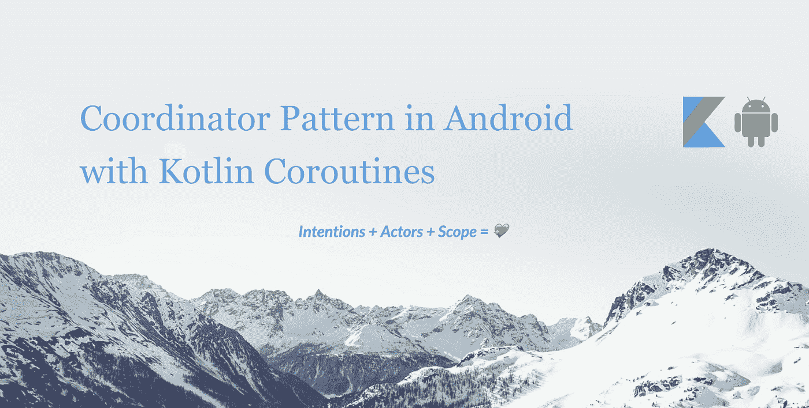
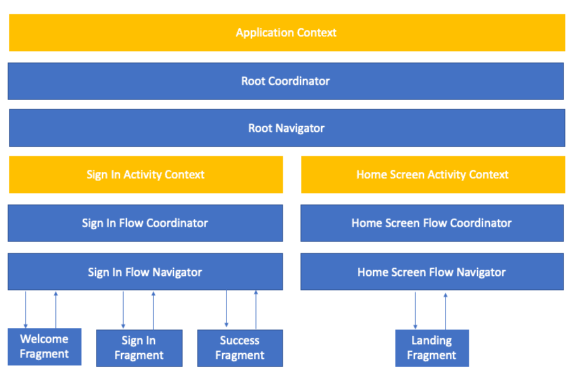
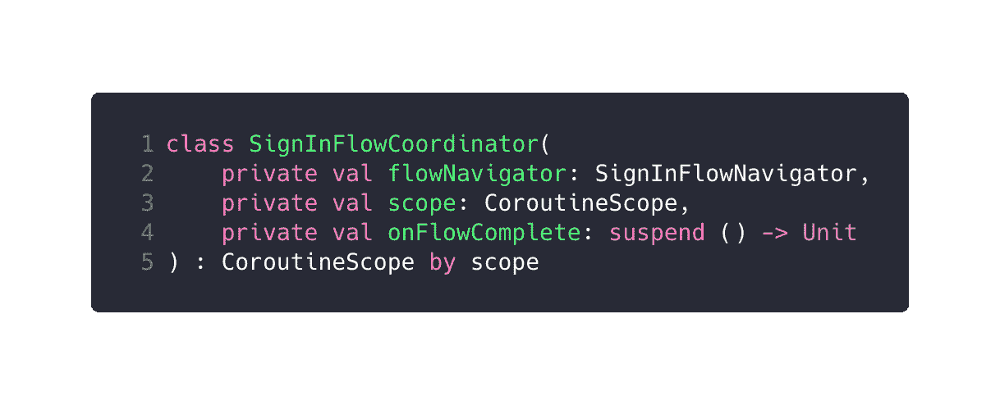
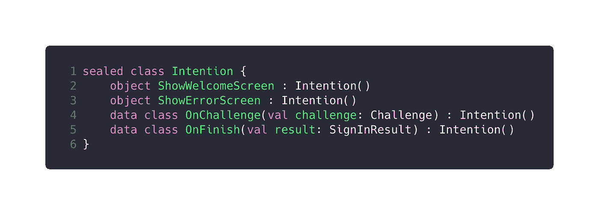
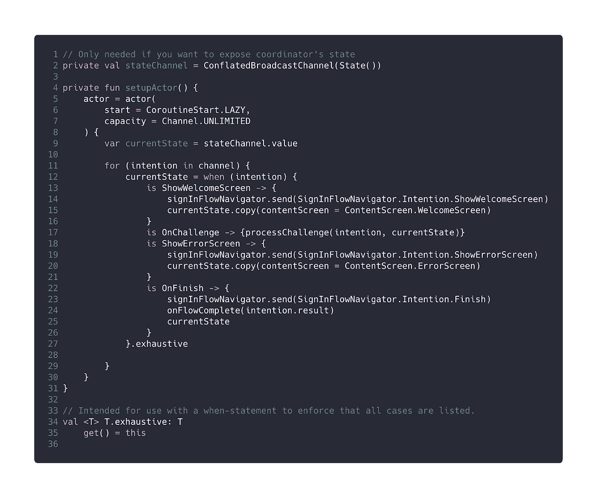
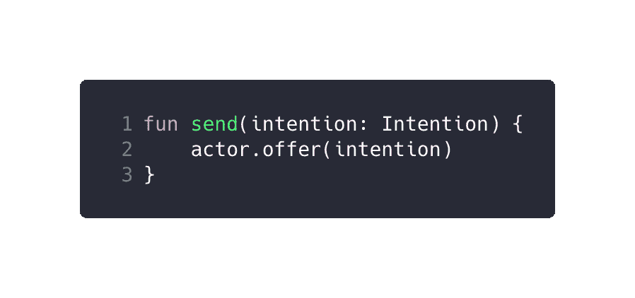
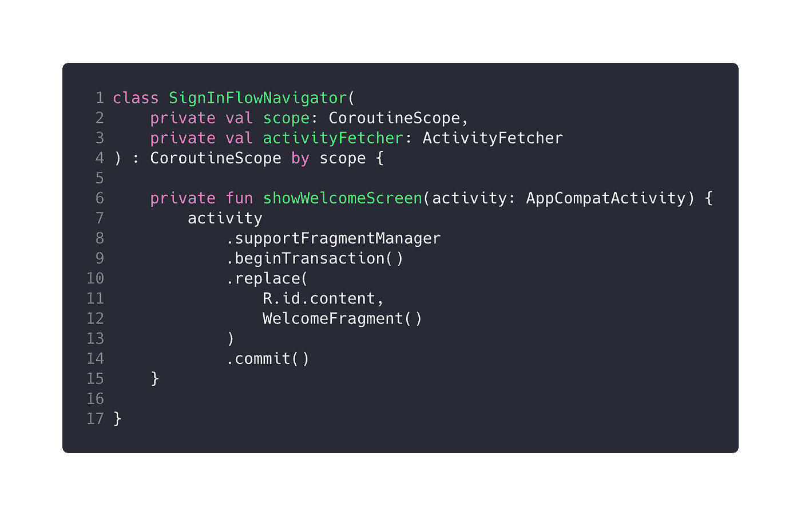

# Android 中使用 Kotlin 协程的协调模式

> 原文：<https://medium.com/capital-one-tech/coordinator-pattern-in-android-with-kotlin-coroutines-fcdf79a089de?source=collection_archive---------0----------------------->

在 Capital One，我的团队为企业构建 Android SDKs。最近，我们遇到了一个有趣的情况，UI 流必须是动态的，这意味着与服务器的每次交互都将返回一个包含 SDK 需要显示的下一个屏幕的响应。我们知道，如果设计得不好，这个问题很容易导致糟糕的代码。因此，受汉尼斯·多尔夫曼的协调员[模式](http://hannesdorfmann.com/android/coordinators-android)的启发，我们转向了一种动态响应 API 响应的方法。

举个例子，我们的 SDK 是使用内部的模型-视图-意图(MVI)框架构建的。该框架使用 redux [原则](https://redux.js.org/introduction/three-principles)设计，支持结构化并发。

本文重点介绍我们使用 Kotlin 协程解决动态导航的方法。

*如果你不熟悉协程，*[*Roman Eliza ROV*](/@elizarov)*有大量的文章和视频非常好地解释了这个概念。*

# ***一种基于协程的*解决方案**

*协调器包含在视图之间导航的业务逻辑。*

一个协调器使用一个**协程** **参与者**来按顺序处理异步 ***意图*** ，这些都在流程生命周期的**范围内**。

## **组件**

下图是我们将要讨论的各种组件的参考。

*   根协调器的作用范围是*应用/ SDK 的*协程上下文，负责通过根导航器基于业务规则调用特定的流协调器。
*   流协调器的作用范围是*活动视图模型*，并且与所有子视图模型共享。基本上，他们负责在流程中的视图之间导航。
*   Flow Navigator 是一个无状态组件，它只拥有向流的活动添加视图/片段的逻辑。它们由流协调器调用。

# 协调者

下面的代码示例代表了一个由根协调器启动的登录活动流中使用的协调器。为了保持这篇文章的简短和集中，我们将只讨论其中一个协调器，因为它们都遵循相似的设计原则。

## ***建造师***

*范围*与主活动的视图模型相关联，并在子片段视图模型之间共享。onFlowComplete lambda 由 RootCoordinator 提供，它应该在流结束时被调用。这样，流的退出和进入由 RootCoordinator 控制。

## ***意图***

这些是我们的协调员用来计算结果的。它们可以由用户操作或一些异步操作(如 API 响应)创建。

## ***演员***

*异步编程界能拿奥斯卡的演员；)*

我们的协调器也有一个 actor，它将被延迟初始化，并具有无限的通道容量。我们选择的容量基于我们的使用案例，因为我们不想放弃任何意图。一个参与者顺序处理意图，并通过`copy(…)`扩展函数计算新的状态，从而确保不会发生并发的状态突变。理想情况下，每个意图都将映射到一个由 SignInFlowNavigator 提供的导航操作。

协调器还公开了一个函数，用于将意图添加到参与者的队列中。

*更多关于协程演员的内容可以在这里阅读***。**

# *航海家*

*现在让我们看看登录活动流中使用的导航器，它由登录协调器调用。为了保持这篇文章的简短和集中，我们将只讨论其中一个导航器，因为它们都遵循相似的设计原则。*

**

*导航器是无状态的，其范围类似于 SignInFlowCoordinator，尽管它们不拥有业务逻辑。像协调器一样，它通过参与者处理它的意图。您可能已经注意到，我们还传入了一个 activityFetcher，它公开了当活动不可用或不处于有效的生命周期状态时导航器挂起的`CompletableDeferred<AppCompatActivity>`。*

# ***结论***

*上面讨论的方法只是协调器概念的一种可能的实现。这种方法有助于简化视图模型和活动/片段，消除重复，并抽象导航逻辑。*

*我的团队正在招聘 Android 开发人员。如果你知道谁可能感兴趣，请把链接发给他们，并把我介绍给他们！*