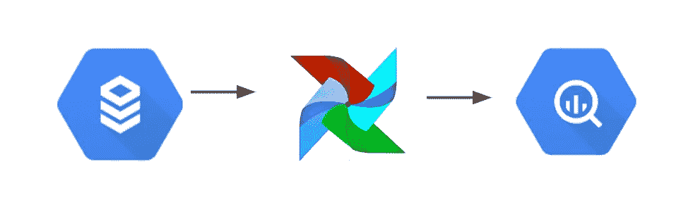
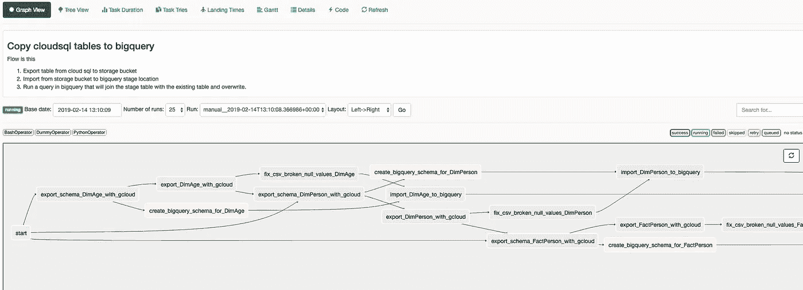

# 使用 Apache Airflow 将数据从云 SQL 复制到 BigQuery

> 原文：<https://medium.com/compendium/copy-data-from-cloud-sql-to-bigquery-using-apache-airflow-b51bdb277463?source=collection_archive---------0----------------------->

TLDR；[链接到底部带有示例气流 DAG](https://github.com/ael-computas/gcp_cloudsql_airflow_bigquery) 的代码回购。

去年，当谷歌将 [Apache Airflow](https://airflow.apache.org/) 变成 [GCP](https://console.cloud.google.com/) 的托管服务时，我很兴奋——主要是因为我以前研究过 Airflow，我发现用实际代码编写任务调度程序而不是点击很好。Airflow 是 GCP 的第一个合适的任务调度器，在此之前，如果你想要一个调度器，你必须使用第三方服务或 [cron 调度器](https://cloud.google.com/scheduler/)。如果您有像“每分钟 ping 一次”或“每小时重新加载缓存”这样的任务，Cron 是不错的，但是一旦您开始有像“从那个源加载数据，然后把它放入另一个源，然后给某人发电子邮件”这样的任务，您就真的需要一个任务管理器了。因为你的工作会崩溃，然后你需要在中间重启一些东西，并关闭整个管道。你不希望在没有框架的情况下创建这些类型的脚本！



自从 Airflow 进入 GCP 以来，已经过去了将近一年的时间，虽然已经有了许多好的补充，使得 GCP 和 BigQuery 的集成更加容易，但是还没有文档介绍如何以重复的方式将数据从云 SQL 移动到 BigQuery。希望在不久的将来会有一种简单的方法将数据从云 SQL 迁移到 BigQuery。

# 第一种解决方案:使用 gcloud 和 Cloud Composer 实现自动化！

然而，谷歌做得好的是 GCP 的工具箱 gcloud。您可以在 GUI 中做任何您能做的事情(甚至更多)，并且在贵由中可以做导出和导入。

我现在要介绍的解决方案最适合“日常”范围内的批量数据传输。比方说，如果您想每天晚上将数据仓库表转移到 BigQuery。

使用 [gcloud](https://cloud.google.com/sdk/gcloud/) 可以为 Cloud Composer 中的表触发导出作业(到 CSV)到云存储。由于表导出也需要一个定制的 SQL，所以您可以让导出变得更加智能，这样您就不必每天都做完整的复制。

**所以我最初的计划是这样的:**

1.  将表导出到云存储
2.  导入到 BigQuery 临时区域
3.  可能是要合并和连接的 BigQuery SQL。

在做了几个小时之后，我遇到了一个非常恼人的 bug，需要我稍微修改一下管道。出于某种原因，谷歌不知道如何正确地将云 SQL 导出到 CSV。如果在 CSV 中有一个空值，则导出会中断(“foo”、“bar”变成“foo”、“N”、“bar”)。 [bug 已经存在很长时间了](https://issuetracker.google.com/70153040)，所以要使用导出，我们必须解决它。

就我而言，可以通过一些脚本破解和创造性地使用 gsutil 和 sed 来解决这个问题。相关的[代码可以在这里找到](https://github.com/ael-computas/gcp_cloudsql_airflow_bigquery/blob/f706487b14cd8c2912a0d036ee698a2337af0954/dags/cloudsql_to_bigquery.py#L231)。

当我开始这个任务时，我没有真正考虑的其他情况是模式。仅使用一个 CSV 文件，您将在列上获得非常通用的名称(column 1、column 2 等)。当我第一次写这个的时候，我计划添加一个 JSON 文件，其中包含每个要同步的表的数据模型，但是后来我想…为什么不从 MySQL 中获取呢？这样我们就不必花费(手动)时间来维护单独的数据模型。

幸运的是，在需要依赖关系的情况下，向 Airflow 添加新任务是非常容易的，所以进展非常顺利。

**重游步骤:**

1.  在 BigQuery 数据集所在的位置创建一个存储桶，这将为您临时保存数据。您可能希望将保留策略设置为一个固定的时间(例如 1 周)，因为您将在此保存相当多的重复数据。
2.  使用 gcloud 将表格以 CSV 格式导出到云存储
3.  使用 gcloud 将 MySQL 模式(列名、类型)导出为 CSV
4.  从导出的 CSV 文件创建一个 BigQuery JSON 模式，并修改一些数据类型，比如 MySQL DATE 导出为 YYYY-mm-dd hh:mm:ss，而 BigQuery 只希望它导出为 YYYY-mm-dd
5.  修复由于这个 bug 导致的导出中的空值([https://cloud . Google . com/SQL/docs/MySQL/known-issues # import-export](https://cloud.google.com/sql/docs/mysql/known-issues#import-export))——基本上导出的空值会破坏 CSV。使用 gsutil 和 sed。
6.  将其导入到 bigquery

免责声明:我没有测试第 4 步如何处理非常大的文件。



Example output

**第一步:水桶**

嗯。只需在 UI 中创建 bucket。授予对 Composer 服务帐户的访问权限。

**步骤 Bash 导出脚本示例**

如果您要编写一个 Bash 脚本来完成这项工作，它可能看起来像这样:

```
gcloud --project foo-bar sql export csv my-sql-instance gs://my-bucket/export_table_YYYYMMDD --database=production --query="SELECT * from example"
```

> 小费！我用 YearMonthDay 进行后期处理，这样文件可以保留一段时间。在我导出到的存储桶中，我保留了 14 天，之后内容会被删除。通常一个作业会在某个时候崩溃，有一些数据可以查看会使调试容易得多。

我将使用上面创建的脚本作为我的气流管道的模板。

一旦你有了云存储中的数据，接下来如何处理它就有了很多选择。将它从这里转移到 BigQuery 要容易得多(数据流、云函数、查询联邦，可能还有更多)

**步骤 3 & 4:从云 SQL (MySQL)获取模式**

我们还需要获得模式:

```
gcloud --project foo-bar sql export csv my-sql-instance gs://my-bucket/export_table_YYYYMMDD --database=production --query="SELECT COLUMN_NAME,DATA_TYPE  FROM INFORMATION_SCHEMA.COLUMNS  WHERE TABLE_SCHEMA = '{{ params.export_database }}' AND TABLE_NAME = '{{ params.export_table }}' order by ORDINAL_POSITION;"
```

该命令会将模式导出到一个 CSV 文件，然后一个小脚本可以将它转换成一个 BigQuery 模式。这个小脚本还可以清除表名，这样就不会出现像“带有/和奇怪字符的奇怪列”这样的列。你可以在 GitHub 中找到 [Python 脚本](https://github.com/ael-computas/gcp_cloudsql_airflow_bigquery/blob/f706487b14cd8c2912a0d036ee698a2337af0954/dags/cloudsql_to_bigquery.py#L160)

**第五步:修复损坏的 CSV**

```
gsutil cp gs://the/bucket/and/file.csv - \
| sed 's/,"N,/,"",/g' | sed 's/,"N,/,"",/g' | sed 's/^"N,/"",/g' | sed 's/,"N$/,""/g' \
| gsutil cp - gs://the/bucket/and/file.csv
```

想法来自[https://issuetracker.google.com/issues/64579566#comment22](https://issuetracker.google.com/issues/64579566#comment22)

**步骤 Bash 导入脚本示例**

BigQuery 导入命令如下所示:

```
bq --project foo-bar --location=EU load --replace --source_format=CSV my_dataset.my_table_YYYYMMDD gs://my-bucket/export_table_YYYYMMDD export_table_YYYYMMDD_schema.json
```

如您所见，我假设这里有一个模式文件(由前面的脚本创建)。BigQuery 有自动检测模式的选项，但是我发现对于更复杂的表，创建显式模式是一个聪明的做法。

# 最后的想法

我在 GitHub 上添加了一个示例，你可以从中收集一些关于如何自己做这件事的想法。它将 3 个表(2 个维度和 1 个事实)完全同步到 BigQuery。

[https://github . com/ael-computas/GCP _ cloud SQL _ air flow _ big query](https://github.com/ael-computas/gcp_cloudsql_airflow_bigquery)

一个更灵活的解决方案是直接从云 SQL 数据库读取，使用它的 API。例如，创建一个新的气流操作符，它使用流 API 来完成这项工作(并去掉 glcoud/gsutil/bg 命令)。这需要在 Cloud Composer Kubernetes 集群中运行云 SQL 代理，还可能需要一些其他步骤。

也许我会回来创建这个操作符！

编辑:[链接到第 2 部分](/@ael_78866/copy-data-from-cloud-sql-to-bigquery-using-apache-airflow-cloud-composer-part-2-33aa02bf456a)

编辑:[如果您发现 composer 价格有点高，请链接到更便宜的工作流调度器](/@ael_78866/argo-workflows-as-alternative-to-cloud-composer-db4db2bea1af)