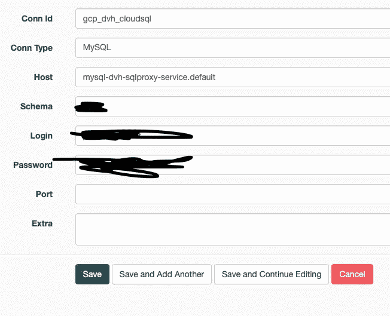
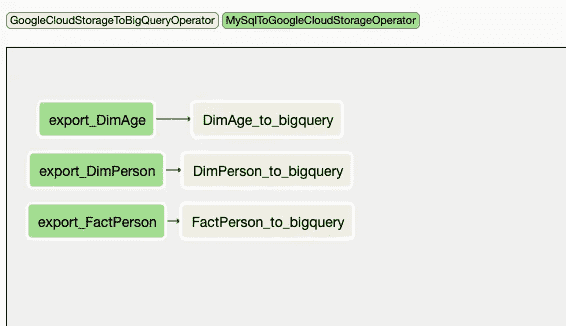

# 使用 apache airflow/cloud composer 将数据从云 SQL 复制到 BigQuery 第 2 部分

> 原文：<https://medium.com/compendium/copy-data-from-cloud-sql-to-bigquery-using-apache-airflow-cloud-composer-part-2-33aa02bf456a?source=collection_archive---------0----------------------->

在我之前的帖子中，我解释了如何使用命令行工具，如 [gcloud](https://cloud.google.com/sdk/gcloud/) 和 [bq](https://cloud.google.com/bigquery/docs/bq-command-line-tool) ，将数据从云 SQL 加载到 bigquery 中。在这篇文章中，我将通过一个例子来说明如何使用 apache airflow 操作符而不是命令行工具来加载数据。这样做有几个优点，比如更干净的代码，更少的黑客攻击，更安全。例如:我们不必担心云 sql 导出作业的限制，或者导出到 csv 文件的 bug。

我使用的是运行在 kubernetes-cloud composer 中的 gcp 管理的气流。本例中运行作业的映像版本是:composer-1.6.1-airflow-1.10.1

# 配置云 sql 代理

我们现在需要做的第一件事是让 cloud composer 集群能够与云 sql 实例对话。这可以通过防火墙规则来实现，但我认为使用[云 sql 代理](https://cloud.google.com/sql/docs/mysql/sql-proxy)是更干净的解决方案。

谢天谢地，google 为我们提供了构建 sql 代理所需的一切。我们只需要两个描述部署和服务的 yaml 文件。

部署文件:用自己的值替换 caps lock。也可以指定一个服务帐户，但是在我的例子中，我希望 SA 是集群 SA。(我将在 github repo 中使用 postgreSQL 和 SA 来举例)

工作部署文件在这里:

[https://github . com/ael-computas/GCP _ cloud SQL _ air flow _ big query/tree/master/YAML](https://github.com/ael-computas/gcp_cloudsql_airflow_bigquery/tree/master/yaml)

```
**apiVersion:** extensions/v1beta1
**kind:** Deployment
**metadata:
  labels:
    run:** mysql-dvh-sqlproxy
  **name:** mysql-dvh-sqlproxy
  **namespace:** default
**spec:
  replicas:** 1
  **selector:
    matchLabels:
      run:** mysql-dvh-sqlproxy
  **strategy:
    rollingUpdate:
      maxSurge:** 1
      **maxUnavailable:** 1
    **type:** RollingUpdate
  **template:
    metadata:
      creationTimestamp:** null
      **labels:
        run:** mysql-dvh-sqlproxy
    **spec:
      volumes:** - **name:** ssl-certs
        **hostPath:
          path:** /etc/ssl/certs
      **containers:** - **image:** gcr.io/cloudsql-docker/gce-proxy:1.11
        **volumeMounts:** - **name:** ssl-certs
          **mountPath:** /etc/ssl/certs
        **command:** ["/cloud_sql_proxy",
          "-instances=PROJECT_ID:REGION:DATABASE=tcp:0.0.0.0:3306"]
        **imagePullPolicy:** Always
        **livenessProbe:
          exec:
            command:** - /bin/sh
            - -c
            - netstat -tlnp | grep -i cloud_sql_proxy
          **failureThreshold:** 3
          **periodSeconds:** 10
          **successThreshold:** 1
          **timeoutSeconds:** 1
        **name:** mysql-dvh-sqlproxy
        **ports:** - **containerPort:** 3306
          **protocol:** TCP
        **resources:** {}
        **terminationMessagePath:** /dev/termination-log
      **dnsPolicy:** ClusterFirst
      **restartPolicy:** Always
      **securityContext:** {}
      **terminationGracePeriodSeconds:** 30
```

这项服务非常简单:

```
**kind:** Service
**apiVersion:** v1
**metadata:
  labels:
    run:** mysql-dvh-sqlproxy
  **name:** mysql-dvh-sqlproxy-service
**spec:
  ports:** - **port:** 3306
    **protocol:** TCP
    **targetPort:** 3306
  **selector:
    run:** mysql-dvh-sqlproxy
```

这意味着服务将进入默认的名称空间，这很好。

在两个文件上使用“kubectl apply -f”。

确保部署和服务在您的 kubernetes 集群中运行。您可能需要启用 API 并修复服务帐户权限。日志在这里应该很有帮助。

*注意，我见过为你安装代理的运营商，但我自己从未试过..如果你害怕 yaml 文件，可以查看一下*[*https://air flow . readthe docs . io/en/latest/how to/connection/GCP _ SQL . html*](https://airflow.readthedocs.io/en/latest/howto/connection/gcp_sql.html)*这可能就是你要找的。*

# 配置气流连接

在 kubernetes 集群报告部署和服务运行之后，您需要在 airflow 中配置连接字符串。



您可以给 conn id 取任何名称，只要记住这也是您将从代码中使用的标识！Host 和 servicename 一样，kubernetes 会为你打理 dns 魔法。

# 创建 DAG

配置完成后，看看这些操作符:

*   [**Google cloudstoragetobigqueryoperator**](https://airflow.apache.org/_modules/airflow/contrib/operators/gcs_to_bq.html)
*   [MySqlToGoogleCloudStorageOperator](https://airflow.apache.org/_modules/airflow/contrib/operators/mysql_to_gcs.html)

与我之前的[帖子](/grensesnittet/copy-data-from-cloud-sql-to-bigquery-using-apache-airflow-b51bdb277463)相比，现在的流程简单多了:

*   导出到云存储，json 中的模式
*   从存储导入到 bigquery。
*   云存储应该有一个让文件在一段时间后自动删除的策略。

代码应该如下所示

```
class TableConfig:
    STANDARD_EXPORT_QUERY = None
    _STANDARD_EXPORT_QUERY = "SELECT * from {}"

    def __init__(self,
                 cloud_sql_instance,
                 export_bucket,
                 export_database,
                 export_table,
                 export_query,
                 gcp_project,
                 stage_dataset,
                 stage_table,
                 stage_final_query,
                 bq_location
                 ):

        self.params = {
            'export_table': export_table,
            'export_bucket': export_bucket,
            'export_database': export_database,
            'export_query': export_query or self._STANDARD_EXPORT_QUERY.format(export_table),
            'gcp_project': gcp_project,
            'stage_dataset': stage_dataset,
            'stage_table': stage_table or export_table,
            'stage_final_query': stage_final_query,
            'cloud_sql_instance': cloud_sql_instance,
            'bq_location': bq_location or "EU",
        }

def get_tables():
dim_tables = ["DimAge", "DimPerson"]
    fact_tables = ["FactPerson"]
    export_tables = dim_tables + fact_tables
    tables = []
    for dim in export_tables:
        tables.append(TableConfig(cloud_sql_instance='CLOUD_SQL_INSTANCE_NAME',
                                  export_table=dim,
                                  export_bucket='YOUR_STAGING_BUCKET',
                                  export_database='prod',
                                  export_query=TableConfig.STANDARD_EXPORT_QUERY,
                                  gcp_project="YOUR_PROJECT_ID",
                                  stage_dataset="YOUR_STAGING_DATASET",
                                  stage_table=None,
                                  stage_final_query=None,
                                  bq_location="EU"))
    return tables

def gen_export_table_task(table_config):
    export_task = MySqlToGoogleCloudStorageOperator(task_id='export_{}'.format(table_config.params['export_table']),
                                                    dag=dag,
                                                    sql=table_config.params['export_query'],
                                                    bucket=table_config.params['export_bucket'],
                                                    filename="cloudsql_to_bigquery/{}/{}".format(table_config.params['export_table'],
                                                                                                 table_config.params['export_table']) + "_{}",
                                                    schema_filename="cloudsql_to_bigquery/schema/{}/schema_raw".format(table_config.params['export_table']),
                                                    mysql_conn_id="gcp_dvh_cloudsql")
    return export_task

def gen_import_table_task(table_config):
    import_task = GoogleCloudStorageToBigQueryOperator(
        task_id='{}_to_bigquery'.format(table_config.params['export_table']),
        bucket=table_config.params['export_bucket'],
        source_objects=["cloudsql_to_bigquery/{}/{}*".format(table_config.params['export_table'],
                                                             table_config.params['export_table'])],
        destination_project_dataset_table="{}.{}.{}".format(table_config.params['gcp_project'],
                                                            table_config.params['stage_dataset'],
                                                            table_config.params['stage_table']),
        schema_object="cloudsql_to_bigquery/schema/{}/schema_raw".format(table_config.params['export_table']),
        write_disposition='WRITE_TRUNCATE',
        source_format="NEWLINE_DELIMITED_JSON",
        dag=dag)

    return import_task

"""
The code that follows setups the dependencies between the tasks
"""

for table_config in get_tables():
    export_script = gen_export_table_task(table_config)
    import_script = gen_import_table_task(table_config)

    export_script >> import_script
```

该作业看起来如下所示:



如果您使用的是 managed airflow 实例，可能需要安装额外的依赖项。从 GCP 控制台转到 Composer 和 pypi 包来安装它们。

与之前的解决方案相比，这是一种更高效的导出方式，因为它将并行运行导出，而不是一次只导出一个。这有点冗长，因为数据现在是 json 而不是 csv，但是临时存储在这里不是问题。

它还可以更优雅地处理大块数据，因为 airflow 操作符会拆分比 bigquery 喜欢的文件更大的文件。

我的示例 github repo 已经用包含这个简化工作流的新文件进行了更新:(v2 文件)

[](https://github.com/ael-computas/gcp_cloudsql_airflow_bigquery) [## ael-computas/GCP _ cloud SQL _ air flow _ big query

### 如何使用 air flow-ael-computas/GCP _ cloud sql _ air flow _ bigquery 从云 SQL 导出到 big query 的示例

github.com](https://github.com/ael-computas/gcp_cloudsql_airflow_bigquery) 

*注意，如果需要从 mssql 加载，apache airflow* *中对此也有一个* [*运算符。但是，它不能正确地处理模式生成，所以您需要自己(现在)通过从数据库中选择来完成。信息 _ 模式。列，并确保 float 类型是 bigquery float 类型。*](https://github.com/apache/airflow/blob/master/airflow/contrib/operators/mssql_to_gcs.py)

如果你喜欢这个帖子，请鼓掌:)

编辑:[请查看这篇帖子，并附上作曲者的相关替代信息](/@ael_78866/argo-workflows-as-alternative-to-cloud-composer-db4db2bea1af)