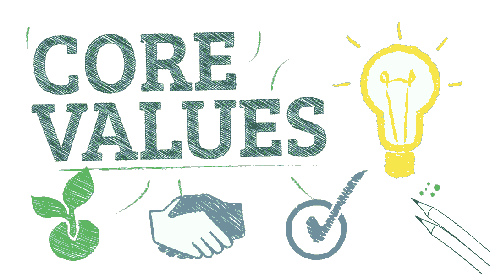

# GDE 的核心价值观

> 原文：<https://medium.com/google-developer-experts/core-values-of-a-gde-782c13370346?source=collection_archive---------5----------------------->

我收到了很多关于如何成为 GDE 的问题。大多数人认为这是一份工作，你得到了钱，你是一个摇滚明星，但我们知道所有这些都不是真的。我对这些问题的回答是另一个问题:“你如何影响你的社区？”我得到一些答案，比如:

*   我想去旅行
*   我想提升我的品牌
*   我有数百个认证，所以我认为“我是专家”。
*   我……
*   更多“我+动词”

当然，答案没有好坏之分，但 GDE 的使命不是只考虑“我”，心态可能是“我们/我们的/我们的”。是的，我明白了；一个 GDE 可能会改善社区和人民；除了在会议上发言或发表博客文章，GDE 每天都在思考如何增加价值、如何创新、如何成为环境中的“推动者”。

改善一个社区需要大量的时间和努力。但是当你看到结果时，所有的努力都是值得的。为了更好地理解这项工作的重要性，作为一名 GDE 人，我想解释一下围绕社区发展的一些核心价值观:

*   卓越:我们每天都努力超越自己的期望。
*   **社区:**通过促进相互信任和尊重，我们与同事和社区建立了积极的关系。
*   **成长:**我们总是在发现改进的新方法中找到快乐。
*   平衡:我们尽最大努力工作，牢记休闲、娱乐也很重要。
*   正直:我们相信高尚、透明和负责任的行为会带来积极的回报。
*   对于社区发展来说，没有比希望更重要的品质了。改变始于个人，然后随着我们对更美好、更有成果的未来的共同努力而成长。
*   **革新者:**看到事物的本来面目，并有*智慧*知道如何应对。有同情心*坚持解决问题，并保持观察，直到找到对关系或团体有益的解决方案。*
*   **建设者:**带来*力量*以行动为导向，带来结果，同时不压迫他人。这是用来产生积极影响的能量，也是对他们知道现在该做什么和下一步该做什么的能力的信心；这是他们的主要优势和贡献。