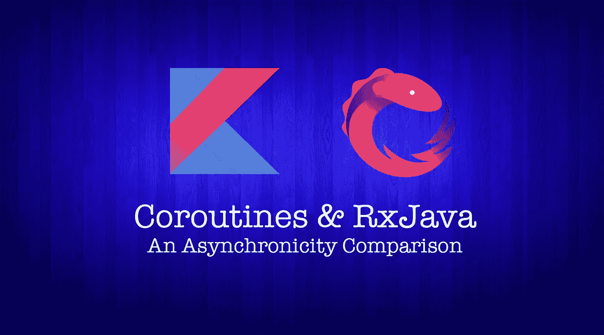

# 协同程序和 rx Java——异步比较第 1 部分:

> 原文：<https://medium.com/capital-one-tech/coroutines-and-rxjava-an-asynchronicity-comparison-part-1-asynchronous-programming-e726a925342a?source=collection_archive---------0----------------------->



## 异步编程

# 介绍

在这个博客系列中，我将比较[](https://kotlinlang.org/docs/reference/coroutines.html)****和** [**RxJava**](https://github.com/ReactiveX/RxJava) ，因为它们都试图解决 Android 开发中的一个常见问题:**异步编程**。**

# **用例:创建异步重物，实现快速应用启动！**

**[启动时性能](https://developer.android.com/topic/performance/launch-time.html)至关重要！如果你想让你的应用程序快速启动，如何处理对象创建是很重要的。**

**有些计算可能需要一些时间(例如初始化重物)。您不希望这种情况发生在 UI 线程中！如果是这样，你的应用程序将会跳过帧，用户将会有滞后的体验。有什么能影响这个？SDK 初始化、创建加密对象等。**

**对于我们的第一个用例，我们只想在后台线程中执行一个繁重的操作。**

## **RxJava**

**尽管 RxJava 是 JVM 的一个[反应式扩展](http://reactive extensions)库，但是您也可以使用它在后台运行异步任务。**

**在这个场景中，我们忽略了 RxJava 传输元素流的能力，我们只需要初始化一些东西。**

**我们需要什么 RxJava 构建操作符来实现这一点？一个 [**可完成的**](http://reactivex.io/RxJava/javadoc/io/reactivex/Completable.html) ！**

> **根据 RxJava 文档:Completable 表示一个延迟的计算，没有任何值，只有完成或异常的指示。**

****我们如何创建一个 Completable 来初始化我们想要的对象？****

```
fun initializeObjectsAsync(): Completable {
    return Completable.create **{** emitter **->** try {
            **heavyInitialization()
**            if (emitter != null && !emitter.*isDisposed*) {
                **emitter?.onComplete**()
            }
        } catch (e: Exception) {
            if (emitter != null && !emitter.*isDisposed*) {
                **emitter?.onError**(e)
            }
        }
    **}** }
```

**如你所见，我们已经创建了一个函数，它将返回一个 **Completable 对象**。在函数内部，我们用`Completable.create`创建了我们的自定义 Completable，它将接受一个发射器(可能订阅它的对象)。**

**在执行了繁重的初始化之后，我们将通知发射器它成功了。如果有错误，我们将通知发生的错误。这是因为发射器的类型是[***completablemitter***](http://reactivex.io/RxJava/javadoc/io/reactivex/CompletableEmitter.html)以及`onComplete`和`onError`是可用于将结果传达给订户的方法。**

**另一种方法是使用`[Completable.fromCallable()](http://reactivex.io/RxJava/javadoc/io/reactivex/Completable.html#fromCallable-java.util.concurrent.Callable-)`**

```
fun initializeObjectsAsync(): Completable {
    return Completable.fromCallable(**{**
            **heavyInitialization()
**    })}
```

**我们如何使用该功能？**

**我们知道，Observables，和(per extension) Completables，在 RxJava 中都是[](/@benlesh/hot-vs-cold-observables-f8094ed53339)*。这意味着只有当我们订阅时，`Completable.create`中的代码才会被执行。需要记住的是，每次您订阅它时，它都会被执行。***

***我们必须订阅我们在上面创建的`initializeObjectsAsync`函数中创建的 Completable。***

```
*fun initializeObjects() {
    initializeObjectsAsync()
        .**subscribeOn**(Schedulers.computation())
        .**observeOn**(AndroidSchedulers.mainThread())
        .**subscribe**(**{** // The initialization succeeded!
            // We can perform UI changes here 
        **}**, **{** // An Error occurred!
        **}**)
}*
```

***我们如何告诉 RxJava 我们希望初始化在后台线程上执行？我们使用`[subscribeOn](http://reactivex.io/documentation/operators/subscribeon.html)`操作符告诉 RxJava 我们希望在后台线程上执行`Completable.create`中的代码。***

***由于我们希望在初始化完成后对 UI 进行一些修改，我们可以使用`[observeOn](http://reactivex.io/documentation/operators/observeon.html)`操作符告诉 RxJava 我们希望在 Android 主线程上监听结果。***

> ***只有当您订阅 Completable 时，Completable.create 中的代码才会被执行。***

***在定义线程之后，我们希望订阅 Completable 并在它完成时得到通知。我们用`.subscribe(successBlockOfCode,failureBlockOfCode)`来做这件事。我们传递两个代码块:第一个定义成功场景，第二个定义失败场景。***

***例如，如果我们希望在创建 Android 活动时执行这段代码，我们可以在 onCreate 方法中调用这个方法。***

```
*override fun onCreate(savedInstanceState: Bundle?) {
    super.onCreate(savedInstanceState)
    setContentView(R.layout.*activity_main*)

    initializeObjects()
}*
```

***我们如何对协程做同样的事情呢？***

## ***科特林协程***

***有了协程，这就更简单了！从概念上讲，协程在许多方面类似于线程:我们可以编写可以在特定线程上运行的顺序代码。***

***我将写另一篇关于 RxJava 和协程线程的博文。现在，您需要知道我们可以用一个[协程调度器](https://kotlin.github.io/kotlinx.coroutines/kotlinx-coroutines-core/kotlinx.coroutines.experimental/-coroutine-dispatcher/)在[协程上下文](https://kotlinlang.org/api/latest/jvm/stdlib/kotlin.coroutines.experimental/-coroutine-context/index.html)中定义一个协程的线程策略。我们可以用一个 CoroutineBuilder 用一个特定的 CoroutineContext 创建一个 coroutine。***

> ***一个**协程构建器**是一个函数，它创建一个协程，运行一段代码，并以某种形式让你访问它的结果。CoroutineBuilder 的例子有:启动、异步、运行阻塞…***

***假设我们想像之前在`onCreate`方法中一样调用`heavyInitialization()`方法，我们可以用 [CoroutineBuilder launch](https://kotlin.github.io/kotlinx.coroutines/kotlinx-coroutines-core/kotlinx.coroutines.experimental/launch.html) 创建一个 Coroutine，并在正在运行的代码块中执行繁重的初始化。***

```
*fun initializeObjects() {
    *launch*(CommonPool) **{
        heavyInitialization()**
    **}** }*
```

***协程调度器 [**共享池**](https://kotlin.github.io/kotlinx.coroutines/kotlinx-coroutines-core/kotlinx.coroutines.experimental/-common-pool/) 类似于 RxJava `Schedulers.computation()`。这将在后台运行代码，我们不必担心其他任何事情。***

***让我们模仿用 RxJava 构建的例子:我们想知道它什么时候完成了对重对象和错误处理的初始化。***

```
*fun initializeObjects() {
    *launch*(CommonPool) **{** try {
            heavyInitialization()
            // The initialization succeeded!
            ***withContext*(*UI*)** **{** // We can perform UI changes here
            **}** } catch (e: Exception) {
            // An Error occurred!
        }
    **}** }*
```

***由于协程(所谓的 ***暂停λ***)内的代码是顺序执行的，所以初始化成功后会执行`heavyInitialization()`之后的行。***

***和以前一样，我们可以将调用包装在 try catch 块中进行错误处理。它将以同样的方式工作。***

***我们如何切换到 UI 线程并执行 UI 更改？您可以在一个名为`[**withContext**](https://kotlin.github.io/kotlinx.coroutines/kotlinx-coroutines-core/kotlinx.coroutines.experimental/with-context.html)`的协程中调用一个函数，该函数使用另一个协程上下文来运行其中的代码块。基本上，它会切换到 Android UI 线程来执行代码。***

> ***我们在示例中看到的 UI CoroutineContext 不是标准 Kotlin Coroutines 库的一部分。因为它是 Android 特有的，所以它可以在另一个库中找到:`org.jetbrains.kotlinx:kotlinx-coroutines-android:$kotlin_coroutines_version`。***

# ***第二个用例:斐波那契示例的后台处理***

***对于我们的第二个用例，除了在后台执行某些东西，我们还想返回值。现在，我们想计算当用户按下按钮时一个数字的斐波那契数列。***

***假设我们有以下代码来计算一个数的斐波那契数列:***

```
*private fun fib(n: Long): Long {        
    return if (n <= 1) n        
    else fib(n - 1) + fib(n - 2)    
}*
```

***如何在后台计算这个并返回结果？***

## ***RxJava***

***在我们的第一个用例中，我们已经看到了大部分这些概念。我们需要一个可以返回对象的 RxJava building 操作符。我们可以用一首 [***单曲***](http://reactivex.io/documentation/single.html) 来说明！***

```
*fun fibonacciAsync(number: Long): Single<Long> = 
    **Single.create**({ emitter ->
            **val result = fib(number)** 
            if (emitter != null && !emitter.*isDisposed*) {       
                 **emitter.onSuccess(result)**
            }
})*
```

***在`Single.create`中的代码将在我们订阅它时被执行，我们可以像以前一样使用它。当我们收到用户交互时，我们只订阅 fibonacci 方法返回的 Single。***

***您还可以使用我们在 Completable 示例中看到的 fromCallable 函数:***

```
*fun fibonacciAsync(number: Long): Single<Long> = 
    **Single.fromCallable**({
        **return fib(number)**
    })*
```

***我们将我们想要的数字作为该函数的参数传递，它也将在代码块`Single.create`中使用。例如，我们可以从 EditText 中获取该数字。***

```
*@OnClick(R.id.my_button)
fun onButtonClicked() { 
 **fibonacciAsync(numberInputEditText.text.toString().toLong())**
       .subscribeOn(Schedulers.computation())
       .observeOn(AndroidSchedulers.mainThread())
       .subscribe({ fibonacciNumber -> 
           //Update UI with the result 
          ** myTextView.text = fibonacciNumber**
       },{
           // Error happened
       })
}*
```

***每次用户点击按钮，我们都要计算一个新的斐波那契数。如果用户更改 numberInputEditText 内部的值，结果将会不同！***

## ***科特林协程***

***这个例子和上面的一样简单。当用户点击按钮时，我们希望启动一个协程并计算我们想要的数字的斐波那契数列。我们已经知道做这件事所需的一切:***

```
*@OnClick(R.id.my_button)
fun onButtonClicked() { 
    ***launch***(CommonPool) { **val result = fib**(
            numberInputEditText.*text*.toString().toLong()
        )
        *withContext*(*UI*) { **fibonacciResultTextView.*text* = result**        }
    }}*
```

# ***接下来会发生什么？***

***本系列[第二部](/@manuelvicnt/coroutines-and-rxjava-an-asynchronicity-comparison-part-2-cancelling-execution-199485cdf068)将是关于**取消执行**！***

***你如何取消一个可观察的？还有协程？下周不要错过！***

# ***更多教育***

***想了解更多关于 Kotlin 的信息？看看这篇文章！***

***[](https://proandroiddev.com/kotlin-education-d0b958740d6a) [## 科特林教育

### 超越基础

proandroiddev.com](https://proandroiddev.com/kotlin-education-d0b958740d6a) 

RxJava 呢？看看这些文章！

[](/@manuelvicnt/rxjava-android-mvvm-app-structure-with-retrofit-a5605fa32c00) [## RxJava: Android MVVM 应用程序结构的改进

### 介绍

medium.com](/@manuelvicnt/rxjava-android-mvvm-app-structure-with-retrofit-a5605fa32c00) [](/capital-one-developers/rxjava2-android-mvvm-lifecycle-app-structure-with-retrofit-2-cf903849f49e) [## RxJava 2: Android MVVM 生命周期应用程序结构与改进 2

### 自从我写了关于 MVVM、RxJava 和翻新的文章已经两年多了。我们来更新一下。

medium.com](/capital-one-developers/rxjava2-android-mvvm-lifecycle-app-structure-with-retrofit-2-cf903849f49e) 

感谢阅读，

曼努埃尔·维森特 Vivo

*披露声明:这些观点是作者的观点。除非本帖中另有说明，否则 Capital One 不属于所提及的任何公司，也不被其认可。使用或展示的所有商标和其他知识产权都是其各自所有者的所有权。本文为 2018 首都一。****