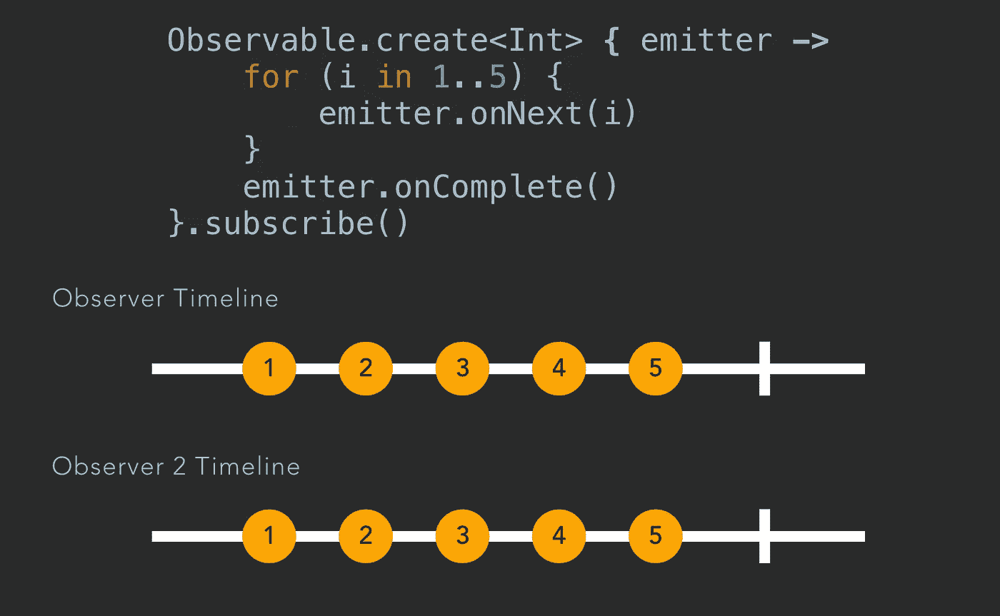
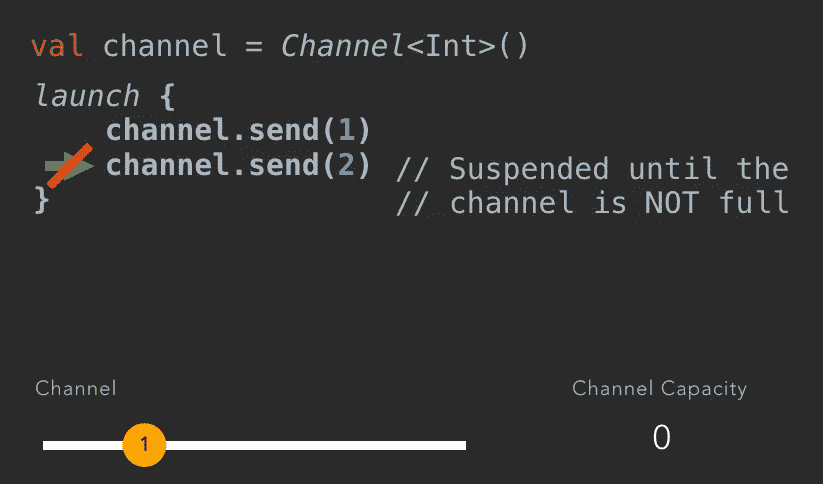
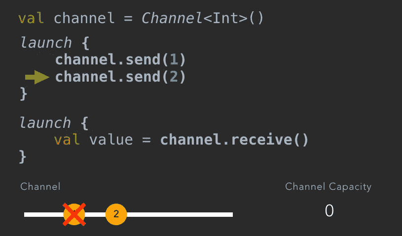
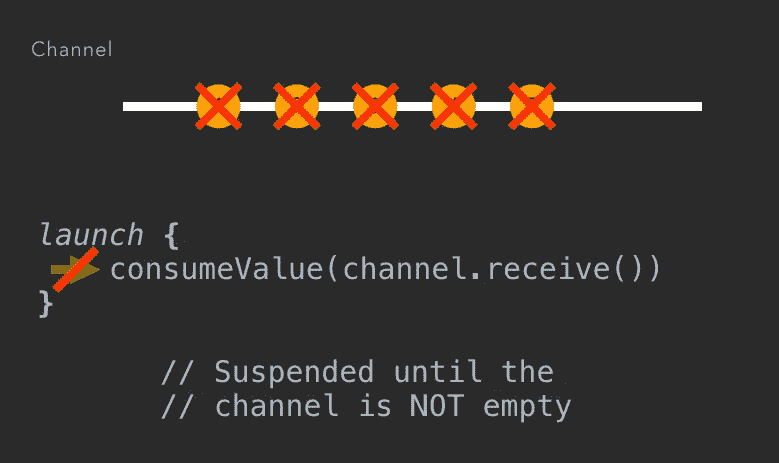
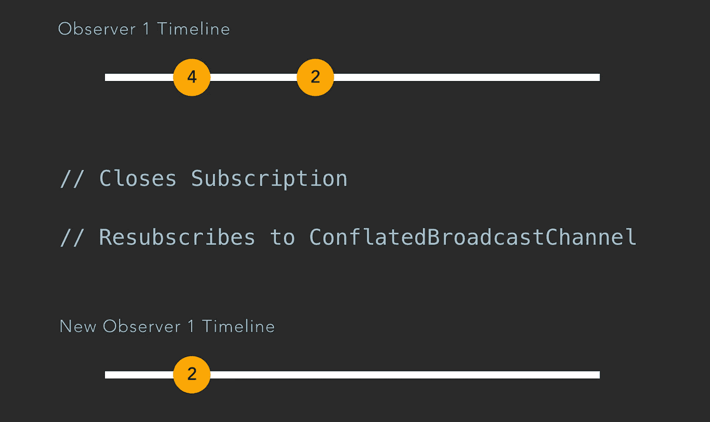

# 协程和 rx Java——异步性比较(第 3 部分):传递价值流

> 原文：<https://medium.com/capital-one-tech/coroutines-and-rxjava-an-asynchronicity-comparison-part-3-transferring-stream-of-values-e858f4233791?source=collection_archive---------0----------------------->


# 介绍

在这个博客系列中，我将比较 [Kotlin 协同程序](https://kotlinlang.org/docs/reference/coroutines.html)和 [RxJava](https://github.com/ReactiveX/RxJava) ，因为它们都试图解决 Android 开发中的一个常见问题:异步编程。

在 [Part 1](/@manuelvicnt/coroutines-and-rxjava-an-asynchronicity-comparison-part-1-asynchronous-programming-e726a925342a) 和 [Part 2](/@manuelvicnt/coroutines-and-rxjava-an-asynchronicity-comparison-part-2-cancelling-execution-199485cdf068) 中，我们学习了如何在后台执行重计算任务，以及如何取消它们。

第 3 部分是关于**转移价值流。**

如果你想了解更多关于 ***频道，题材，演员，broadcast Channels****…*继续阅读！

# RxJava 中的可观察对象

我们可以用一个 [**可观测的**](http://reactivex.io/RxJava/javadoc/io/reactivex/Observable.html) 来传递价值流。在下面的例子中，我们可以看到如何向观察者(可观察对象的订阅者)发送五个项目。

```
Observable.create<Int> **{** emitter **->** for (i in 1..5) {
        **emitter.onNext(i)**
    }
    **emitter.onComplete()** }
```

我们刚刚创建了一个信息源，它将向订阅它的观察者(订阅者)发出五个条目。

我们传递一个元素的方式是用`**emitter.onNext(i)**`。我们使用`**emitter.onComplete()**`来通知观察者我们已经完成了物品的发射。

记住，每次用户呼叫`.subscribe()`时，`Observable.create`代码将被再次执行。每个观察者都会收到不同的物体。



Observers subscribing at different times to the same Observable

我们可以看到不同的观察者将如何得到五个不同的物体加上完成信号。我们如何用协程做同样的事情呢？我们要介绍**渠道**。

# 频道

[**通道**](https://kotlin.github.io/kotlinx.coroutines/kotlinx-coroutines-core/kotlinx.coroutines.experimental.channels/-channel/index.html) 是我们如何在协程中传输值流。

信道的类型为 *E，*，这是可以在信道中传输的元素类型。通道**可以在不同的协程**之间共享 **，默认情况下，它们的**容量为 1** 。**

通道实现了 [**发送通道和**](https://github.com/Kotlin/kotlinx.coroutines/blob/master/core/kotlinx-coroutines-core/src/main/kotlin/kotlinx/coroutines/experimental/channels/Channel.kt) 接收通道接口。让我们来看看他们的一些方法:

```
public interface **SendChannel**<in E> {
    public suspend fun send(element: E)
    public fun offer(element: E)
    public fun close(cause: Throwable? = null): Boolean
}public interface **ReceiveChannel**<out E> {
    public suspend fun receive(): E
    public fun close(cause: Throwable? = null): Boolean
}
```

它们都公开了关闭通道的方法`**close(cause: Throwable? = null): Boolean**`。

> 可以关闭一个通道。当这种情况发生时，您不能发送或接收来自它的元素。

您可以使用方法`**send(element: E)**`向通道发送项目，并使用`**receive(): E**`从通道接收项目。正如你所注意到的，它们被标上了 suspend 修饰符。这意味着那些方法是 ***挂起函数:*** 它们需要在一个协程内被调用(你可以用一个协程构建器来创建，就像我们在本系列的[第 1 部分](/@manuelvicnt/coroutines-and-rxjava-an-asynchronicity-comparison-part-1-asynchronous-programming-e726a925342a)中看到的那样)。

> **阻塞和暂停的区别**？你可以[阅读 Kotlin 文档的这一部分](https://kotlinlang.org/docs/reference/coroutines.html#blocking-vs-suspending)来了解更多。

如果您试图从一个空通道调用`receive`，调用该方法的协程将暂停执行，直到通道中有一个元素。同样，如果你在一个已满的通道上调用`send`，调用该方法的协程将暂停，直到通道未满。

如果您想向通道发送一个元素，并且在通道已满时不被挂起，您可以使用`**offer(element: E)**`。如你所见，这个方法不是一个挂起函数，所以**没有必要在协程**中调用这个方法。

> 使用`offer`的警告是，它不能保证元素会被添加到通道中。频道满了就不加了。

我们来展示一些代码吧！如何创建一个渠道？

```
val channel = *Channel*<Int>()
```

## 发送对象

我们刚刚创建了 Int 类型的 ***通道*** 。它将能够传输整数流。我们如何发送一个值？

```
*launch* { **channel.send(**1**)** }
```

在上面的例子中，我们用 Coroutine builder*launch*创建了一个 Coroutine，并向通道发送了一个元素。这是它的视觉表现:


Visual representation of a Channel with an element

怎样才能消费这种元素？具有`receive`功能。

```
*launch* { **val value = channel.receive()** }
```

我们创建了另一个协程，并使用了之前创建的通道中的元素。


Visual representation of a Channel with a consumed element

## 发送多个对象

如果我们想寄两件东西呢？

```
val channel = *Channel*<Int>()*launch* { **channel.send(**1**)
    channel.send(**2**)** }
```

正如我们所料，协程将开始执行代码，对象 1 将被发送到通道。当它试图执行第二行时，**它将暂停，直到对象 1 被消耗掉**。



Coroutine suspended when Channel capacity is 0

如果我们创建另一个协程并使用该值，那么第一个协程将继续执行并发送第二个元素。



First coroutine has resumed execution and sent the second object to the Channel

## 前一个 RxJava 示例使用了一个通道

我们怎样才能实现类似于我们在文章开头看到的 RxJava 例子的东西呢？

```
val channel = *Channel*<Int>()*launch* **{
    for** (i in 1..5) {
        **channel.send(i)** }
**}**
```

这是一个协程，它将通过一个简单的`for`循环向通道发送五个元素。您可以通过以下方式使用这些元素:

```
*launch* { **for (value in channel)** {
        consumeValue(value)
    }
}
```

这个 for 循环将隐式调用`channel.receive()`。

这里发生了什么？由于信道容量为一…

*   第一个协程将发送第一个元素(`channel.send(1)`)，并在试图执行`channel.send(2)`时暂停，直到第二个协程(因为通道中没有元素而暂停)恢复执行并消耗第一个元素。
*   一旦通道中有一个元素，第二个协程将恢复执行并使用该值。然后，它会暂停，直到通道中出现另一个元素。
*   既然第二个协程已经使用了这个值，通道中就有了容量:第一个协程将再次继续发送第二个整数。

> 这两个协程将间歇地恢复和暂停，直到另一个协程进入并消耗/发送该值。

当两个协程都执行完它们的暂停 lambda 时，这五个对象已经被消耗掉了。


Channel with 5 objects consumed

如果我们启动另一个协程，并希望使用通道中的元素，该怎么办？

```
*launch* { **consumeValue(channel.receive())** }
```

该协程将被挂起，因为通道中没有元素。



Coroutine suspended since there are no elements in the channel

## 与可观察值的差异

RxJava Observables 有什么区别？RxJava Observables 将在您每次订阅时执行`Observable.create`中的代码。渠道不会发生这种情况。

> 当您从通道中使用一个对象时，没有其他协程能够获得相同的对象

## 缓冲通道

如前所述，默认情况下，通道的容量为 1。您可以创建缓冲通道，使**允许发送者在挂起**之前发送多个元素。

```
val channel = *Channel*<Int>(**3**) // **Channel of capacity 3**
```

您可以在构造函数中将容量指定为参数。这就是我们如何创建容量为三的通道。

## 转移元素的另一种方式:生产

你可以使用 [**协同生成器*产生***](https://kotlin.github.io/kotlinx.coroutines/kotlinx-coroutines-core/kotlinx.coroutines.experimental.channels/produce.html) 来传输元素流。 ***产生*创建一个带有内置通道的协程**。

> Produce =协同程序+通道

怎样才能用 ***产生*** ？

```
val publisher = ***produce***(capacity = 2)**{** for (i in 1..5) **send(i)**
**}**
```

**用*生产*有什么好处？**

**只有 *produce* 内部的代码可以向通道**发送元素，因此它可以防止其他协程在该通道上调用`send`。这是因为 produce 只实现了`ReceiveChannel<E>`接口:它限制了可以向通道发送元素的协程。**这比创建一个通道对象**更“安全”。

> 生成是创建自定义操作符的一种非常有用的方式。

您可以像这样使用该通道中的值:

```
*launch* {publisher.***consumeEach***{consumeValue(**it**)
    }
}
```

> **当 produce CoroutineBuilder 执行完它的暂停 lambda，并且通道中的元素被使用完之后，通道将自动关闭**

## 演员

[一个 ***演员***](https://kotlin.github.io/kotlinx.coroutines/kotlinx-coroutines-core/kotlinx.coroutines.experimental.channels/actor.html) 也会创建一个内置通道的协程。 ***与*** 有什么区别？ *produce* 实现了`ReceiveChannel<E>`接口，而 *actor* 实现了`SendChannel<E>`接口。

> 只有由 actor 创建的协程可以使用通道中的元素。

**你可以把 *actor* 想象成一个接收和处理元素**的邮箱。因为协程中的代码是顺序执行的，所以一次只能处理一个元素。你怎么能创造一个呢？

```
val actor = ***actor***<Int>(CommonPool) {
    for (**int in channel**) {
        // iterate over received Integers
    }
}
```

正如我们之前所说的，这个 actor 一次只会处理一个整数。**怎样才能给演员送一个元素？**

```
*launch* { **actor.send(2)**
}
```

## 频道中的竞争条件

到目前为止，我们已经展示了简单的例子，只有一个发送者和一个消费者，不会给我们带来任何问题。如果有多个消费者和一个发送者，会发生什么？

```
val channel = *Channel*<Int>()*launch* **{** val value1 = **channel.receive()
}***launch* **{** val value2 = **channel.receive()
}***launch* **{
    channel.send(1)
}**
```

在上面的例子中…什么变量将包含值 1？第一协程的*值 1* 还是第二协程的*值 2* ？我们不可能得到一致的结果。一个**竞态条件**即将发生。

如果你想把同一个对象发送给多个观察者，你需要一个 **BroadcastChannel** 。

我们来看看 RxJava 做广播的方式:**科目**。

# 学科

可以用 RxJava 做**广播，主题**。当您创建一个主题并发送一个元素时，所有订阅者将同时获得相同的对象。

```
val subject: PublishSubject<Int> = PublishSubject.create()subject.subscribe **{** consumeValue(it)
**}**subject.subscribe **{** *println*(it)
**}**
```

我们创建了一个主题，并通过两个不同的观察者订阅了它。当我们发送一个带有`subject.onNext(1)`的元素时，两个观察者会得到相同的对象。

我们如何对协程做同样的事情呢？

# 广播频道

我们可以用[**broadcast channels**](https://kotlin.github.io/kotlinx.coroutines/kotlinx-coroutines-core/kotlinx.coroutines.experimental.channels/-broadcast-channel/)实现同样的行为。它们向使用***open subscription***方法监听元素的多个消费者发出相同的对象。

让我们创建一个广播频道。

```
val channel = *BroadcastChannel*<Int>(2)
```

我们如何消费发送到通道的元素？我们可以使用 **openSubscription** 方法和扩展函数 ***使用*** 来为我们处理订阅。当 ***使用*** 中的暂停功能结束时，订阅将被关闭。

```
val observer1Job = *launch* { **channel.openSubscription().*use*****{** channel **->** for (value in channel) {
            consumeValue(value)
        } 
        // subscription will be closed
    }
}
```

我们可以从通道消费的另一种方式是使用扩展函数 **consumeEach** :

```
val observer2Job = *launch* { **channel.*consumeEach*****{** value **->** consumeValue(value)
    }
}
```

***ConsumeEach*** 会打开一个订阅，消费通道发出的所有元素。

## **合并广播频道**

合并是一种特殊的能力。 [**合并的 BroadcastChannel**](https://kotlin.github.io/kotlinx.coroutines/kotlinx-coroutines-core/kotlinx.coroutines.experimental.channels/-conflated-broadcast-channel/) 的行为方式与 **RxJava 行为主体**类似。那是什么意思？

观察者将收到信息源在订阅后发出的所有元素，还会收到观察者订阅前信息源发出的最后一项。

让我们来看一个例子:



Resubscribing to a ConflatedBroadcastChannel

假设我们有一个合并的 BroadcastChannel，其中一个观察者已经接收到两个对象。如果观察者关闭了订阅，当它再次订阅同一个频道时，**它将接收到由频道**发出的最后一个对象。

这种行为不仅发生在重新订阅的观察者身上，也发生在新的观察者身上。如果通道已经发出了一个项目，那么它们都将获得通道发出的最后一个项目。

# RxJava 反压呢？

我们还没有在协程部分讨论背压。在 RxJava 中，**当信息源发送元素的速度快于观察者消耗元素的速度时，就会产生反压力**。在协程中是如何处理的？

> 缺省情况下，协程处理背压。

**我们不必担心协程中的背压**。由于`receive`和`send`是暂停函数，当我们处于反压场景时，发送方将暂停，直到通道中有容量。

我们可以说协程的行为类似于 RxJava 中的`BackpressureStrategy.BUFFER`。

# 协程和 RxJava 比较

我们可以比较在本系列的这一部分中看到的不同术语。


Coroutines and RxJava Sources of information comparison

我们可以说一个可观察的是**冷的**，其余的项是**热的**。

> 即使没有观察者监听事件，热点信息源也可以发送信息。

一个可观察物是冷的，因为只有当观察者订阅它时，它才会开始发射物品。

**可观测量和信道是单播的**,因为只有一个观测者将接收已发送的对象。但是，对于主题或广播频道，您可以将同一对象发送给多个观察者。

## 协程的冷可观察行为？

如何用协程得到一个冷可观察的行为？您还记得 coroutine builder*produce*创建了一个内置通道的 coroutine 吗？

您可以使用 [***发布***](https://kotlin.github.io/kotlinx.coroutines/kotlinx-coroutines-reactive/kotlinx.coroutines.experimental.reactive/publish.html) 并像使用*产生*一样使用它。

```
val publisher = ***publish*****{** for (i in 1..5) **send(i)**
**}**
```

不同的是**每次你想从频道中消费元素，你会看到不同的对象**。

但是这里有一个警告， *publish* 不是标准协程库的一部分。你必须导入 [**协程和 RxJava 互操作库**](https://github.com/Kotlin/kotlinx.coroutines/tree/master/reactive/kotlinx-coroutines-rx2) 。

想了解这个互操作库的更多信息吗？您必须等待下周发布的本系列的第 4 部分。

# 接下来会发生什么？

在本系列的第四部分中，我们将看到如何手动使用 RxJava 和协程。协程和 RxJava 互操作库将允许我们在同一个项目中连接和使用它们。

# 更多教育

你错过了**第一部分**还是**第二部分**？

[](/@manuelvicnt/coroutines-and-rxjava-an-asynchronicity-comparison-part-1-asynchronous-programming-e726a925342a) [## 协程和 rx Java——异步比较(第 1 部分):异步编程

### 第 1 部分—异步编程

medium.com](/@manuelvicnt/coroutines-and-rxjava-an-asynchronicity-comparison-part-1-asynchronous-programming-e726a925342a) [](/@manuelvicnt/coroutines-and-rxjava-an-asynchronicity-comparison-part-2-cancelling-execution-199485cdf068) [## 协程和 rx Java——异步比较(第 2 部分):取消执行

### 第 2 部分—取消执行

medium.com](/@manuelvicnt/coroutines-and-rxjava-an-asynchronicity-comparison-part-2-cancelling-execution-199485cdf068) 

如果您想了解更多关于 RxJava 的知识，请查阅这篇文章。

[](/capital-one-developers/rxjava2-android-mvvm-lifecycle-app-structure-with-retrofit-2-cf903849f49e) [## RxJava 2: Android MVVM 生命周期应用程序结构与改进 2

### 自从我写了关于 MVVM、RxJava 和翻新的文章已经两年多了。我们来更新一下。

medium.com](/capital-one-developers/rxjava2-android-mvvm-lifecycle-app-structure-with-retrofit-2-cf903849f49e) 

感谢阅读，

曼努埃尔·维森特 Vivo