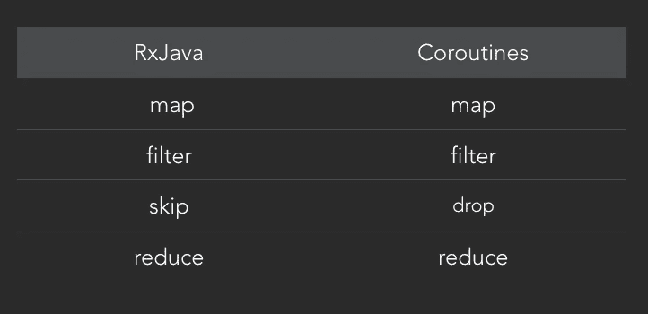
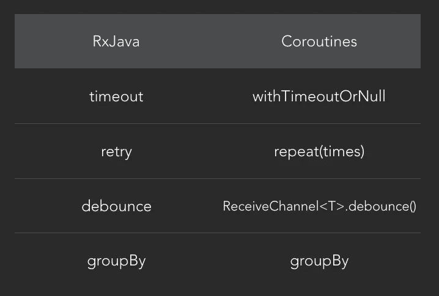

# 协同程序和 rx Java——异步比较(第 5 部分):运算符

> 原文：<https://medium.com/capital-one-tech/coroutines-and-rxjava-an-asynchronicity-comparison-part-5-operators-2603a8ecaa5f?source=collection_archive---------2----------------------->


# 介绍

在这个博客系列中，我将比较 [Kotlin 协同程序](https://kotlinlang.org/docs/reference/coroutines.html)和 [RxJava](https://github.com/ReactiveX/RxJava) ，因为它们都试图解决 Android 开发中的一个常见问题:**异步编程**。

在[第 3 部分](/@manuelvicnt/coroutines-and-rxjava-an-asynchronicity-comparison-part-3-transferring-stream-of-values-e858f4233791)和[第 4 部分](/@manuelvicnt/coroutines-and-rxjava-an-asynchronicity-comparison-part-4-interop-library-4a2439a690f9)中，我们讨论了转移值流以及协同程序和 RxJava 互操作库。

现在是时候比较我们如何使用**操作符**来转换这些流了。

# 常见运算符

作为 [**Kotlin 集合**](https://kotlinlang.org/api/latest/jvm/stdlib/kotlin.collections/) 的一部分， [Kotlin 标准库](https://kotlinlang.org/api/latest/jvm/stdlib/index.html)中提供了一些 RxJava 操作符。在这里，您可以看到一个比较简单运算符的表格。



Simple operators in RxJava and Coroutines

这些操作符以相同的方式转换流，即使有些操作符名称不同:例如 RxJava 中的`skip`在协程中被称为`drop`。

# 创建您自己的操作员

有些运算符不是 Kotlin 集合的一部分。但是，您可以轻松地自己创建它们。

我们可以用几行代码和一个简单的`for`循环复制 [**range RxJava 操作符**](http://reactivex.io/documentation/operators/range.html) 所做的事情。

```
fun **range**(
        context: CoroutineContext,
        start: Int,
        count: Int
) = *publish*(context) {for (x in start *until* start + count) send(x)
}
```

其他一些运营商需要更多的工作。在下面的例子中，您可以看到[**completable . zip rx Java**](http://reactivex.io/documentation/operators/zip.html)操作符的实现，它使用了两个代码块，并等待它们都完成。

```
suspend fun **zip**(
             context: CoroutineContext,             
             block: () -> Unit, 
             block2: () -> Unit
) {
    val deferred1 = *async*(context)**{** block() **}** val deferred2 = *async*(context)**{** block2() **}** deferred1.await()
    deferred2.await()
}
```

> 如果你注意到了，我们传递一个 CoroutineContext 作为参数。我们这样做是为了通过调用上下文作业中的`.cancel()`来轻松取消操作符，正如我们在[第 2 部分](/@manuelvicnt/coroutines-and-rxjava-an-asynchronicity-comparison-part-2-cancelling-execution-199485cdf068)中所讨论的。

# 复杂运算符

像`[debounce](http://reactivex.io/documentation/operators/debounce.html)`这样更复杂的 RxJava 操作符呢？



Complex operators in RxJava and Coroutines

你可以在`ReceiveChannel`上找到作为扩展功能的去抖。RxJava `timeout`在 Kotlin 协同程序中有一个等价的`withTimeoutOrNull`等等。

# 异同

我们看到大多数操作符在两个库中都可用，如果没有，您可以很容易地构建它们。

> 我在这两个库中能看到的唯一区别是你在什么时候应用这些操作符

在 RxJava 中，您可以在订阅流之前应用操作符，但是您必须在协同例程中打开订阅之后**才能这样做。让我们看看如何在 RxJava 中映射元素:**

```
rxObservable
    .**map** { result -> map(result) }
    .subscribe({
         consumeResult(it)    
    })
```

现在我们如何在协程中实现它:

```
broadcastChannel
    .openSubscription()
    .**map** { result -> map(result) }
```

在协程中，我们必须在打开订阅后进行，因为协程中的 [**映射**是`ReceiveChannel<E>`上的扩展函数。其他操作符如`filter`、`drop`等也是如此。调用`openSubscription()`返回一个扩展`ReceiveChannel<E>`的`SubscriptionReceiveChannel<T>`对象。](https://kotlin.github.io/kotlinx.coroutines/kotlinx-coroutines-core/kotlinx.coroutines.experimental.channels/map.html)

> 在我看来，如果希望多个观察者应用相同的操作符，协程需要额外的工作。你当然能做到！但是它需要更多的代码。

# 接下来会发生什么？

[**线程**](/capital-one-tech/coroutines-and-rxjava-an-asynchronicity-comparison-part-6-threading-2aa5e9c52c94) 是本系列第六部分的主题。

如果您想知道如何在协程中交换线程，就像在 RxJava 中用`subscribeOn()`和`observeOn()`交换线程一样，请不要错过下周的博文！

# 更多教育

更多关于 RxJava 的文章

[](/@manuelvicnt/rxjava-android-mvvm-app-structure-with-retrofit-a5605fa32c00) [## RxJava: Android MVVM 应用程序结构的改进

### 介绍

medium.com](/@manuelvicnt/rxjava-android-mvvm-app-structure-with-retrofit-a5605fa32c00) [](/capital-one-developers/rxjava2-android-mvvm-lifecycle-app-structure-with-retrofit-2-cf903849f49e) [## RxJava 2: Android MVVM 生命周期应用程序结构与改进 2

### 自从我写了关于 MVVM、RxJava 和翻新的文章已经两年多了。我们来更新一下。

medium.com](/capital-one-developers/rxjava2-android-mvvm-lifecycle-app-structure-with-retrofit-2-cf903849f49e) 

感谢阅读，

曼努埃尔·维森特 Vivo