# 协程和 rx Java——异步比较(第 6 部分):线程

> 原文：<https://medium.com/capital-one-tech/coroutines-and-rxjava-an-asynchronicity-comparison-part-6-threading-2aa5e9c52c94?source=collection_archive---------1----------------------->


# 介绍

在这个博客系列中，我将比较 [Kotlin 协同程序](https://kotlinlang.org/docs/reference/coroutines.html)和 [RxJava](https://github.com/ReactiveX/RxJava) ，因为它们都试图解决 Android 开发中的一个常见问题:**异步编程**。

作为本系列的一部分，我们已经讨论了许多不同的主题:[异步编程](/capital-one-developers/coroutines-and-rxjava-an-asynchronicity-comparison-part-1-asynchronous-programming-e726a925342a)、[取消执行](/capital-one-developers/coroutines-and-rxjava-an-asynchronicity-comparison-part-2-cancelling-execution-199485cdf068)、[传输值流](/capital-one-developers/coroutines-and-rxjava-an-asynchronicity-comparison-part-3-transferring-stream-of-values-e858f4233791)、[互操作库](/capital-one-developers/coroutines-and-rxjava-an-asynchronicity-comparison-part-4-interop-library-4a2439a690f9)和[操作符](/@manuelvicnt/coroutines-and-rxjava-an-asynchronicity-comparison-part-5-operators-2603a8ecaa5f)。

因为我们要比较的最新话题是**线程**！

# 缓慢渲染

在 Android 应用程序中，如果你想有一个反应灵敏的用户界面，你需要控制你的代码在哪个线程中执行。

你不希望你的应用程序跳帧，给用户不好的体验。这被称为[慢速渲染](https://developer.android.com/topic/performance/vitals/render.html)，通常发生在 Android UI 线程中有大量处理正在进行时。

所有的 UI 操作都必须在 UI 线程上运行(例如，设置 TextView 的文本),但其他操作不需要。这就是为什么我们想要**减少 UI 线程的负载(为了平滑渲染)并在后台线程中运行非 UI 操作**。

> 注意，如果你担心你在 UI 线程上做了太多的工作，有不同的方法[用 Android Studio](https://developer.android.com/studio/profile/index.html) 分析你的应用。

# RxJava 中的线程

RxJava 中的线程由两个操作符控制:`[**subscribeOn()**](http://reactivex.io/documentation/operators/subscribeon.html)`和`[**observeOn()**](http://reactivex.io/documentation/operators/observeon.html)`。

简而言之，**subscribe**指定一个可观察对象将在其上执行其`.create`方法的调度程序，而**observe**指定一个观察者将在其上消费可观察对象发出的项目的调度程序。

[调度器](http://reactivex.io/RxJava/javadoc/io/reactivex/Scheduler.html)**是一个调度要执行的动作的工具。有一些[预定义的调度器](http://reactivex.io/RxJava/javadoc/io/reactivex/schedulers/Schedulers.html)，但是你也可以创建你自己的调度器，传递一个 ExecutorService(可以包含你自己的线程池)。**

**我们来看一段 RxJava 代码。我们将利用这些操作符，同时用一个`Single.zip`操作符转换我们发送的元素。**

**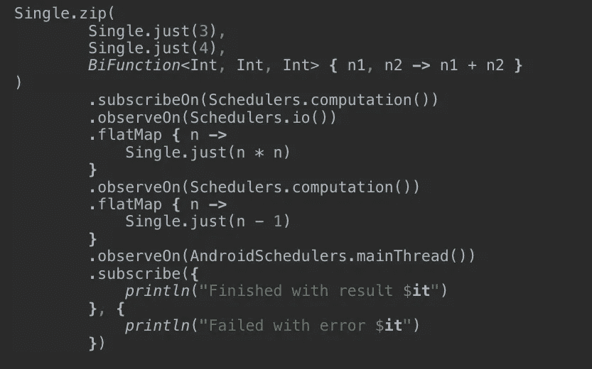**

**RxJava code to study**

**让我们把这些都分解开来。你可能已经注意到了`subscribeOn()`操作符。**

**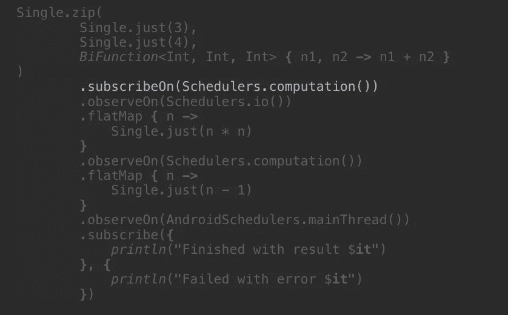**

**subscribeOn defines on which Scheduler the Observable will execute its create method**

**它定义了`Single.create`将在哪个调度程序上执行。这种情况下，`Schedulers.computation()`。**

> **请注意，所有创建观察值的 RxJava 操作符(即`Single.just`、`Single.zip`等)都在内部使用`Single.create`。**

**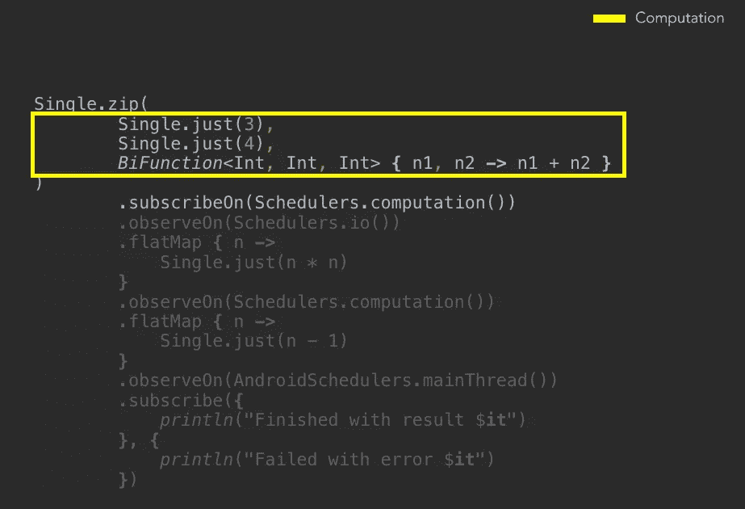**

**The emission of the item will happen on Schedulers.computation()**

**发出该项目后，我们将对该对象进行转换。为了在不同的线程中执行它们，我们必须在不同的调度器上观察项目。我们通过`observeOn()`操作符实现了这一点。**

> **请注意，我们在应用转换之前使用 observeOn 操作符，在创建可观察对象之后使用 subscribeOn 操作符**

**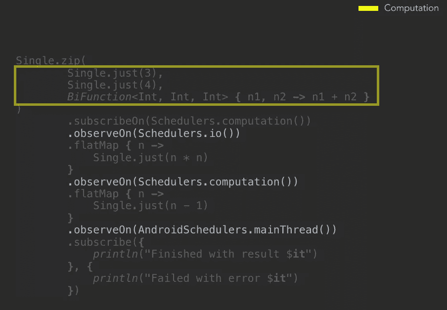**

**Usage of observeOn to execute transformations/observe items in different threads**

**第一个转换包括发出那个数字的平方，我们希望它发生在`Schedulers.io()`。**

> **请注意，这不是你在应用程序中会做的事情。我只是切换到不同的调度器来展示我们如何做到这一点，以及线程在 RxJava 中是如何工作的。**

**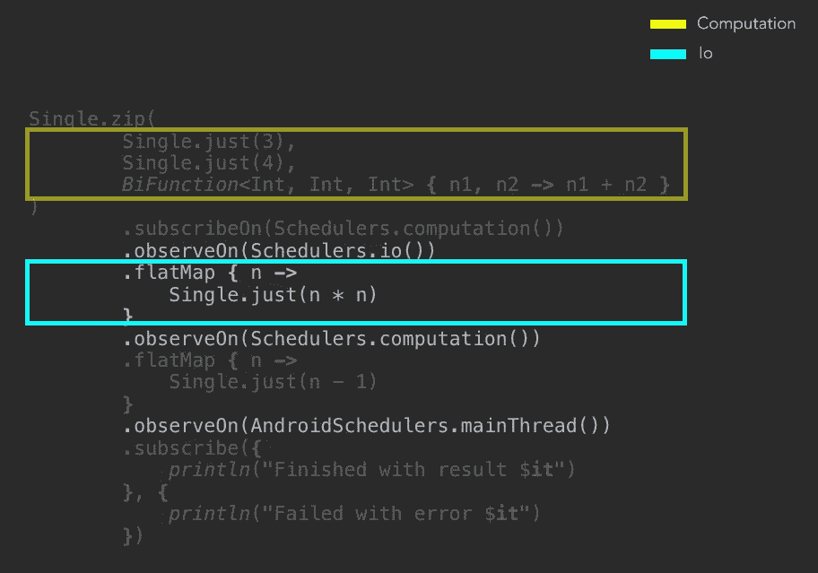**

**Transforming the item on Schedulers.io()**

**如您所见，我们调用`observeOn(Schedulers.io())`来决定我们希望哪个调度程序来消费该项目。然后，我们使用`flatMap`操作符返回一个 Single，它发出我们收到的数字的平方。**

> **注意一个`map`操作员也会在这里工作来转换物品。我用`flatMap`来展示 RxJava 中线程的强大。**

**下一个转换将发出我们接收到的数字(我们从上一个转换中得到的原始数字的平方)减去 1。由于我们再次切换到`Schedulers.computation()`，转换将在那个调度程序上执行。**

**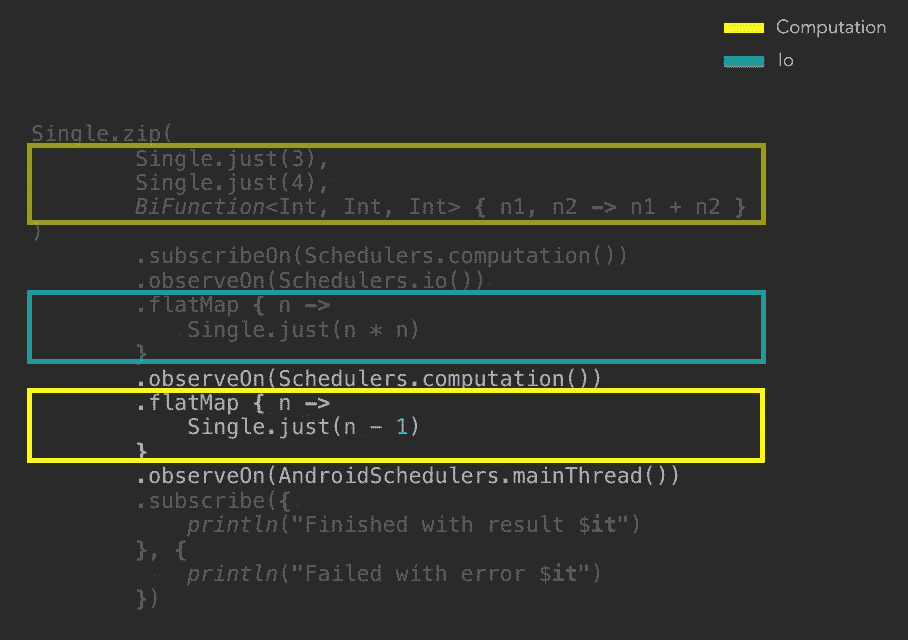**

**Transforming the item on Schedulers.computation()**

**现在我们想消费这个项目。因为我们假设会做一些用户界面的改变，我们希望这发生在 Android 主线程中。和以前一样，我们使用`observeOn()`操作符传入`AndroidSchedulers.mainThread()`。**

> **`AndroidSchedulers.mainThread()`是 [RxAndroid](https://github.com/ReactiveX/RxAndroid) 的 Android 专用调度器部分。**

**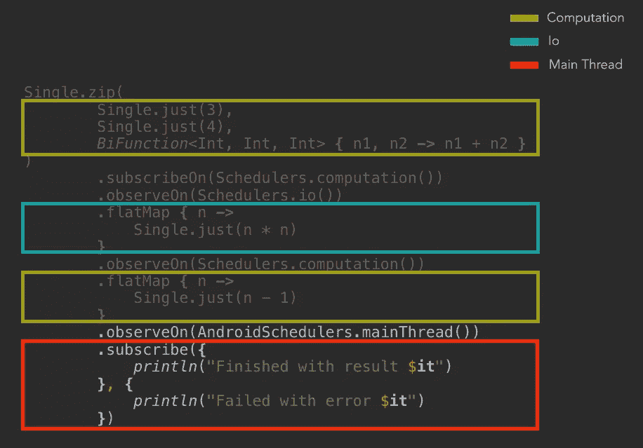**

**Consuming the item in the Android Main Thread**

**在这个例子中，我们打印是为了安慰我们消费的商品。由于这发生在 Android UI 线程中，我们也可以修改屏幕上的任何 UI 小部件。**

**至此，我认为我们已经对 RxJava 中的线程化有了足够的了解，可以将其与协程中的线程化进行比较。**

# **协程中的线程**

**协程中的线程是在协程上下文中定义的。[在之前的文章](/capital-one-developers/coroutines-and-rxjava-an-asynchronicity-comparison-part-2-cancelling-execution-199485cdf068)中，我们说过协程上下文是用户定义对象的`**set**`。线程在键[**continuation interceptor**](https://kotlinlang.org/api/latest/jvm/stdlib/kotlin.coroutines.experimental/-continuation-interceptor/index.html)的值中定义。**

> **做一些类似于`coroutineContext[ContinuationInterceptor] = threadingPolicy`的事情将会改变特定协程的线程策略。**

**该值的类型为 [**协程调度器**](https://kotlin.github.io/kotlinx.coroutines/kotlinx-coroutines-core/kotlinx.coroutines.experimental/-coroutine-dispatcher/) 。您可以拥有一个带有单线程或线程池的协同调度程序。与 RxJava 线程一样，协程带有一些预定义的值，您可以开箱即用。其中一些是:**

*   **[公共池](https://kotlin.github.io/kotlinx.coroutines/kotlinx-coroutines-core/kotlinx.coroutines.experimental/-common-pool/)。这类似于 RxJava 中的`Schedulers.computation()`。微小的区别在于`computation()`是一个大小数量的 CPU 的池，而 CommonPool 是一个大小数量的 CPU 减 1 的池(这意味着对于双核设备，你只能得到 1 个线程),正如 [Nick Capurso](https://medium.com/u/a575ffc02c7d?source=post_page-----2aa5e9c52c94--------------------------------) 在[他的帖子](/capital-one-developers/kotlin-coroutines-on-android-things-i-wish-i-knew-at-the-beginning-c2f0b1f16cff)中所说。**
*   **[UI](https://github.com/Kotlin/kotlinx.coroutines/blob/master/ui/kotlinx-coroutines-android/src/main/kotlin/kotlinx/coroutines/experimental/android/HandlerContext.kt#L29) (安卓)。在 Android 主 UI 线程上调度执行。**
*   **[无约束](https://kotlin.github.io/kotlinx.coroutines/kotlinx-coroutines-core/kotlinx.coroutines.experimental/-unconfined/)。如果您想使用这个特性，请仔细阅读文档。如果协程通过了一个暂停点，它可能会在另一个协程调度程序上恢复。**

> **Schedulers.computation 是一个大小= CPU 的池，CommonPool 是一个大小= CPU-1 的池**

## **创建您自己的协程调度程序**

**您可以使用`[**newSingleThreadContext**](https://kotlin.github.io/kotlinx.coroutines/kotlinx-coroutines-core/kotlinx.coroutines.experimental/new-single-thread-context.html)`创建一个单线程的协同调度程序。**

```
val coroutineDispatcher = **newSingleThreadContext**("ThreadName")
```

**并且还可以使用[**newFixedThreadPoolContext**](https://kotlin.github.io/kotlinx.coroutines/kotlinx-coroutines-core/kotlinx.coroutines.experimental/new-fixed-thread-pool-context.html)创建一个具有固定大小线程池的协同调度器。**

```
val coroutineDispatcher = **newFixedThreadPoolContext**(4, "PoolName")
```

**这将创建一个具有由四个线程组成的线程池的 CoroutineDispatcher。**

## **实践中的穿线**

**现在是时候以 RxJava 为例，使用协程完成一个类似的例子了。**

**让我们来看看下面的协程:**

**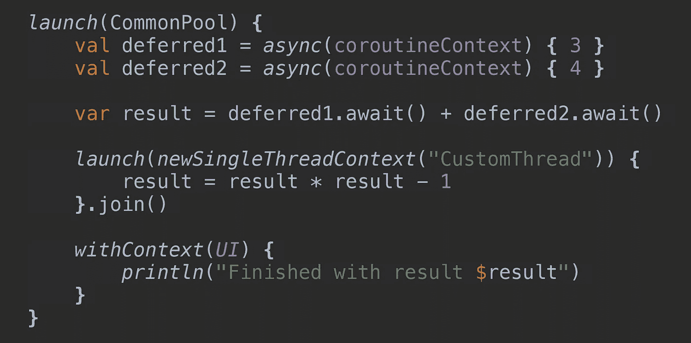**

**Coroutine code to study**

**如您所见，在第一行中，我们用协程构建器`launch`启动了一个协程，并将`CommonPool`作为协程上下文传递。这将覆盖我们刚刚创建的协程的 ContinuationInterceptor 值。这将使我们的协程在后台运行。**

> **协程中的代码将在后台线程中执行。**

****CommonPool 是 CoroutineContext 中 ContinuationInterceptor 键的默认**值。**

**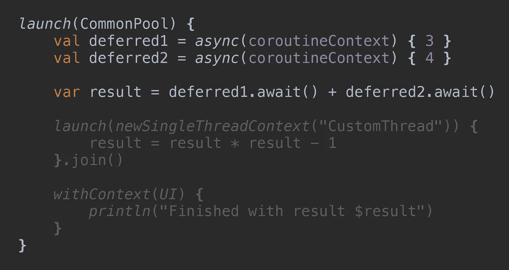**

**Using the CoroutineContext of the parent coroutine**

**在接下来的几行中，我们创建了另外两个协程来模仿我们在 RxJava 代码中对`Single.zip`所做的事情。然后，我们只需等待两个协程完成，对它们返回的数字求和，并将其赋给`result`变量。**

**新的两个协同程序的代码在哪里执行？如您所见，我们将`coroutineContext`作为参数传递给`async`协程构建器。`coroutineContext`是每个协程都有的变量，**是指父协程**的上下文，即我们在第一行用`launch`创建的协程的上下文。因此，异步协同例程有效地使用父协同例程的协同上下文:`CommonPool`。**

**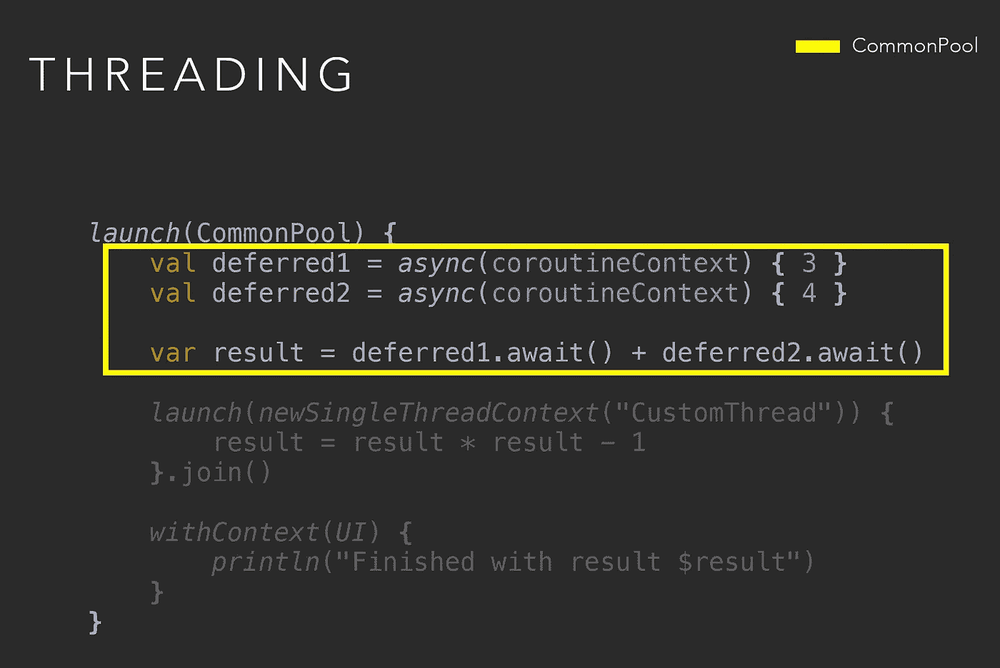**

**The code will be executed in the CommonPool since we use the parent CoroutineContext**

**所有代码都将在`CommonPool`中执行，因为那是主协程的 ContinuationInterceptor 值。**

**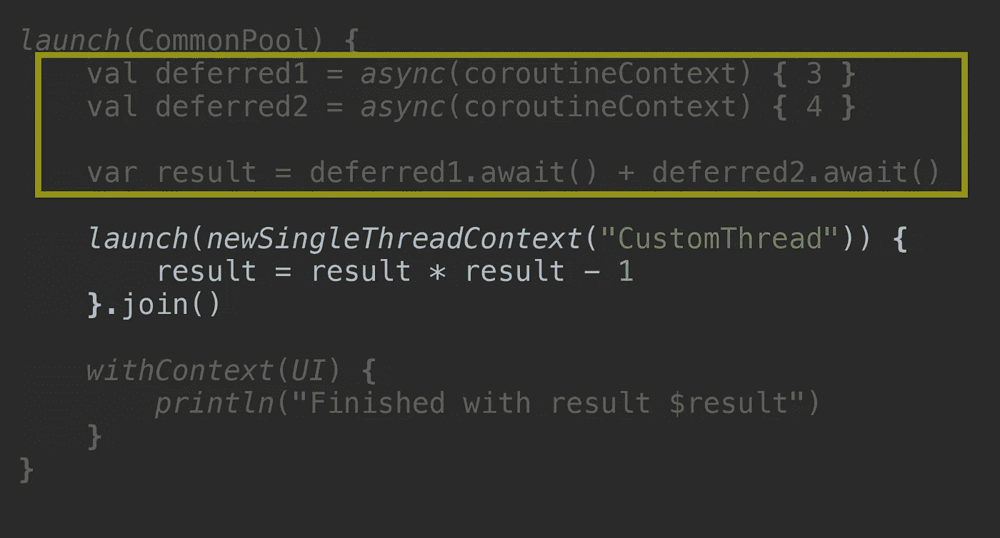**

**Use of newSingleThreadContext**

**下一步是什么？我们希望像在 RxJava 代码中那样应用转换。我们正在创建另一个协程来转换变量`result`的值。为此，我们使用协程构建器`launch`并调用`.join()`，因此父协程等待这个协程完成。**

**如您所见，我们正在使用`newSingleThreadContext`，这将创建一个新线程来执行这个协程中的代码。**

**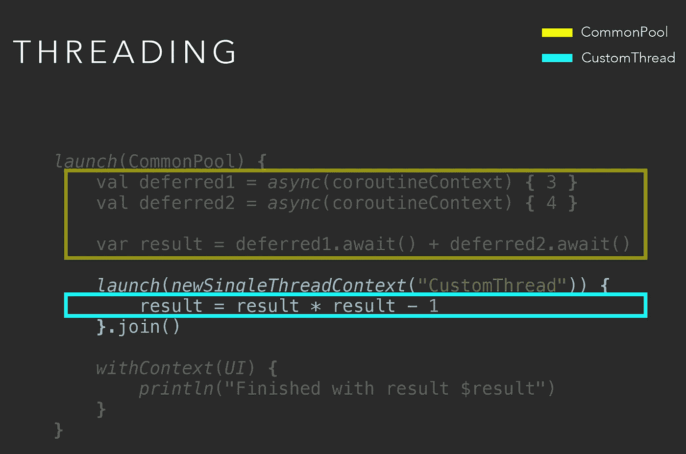**

**The coroutine will be executed in a new thread we just created to run it**

**协程中的代码将在一个名为`CustomThread`的新线程中执行。**

**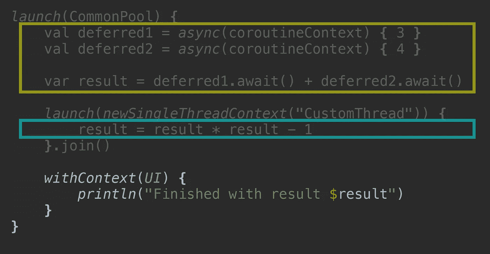**

**Another way of swapping threads with Coroutines**

**对于最后一个例子，我们使用`[withContext](https://kotlin.github.io/kotlinx.coroutines/kotlinx-coroutines-core/kotlinx.coroutines.experimental/with-context.html)`。如果我们假设想要运行 Android UI 主线程中的代码来进行一些 UI 更改，我们将不得不使用 UI CoroutineDispatcher。**

**`withContext`是一个挂起函数，它将在不同的上下文中运行其中的挂起代码。在继续执行之前，父协程将等待它返回。**

**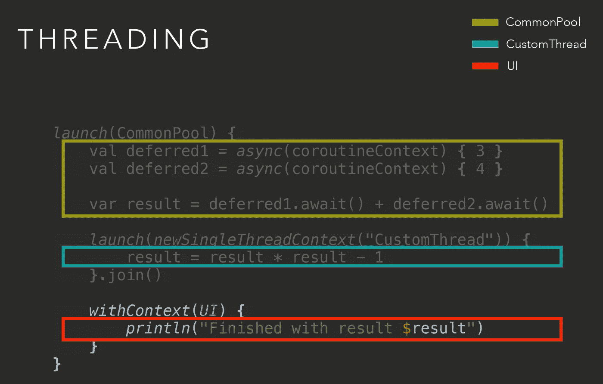**

**The code is executed in the context defined as a parameter**

**挂起函数中的代码将在 Android UI 线程中执行。**

## **withContext vs launch.join**

**什么时候必须用`withContext` vs `launch{}.join()`？在这两种情况下，调用这些方法的父协程将等待它们完成。然而，`launch`会创建一个新的协程，而`withContext`不会。`launch`会增加创建新协程的额外成本。**

**此时，我会根据可读性做出决定。如果要执行的任务与协程相关，我会使用`withContext`。如无关联，`launch`。**

# **结论**

**这一系列即将结束，这是我们最后一次就某一特定主题进行比较。我们已经看到了**两个库如何为异步编程的每个方面提供解决方案**。**

**我想提出几个结论:**

*   **RxJava 和协程之间没有赢家/输家。用适合你项目的，你最喜欢的。这可能会有所不同，对您和您的项目来说是独一无二的。**
*   **这两个库都提供了进行异步编程的好方法。**
*   **如果你是 RxJava 专家，没必要切换。你可以继续你正在做的事情。**
*   **如果你正在纠结 RxJava 或者是一个新的 Android 开发者，那么协程是你可以尝试的另一个选择。协程应该有一个较低的学习曲线。**

# **更多教育**

**关于 RxJava 2 的文章**

**[](/capital-one-developers/rxjava2-android-mvvm-lifecycle-app-structure-with-retrofit-2-cf903849f49e) [## RxJava 2: Android MVVM 生命周期应用程序结构与改进 2

### 自从我写了关于 MVVM、RxJava 和翻新的文章已经两年多了。我们来更新一下。

medium.com](/capital-one-developers/rxjava2-android-mvvm-lifecycle-app-structure-with-retrofit-2-cf903849f49e) 

本系列的前几部分

[](/capital-one-developers/coroutines-and-rxjava-an-asynchronicity-comparison-part-1-asynchronous-programming-e726a925342a) [## 协程和 rx Java——异步比较(第 1 部分):异步编程

### 异步编程

异步 Programmingmedium.com](/capital-one-developers/coroutines-and-rxjava-an-asynchronicity-comparison-part-1-asynchronous-programming-e726a925342a) [](/capital-one-developers/coroutines-and-rxjava-an-asynchronicity-comparison-part-2-cancelling-execution-199485cdf068) [## 协程和 rx Java——异步比较(第 2 部分):取消执行

### 第 2 部分—取消执行

medium.com](/capital-one-developers/coroutines-and-rxjava-an-asynchronicity-comparison-part-2-cancelling-execution-199485cdf068) 

感谢阅读，

曼努埃尔·维森特 Vivo**