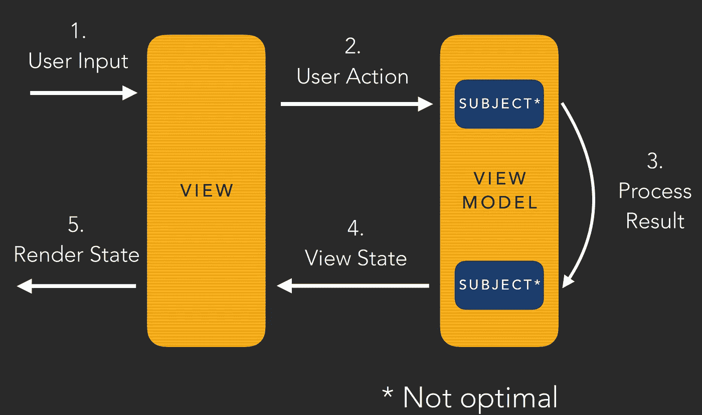

# 协程和 rx Java——异步比较(第 7 部分):MVI 项目

> 原文：<https://medium.com/capital-one-tech/coroutines-and-rxjava-an-asynchronicity-comparison-part-7-mvi-project-f763fdd5070e?source=collection_archive---------4----------------------->

# 介绍

在这个博客系列中，我比较了 [Kotlin 协同程序](https://kotlinlang.org/docs/reference/coroutines.html)和 [RxJava](https://github.com/ReactiveX/RxJava) ，因为它们都试图解决 Android 开发中的一个常见问题:**异步编程**。在上一篇文章中，我们完成了这两个库与本系列前一部分的主题比较，现在是时候将我们学到的一切付诸实践了。

> 让我们用我们所学的知识建立一个 MVI 项目！

# Android 应用程序

在本文中，我们将构建一个 Android 应用程序，它将计算一个数字的斐波那契数列，并可以选择性地告诉您一个关于该数字的有趣事实。

我们将使用一个名为[numbersapi.com](http://numbersapi.com/#42)的公共 API 发出一个网络请求来计算这个数字的有趣事实。

App screenshots

计算斐波那契和获取有趣的事实是两个并行运行的任务，只有当两个请求都到来时，我们才会向用户显示信息。这是为了防止用户勾选“告诉我一个有趣的事实”复选框。

## 应用程序变体—项目

我们有三种项目变体可用:

1.  纯协程。
2.  纯 RxJava。
3.  协同程序/RxJava 互操作。一些部分将在 RxJava 中完成，并将被协程使用(也可能是其他方式)。

 [## manuelvicnt/MathCoroutines

### 这是一个带有数学例子的协同程序的例子

github.com](https://github.com/manuelvicnt/MathCoroutines)  [## manuelvicnt/MathRxJava

### 这是一个带有数学例子的 RxJava 的例子

github.com](https://github.com/manuelvicnt/MathRxJava)  [## manuelvicnt/MathRxCoroutines

### 这是一个将 RxJava 和协同程序集成到一个数学例子中的例子

github.com](https://github.com/manuelvicnt/MathRxCoroutines) 

> 免责声明:这段代码可能并不完美。请注意高层次的概述，而不是您已经知道如何解决的细节:)

## 应用概述

我们将使用 [MVI 模式](http://hannesdorfmann.com/android/model-view-intent)和[架构组件视图模型](https://developer.android.com/topic/libraries/architecture/)。

*   **MVI** 帮助我们构建一个关注点清晰分离的应用程序，并以一种简单的方式维护其状态。
*   我们将使用**架构组件视图模型**来管理配置更改，并能够轻松恢复状态。

幸存的配置更改是每个 Android 开发者的痛点。不久前，我发现自己正在写一篇关于这个的文章。简而言之，我们希望应用程序的状态在用户旋转屏幕后继续显示。见下面截图:

The app can restore state after a configuration change

# MVI 建筑

我们将遵循 MVI 模式如下:

用户将与应用程序进行交互。视图将对其做出反应，并通过 UserAction 将用户输入传递给视图模型。ViewModel 将处理该动作，并通过 ViewState 与视图进行通信。然后，视图将呈现新的状态，用户将看到它。

App MVI Architecture

如您所见，这里发生了两次通信:

1.  **视图- >视图模型**带用户动作。ViewModel 需要监听视图事件，并能够对它们做出反应。
2.  **ViewModel - >用 ViewState 查看**。视图需要监听 ViewModel 事件，并能够对它们做出反应。

我们需要两个实体/对象来管理这种通信。

MVI Architecture communication points

# RxJava 中的 MVI

我们想到的第一件事可能是使用主题。为什么是主题？我们想要一个即使没有观察者监听事件也能存活的**热可观察物**，并且能够向多个观察者广播这些事件。

We can use Subjects for the View <-> ViewModel communication

视图模型可以有一个`userActionSubject`和一个`viewStateSubject`。

1.  视图调用`userActionSubject`上的`onNext`向视图模型发送事件。ViewModel 在初始化时订阅它。这个主题可以是`PublishSubject`类型。
2.  ViewModel 调用`userStateSubject`上的`onNext`向视图发送事件。每当它对用户可见时，视图就订阅它(我们可以在`onStart`中注册)。**这个主体应该是**类型的`**BehaviorSubject**`。我们需要一个`BehaviorSubject`，因为我们希望视图在配置更改后自动接收 ViewModel 发送的最新视图状态。当这种情况发生时，视图将再次订阅同一个主题，主题将发出它发送的最后一个状态。这样，视图就可以恢复它原来的视图状态。

处理 UserAction 的所有逻辑都发生在对`userActionSubject`的订阅中。在代码内部，视图模型将调用`userStateSubject`上的`onNext`来与视图通信。

RxJava ViewModel part of the implementation

RxJava View part of the implementation

如果你意识到在之前的图像中我们说过一个主题不是最佳的。让我澄清这一点。ViewModel 创建了一个 Subject，但是它不应该将它公开为 Subject 对象。

1.  在第一个场景中，视图不应该能够调用`onComplete`。如果发生了这种情况，这个主题就没用了，之后就不会再有交流了。我们可以使用 Jake Wharton 的 RxRelay 库和 PublishRelay 库。
2.  在这种情况下，视图不需要向 ViewModel 发送事件，它只需要向 Subject 注册。我们可以**公开一个可观察的**并保护视图模型，而不是公开一个主题。

Better implementations of the RxJava MVI Architecture

## **小心…**

*   ViewModel 订阅了`Schedulers.computation()`上的`userActionSubject`，我们需要在后台进行处理。
*   ViewModel 清理 ViewModel 库提供的`onCleared`方法中的主题。
*   视图观察`AndroidSchedulers.mainThread()`日的`viewStateSubject`事件。
*   视图开始在`onStart`中监听`viewStateSubject`，并在`onStop`中处理订阅。

# 穿着花冠的 MVI

我们现在需要用协程实现我们在 RxJava 中编程的相同行为。

We can use Actors and Channels for the View <-> ViewModel communication

如果我们使用主题来实现 RxJava，**我们可以使用通道来实现协程一**。在本系列的第三部分中，我们看到它们在功能上是相似的。

1.  对于 View -> ViewModel 通信，我们可以使用`**Actor**`。显然，我们希望在后台处理用户操作，所以我们需要一个协程。对于这个用例，ViewModel 不需要在这个通道中发回任何东西；它将只监听视图发送的事件。出于所有这些原因，Actor 是理想的候选:协程+只能接收事件的通道。参与者将在后台一次处理一个用户操作。
2.  对于 ViewModel ->视图通信，ViewModel 创建一个`**ConflatedBroadcastChannel**`。如果我们在 RxJava 中使用`BehaviorSubject`来回复新订阅事件，那么我们在协程中使用了`ConflatedBroadcastChannel`。完全出于同样的原因，所以我们可以在配置更改后生存下来，并且可以恢复状态。

Actor 中的挂起代码将处理用户操作，并将事件发送给`ConflatedBroadcastChannel`。

## 当心…

*   ViewModel 在公共池上运行 Actor。
*   ViewModel 关闭`onCleared` ViewModel 方法中的`viewStateChannel`和`userActionActor`。
*   视图使用`launch(parentJob + CommonPool)`创建一个新的协同程序，开始监听带有`consumeEach`扩展函数的`viewStateChannel`。在这段代码中，我们调用了`withContext(UI)`,以便在 Android UI 主线程上处理事件。
*   视图开始监听`onStart`方法中的 ViewModel 事件，并取消`onStop`中协程的作业。

Coroutines Actor implementation

Coroutines listenViewModel View implementation

# 结论

这是关于如何使用 RxJava 和协程实现 MVI 项目的高级概述。我们没有时间讨论项目中的其他一些概念，但我认为值得一提的是:

*   协同程序项目中的 Zip 操作符实现。
*   互操作项目中协同例程和 RxJava 之间的互操作。

感谢阅读，

曼努埃尔·维森特 Vivo