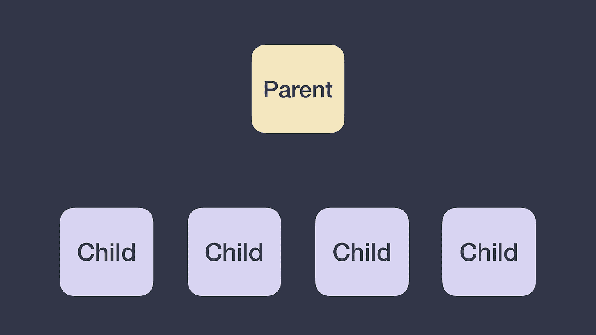
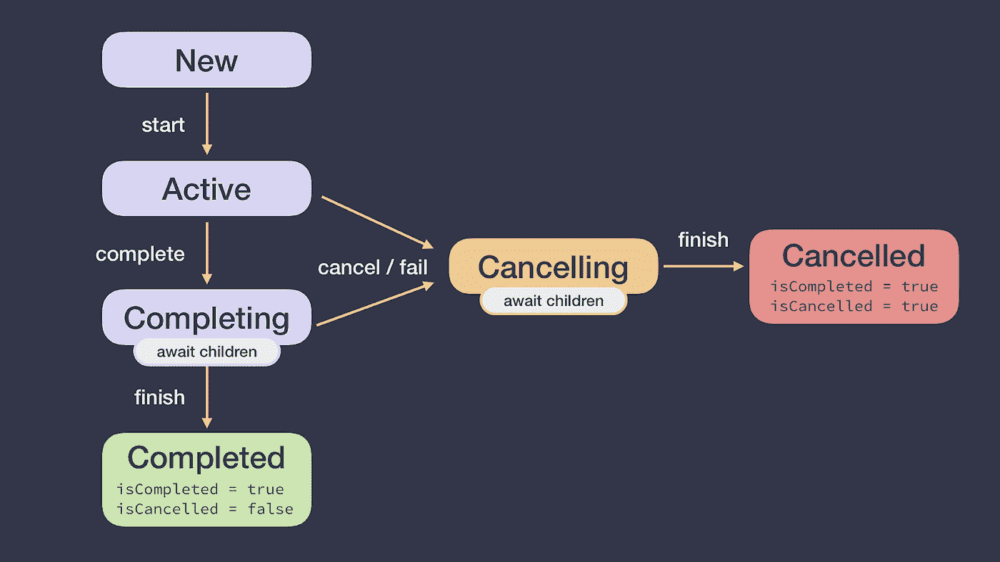
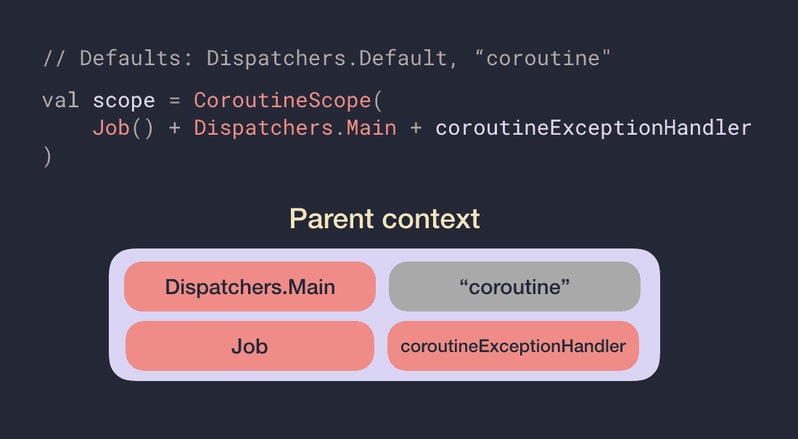
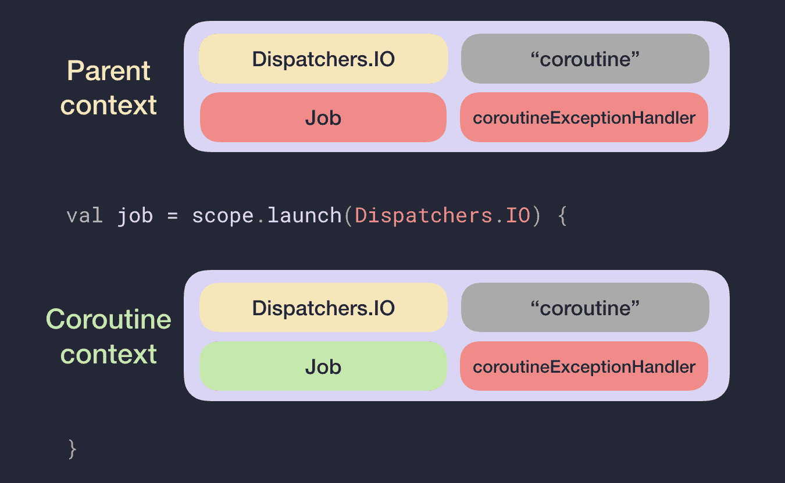

# 协程:先做最重要的事情

> 原文：<https://medium.com/androiddevelopers/coroutines-first-things-first-e6187bf3bb21?source=collection_archive---------2----------------------->


Illustration by [Virginia Poltrack](https://twitter.com/VPoltrack)

## 协同程序中的取消和异常(第一部分)

这一系列博客文章深入探讨了协程中的取消和异常。取消对于避免做多余的工作很重要，这样会浪费内存和电池寿命；正确的异常处理是良好用户体验的关键。作为本系列其他两部分的基础([第 2 部分:取消](/androiddevelopers/cancellation-in-coroutines-aa6b90163629)、[第 3 部分:异常](/androiddevelopers/exceptions-in-coroutines-ce8da1ec060c))，定义一些核心协程概念很重要，比如`CoroutineScope`、`Job`和`CoroutineContext`，这样我们就能达成一致。

如果你喜欢视频，可以看看我和弗洛里纳·芒特内斯库在 2019 年科特林康夫的演讲:

# 验光仪

一个`[**CoroutineScope**](https://kotlin.github.io/kotlinx.coroutines/kotlinx-coroutines-core/kotlinx.coroutines/-coroutine-scope/)`跟踪你使用`[launch](https://kotlin.github.io/kotlinx.coroutines/kotlinx-coroutines-core/kotlinx.coroutines/launch.html)`或`[async](https://kotlin.github.io/kotlinx.coroutines/kotlinx-coroutines-core/kotlinx.coroutines/async.html)`(这些是`CoroutineScope`上的扩展函数)创建的任何协程。正在进行的工作(运行协程)可以通过在任何时间点调用`scope.cancel()`来取消。

每当您想要在应用程序的特定层启动和控制协程的生命周期时，您都应该创建一个`CoroutineScope`。在一些像 Android 这样的平台上，KTX 库已经在某些生命周期类中提供了一个`CoroutineScope`，比如`[viewModelScope](https://developer.android.com/reference/kotlin/androidx/lifecycle/package-summary#(androidx.lifecycle.ViewModel).viewModelScope:kotlinx.coroutines.CoroutineScope)`和`[lifecycleScope](https://developer.android.com/reference/kotlin/androidx/lifecycle/package-summary#lifecyclescope)`。

当创建一个`CoroutineScope`时，它将一个`CoroutineContext`作为其构造函数的参数。您可以使用以下代码创建一个新的作用域&协程:

```
// Job and Dispatcher are combined into a CoroutineContext which
// will be discussed shortly
val scope = CoroutineScope(Job() + Dispatchers.Main)val job = scope.launch {
    // new coroutine
}
```

# 职位

`Job`是协程程序的句柄。对于您(通过`launch`或`async`创建的)每个协程，它返回一个`[**Job**](https://kotlin.github.io/kotlinx.coroutines/kotlinx-coroutines-core/kotlinx.coroutines/-job/index.html)`实例，该实例唯一地标识协程并管理它的生命周期。正如我们在上面看到的，您也可以将一个`Job`传递给一个`CoroutineScope`来保持对其生命周期的控制。

# 协同上下文

`[**CoroutineContext**](https://kotlinlang.org/api/latest/jvm/stdlib/kotlin.coroutines/-coroutine-context/index.html)`是一组定义协程行为的元素。它由以下材料制成:

*   `Job` —控制协程的生命周期。
*   `[CoroutineDispatcher](https://kotlin.github.io/kotlinx.coroutines/kotlinx-coroutines-core/kotlinx.coroutines/-coroutine-dispatcher/index.html)` —将工作分派给适当的线程。
*   `[CoroutineName](https://kotlin.github.io/kotlinx.coroutines/kotlinx-coroutines-core/kotlinx.coroutines/-coroutine-name/index.html)` —协程的名称，用于调试。
*   `[CoroutineExceptionHandler](https://kotlin.github.io/kotlinx.coroutines/kotlinx-coroutines-core/kotlinx.coroutines/-coroutine-exception-handler/index.html)` —处理未捕获的异常，将在本系列的第 3 部分中讨论。

新协程的`CoroutineContext`是什么？我们已经知道将会创建一个新的`Job`实例，允许我们控制它的生命周期。其余的元素将从其父元素的`CoroutineContext`继承(要么是另一个协程，要么是创建它的`CoroutineScope`)。

由于`CoroutineScope`可以创建协程，并且您可以在一个协程内创建更多的协程，因此创建了一个隐式的 ***任务层次*** 。在下面的代码片段中，除了使用`CoroutineScope`创建一个新的协同程序，还可以看到如何在一个协同程序中创建更多的协同程序:

```
val scope = CoroutineScope(Job() + Dispatchers.Main)val job = scope.**launch** {
    // New coroutine that has CoroutineScope as a parent
    val result = **async** {
        // New coroutine that has the coroutine started by 
        // launch as a parent
    }.await()
}
```

这个层级的根通常是`CoroutineScope`。我们可以将这种层次形象化如下:



*Coroutines are executed in a task hierarchy. The parent can be either a CoroutineScope or another coroutine.*

# 作业生命周期

一个`Job`可以经历一组状态:新建、活动、完成、完成、取消和取消。虽然我们不能访问状态本身，但是我们可以访问作业的属性:`isActive`、`isCancelled`和`isCompleted`。



Job lifecycle

如果协程处于活动状态，协程或调用`job.cancel()`的失败将使作业处于取消状态(`isActive = false`、`isCancelled = true`)。一旦所有的孩子都完成了他们的工作，协程将进入取消状态和`isCompleted = true`。

# 父协同上下文解释

在任务层次结构中，每个协程都有一个父协程，它可以是一个`CoroutineScope`或另一个协程。然而，协程的结果父级`CoroutineContext`可能不同于父级的`CoroutineContext`,因为它是基于以下公式计算的:

> **父上下文** =默认值+继承的`CoroutineContext` +参数

其中:

*   有些元素有**默认**值:`Dispatchers.Default`是`CoroutineDispatcher`的默认值，`“coroutine”`是`CoroutineName`的默认值。
*   继承了 `**CoroutineContext**`的**是创建它的`CoroutineScope`或协程的`CoroutineContext`。**
*   **协程生成器中传递的参数**将优先于继承上下文中的那些元素。

***注*** : `CoroutineContext` s 可以用`+`运算符组合。由于`CoroutineContext`是一组元素，一个新的`CoroutineContext`将被创建，加号右边的元素覆盖左边的元素。例如`(Dispatchers.Main, “name”) + (Dispatchers.IO) = (Dispatchers.IO, “name”)`



*Every coroutine started by this CoroutineScope will have at least those elements in the CoroutineContext. CoroutineName is gray because it comes from the default values.*

现在我们知道了新协程的父代`CoroutineContext`是什么，它的实际`CoroutineContext`将是:

> **新协程上下文** =父`CoroutineContext` + `Job()`

如果我们用上图所示的`CoroutineScope`创建一个新的协程，如下所示:

```
val job = scope.launch(Dispatchers.IO) {
    // new coroutine
}
```

那个协程的父`CoroutineContext`和它的实际`CoroutineContext`是什么？见下图的解决方案！



*The Job in the CoroutineContext and in the parent context will never be the same instance as a new coroutine always get a new instance of a Job*

所得到的父级`CoroutineContext`具有`Dispatchers.IO`而不是作用域的`CoroutineDispatcher`,因为它被协程生成器的参数覆盖了。另外，检查父`CoroutineContext`中的`Job`是作用域的`Job`(红色)的实例，并且`Job`(绿色)的新实例已经被分配给新协程的实际`CoroutineContext`。

正如我们将在本系列的第 3 部分看到的，一个`CoroutineScope`可以在它的`CoroutineContext`中有一个不同的`Job`实现，称为`SupervisorJob`，它改变了`CoroutineScope`处理异常的方式。因此，用该作用域创建的新协程可以将`SupervisorJob`作为父`Job`。然而，当一个协程的父代是另一个协程时，父代`Job`将总是类型`Job`。

既然您已经了解了协程的基础知识，那么就从本系列的第二部分和第三部分开始学习更多关于协程中的取消和异常:

[](/androiddevelopers/cancellation-in-coroutines-aa6b90163629) [## 协同程序中的取消

### 协程中的取消和异常(下)

medium.com](/androiddevelopers/cancellation-in-coroutines-aa6b90163629) [](/androiddevelopers/exceptions-in-coroutines-ce8da1ec060c) [## 协程中的异常

### 协程中的取消和异常(第三部分)——必须全部捕获！

medium.com](/androiddevelopers/exceptions-in-coroutines-ce8da1ec060c) [](/androiddevelopers/coroutines-patterns-for-work-that-shouldnt-be-cancelled-e26c40f142ad) [## 不应该取消的工作的协程和模式

### 协同程序中的取消和例外(第四部分)

medium.com](/androiddevelopers/coroutines-patterns-for-work-that-shouldnt-be-cancelled-e26c40f142ad)