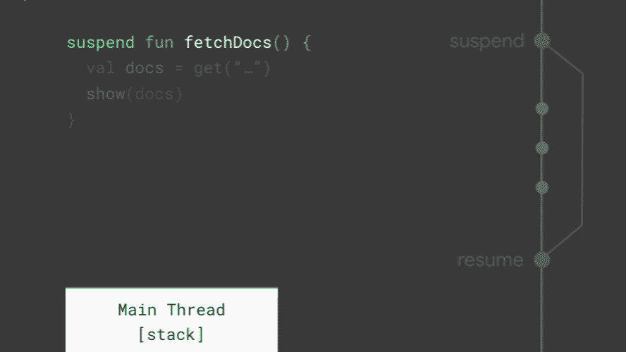

# Android 上的协同程序(第一部分):了解背景

> 原文：<https://medium.com/androiddevelopers/coroutines-on-android-part-i-getting-the-background-3e0e54d20bb?source=collection_archive---------0----------------------->


Illustration by [Virginia Poltrack](https://twitter.com/VPoltrack)

这是关于在 Android 上使用协程的系列文章的一部分。这篇文章关注协程是如何工作的，以及它们解决了什么问题。

## 本系列的其他文章:

[](/androiddevelopers/coroutines-on-android-part-ii-getting-started-3bff117176dd) [## Android 上的协同程序(第二部分):入门

### 这是关于在 Android 上使用协程的系列文章的一部分。这一部分的重点是开始工作和保持…

medium.com](/androiddevelopers/coroutines-on-android-part-ii-getting-started-3bff117176dd) [](/androiddevelopers/coroutines-on-android-part-iii-real-work-2ba8a2ec2f45) [## Android 上的协同程序(第三部分):实际工作

### 了解如何使用协程来完成实际工作，比如使用数据库或发出网络请求。

medium.com](/androiddevelopers/coroutines-on-android-part-iii-real-work-2ba8a2ec2f45) 

# 协程解决什么问题？

Kotlin [协同程序](https://kotlinlang.org/docs/reference/coroutines-overview.html)引入了一种新的并发方式，可以在 Android 上用来简化异步代码。虽然它们是 kot Lin 1.3 中的新内容，但协程的概念自编程语言诞生以来就一直存在。第一个探索使用协程的语言是 1967 年的 [Simula](https://en.wikipedia.org/wiki/Simula) 。

在过去的几年中，协程越来越受欢迎，现在已经包含在许多流行的编程语言中，例如 [Javascript](https://javascript.info/async-await) 、 [C#](https://docs.microsoft.com/en-us/dotnet/csharp/programming-guide/concepts/async/) 、 [Python](https://docs.python.org/3/library/asyncio-task.html) 、 [Ruby](https://ruby-doc.org/core-2.1.1/Fiber.html) 和 [Go](https://tour.golang.org/concurrency/1) 等等。Kotlin 协程是基于已经被用于构建大型应用程序的既定概念。

在 Android 上，协程是两个问题的绝佳解决方案:

1.  **长时间运行的任务**是花费太长时间阻塞主线程的任务。
2.  **Main-safety** 允许您确保任何挂起函数都可以从主线程调用。

让我们深入到每一个方面，看看协程如何帮助我们以一种更简洁的方式构建代码！

# 长期运行的任务

获取网页或与 API 交互都涉及发出网络请求。类似地，从数据库中读取或从磁盘中加载映像也涉及到读取文件。这类事情就是我所说的长时间运行的任务——对于你的应用程序来说，停止并等待它们需要太长的时间！

与网络请求相比，很难理解现代手机执行代码的速度有多快。在 Pixel 2 上，一个 CPU 周期需要不到 0.0000000004 秒，这个数字对人类来说很难理解。然而，如果你把一个网络请求想象成一眨眼，大约 400 毫秒(0.4 秒)，就更容易理解 CPU 的运行速度。一眨眼的功夫，或者稍微慢一点的网络请求，CPU 就能执行超过十亿个周期！

在 Android 上，每个应用都有一个主线程，负责处理 UI(如绘图视图)和协调用户交互。如果这个线程上有太多的工作发生，应用程序似乎会挂起或变慢，导致不良的用户体验。任何长时间运行的任务都应该在不阻塞主线程的情况下完成，这样你的应用就不会显示所谓的“jank”，比如冻结的动画，或者对触摸事件反应缓慢。

为了在主线程之外执行网络请求，一种常见的模式是回调。回调提供了一个库的句柄，它可以用来在将来的某个时候回调你的代码。通过回调，获取 developer.android.com 可能如下所示:

```
class ViewModel: ViewModel() {
   fun fetchDocs() {
       get("developer.android.com") { result ->
           show(result)
       }
    }
}
```

即使从主线程调用`get`，它也会使用另一个线程来执行网络请求。然后，一旦从网络获得结果，回调将在主线程上被调用。这是处理长时间运行任务的好方法，像[改型](https://square.github.io/retrofit/)这样的库可以帮助你在不阻塞主线程的情况下发出网络请求。

# 为长时间运行的任务使用协程

协程是一种简化用于管理像`fetchDocs`这样的长时间运行任务的代码的方法。为了探究协程如何简化长时间运行任务的代码，让我们重写上面的回调示例来使用协程。

```
// Dispatchers.Main
suspend fun fetchDocs() {
    // Dispatchers.Main
    val result = get("developer.android.com")
    // Dispatchers.Main
    show(result)
}// look at this in the next section
suspend fun get(url: String) = withContext(Dispatchers.IO){/*...*/}
```

这段代码不会阻塞主线程吗？它如何在不等待网络请求和阻塞的情况下从`get`返回一个结果？原来协程为 Kotlin 提供了一种方法来执行这段代码，并且永远不会阻塞主线程。

协程通过添加两个新操作来构建常规函数。除了 **invoke** (或 call)和 **return** 之外，协程增加了 **suspend** 和 **resume** 。

*   **暂停** —暂停当前协程的执行，保存所有局部变量
*   **恢复** —从暂停的地方继续暂停的协程

这个功能是 Kotlin 通过函数上的 suspend 关键字添加的。您只能从其他挂起函数调用挂起函数，或者通过使用像`[launch](https://kotlin.github.io/kotlinx.coroutines/kotlinx-coroutines-core/kotlinx.coroutines/launch.html)`这样的协程构建器来启动一个新的协程。

> 挂起和恢复工作一起代替回调。

在上面的例子中，`get`会在**开始网络请求之前挂起**协程。函数`get`将仍然负责在主线程之外运行网络请求。然后，当网络请求完成时，它可以简单地**恢复**它挂起的协程，而不是调用回调来通知主线程。



Animation showing how Kotlin implements suspend and resume to replace callbacks.

看看`fetchDocs`是如何执行的，你就能明白**如何挂起**了。每当一个协程被挂起时，当前的堆栈帧(Kotlin 用来跟踪哪个函数正在运行及其变量的地方)被复制并保存，以备后用。当**恢复**时，堆栈帧从其保存的位置复制回来，并再次开始运行。在动画中间——当主线程上的所有协程都被挂起时，主线程可以自由地更新屏幕和处理用户事件。挂起和恢复一起替换回调。相当整洁！

> 当主线程上的所有协程被挂起时，主线程可以自由地做其他工作。

即使我们编写了看起来完全像阻塞网络请求的简单的顺序代码，协程将完全按照我们想要的方式运行我们的代码，并避免阻塞主线程！

接下来，让我们看看如何使用协程来保证主安全，并探索一下调度程序。

# 使用协程的主安全

在 Kotlin 协程中，从主线程调用写得好的挂起函数总是安全的。不管他们做什么，他们应该总是允许任何线程调用他们。

但是，我们在 Android 应用程序中做的很多事情在主线程上发生太慢了。网络请求、解析 JSON、读取或写入数据库，甚至只是迭代大型列表。任何这些都有可能运行缓慢，导致用户可见的“jank ”,应该在主线程之外运行。

使用`suspend`并没有告诉 Kotlin 在后台线程上运行一个函数。值得一提的是，协程将在主线程上运行。事实上，使用[调度器确实是个好主意。Main.immediate](https://kotlin.github.io/kotlinx.coroutines/kotlinx-coroutines-core/kotlinx.coroutines/-main-coroutine-dispatcher/immediate.html) 当启动一个协程来响应一个 UI 事件时——这样，如果你没有完成一个需要 main-safety 的长时间运行的任务，结果可以在下一帧中提供给用户。

> 协程会在主线程上运行，挂起不代表后台。

要让一个对主线程来说太慢的函数成为主安全的，你可以告诉 Kotlin 协同程序在`Default`或`IO`调度程序上执行工作。在 Kotlin 中，所有协程都必须运行在调度程序中——即使它们运行在主线程上。协程程序可以**挂起**自己，而调度程序知道如何**恢复**它们。

为了指定协程应该在哪里运行，Kotlin 提供了三个[调度器](https://kotlin.github.io/kotlinx.coroutines/kotlinx-coroutines-core/kotlinx.coroutines/-coroutine-dispatcher/)供您用于线程调度。

```
**+-----------------------------------+
|         Dispatchers.**[**Main**](https://kotlin.github.io/kotlinx.coroutines/kotlinx-coroutines-core/kotlinx.coroutines/-dispatchers/-main.html) **|
+-----------------------------------+**
| Main thread on Android, interact  |
| with the UI and perform light     |
| work                              |
+-----------------------------------+
| - Calling suspend functions       |
| - Call UI functions               |
| - Updating LiveData               |
+-----------------------------------+

**+-----------------------------------+
|          Dispatchers.**[**IO**](https://kotlin.github.io/kotlinx.coroutines/kotlinx-coroutines-core/kotlinx.coroutines/-dispatchers/-i-o.html) **|
+-----------------------------------+**
| Optimized for disk and network IO |
| off the main thread               |
+-----------------------------------+
| - Database*                       |
| - Reading/writing files           |
| - Networking**                    |
+-----------------------------------+
 **+-----------------------------------+
|        Dispatchers.**[**Default**](https://kotlin.github.io/kotlinx.coroutines/kotlinx-coroutines-core/kotlinx.coroutines/-dispatchers/-default.html) **|
+-----------------------------------+**
| Optimized for CPU intensive work  |
| off the main thread               |
+-----------------------------------+
| - Sorting a list                  |
| - Parsing JSON                    |
| - DiffUtils                       |
+-----------------------------------+
```

*** [*房间*](https://developer.android.com/topic/libraries/architecture/room) *使用* [*暂停功能*](/androiddevelopers/room-coroutines-422b786dc4c5) *、*[*rx Java*](/androiddevelopers/room-rxjava-acb0cd4f3757)*或*[*LiveData*](https://developer.android.com/topic/libraries/architecture/livedata#use_livedata_with_room)*将自动提供主安全。*

***网络库，如* [*改型*](https://square.github.io/retrofit/) *和* [*凌空*](https://developer.android.com/training/volley) *管理它们自己的线程，当与 Kotlin 协程一起使用时，不需要在代码中显式主安全。*

继续上面的例子，让我们使用调度程序来定义`get`函数。在`get`的主体内部，您调用`withContext(Dispatchers.IO)`来创建一个将在`IO`调度程序上运行的块。您放入该块的任何代码将总是在`IO`调度程序上*执行。由于`withContext`本身是一个挂起函数，它将使用协程来提供主要的安全性。*

```
// Dispatchers.Main
suspend fun fetchDocs() {
    // Dispatchers.Main
    val result = get("developer.android.com")
    // Dispatchers.Main
    show(result)
}// Dispatchers.Main
suspend fun get(url: String) =
    // Dispatchers.Main
    withContext(Dispatchers.IO) {
        // Dispatchers.IO
        /* perform blocking network IO here */
    }
    // Dispatchers.Main
```

使用协程，您可以通过细粒度的控制进行线程调度。因为`withContext`允许您控制任何代码行在哪个线程上执行，而无需引入回调来返回结果，所以您可以将它应用于非常小的功能，比如从数据库读取数据或执行网络请求。所以一个好的做法是使用`withContext`来确保每个函数都可以安全地在任何`Dispatcher`上被调用，包括`Main`——这样调用者就不必考虑执行函数需要什么线程。

在这个例子中，`fetchDocs`在主线程上执行，但是可以安全地调用`get`，后者在后台执行网络请求。因为协程支持**挂起**和**恢复**，所以一旦`withContext`块完成，主线程上的协程将恢复，并产生结果。

> 写得好的挂起函数从主线程调用总是安全的(或者说是主安全的)。

让每个挂起函数都是 main-safe 的确实是个好主意。如果它做了任何涉及磁盘、网络的事情，甚至只是使用了太多的 CPU，使用`withContext`使它从主线程调用变得安全。这是基于协程的库(如 retrieval 和 Room)遵循的模式。如果您在整个代码库中遵循这种风格，您的代码将会更加简单，并且避免将线程问题与应用程序逻辑混淆。当一致遵循时，协程可以在主线程上自由启动，用简单的代码发出网络或数据库请求，同时保证用户不会看到“jank”。

# withContext 性能

在提供主安全方面，与回调或 RxJava 一样快。在某些情况下，甚至可以优化`withContext`调用，而不仅仅是回调。如果一个函数将对一个数据库进行 10 次调用，你可以告诉 Kotlin 在所有 10 次调用的外围`withContext`中切换一次。然后，即使数据库库将重复调用`withContext`，它也将停留在同一个调度程序上，并遵循一条快速路径。此外，优化了`Dispatchers.Default`和`Dispatchers.IO`之间的切换，以尽可能避免线程切换。

# 下一步是什么

在这篇文章中，我们探索了协程擅长解决什么问题。协程在编程语言中是一个非常古老的概念，最近变得流行起来，因为它们能够使与网络交互的代码更简单。

在 Android 上，你可以用它们来解决两个真正常见的问题:

1.  简化长时间运行任务的代码，比如从网络、磁盘读取数据，甚至解析大型 JSON 结果。
2.  执行精确的 main-safety，确保您永远不会意外地阻塞主线程，而不会使代码难以读写。

在下一篇文章中，我们将探索它们如何适应 Android，以跟踪你从屏幕上开始的所有工作！读一读:

[](/androiddevelopers/coroutines-on-android-part-ii-getting-started-3bff117176dd) [## Android 上的协同程序(第二部分):入门

### 这是关于在 Android 上使用协程的系列文章的一部分。这一部分的重点是开始工作和保持…

medium.com](/androiddevelopers/coroutines-on-android-part-ii-getting-started-3bff117176dd)