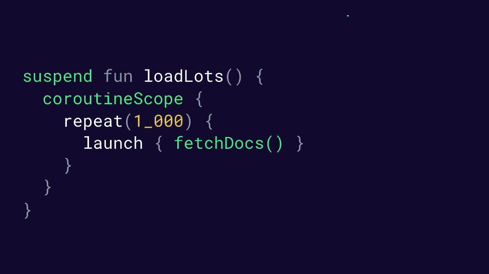

# Android 上的协同程序(第二部分):入门

> 原文：<https://medium.com/androiddevelopers/coroutines-on-android-part-ii-getting-started-3bff117176dd?source=collection_archive---------0----------------------->


Illustration by [Virginia Poltrack](https://twitter.com/VPoltrack)

这是关于在 Android 上使用协程的系列文章的一部分。这篇文章的重点是开始工作和跟踪已经开始的工作。

## **本系列其他文章:**

[](/androiddevelopers/coroutines-on-android-part-i-getting-the-background-3e0e54d20bb) [## Android 上的协同程序(第一部分):了解背景

### 协程解决什么问题？

medium.com](/androiddevelopers/coroutines-on-android-part-i-getting-the-background-3e0e54d20bb) [](/androiddevelopers/coroutines-on-android-part-iii-real-work-2ba8a2ec2f45) [## Android 上的协同程序(第三部分):实际工作

### 了解如何使用协程来完成实际工作，比如使用数据库或发出网络请求。

medium.com](/androiddevelopers/coroutines-on-android-part-iii-real-work-2ba8a2ec2f45) 

# 跟踪协程

在第一部分中，我们探索了协程擅长解决的问题。总的来说，协程是两个常见编程问题的绝佳解决方案:

1.  **长时间运行的任务**是花费太长时间来阻塞主线程的任务。
2.  **Main-safety** 允许你确保任何挂起函数都可以从主线程调用。

为了解决这些问题，协程通过添加**挂起**和**恢复**来构建常规函数。当一个特定线程上的所有协程被挂起时，该线程可以自由地做其他工作。

然而，协程本身并不能帮助您跟踪正在进行的工作。拥有大量的协程——数百个甚至数千个——并让它们同时挂起是再好不过了。虽然协程很便宜，但它们执行的工作通常很昂贵，比如读取文件或发出网络请求。

使用代码手动跟踪一千个协程是非常困难的。您*可以*尝试跟踪所有这些任务，并手动确保它们完成或取消，但是像这样的代码是乏味且容易出错的。如果代码不完美，它会失去对协程的跟踪，这就是我所说的*工作泄漏*。

一个*工作泄漏*就像一个内存泄漏，但是更糟糕。这是一个已经丢失的协程。除了使用内存之外，工作泄漏还可以继续使用 CPU、磁盘，甚至发起网络请求。

> 泄漏的协程会浪费内存、CPU、磁盘，甚至启动不需要的网络请求。

为了帮助避免泄漏协程，Kotlin 引入了 [**结构化并发**](https://kotlinlang.org/docs/reference/coroutines/basics.html#structured-concurrency) 。结构化并发是语言特性和最佳实践的结合，遵循这些特性和实践，可以帮助您跟踪协程中运行的所有工作。

在 Android 上，我们可以使用结构化并发做三件事:

1.  取消不再需要的工作。
2.  在工作运行的同时跟踪工作。
3.  **协程失效时的信号错误**。

让我们深入其中的每一个，看看结构化并发如何帮助我们确保永远不会丢失协程和泄漏工作。

# 取消使用范围的工作

在 Kotlin 中，协程必须在一个叫做`CoroutineScope`的东西中运行。一个`CoroutineScope`跟踪你的协程，甚至是暂停的协程。与我们在第一部分中讨论的`Dispatchers`不同，它实际上并不执行你的协程——它只是确保你不会跟不上它们。

为了确保跟踪所有的协程，Kotlin 不允许您在没有`CoroutineScope`的情况下启动一个新的协程。你可以把`CoroutineScope`想象成拥有超能力的`ExecutorService`的轻量级版本。它使您能够启动新的协程，这些协程带有我们在第一部分中探讨的所有挂起和恢复的优点。

一个`CoroutineScope`跟踪你所有的协程，它可以取消所有在它里面启动的协程。这非常适合 Android 开发，在 Android 开发中，当用户离开时，您需要确保清理由屏幕启动的所有内容。

> 协程作用域跟踪你所有的协程，它可以取消在它里面启动的所有协程。

## 开始新的协程

需要注意的是，你不能从任何地方调用一个`suspend`函数。挂起和恢复机制要求您从正常函数切换到协程。

启动协程有两种方式，它们有不同的用途:

1.  [**launch**](https://kotlin.github.io/kotlinx.coroutines/kotlinx-coroutines-core/kotlinx.coroutines/launch.html)builder 将启动一个新的协程，该协程是“启动并忘记”——这意味着它不会将结果返回给调用者。
2.  [**async**](https://kotlin.github.io/kotlinx.coroutines/kotlinx-coroutines-core/kotlinx.coroutines/async.html)builder 将启动一个新的协程，它允许你用一个名为`await`的挂起函数返回一个结果。

几乎在所有情况下，如何从常规函数启动协程的正确答案是使用`launch`。由于常规函数没有办法调用`await`(记住，它不能直接调用暂停函数)，所以使用`async`作为协程的主入口没有多大意义。我们稍后将讨论何时使用`async`是有意义的。

相反，您应该使用协程作用域，通过调用`launch`来启动协程。

```
scope.launch {
    // This block starts a new coroutine 
    // "in" the scope.
    // 
    // It can call suspend functions
   fetchDocs()
}
```

您可以将`launch`看作是将您的代码从常规函数带入协程世界的桥梁。在`launch`主体内部，你可以调用暂停函数并创建主安全，就像我们在上一篇文章中提到的那样。

> 启动是从常规函数到协程的桥梁。

> 警告:*`*launch*`*和* `*async*` *的一个很大区别就是他们处理异常的方式。* `*async*` *预计你最终会调用* `*await*` *得到一个结果(或者异常)所以默认情况下不会抛出异常。这意味着如果你使用* `*async*` *来启动一个新的协程，它将会悄悄地丢弃异常。**

*因为`launch`和`async`只在`CoroutineScope`上可用，所以您知道您创建的任何协程都将被作用域跟踪。Kotlin 只是不让您创建未被跟踪的协程，这大大避免了工作泄漏。*

## *从视图模型开始*

*因此，如果一个`CoroutineScope`跟踪所有在其中启动的协程，并且`launch`创建一个新的协程，那么你应该在哪里调用`launch`并放置你的作用域呢？什么时候取消一个作用域中启动的所有协程是有意义的？*

*在 Android 上，将一个`CoroutineScope`与用户屏幕相关联通常是有意义的。这让您可以避免泄漏协程或为不再与用户相关的`Activities`或`Fragments`做额外的工作。当用户导航离开屏幕时，与屏幕关联的`CoroutineScope`可以`cancel`全部工作。*

> *结构化并发保证当一个**作用域** **取消**时，它的所有**协同程序** **取消**。*

*当将协同程序与 Android 架构组件集成时，您通常希望将`launch`协同程序放在`ViewModel`中。这是一个很自然的地方，因为大多数严肃的工作都是从这里开始的——而且您不必担心轮换会杀死所有的协程。*

*要在`ViewModel`中使用协程，可以使用来自`lifecycle-viewmodel-ktx:2.1.0-alpha04`的`viewModelScope` [扩展属性](https://kotlinlang.org/docs/tutorials/kotlin-for-py/extension-functionsproperties.html)。`viewModelScope`即将在 [AndroidX 生命周期(v2.1.0)](https://developer.android.com/jetpack/androidx/releases/lifecycle) 中发布，目前处于 alpha 阶段。你可以在 [@manuelvicnt](http://manuelvicnt) 的[博客文章](/androiddevelopers/easy-coroutines-in-android-viewmodelscope-25bffb605471)中了解更多关于它是如何工作的。由于该库目前处于 alpha 版本，可能会有一些错误，API 可能会在最终版本发布前发生变化。如果发现任何 bug，你可以在这里把它们[归档。](https://issuetracker.google.com/issues?q=componentid:413132)*

*看一下这个例子:*

```
*class MyViewModel(): ViewModel() {
    fun userNeedsDocs() {
        // Start a new coroutine in a ViewModel
        viewModelScope.launch {
            fetchDocs()
        }
    }
}*
```

*当`viewModelScope`被清除时(当`onCleared()`回调被调用时),它将自动取消任何由此`ViewModel`启动的协程。这通常是正确的行为——如果我们没有获取文档，而用户关闭了应用程序，我们可能只是在浪费他们的电池来完成请求。*

*为了更加安全，一个`CoroutineScope`会自我传播。因此，如果您启动的一个协程继续启动另一个协程，它们将在相同的作用域中结束。这意味着，即使您所依赖的库从您的`viewModelScope`启动了一个协程，您也有办法取消它们！*

> *警告:*协程被* [*协同取消*](https://kotlinlang.org/docs/reference/coroutines/cancellation-and-timeouts.html#cancellation-and-timeouts) *在协程挂起时抛出* `*CancellationException*` *。捕获像* `*Throwable*` *这样的顶级异常的异常处理程序会捕获这个异常。如果您在异常处理程序中使用异常，或者从不挂起，那么协程将停留在半取消状态。**

*因此，当您需要一个协同程序运行得和一个`ViewModel`一样长时，使用`viewModelScope`从常规函数切换到协同程序。然后，因为`viewModelScope`会自动为你`cancel`协程，所以在这里写一个无限循环而不产生漏洞是完全没问题的。*

```
*fun runForever() {
    // start a new coroutine in the ViewModel
    viewModelScope.launch {
        // cancelled when the ViewModel is cleared
        while(true) {
            delay(1_000)
            // do something every second
        }
    }
}*
```

*通过使用`viewModelScope`,你能够确保所有的工作，甚至这个无限循环，在不再需要的时候被取消。*

# *跟踪工作*

*启动一个协程是好的——对于许多代码来说，这确实是您需要做的全部工作。启动一个协程，发出一个网络请求，并将结果写入数据库。*

*不过，有时候你需要更复杂一点。假设您想在一个协程中同时处理两个网络请求——要做到这一点，您需要启动更多的协程！*

*为了生成更多的协程，任何挂起函数都可以通过使用另一个名为[协程作用域](https://kotlin.github.io/kotlinx.coroutines/kotlinx-coroutines-core/kotlinx.coroutines/coroutine-scope.html)或其表亲[监督作用域](https://kotlin.github.io/kotlinx.coroutines/kotlinx-coroutines-core/kotlinx.coroutines/supervisor-scope.html)的构建器来启动更多的协程。老实说，这个 API 有点令人困惑。`coroutineScope` builder 和`CoroutineScope`是不同的东西，尽管它们的名字只有一个字符不同。*

*到处启动新的协程是造成潜在工作泄漏的一种方式。调用者可能不知道新的协同程序，如果不知道，它如何跟踪工作呢？*

*为了解决这个问题，结构化并发可以帮助我们。也就是说，它保证当一个`suspend`函数返回时，它的所有工作都完成了。*

> *结构化并发保证当挂起函数返回时，它的所有工作都已完成。*

*这里有一个使用`coroutineScope`获取两个文档的例子:*

```
*suspend fun fetchTwoDocs() {
    coroutineScope {
        launch { fetchDoc(1) }
        async { fetchDoc(2) }
    }
}*
```

*在这个例子中，从网络上同时获取两个文档。第一个是在一个以`launch`开始的协程中获取的，它是“启动并忘记”——这意味着它不会将结果返回给调用者。*

*用`async`获取第二个文档，因此该文档可以返回给调用者。这个例子有点奇怪，因为通常你会对两个文档都使用`async`——但是我想展示你可以根据需要混合搭配`launch`和`async`。*

> *协程作用域和超级作用域让您可以从挂起函数中安全地启动协程。*

*但是请注意，这段代码从来不会显式地等待任何一个新的协程！看起来`fetchTwoDocs`会在协程运行时返回！*

*为了实现结构化并发并避免工作泄漏，我们希望确保当像`fetchTwoDocs`这样的挂起函数返回时，它的所有工作都已完成。这意味着它启动的两个协程必须在`fetchTwoDocs`返回之前完成。*

*科特林用`coroutineScope`生成器确保工作不会从`fetchTwoDocs`泄露。`coroutineScope`构建器将挂起自己，直到它内部启动的所有协程都完成。因此，在`coroutineScope`构建器中启动的所有协程完成之前，无法从`fetchTwoDocs`返回。*

## *很多很多的工作*

*既然我们已经探索了跟踪一个和两个协程，那么是时候全力以赴，尝试跟踪一千个协程了！*

*看看下面的动画:*

**

*Animation showing how a coroutineScope can keep track of one thousand coroutines.*

**这个例子显示了同时发出一千个网络请求。在真正的 Android 代码中不建议这样做——你的应用程序会使用大量资源。**

*在这段代码中，我们在一个`coroutineScope`构建器中启动了一千个带有`launch`的协同程序。你可以看到东西是如何连接起来的。因为我们在一个`suspend`函数中，某处的一些代码一定使用了一个`CoroutineScope`来创建一个协程。我们对那个`CoroutineScope`一无所知，它可能是一个`viewModelScope`或在其他地方定义的其他`CoroutineScope`。无论调用范围是什么，`coroutineScope`构建器都会将其作为它所创建的新范围的父范围。*

*然后，在`coroutineScope`块中，`launch`将在新的作用域中启动协程。当由 launch 启动的协程完成时，新的作用域将跟踪它们。最后，一旦在`coroutineScope`中启动的所有协程都完成了，`loadLots`就可以自由返回。*

**注意:*作用域和协程之间的父子关系是使用`[Job](https://kotlin.github.io/kotlinx.coroutines/kotlinx-coroutines-core/kotlinx.coroutines/-job/)`对象创建的。但是您经常可以想到协程和作用域之间的关系，而不必深入到那个层次。*

> *协同作用域和监督作用域将等待子协同作用域完成。*

*这里面发生了很多事情——但重要的是，使用`coroutineScope`或`supervisorScope`你可以`launch`一个协程安全地避开任何挂起函数。即使它将启动一个新的协同程序，您也不会意外地泄漏工作，因为您将总是挂起调用者，直到新的协同程序完成。*

*真正酷的是`coroutineScope`将创建一个子范围。因此，如果父作用域被取消，它将把取消传递给所有新的协程。如果调用者是`viewModelScope`，当用户离开屏幕时，所有 1000 个协程将被自动取消。相当整洁！*

*在我们继续讨论错误之前，有必要花点时间讨论一下`supervisorScope`和`coroutineScope`。主要区别在于，无论何时任何一个子节点失败，a `coroutineScope`都会`cancel`。因此，如果一个网络请求失败，所有其他请求都会立即取消。相反，如果您想在一个请求失败时继续其他请求，您可以使用`supervisorScope`。一个`supervisorScope`不会在一个孩子失败的时候取消其他孩子。*

# *协程失败时发出错误信号*

*在协程中，错误是通过抛出异常来发出信号的，就像常规函数一样。resume 会将来自`suspend`函数的异常重新抛出给调用者。就像常规函数一样，您并不局限于使用 try/catch 来处理错误，如果您愿意，您可以构建抽象来用其他样式执行错误处理。*

*然而，在协程中也有错误丢失的情况。*

```
*val unrelatedScope = MainScope()// example of a lost error
suspend fun lostError() {
    // async without structured concurrency
    unrelatedScope.async {
        throw InAsyncNoOneCanHearYou("except")
    }
}*
```

*注意这段代码声明了一个不相关的协程作用域，该作用域将启动一个没有结构化并发的新协程。还记得我在开始时说过，结构化并发是类型和编程实践的结合，在挂起函数中引入不相关的协程范围并不符合结构化并发的编程实践。*

*该错误在这段代码中丢失了，因为`async`假设您最终将调用`await`，在那里它将再次抛出异常。但是，如果你从来没有调用过`await`，这个异常将会被永久保存，耐心等待被引发。*

> *结构化并发保证当协程出错时，它的调用者或作用域会得到通知。*

*如果您对上述代码使用结构化并发，错误将被正确地抛出给调用者。*

```
*suspend fun foundError() {
    coroutineScope {
        async { 
            throw StructuredConcurrencyWill("throw")
        }
    }
}*
```

*由于`coroutineScope`将等待所有子进程完成，所以当它们失败时，它也可以得到通知。如果由`coroutineScope`启动的协程抛出异常，`coroutineScope`可以将它抛出给调用者。由于我们使用的是`coroutineScope`而不是`supervisorScope`，当异常抛出时，它也会立即取消所有其他的子进程。*

# *使用结构化并发*

*在这篇文章中，我介绍了结构化并发，并展示了它如何使我们的代码与 Android `ViewModel`很好地匹配，以避免工作泄漏。*

*我还谈到了它如何使挂起函数更容易推理。既要确保它们在返回之前完成工作，又要确保它们通过显示异常来发出错误信号。*

*如果我们使用非结构化并发，协程很容易意外泄漏调用者不知道的工作。这项工作是不可取消的，也不能保证会再次抛出异常。这将使我们的代码更加令人惊讶，并可能产生难以理解的错误。*

*您*可以通过引入一个新的不相关的`CoroutineScope`(注意大写的`C`)或者通过使用一个名为`GlobalScope`的全局作用域*来创建非结构化并发，但是您应该只在极少数情况下考虑非结构化并发，当您需要协同程序比调用作用域存在更长时间的时候。然后自己添加结构是一个好主意，这样可以确保跟踪非结构化的协程，处理错误，并有一个好的取消故事。*

*如果您有非结构化并发的经验，那么结构化并发确实需要一些时间来适应。这种结构和保证使得与`suspend`功能的交互更加安全和容易。尽可能地使用结构化并发是一个好主意，因为它有助于使代码更容易阅读，也不那么令人惊讶。*

*在这篇文章的开始，我列出了结构化并发为我们解决的三件事情*

1.  ***取消不再需要的工作**。*
2.  ***在工作运行时跟踪工作。***
3.  ***协程失效时的信号错误**。*

*为了实现这种结构化并发，我们对代码有了一些保证。以下是结构化并发的保证。*

1.  *当一个**范围** **取消**时，其所有**协程** **取消**。*
2.  *当一个**挂起 fun** **返回**时，其所有**工作完成**。*
3.  *当一个**协程** **出错**时，其**调用者或作用域被通知**。*

*总之，结构化并发的保证使我们的代码更安全，更容易推理，并允许我们避免泄漏工作！*

# *下一步是什么？*

*在这篇文章中，我们探讨了如何在视图模型中启动 Android 上的协同程序，以及如何使用结构化并发来使我们的代码不那么令人惊讶。*

*在下一篇文章中，我们将更多地讨论如何在实际情况中使用协程！读一读:*

*[](/androiddevelopers/coroutines-on-android-part-iii-real-work-2ba8a2ec2f45) [## Android 上的协同程序(第三部分):实际工作

### 了解如何使用协程来完成实际工作，比如使用数据库或发出网络请求。

medium.com](/androiddevelopers/coroutines-on-android-part-iii-real-work-2ba8a2ec2f45)*