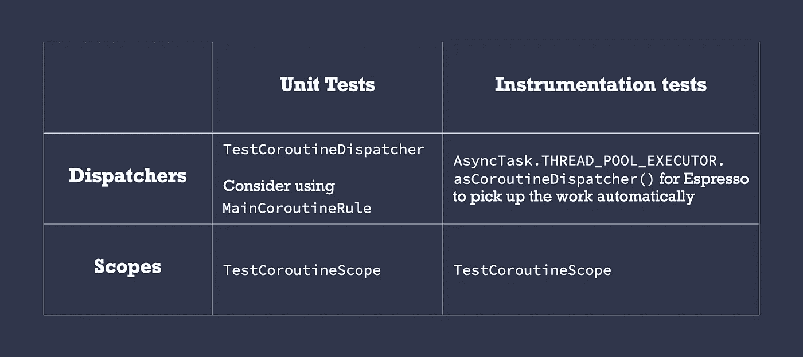

# 不应该取消的工作的协程和模式

> 原文：<https://medium.com/androiddevelopers/coroutines-patterns-for-work-that-shouldnt-be-cancelled-e26c40f142ad?source=collection_archive---------0----------------------->


Illustration by [Virginia Poltrack](https://twitter.com/VPoltrack)

## 协同程序中的取消和异常(第四部分)

在[协程系列](/androiddevelopers/cancellation-in-coroutines-aa6b90163629)的*取消和异常的第 2 部分中，我们学习了取消不再需要的工作的重要性。在 Android 上，你可以使用 Jetpack 提供的`CoroutineScope`:`[viewModelScope](https://developer.android.com/reference/kotlin/androidx/lifecycle/package-summary#(androidx.lifecycle.ViewModel).viewModelScope:kotlinx.coroutines.CoroutineScope)`或`[lifecycleScope](https://developer.android.com/reference/kotlin/androidx/lifecycle/package-summary#lifecyclescope)`，当它们的作用域完成时，也就是当`Activity/Fragment/Lifecycle`完成时，取消任何正在运行的工作。如果你正在创造你自己的`CoroutineScope`，确保你把它绑在一个`Job`上，需要的时候叫取消。*

但是，有些情况下，即使用户离开了屏幕，您也希望操作能够完成。因此，您*不希望*工作被取消(例如，写入数据库或向您的服务器发出某个网络请求)。

请继续阅读，寻找实现这一目标的模式！

# 协同程序还是工作管理器？

只要您的应用程序进程还活着，协程就会一直运行。如果你需要运行比进程持续时间更长的操作(例如，发送日志到你的远程服务器)，在 Android 上使用[工作管理器](https://developer.android.com/topic/libraries/architecture/workmanager)。WorkManager 是用于预期在未来某个时间点执行的关键操作的库。

对当前流程中有效的操作使用协程，如果用户终止应用程序，则可以取消这些操作(例如，发出您想要缓存的网络请求)。触发这些行动的模式是什么？

# 协程最佳实践

因为这种模式建立在其他协程最佳实践的基础上；让我们回顾一下:

## **1。将调度程序注入到类中**

当创建新的协程或调用`withContext`时，不要硬编码它们。

✅ *的好处*:易于测试，因为你可以很容易地更换它们进行单元测试和仪器测试。

## **2。ViewModel/Presenter 层应该创建协程**

如果是只针对 UI 的操作，那么 UI 层可以做到。如果您认为这在您的项目中是不可能的，很可能您没有遵循最佳实践#1(即，测试不注入`Dispatchers`的虚拟机更加困难；在这种情况下，公开挂起函数是可行的)。

✅ *好处*:ui 层应该是哑的，不直接触发任何业务逻辑。相反，将这一职责委托给视图模型/演示者层。测试 UI 层需要在 Android 中进行测试，这需要一个仿真器来运行。

## **3。ViewModel/Presenter 层下面的层应该公开挂起函数和流**

如果你需要创建协程，使用`[coroutineScope](https://kotlin.github.io/kotlinx.coroutines/kotlinx-coroutines-core/kotlinx.coroutines/coroutine-scope.html)`或者`[supervisorScope](https://kotlin.github.io/kotlinx.coroutines/kotlinx-coroutines-core/kotlinx.coroutines/supervisor-scope.html)`。如果您需要它们遵循不同的范围，这就是本文的内容！继续读！

✅ *好处*:调用者(通常是 ViewModel 层)可以控制这些层中工作的执行和生命周期，在需要的时候可以取消。

# 协程中不应该取消的操作

假设我们的应用程序中有一个视图模型和一个存储库，逻辑如下:

```
class MyViewModel(private val repo: Repository) : ViewModel() {
  fun callRepo() {
    viewModelScope.launch {
      repo.doWork()
    }
  }
}class Repository(private val ioDispatcher: CoroutineDispatcher) {
  suspend fun doWork() {
    withContext(ioDispatcher) {
      doSomeOtherWork()
 **veryImportantOperation() // This shouldn’t be cancelled**
    }
  }
}
```

我们不希望`veryImportantOperation()`被`viewModelScope`控制，因为它随时可能被取消。我们希望这次行动能持续到`viewModelScope`。我们如何实现这一目标？

为此，**在应用程序类中创建您自己的作用域，并调用由它启动的协程中的那些操作**。该范围应该被注入到需要它的类中。

与我们稍后将看到的其他解决方案(如`GlobalScope`)相比，创建您自己的`CoroutineScope`的好处是您可以根据自己的意愿进行配置。需要一个`[CoroutineExceptionHandler](https://kotlin.github.io/kotlinx.coroutines/kotlinx-coroutines-core/kotlinx.coroutines/-coroutine-exception-handler/)`吗？你有自己的线程池作为`Dispatcher`使用吗？将所有常见配置放在它的`CoroutineContext`中！

您可以将其命名为`applicationScope`，并且它必须包含一个`SupervisorJob()`，这样协同程序中的故障就不会在层次结构中传播(如系列文章的[第 3 部分所示):](/androiddevelopers/exceptions-in-coroutines-ce8da1ec060c)

```
class MyApplication : Application() {
  // No need to cancel this scope as it'll be torn down with the process
 **val applicationScope = CoroutineScope(SupervisorJob() + otherConfig)** }
```

我们不需要取消这个作用域，因为只要应用程序进程还活着，我们就希望它保持活动状态，所以我们不持有对`SupervisorJob`的引用。我们可以使用这个作用域来运行需要比调用作用域更长生命周期的协程。

> 对于不应该取消的操作，从应用程序协同作用域创建的协同程序中调用它们

**每当您创建一个新的存储库实例时，传入我们在上面**创建的 applicationScope。对于测试，查看下面的*测试*部分。

## 使用哪个协程生成器？

根据`veryImportantOperation`的行为，您需要使用 launch 或 async 来启动一个新的协程:

*   如果它需要返回结果，使用`**async**`并调用`**await**`等待它完成。
*   如果没有，使用`**launch**`并等待它以`**join**`结束。请注意，正如系列文章的[第 3 部分所解释的，您必须在启动块内部手动处理异常。](/androiddevelopers/exceptions-in-coroutines-ce8da1ec060c)

这就是使用`launch`触发协程的方式:

```
class Repository(
  private val externalScope: CoroutineScope,
  private val ioDispatcher: CoroutineDispatcher
) {
  suspend fun doWork() {
    withContext(ioDispatcher) {
      doSomeOtherWork()
 **externalScope.launch {**        // if this can throw an exception, wrap inside try/catch
        // or rely on a CoroutineExceptionHandler installed
        // in the externalScope's CoroutineScope
        veryImportantOperation()
 **}.join()**    }
  }
}
```

或者使用`async`:

```
class Repository(
  private val externalScope: CoroutineScope,
  private val ioDispatcher: CoroutineDispatcher
) {
  suspend fun doWork(): Any { // Use a specific type in Result
    withContext(ioDispatcher) {
      doSomeOtherWork()
 **return externalScope.async {**
        // Exceptions are exposed when calling await, they will be
        // propagated in the coroutine that called doWork. Watch
        // out! They will be ignored if the calling context cancels.
        veryImportantOperation()
 **}.await()**
    }
  }
}
```

在任何情况下，ViewModel 代码都不会改变，如上所述，即使`viewModelScope`被破坏，使用`externalScope`的工作也会继续运行。此外，`doWork()`不会返回，直到`veryImportantOperation()`像任何其他暂停调用一样完成。

## 简单点的怎么样？

另一个可以服务于某些用例的模式(可能是任何人都会想到的第一个解决方案)是在`externalScope`的上下文中使用`withContext`包装`veryImportantOperation`，如下所示:

```
class Repository(
  private val externalScope: CoroutineScope,
  private val ioDispatcher: CoroutineDispatcher
) {
  suspend fun doWork() {
    withContext(ioDispatcher) {
      doSomeOtherWork()
 **withContext(externalScope.coroutineContext)** {
        veryImportantOperation()
      }
    }
  }
}
```

但是，这种方法有一些需要注意的地方:

*   如果调用`doWork`的协程在`veryImportantOperation`正在执行时被取消，它将一直执行到下一个取消点，而不是在`veryImportantOperation`执行完之后。
*   `CoroutineExceptionHandler`在`withContext`中使用上下文时，不会像你预期的那样工作，因为异常会被再次抛出。

# 测试

由于我们需要注射`Dispatcher`和`CoroutineScope`两种药物，在这些情况下你应该注射什么？



What to inject in testing

🔖*图例* : `[TestCoroutineDispatcher](https://kotlin.github.io/kotlinx.coroutines/kotlinx-coroutines-test/kotlinx.coroutines.test/-test-coroutine-dispatcher/index.html)`，`[MainCoroutineRule](https://github.com/android/plaid/blob/master/test_shared/src/main/java/io/plaidapp/test/shared/MainCoroutineRule.kt)`，`[TestCoroutineScope](https://kotlin.github.io/kotlinx.coroutines/kotlinx-coroutines-test/kotlinx.coroutines.test/-test-coroutine-scope/)`，`[AsyncTask.THREAD_POOL_EXECUTOR.asCoroutineDispatcher()](https://github.com/google/iosched/blob/adssched/mobile/src/androidTest/java/com/google/samples/apps/iosched/tests/di/TestCoroutinesModule.kt#L36)`

# 可供选择的事物

还有其他方法可以用协程实现这种行为。然而，这些解决方案不能系统地应用于所有用例。让我们看看一些替代方案，以及为什么/什么时候应该/不应该使用它们。

## ❌全球镜

有多种原因让你不应该使用`[GlobalScope](https://kotlin.github.io/kotlinx.coroutines/kotlinx-coroutines-core/kotlinx.coroutines/-global-scope/)`:

*   **提升硬编码值**。如果你直接使用`GlobalScope`，硬编码`Dispatchers`可能会很有诱惑力。那是一种不好的做法！
*   这使得测试变得非常困难。由于您的代码将在不受控制的范围内执行，您将无法管理由它启动的工作的执行。
*   你不能像我们对`applicationScope`所做的那样，在作用域中为所有协程建立一个公共的协程上下文。相反，你必须向所有由`GlobalScope`启动的协程传递一个公共的`CoroutineContext`。

**建议:不要直接用。**

## Android 中的❌进程生命周期所有者范围

在安卓系统中，`androidx.lifecycle:lifecycle-process`库中有一个`applicationScope`，可以通过`ProcessLifecycleOwner.get().lifecycleScope`访问。

在这种情况下，你应该注入一个`LifecycleOwner`而不是我们之前做的`CoroutineScope`。在生产中，你可以通过`ProcessLifecycleOwner.get()`和单元测试，你可以使用`LifecycleRegistry`创建一个假的`LifecycleOwner`。

注意，这个作用域的默认`CoroutineContext`使用了`Dispatchers.Main.immediate`，这对于后台工作来说可能并不理想。与`GlobalScope`一样，您必须将一个公共的`CoroutineContext`传递给所有由`GlobalScope`启动的协程。

由于上述原因，这种替代方法比仅仅在`Application`类中创建一个`CoroutineScope`需要更多的工作。此外，我个人不喜欢在 ViewModel/Presenter 下面的层中包含与 Android 生命周期相关的类，因为这些层应该是平台不可知的。

**建议:不要直接用**。

## ⚠️免责声明

如果你的`applicationScope`的`CoroutineContext`与`GlobalScope`或`ProcessLifecycleOwner.get().lifecycleScope`的相匹配，你*可以直接将它们赋值如下:*

```
class MyApplication : Application() {
  **val applicationScope = GlobalScope**
}
```

您仍然可以获得上述所有的*好处*，并且如果将来需要，您可以很容易地更改它。

## ❌ ✅使用不可取消

如系列文章的[第 2 部分所示，您可以使用`withContext(NonCancellable)`来调用被取消的协程中的挂起函数。我们建议用它来清理可以挂起的代码。但是，你不应该滥用它。](/androiddevelopers/cancellation-in-coroutines-aa6b90163629)

这样做是非常危险的，因为您会失去对协程执行的控制。的确，它产生了更简洁、更易读的代码，但这在未来可能导致的问题是不可预测的。

其用法示例:

```
class Repository(
  private val ioDispatcher: CoroutineDispatcher
) {
  suspend fun doWork() {
    withContext(ioDispatcher) {
      doSomeOtherWork()
 **     withContext(NonCancellable)** {
        veryImportantOperation()
      }
    }
  }
}
```

虽然这很有诱惑力，但你可能并不总是知道`veryImportantOperation()`背后是什么:也许是一个外部库，也许是一个接口背后的实现，……会发生什么问题？

*   你不能在测试中停止这些操作。
*   使用`delay`的无限循环将无法取消。
*   在它内部收集一个`Flow`使得流从外部不可取消。
*   …

这些问题会导致细微的、非常难以调试的错误。

**建议:仅将它用于挂起清理代码。**

每当您需要在当前作用域之外运行一些工作时，我们建议在您的`Application`类中创建一个自定义作用域，并在其中运行协程。避免使用`GlobalScope`、`ProcessLifecycleOwner`示波器和`NonCancellable`进行此类工作。