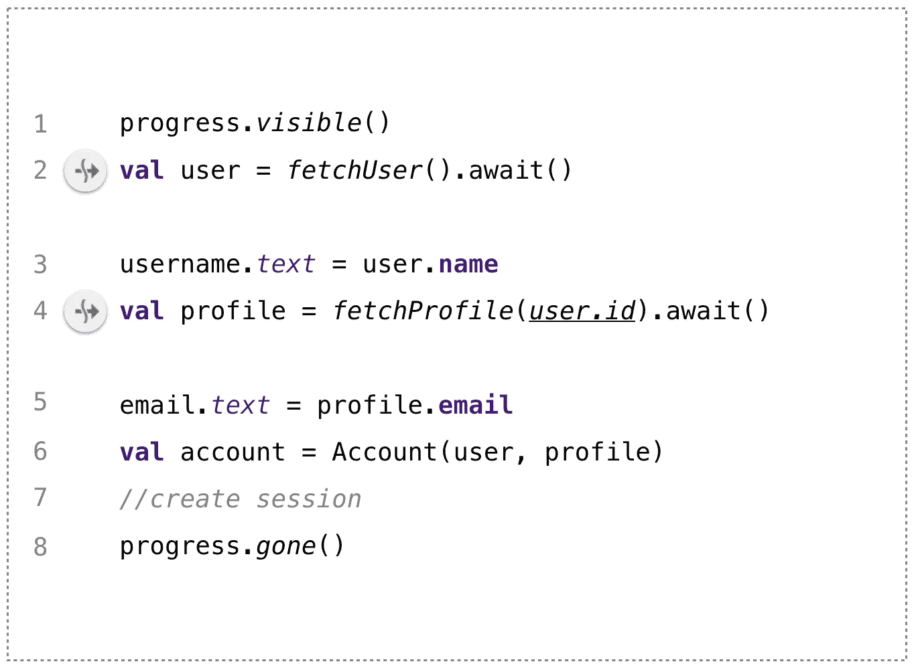
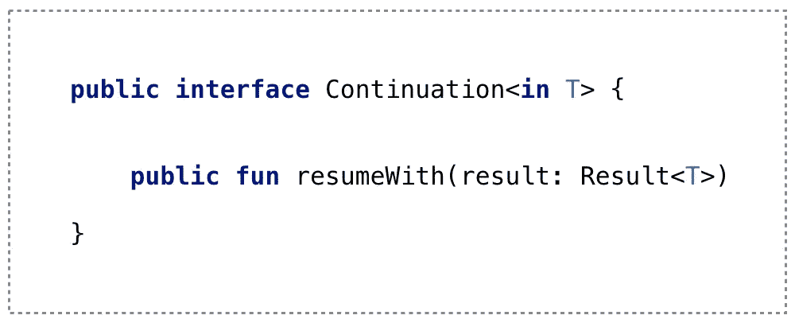

# 协程:挂起状态机

> 原文：<https://medium.com/google-developer-experts/coroutines-suspending-state-machines-36b189f8aa60?source=collection_archive---------0----------------------->

Photo by [Dewang Gupta](https://unsplash.com/@dewang?utm_source=unsplash&utm_medium=referral&utm_content=creditCopyText) on [Unsplash](https://unsplash.com/@dewang?utm_source=unsplash&utm_medium=referral&utm_content=creditCopyText)

协程使我们的异步代码看起来是顺序的。协程帮助我们逃离回调地狱。协程将我们从复杂的反应链中拯救出来。

一切都很好，但是你有没有想过在幕后发生了什么样的魔法？一段特定的代码实际上是如何在幕后异步执行操作的，同时又给我们一种一切都在按顺序进行的感觉？是魔法吗？(当然是，但在其他一些平行宇宙中)对我们[麻瓜](https://en.wikipedia.org/wiki/Muggle)来说，都是围绕着状态机，悬挂点，延续传球。

如果这是你第一次听到所有这些术语，那么不要担心，这篇文章将帮助你理解它们。我们会谈到**暂停点，CPS(延续传球方式)，状态机**。如果您已经知道这些术语，那么我希望您仍然喜欢阅读本文中提到的代码示例和各种概念。

我们将首先看一个使用协程实现的小代码片段。然后，我们将尝试识别代码片段中的暂停点。然后，我们将看到代码如何通过使用暂停点提取各种状态来编译成状态机。最后，我们将了解一个作为状态机实现的`Continuation`是如何传递的，以实现一些神奇的东西。

## 问题陈述:

*我们需要用用户详细信息填充用户的个人资料屏幕。为此，我们需要进行两次 API 调用。我们首先调用的 API 是* `*fetchUser()*` *，在我们得到* `*User*` *之后，我们再调用另一个 API 来获取用户* `*Profile*` *。使用我们所拥有的信息，我们继续填充 UI，最后，我们从* `*user*` *和* `*profile*` *创建一个* `*Account*` *对象来持久化。*

让我们看看 API 调用的伪代码:

Snippet 1: Fetching User and Profile using async coroutine builders

我们在上面的代码片段中使用`[async](https://kotlinlang.org/docs/reference/coroutines/composing-suspending-functions.html#concurrent-using-async)`协程构建器从 API 中获取`User`和`Profile`。`async`协程构建器返回一个`Deferred<T>`协程，这样我们就可以调用它的`.await()`以在稍后得到结果。

在我们的例子中，`fetchUser()`函数返回协程的一个`Deferred<User>`对象，该对象从 API 获取`User`。然后我们可以在`Deferred`协程上调用`await()`来获得`User`结果。

类似地，`fetchProfile(userId)`函数返回一个`Deferred<Profile>`，稍后我们可以调用`await()`来获取`User`的`Profile`。

接下来让我们看看将“顺序”执行上述功能的协程:

Snippet 2: fetch User and Profile using coroutines

*第 1 行*:我们首先将 loader 设置为 visible，表示我们正在获取数据。

*第 2 行:*然后我们调用，`fetchUser()`，它返回一个`Deferred<User>`，我们也立即对它调用`.await()`。`**await()**`是一个`suspend`函数，因此，我们在 IDE 的左边看到一个暂停函数指示器，如代码片段 2 的第 2 行所示。我们的协程将在此时暂停，直到返回`User`。

因此，这是我们代码中的第一个**暂停点**，在异步协程完成并返回结果(即`User`)后，协程的执行可以在这里暂停，然后恢复。

当我们的`user`从网络中被获取时，让我们谈论一些术语。

## 暂停点和 CPS(连续传球方式)

每个`suspend`函数都被编译器转换成一个`Continuation` 对象。在上面的例子中，`.await()`暂停函数在编译时会被转换成带一个`Continuation`对象，即`.await(continuation)`。所以，我们保存所有的状态(比如局部变量等等。)并将其传递给`.await(continuation)`暂停函数。类似地，所有其他挂起函数和块也被转换为接受一个`Continuation`对象。

All suspend functions are compiled to take Continuation implementation

`[**Continuation**](https://kotlinlang.org/api/latest/jvm/stdlib/kotlin.coroutines/-continuation/)`，顾名思义，封装了当前状态以及关于如何从特定暂停点继续的信息。

代码中的一个**暂停点**就像一个检查点，在这里当前状态(像局部变量等。)可以被保存(在一个`Continuation`中)以便稍后从我们停止的地方继续。特定暂停点之后的所有内容(暂停点之后的代码行)也保存在`Continuation`对象中，并传递给编译后的`suspend`函数以供以后执行。使用`delay`、`yield`、`suspendCancellableCoroutine`等暂停功能创建暂停点。

因此，所有的挂起函数在转换时都会得到一个作为参数传递给它们的`Continuation`对象，以便稍后恢复执行。这就是所谓的 **CPS(延续传球方式)**。这种模式类似于传递回调并在工作完成时得到通知。不同之处在于，有了协程，这些“回调”(确切地说是延续)由编译器为我们处理，我们获得了顺序代码执行的外观和感觉。

现在让我们从最后一个暂停点继续我们的代码片段😉，即第 2 行:

Snippet 2: fetch User and Profile using coroutines

*第 2 行:*现在，当从 API 中获取`User`时，执行在我们的第一个暂停点之后立即恢复

第 3 行:然后我们可以在 UI 上设置`user.name`。

*第 4 行:*接下来，我们有`user.id`可以用来从 API 中获取用户的`Profile`。因此，我们呼叫`fetchProfile(user.id)`，然后立即再次呼叫`.await()`。由于`.await()`暂停功能，这是我们到达第二个暂停点的时候。执行在这一点再次暂停，稍后当从 API 获取`Profile`时继续。

*第 5 行到第 8 行:*一旦用户配置文件可用并从`.await()`函数返回，我们就可以在 UI 上设置所需的信息，并创建一个`Account`对象来持久化会话，最后，一旦完成，我们就隐藏我们的`progress`指示器。

## 暂停指向状态

现在我们已经确定了代码中的两个暂停点，让我们看看这些暂停点是如何使用标签转换成不同状态的。

Snippet 3: Identifying states for the state machine

高于并包括一个暂停点的所有东西都被编译器转换成一个状态。在下一个暂停点或暂停函数结束之前，暂停点以下的所有内容都会转换为另一种状态。

因此，在上面的代码片段 3 中，我们将有三种状态，即

*   **L0** :直到第一个暂停点
*   **L1** :直到第二个悬挂点
*   **L2:** 直到结束

## 生成状态机

现在，使用这三个状态作为标签，生成了一个`[Continuation](https://kotlinlang.org/api/latest/jvm/stdlib/kotlin.coroutines/-continuation/)`状态机，它可以从任何状态恢复执行。下面是`Continuation`界面的样子:

Continuation interface

现在，让我们看看编译器生成的`Continuation`状态机实现的伪代码:

Snippet 4: Continuation state-machine implementation pseudo-code

每个状态被生成为一个标签，当继续执行时，执行可以`goto`一个特定的标签。生成的`Continuation`状态机实现包含一个保存当前状态的字段，即`label,`，所有中间数据，即不同状态之间共享的局部变量，如`v1: User`、`v2: Profile`也存储为字段。

## 状态机的执行

***状态 L0:*** 当协程启动后，`resumeWith()`被`label = 0`调用，我们进入 **L0** 状态如下图所示:

State Machine Diagram for fetching User Profile

然后我们做一些工作，比如显示一个进度指示器，并在调用`.await()`之前将`label`设置为`1`，这将挂起协程。当一个协同程序被挂起时，`.await()`函数在此时返回名为`COROUTINE_SUSPENDED.`的结果，我们将这个状态机传递给`.await(continuation)`函数，以便能够稍后从我们停止的地方恢复状态，并且协同程序进入`SUSPENDED`状态。

***状态 L1:*** 一旦从 API 中获取了`User`，我们将在我们保存的`continuation`对象上调用`continuation.resumeWith(user), label=1`，并直接进入状态 **L1。**此时，我们已经获取了`User`，我们可以用它来填充 UI 等。然后，我们将`label`设置为`2`并暂停`profile.await(continuation)`上的执行，同时等待用户配置文件并再次传入`continuation`对象以便稍后恢复控制。

***状态 L2:*** 最后，当`Profile`被取出时，我们再次调用保存的`continuation`上的`continuation.resumeWith(profile), label=2`并到达状态 **L2。**至此，我们已经把`user`和`profile`都拿来了。然后我们可以使用`user`和`profile,`创建一个`Account`对象，设置 UI 上获取的数据，隐藏加载器，持久化会话，跳一会儿舞，等等。最后将`label`置为`-1`，表示协程结束。

因此，我们已经看到了暂停点如何帮助确定状态机的各种状态。这个状态机允许我们从不同的暂停点恢复执行。

代码在我们看来是连续的，在幕后，它利用状态机在需要时在不同的暂停点暂停和恢复执行。

## 单悬挂点

前面的例子在协程中有多个暂停点。如果一个暂停函数仅在末尾，即尾部位置调用另一个暂停函数，在暂停函数仅包含单个暂停点并且也在尾部位置的这种简单情况下，则不需要生成状态机，因为只涉及单个状态。这样的挂起函数被编译成只接受一个`Continuation`参数来挂起和恢复执行。

这就把我们带到了本文的结尾。请注意，了解这些实施细节并不是强制性的。但我相信它肯定有助于创建一个更好的各种问题的心理模型，并更好地利用手头的工具。

## 延伸阅读:

[悬浮修改器——引擎盖下](/androiddevelopers/the-suspend-modifier-under-the-hood-b7ce46af624f)Manuel Vivo 著

[Kotlin coroutines 提案文档](https://github.com/Kotlin/KEEP/blob/master/proposals/coroutines.md#implementation-details):我发现这个官方文档有助于理解很多概念。

特别感谢 [Manuel Vivo](https://medium.com/u/3b5622dd813c?source=post_page-----36b189f8aa60--------------------------------) 的点评:)

如果你学到了什么，请留下一些掌声，并与你的朋友分享。如果您发现了改进，请留下评论，这样我们可以一起学习:)