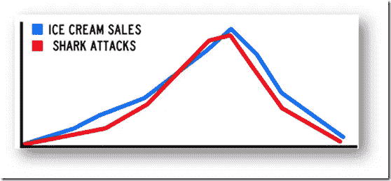
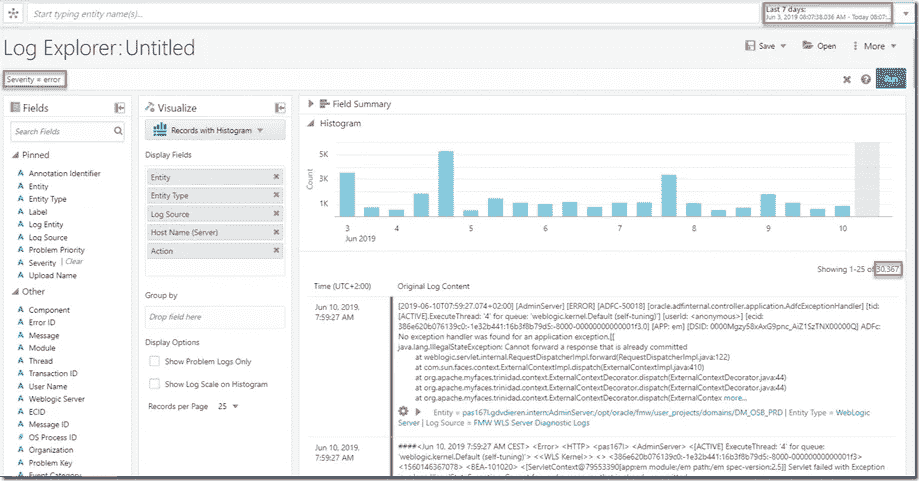
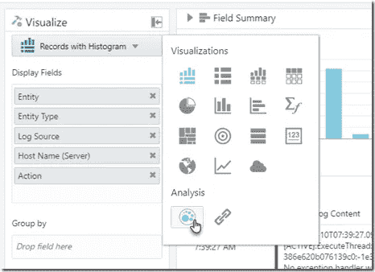
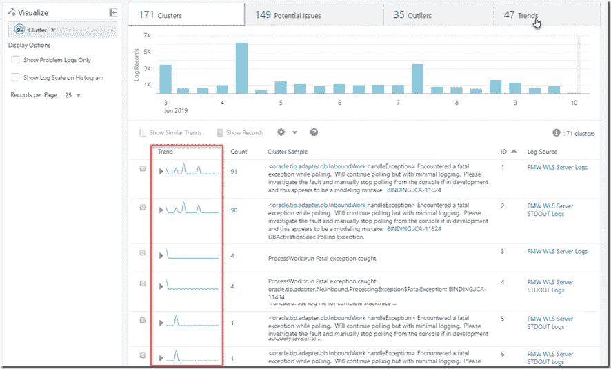
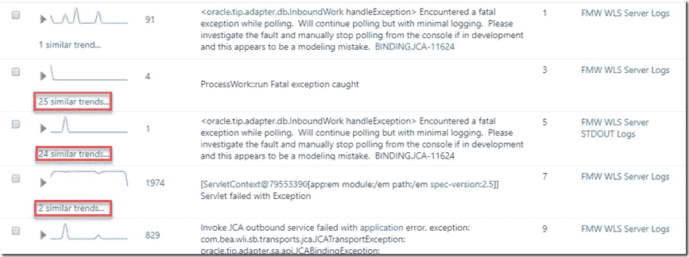
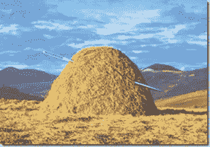

# 相关性要求考虑共同原因

> 原文：<https://medium.com/oracledevs/correlation-calls-for-common-cause-consideration-5fa70e7343ae?source=collection_archive---------0----------------------->

相关性是一个强大的东西。当两个指标以相似的方式上升和下降时，这肯定不是巧合。它必须以某种方式有意义。

在我们看来，相关性很容易变成因果关系。我们的大脑天生就是这样思考的:在我们观察到的事物中寻找故事。因此，一种度量标准所代表的现象很容易被认为是另一种度量标准所衡量的现象的影响因素。这反过来会导致草率和错误的结论。

然而，相关性是一个强大的东西。巧合的模式通常不仅仅是巧合。有一个解释。一个常见的现象:一个支配性的现象，它影响了度量所代表的两个方面。共同的事业。有时这个共同的原因是显而易见的。这种相关性并没有带来新的见解。有时候并不是。相关性虽然不代表因果关系，但有助于我们更接近根本原因，并理解我们正在观察的行为。这可能导致预测和影响。

这种相关性的概念可以帮助我们找到共同的，也许是根本的原因，这是我最近在日志文件分析方面的一次经历。使用具有两种强大功能的工具。让我展示一下是什么激发了我的灵感。

# 日志文件分析—聚类和常见趋势检测

这里，我正在查看所有收集的日志文件中一周的错误消息:

超过三万条信息。分析这些感觉就像打扫奥革阿斯的马厩。人力不可行。出现的所有不同问题是什么？它们是什么时候发生的？它们为什么会发生？错误的发生率是否有某种模式可以帮助理解原因？

这个工具提供了一个很好的选项:聚集当前选择的日志记录:

这意味着检查日志消息的模式:所有指示磁盘已满、HTTP 调用失败或超时异常的消息都是相似的。磁盘名称、特定端点、JDBC 数据源和 SQL 语句会有所不同，但所有与类似问题相关的消息的总体消息模式是相同的。通过基于它们的共同模式对日志条目进行聚类，我们可以非常快速地掌握我们正在处理的错误类型。

在这种情况下，我们从 30K 日志条目增加到 171 个集群或 171 个常见错误模式。这是一个更容易理解和解决的数字。尤其是当我们知道有些是罕见的，有些是相当频繁的。

当你看这个图的时候，红色的矩形突出了一个叫做*趋势*的小图。它是一段时间内消息模式出现的表示。它显示了过去七天中该模式出现的时间和频率。你会觉得我看到了另一种模式的出现。前两个消息簇似乎具有相同的发生率:相同的频率和相同的时间分布。这同样适用于两个第三和第四集群，第五和第六似乎也是重合的。

我正在使用的这个日志分析工具提供了另一个强大的特性:它为我们做了一致性或相关性的分析。当我切换到*趋势*标签时，我得到了下一个概览:

寻找共同原因——或者也许是直接因果关系——的工作正在进行。从 171 个聚类中，我们发现了 47 个趋势。或者 47 组具有高相关性的消息。例如，此处显示的第二个模式有 25 个相似的趋势，展开后代表 26 个消息模式中的 420 个错误消息，几乎完全一致。我还不知道是一种模式代表了根本原因，而 25 种模式是根本原因的结果，还是它们都有一个共同的根本原因，我必须通过观察这 26 种信息模式和它们所代表的现象来找出这个共同的根本原因。但我知道我正在看一组我能理解的数据。我没有一个大的干草堆，而是有多个小得多的干草堆——也没有那么难以捉摸的针。

注意:我用于日志文件分析的工具是 Oracle 管理云日志分析。

# 共同趋势检测

自从我在我的袖珍计算器上发现了确定一组(x，y)坐标的相关系数的功能，我就对相关有一个弱点。

得到一些结构的想法，也许是第一个暗示，以及事情是如何联系在一起的，对我很有吸引力。

日志分析中的聚类和趋势分析功能重新点燃了人们的兴趣。我突然热衷于查看时间序列数据和空间或地理数据中的其他相关性。我能在不同的地理区域找到相似的现象吗？在不同的地方有相似的变化。

这里有一篇关于比较地图和数据分布的鼓舞人心的文章——事实证明这与图像比较非常相似:[http://www . innovation vegis . com/basis/map analysis/topic 10/topic 10 . htm # Compare _ maps](http://www.innovativegis.com/basis/mapanalysis/Topic10/Topic10.htm#Compare_maps)

例如参见:Python PySAL 库中的空间相关性([https://py sal . readthedocs . io/en/v 1 . 12 . 0/users/tutorials/auto Correlation . html #](https://pysal.readthedocs.io/en/v1.12.0/users/tutorials/autocorrelation.html))和 R 模块 R . niche . similarity—[https://SVN . OS geo . org/grass/grass-addons/grass 6/raster/R . niche . similarity/R . niche . html](https://svn.osgeo.org/grass/grass-addons/grass6/raster/r.niche.similarity/r.niche.similarity.html)

关于时间序列数据中的序列相关性(又名自相关):[https://www . quant start . com/articles/Serial-Correlation-in-Time-Series-Analysis](https://www.quantstart.com/articles/Serial-Correlation-in-Time-Series-Analysis)。

我想了解一些问题:

*推特分析——仅基于一周和一月中的推文时间和日期*

*   我能确定 Twitter 账户的时区吗？
*   我可以确定推特账户的国家吗(基于国家法定假日，推特活动与全国性事件的巧合)
*   我能在 Twitter 上发现机器人吗(从发布推文的机械模式——频率、重复模式、一天中的所有时间)(见这篇文章[关于发现 Twitter 机器人](https://www.symantec.com/blogs/election-security/spot-twitter-bot))
*   我可以按国家对 150 个 Twitter 账户进行分组吗？
*   我能找到具有高度相似推特行为的推特账户吗(这可能是一个机器人的迹象，或者只是一个复制猫转发者)

*我能在更大的数据集集合中找到具有相似时间趋势的数据集吗？(类似于日志(聚类)趋势功能)*

*   我能找到具有相似时间趋势*和*的数据集吗？它们以相似的方式上升和下降，但有一定的滞后(一秒、两小时、三天)
*   我能从这些房间的温度读数中找到朝东、朝南和朝西窗户的房间吗？

我希望就这些问题再写些文章。

*原载于 2019 年 6 月 10 日*[*https://technology . amis . nl*](https://technology.amis.nl/2019/06/10/correlation-calls-for-common-cause-consideration/)*。*