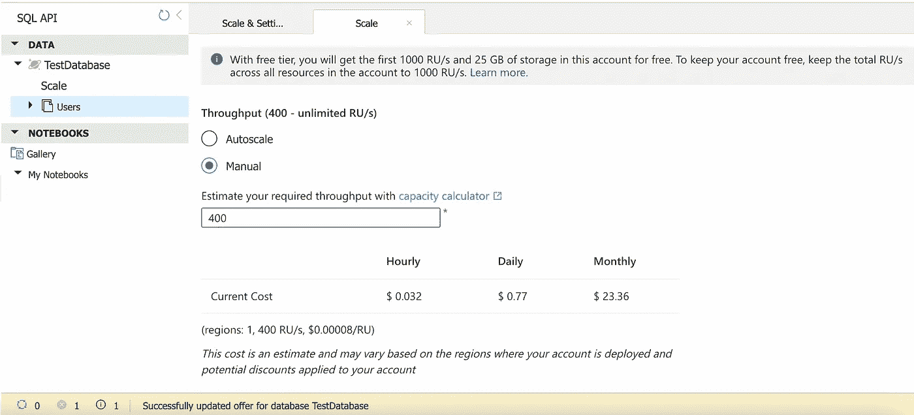

# 在 Cosmos DB 中保持低成本

> 原文：<https://medium.com/version-1/cosmos-db-keeping-your-costs-low-d69b5fc91a09?source=collection_archive---------1----------------------->

当我在[版本 1](https://www.version1.com/) 与同事和同事讨论并提到我正在使用 Cosmos DB ( [微软 Azure](https://www.version1.com/about-us/our-technology-partnerships/microsoft/) )的项目时，通常我被问的第一个问题是关于成本，所以我认为写一篇简短的博客解释 Cosmos DB 的定价方式可能会有用。

Cosmos DB 提供了许多工具，让您根据自己的需求控制和限制成本，使其成为一个非常划算的解决方案。下面我将介绍不同的定价方案，并根据我的经验提供一些最佳方案的建议。在我们查看 Cosmos DB 中可用的不同选项之前，我将简要解释请求单位(RUs ),因为定价选项都是基于 RUs 的。

## **请求单位(RUs)**

请求单元是一种性能货币，它抽象出执行 Azure Cosmos DB 支持的数据库操作所需的系统资源，如 CPU、IOPS 和内存

[https://docs . Microsoft . com/en-us/azure/cosmos-db/request-units](https://docs.microsoft.com/en-us/azure/cosmos-db/request-units)

Cosmos DB 中每个数据库操作的成本都用 RUs 表示。理解这一点很重要，因为 Cosmos DB 的定价模型是围绕 RUs 构建的。Cosmos DB 要求您为您使用的 ru 付费，要么预先提供，要么只为您使用的 ru 付费。如果您的请求超过了供应的 ru，您要么会受到性能影响，要么会增加成本。

因此，如果你保持你的查询和数据小，你使用的逻辑单元的数量将会减少。您也可以手动设置索引等。努力减少每次操作中使用的 ru。在上面的链接中有更多关于请求单位的信息，我会写一些在未来保持你的 RUs 低的技巧。

# **无服务器还是调配吞吐量？**

当您设置一个新的 Cosmos DB 数据库时，您必须在无服务器或预配吞吐量模式之间进行选择。在使用 CosmosDB 时，根据您的需求选择最佳选项是保持低成本的关键。

注意:一旦创建了资源，就不能在无服务器和调配的吞吐量容量选项之间切换。

## **调配的吞吐量**

当您选择调配的吞吐量模式时，您将决定需要的最大 RU/s，并预先进行调配。您可以随时更改最大值，系统会根据您在该小时内配置的最大 RU 按小时计费。

例如，如果您将最大 RUs 设置为 10，000，然后在同一小时内降至 5，000，您将在第一个小时被收取 10，000 的费用，然后继续每小时收取 5，000 RUs 的费用，直到您再次更改。

注意:您可以选择在每个容器上提供吞吐量，或者在数据库中的所有容器之间共享吞吐量。无论如何，下面描述的选项都是一样的，虽然如果在容器级别进行配置，您的成本可能会更高，但是在性能方面您将有更大的灵活性。

一旦创建了调配的吞吐量 Cosmos DB 资源，就有两个选项来管理可用的 RUs —手动或自动扩展。您可以随时在这两者之间切换。

*   **手动**

因此，在这个例子中，我将这个数据库的吞吐量设置为 400，并得到了这个月的估计成本。无论数据库收到多少请求，这都是我在月底要支付的费用。我可以根据自己的意愿随时更改，如上所述，您将为每小时使用的最高调配值付费。这里所做的任何更改都会立即生效。

注意:如果您开始使用比您可用的更多的 ru，您将得到一个 429 错误作为您的响应。根据您的使用情况，只需等待一会儿并重试就可以解决这个问题。随着数据库负载的减少，您最终会得到一个成功的响应。您也可以手动将吞吐量提高到您需要的水平。如果您的流量在一天或一周内波动很大，那么自动缩放选项可能更合适。

*   **自动缩放**

正如您在上面看到的，有一个自动缩放选项，这允许您设置最大吞吐量，Cosmos DB 将根据需要自动缩放，但永远不会超过您选择的最大值。在写入时，此处允许的最小值为 4000RU/s。这意味着它会在安静时一直向下扩展到 400 RU/s，但在负载增加时，会根据需要向上扩展到最大值 4000 RU/s。

**注意:**最小 RU/s 值开始为 400RU/s，但是随着数据库中数据量的增长，允许的最小值开始以 100 RU/s 为单位增长。因此，如果数据增长到足够大，您的成本可能会随着最小值从 400 RU/s 变为 500RU/s 而增加，以此类推。

如果这是一个问题，您可能需要限制保存在 Cosmos DB 中的数据，也许删除或存档不再需要的旧数据。这适用于手动和自动缩放选项。

自动缩放显然是更灵活的选择，但是如果您需要的吞吐量较低，它也可能比手动缩放更昂贵。幸运的是，您可以随时在自动缩放和手动选项之间进行切换，因此您可以尝试这种方式来找到最适合您需求的方式。

**无服务器**

这是 Cosmos DB 的最新选项，也可能是最便宜的选项，尽管有一些限制。

如果您选择无服务器模式，您只需为您使用的 ru 付费。因此，在您的流量非常小且时断时续的情况下，这可能会比上述提供的吞吐量选项便宜得多，另一个好处是，无服务器可以上下扩展以处理任何增加的负载，因此您无需担心手动配置最大 RUs 和自动扩展设置等。

需要注意一些限制。

*   您的账单金额不太容易预测，因此您需要监控使用情况，并可能设置警报等。在 Azure Monitor 中，如果 RU 消耗高于您预期的范围，它会通知您。
*   无服务器容器的每个容器的数据和索引大小限制为 50Gb。
*   最大 RU/s 是 5000，所以如果您的使用超过了这个值，您的性能将会受到影响。
*   只能在单个区域运行。

注意:无服务器只是最近才添加的，所以如果将来对上述限制的更改被添加进来，我不会感到惊讶。

**总结**

如上所述，Cosmos DB 有 3 个主要的定价选项

*   **无服务器—** 对于大多数用例来说，这是最便宜的选择。您只需为您所使用的 ru 付费，但是价格是不可预测的，并且在存储空间和性能方面有很大的限制。
*   **标准供应吞吐量** —您选择可用 ru 的最大值，即使未使用该吞吐量，您也会按小时付费。计费是可预测的，您可以随时增加或减少供应的 ru。
*   **auto scale Provisioned Throughput**—非常类似于标准的 Provisioned Throughput 选项，但此选项允许您设置最大 RU 值，当数据库处于安静状态时，它会自动缩小到该最大值的 10%，并根据需要扩大。

感谢您阅读这篇文章。

如果您有任何反馈或问题，请随时添加评论，我会尽快回复您。

**关于作者**

Craig O Connor 目前是版本 1 的技术/团队负责人。