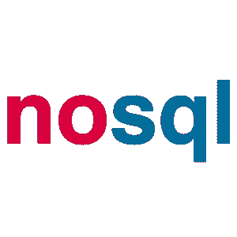
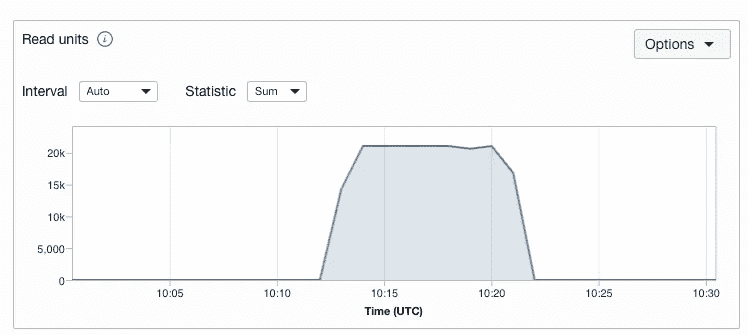
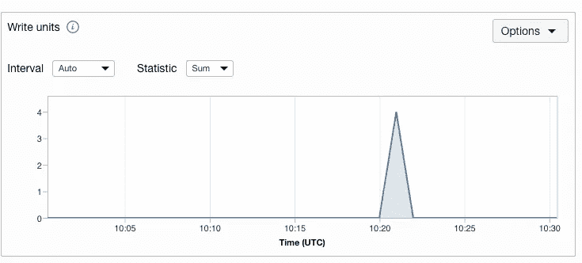

# Oracle 云基础设施上的 NoSQL 成本优化(OCI)

> 原文：<https://medium.com/oracledevs/cost-optimization-with-no-sql-on-oracle-cloud-infrastructure-oci-8136303235fd?source=collection_archive---------9----------------------->

**如何优化 Oracle NoSQL 云数据表的成本？**

NoSQL 用于存储 JSON 文档、列和键值数据库模型，通过数据复制提供可预测的个位数毫秒级响应时间，从而实现高可用性。

让我们来看一个估计成本的用例，以及降低成本的进一步措施。

**用例**:一个客户想要跟踪一个组织拥有的租赁列表的价格卡。

SOL:连接到每个租户，并将其存储在 Oracle Cloud 中的一个非 sql 表(oci_client_reatecard)中。如果需要，我们可以进一步加工。

# **样本成本计算:**

NoSQL 计费成本是根据存储大小以及读写分配来计算的。

|表名|读取次数。|写入次数|数据库大小|开销|
| OCI _ client _ reate card | 1000 | 1000。| 10gb |～132.46 美元|

该费用可能有所不同，请查看费用估算器— [链接](https://www.oracle.com/in/cloud/costestimator.html)了解最新价格。

根据使用案例，这个过程需要大约 10 分钟来完成 OKE 中的日常 CRON 作业的要求。

在一天的 24 小时内，作业执行期间需要计算能力。它不需要在空闲状态下进行任何读写操作。

通过实施最佳实践，可以进一步降低成本。

手动无法在流程开始前分配，也无法在流程结束后减少。Oracle NoSQL SDK 支持使用 API 设置读写。

# **最佳实践后**

|表名|读取次数。|写入次数|数据库大小|开销|
| OCI _ client _ reate card | 1000 | 1000。| 10gb |～2.07 美元|

总体成本降低了 **98%。**

样本执行:

# **读取单元**

# **写单位**

# **流程**

开始->增加读写->处理作业->减少读写->停止

**第一步:**填写 config.py 中的值—链接此处:[https://docs . Oracle . com/en-us/iaas/Content/API/Concepts/SDK config . htm](https://docs.oracle.com/en-us/iaas/Content/API/Concepts/sdkconfig.htm)。

第二步:运行 main.py

从 github 下载代码:[kollachaitanyakrishna/OCI-no SQL:Oracle 云 nosql 表(github.com)的 Python 代码](https://github.com/kollachaitanyakrishna/oci-nosql)。

**参考文献**

了解更多关于 nosql 的信息:[https://www . Oracle . com/in/database/no SQL/technologies/no SQL/](https://www.oracle.com/in/database/nosql/technologies/nosql/)

尝试本地安装 NoSQL:[https://www . Oracle . com/database/technologies/no SQL-database-server-downloads . html](https://www.oracle.com/database/technologies/nosql-database-server-downloads.html)

想谈谈吗？[加入我们的公共休闲活动，享受更多](https://bit.ly/devrel_slack)！