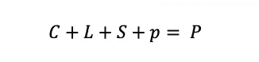
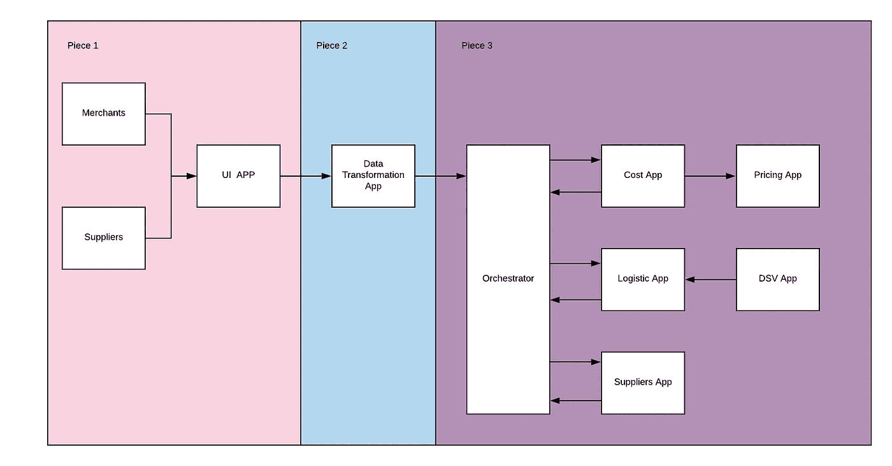
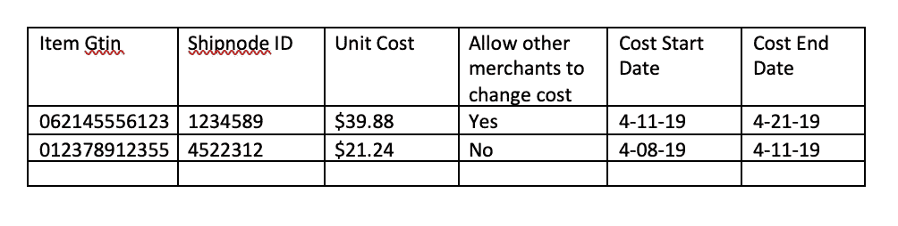
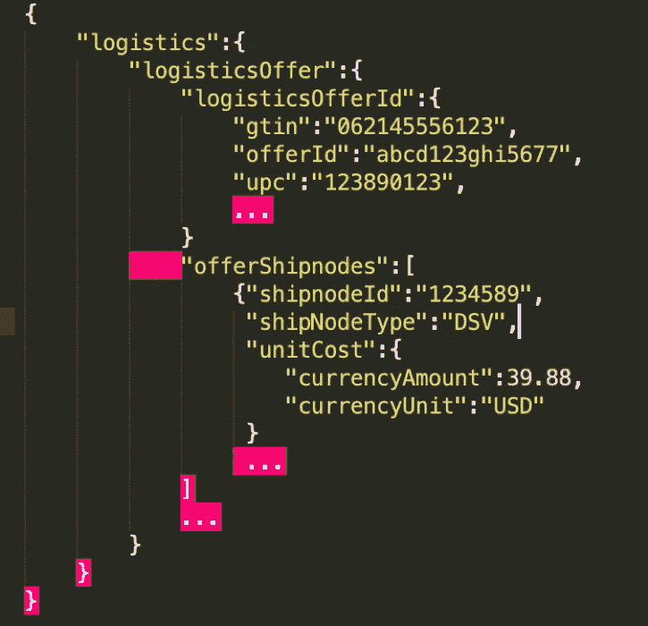

# 沃尔玛的成本协调

> 原文：<https://medium.com/walmartglobaltech/cost-orchestration-at-walmart-f34918af67c4?source=collection_archive---------3----------------------->

为了拥有一家电子商务商店，尤其是像沃尔玛这样规模的商店，你需要跟踪大量数据。沃尔玛销售的每件商品都有大量相关信息。沃尔玛拥有的关于每件商品的数据包括商品的价格、商品存放的仓库、商品是否需要冷藏。由于沃尔玛的在线商店中有超过 1.5 亿种不同的商品，管理所有这些商品的物流变成了数千名软件工程师工作的分布式数据问题。在这篇文章中，我们将讨论沃尔玛的系统来组织成本。成本是沃尔玛从分销商那里购买每件商品需要支付的费用。商品的价格是该商品的成本，加上运费，再加上沃尔玛每件商品的利润，如下式所示。

c 代表成本，L 代表物流成本，S 代表运费，P 代表沃尔玛每件商品的利润，P 代表沃尔玛呈现给顾客在线购买每件商品的价格。

如等式中所述，有 5 个微系统都使用成本数据:定价、商家、发货商、物流和成本。每个微系统都有一个软件团队和许多微服务来管理沃尔玛的数据。定价使用成本数据来更新项目的价格。供应商使用成本来更好地表示供应链动态。物流使用物流运输信息的成本，而商家是成本本身的创造者，因为他们将商品出售给沃尔玛。上面的等式是简化的，有更多的数据用于计算价格，每个微系统都比上面的等式记录更多的数据。

每件商品的价格总是在变化。商品成本变化的一个示例原因是商家(商品的购买地)想要改变他们的价格，因为创建该商品的成分已经改变。至关重要的是，上述每个不同的团队都拥有相同的信息。每一条与成本相关的数据都是同步的。如果其中一个团队的成本与另一个团队不同，商品的价格可能会不公平地扭曲，沃尔玛可能会损失大量利润，因为沃尔玛的工作规模巨大，销售数千甚至数百万件相同的商品。

有三个软件保持数据同步:一个是检索数据的软件，一个是组织数据的软件，一个是分发数据的软件。检索数据包括提供一个用户界面，用户或其他软件程序可以通过该界面将数据写入沃尔玛。组织数据包括将用户输入转化为沃尔玛内部系统可识别的数据。分发包括将每一段数据传送给每个需要它的微系统。

Cost Orchestration Through Walmart Systems

编排片段通过 Kafka 或 HTTP 调用发生。Kafka 是一种消息服务，其中一个团队编写一条消息，在稍后的时间，另一个团队响应，表明他们收到了该消息。每次有人回答时，都与一个特定的键相关联。而且，由于每条消息都是一组不同的信息，因此响应者不一定要在场才能听到响应。把卡夫卡想象成短信，而 HTTP 呼叫就像口头电话。

下面是软件团队之间传递的经过编辑的消息片段的例子，以及一些软件团队在将数据传递给下一个消费者之前所做的计算。每个交付和消息都由编排团队及其软件进行协调。

第一部分

商家将他们的大部分信息写在 excel 文档中，网格如下。

Gtin 是代表特定项目的数字代码。

ShipnodeID 是代表特定仓库或配送单元的数字代码。

第二部分

对于每个需要数据的团队来说，数据被分解成片段。例如，后勤团队从上面的网格中获得了下面的数据片段。

现在每个团队都有了清晰的画面和所有需要的数据。该系统可以通知其个人消费者适当的成本信息，并且可以确定每个项目的价格。

沃尔玛每天收到大约 4000 万条成本更新，每天重新计算 8000 万件商品的价格。总的来说，数据转换系统和 orchestrator 每天处理 3 亿次属性更新。

此外，要意识到这是由沃尔玛 hyperloop 团队的几名工程师组成的团队努力。我要特别感谢我的经理 Chintan Shah、我的团队成员 Pavankumar Pasala 和相应的成本资源双人组 Eddy Wang 以及 Dzmitry Verkovin。