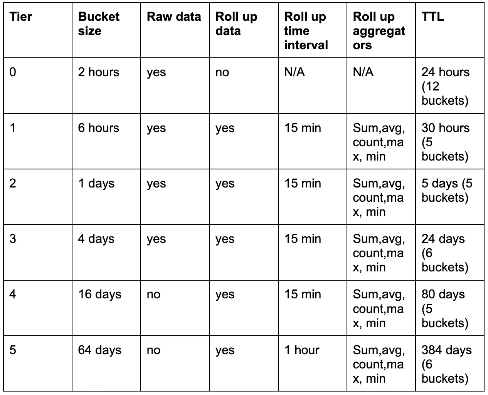
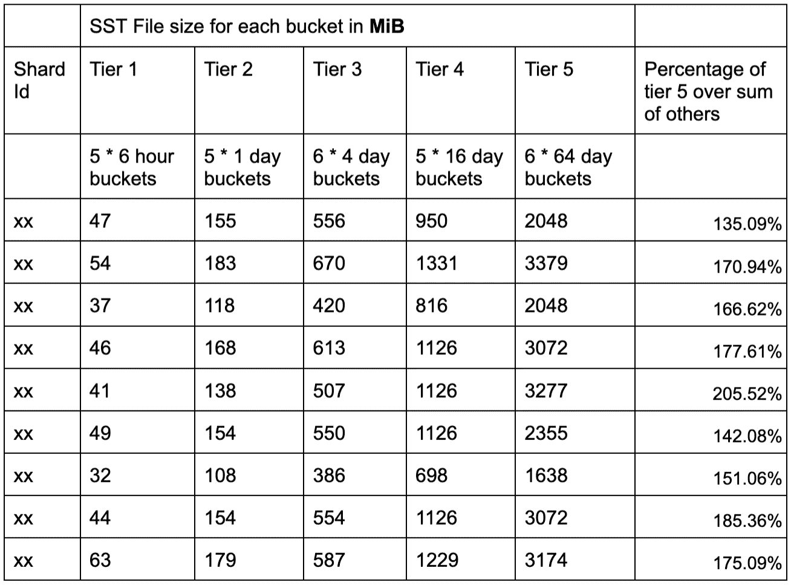
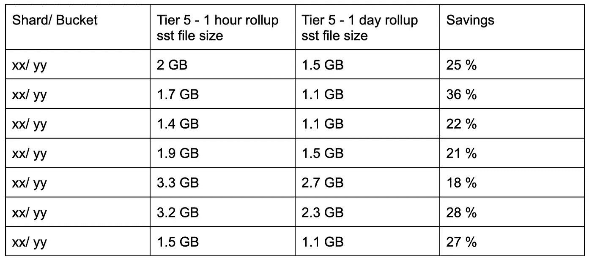
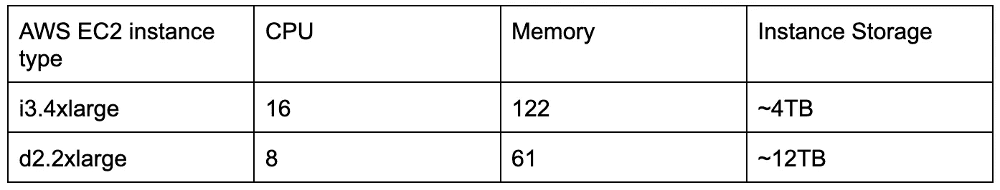

# 降低悟空的成本

> 原文：<https://medium.com/pinterest-engineering/cost-reduction-in-goku-9bf09696e99e?source=collection_archive---------3----------------------->

Monil Mukesh Sanghavi |实时分析团队软件工程师；

张睿|实时分析团队软件工程师；

姜灏|实时分析团队软件工程师；

王淼|实时分析团队软件工程师；

2018 年，我们推出了 [Goku](/pinterest-engineering/goku-building-a-scalable-and-high-performant-time-series-database-system-a8ff5758a181) ，这是一个可扩展的高性能时间序列数据库系统，用作短期指标(不到一天)的存储和查询服务引擎。2020 年初，我们推出了 [GokuL](/pinterest-engineering/gokul-extending-time-series-data-storage-to-serve-beyond-one-day-52264307364d) (Goku long term)，通过支持长期指标数据(即超过一天且长达一年的数据)扩展了 Goku 的功能。这两个都完全取代了 OpenTSDB。对于 GokuL，我们使用了 3 个 i3 . 4x 大 ssd 支持的 ec2 实例集群，随着时间的推移，我们意识到这非常昂贵。降低这一成本是我们进入 2021 年的主要目标之一。这篇博文将讲述我们实现抱负的方法。

# 背景

我们使用分层方法来隔离长期数据，并将其以存储桶的形式存储。

Table 1: table of tiered approach

第 1 层到第 5 层包含存储在 GokuL(长期)集群上的数据。GokuL 使用 RocksDB 来存储其长期数据，数据以 sst 文件的形式接收。

# 查询分析

我们分析了发往长期集群的查询，并观察到以下情况:

1.  在总共 10B 个指标中，从 GokuL 查询的数据点时间超过三个月的指标非常少(大约 6K)。
2.  一半以上的 GokuL 查询指定了一天或一天以上的汇总间隔。

# 第 5 层数据分析

我们在 GokuL 随机选择了一些碎片，并分析了数据。我们观察到第 5 层数据的内存消耗比所有其他层(1-4)的总和还要多。尽管第 5 层仅包含一小时的汇总数据，而其他层包含原始数据和 15 分钟的汇总数据。

Table 2: SST File size for each bucket in MiB

# 解决方法

从查询和第 5 层分析中可以推断，第 5 层数据(包含六个存储桶，每个存储桶包含 64 天的数据)是查询最少的，也是消耗磁盘最多的。我们计划将我们的解决方案瞄准这一层，因为它将给我们带来最大的好处。下面是讨论过的一些解决方案。

## 命名空间

名为 namespace 的功能的实现将存储 ttl、rollup interval 之类的配置，以及该 namespace 之后的一组指标的层配置。[优步的 M3](https://eng.uber.com/m3/) 也有类似的解决方案。这将有助于我们为选择集设置适当的配置(例如，为不需要更长保留时间的指标设置较低的 ttl 等)。这个项目的生产时间更长，因此我们决定将来把它作为一个单独的项目。这是一个正在积极进行的项目。

## 第 5 层数据的累计间隔调整

我们尝试将第 5 层数据的累计间隔从一小时更改为一天，并观察了第 5 层存储桶的最终 sst 文件大小的变化。

Table 3

该解决方案带来的节约不足以支持将其投入生产。

## 按需加载第 5 层数据

GokuL 集群在启动时只存储第 1 层到第 4 层的数据，并在必要时加载第 5 层存储桶(基于查询)。这种解决方案的缺点是:

*   一旦 GokuL 主机接收到 s3 中相应的第 5 层存储桶，用户就必须等待并重试查询。
*   一旦被接收，这个桶将一直留在 GokuL 中，除非被驱逐算法丢弃。

我们决定不采用这个解决方案，因为它对用户不友好。

## 分层存储

我们决定将第 5 层数据移动到一个独立的基于硬盘的集群中。虽然在查询延迟方面观察到了一些显著的差异，但是可以忽略，因为命中该层的查询数量要少得多。我们计算出，GokuL 集群中的 650 台主机中，第 5 层每台大约消耗 1 TB。我们决定使用 d2.2xlarge 实例来存储和服务 GokuL 中的第 5 层数据。

Table 4

该解决方案带来的成本节约是巨大的。我们用 111 个 d 2.2x 大型实例替换了大约 325 个 I 3.4x 大型实例，成本大幅降低。通过这一改变，我们降低了近 30–35%的成本。

为了支持这一点，我们必须在 goku 根集群中设计和实现基于层的路由，将查询路由到短期和长期叶集群。这是为我们节省大量成本的解决方案之一。

将来，我们可以评估是否可以减少副本的数量，并针对低数量的查询牺牲可用性。

## RocksDB 调整

如上所述，GokuL 使用 RocksDB 来存储长期数据。我们发现我们使用的 RocksDB 选项对于具有高容量和低 QPS 的悟空数据来说并不是最佳的。

我们尝试使用更强的压缩算法(ZSTD，级别 5)，这将磁盘使用量减少了 40%。除此之外，我们启用了分区索引过滤器，其中只有顶级索引被加载到内存中。除此之外，我们为过滤器和索引块启用了更高优先级的缓存，以便它们使用与数据块相同的缓存，同时最大限度地降低性能影响。

通过上述两项更改，我们注意到延迟差异并不大，数据空间使用量减少了大约 50%。我们立即将其投入生产，并将 GokuL 集群的规模和成本缩减了一半。

# 下一步是什么

## 命名空间

如前所述，我们正在积极实施命名空间功能，这将有助于我们进一步降低长期集群成本，方法是降低大多数不需要高保留率的当前指标的 ttl。

# 承认

非常感谢布莱恩·奥弗斯特里特、朱未和观察小组提供并支持桌面上的解决方案。

*要在 Pinterest 了解更多工程知识，请查看我们的* [*工程博客*](https://medium.com/pinterest-engineering) *，并访问我们的*[*Pinterest Labs*](https://www.pinterestlabs.com/?utm_source=medium&utm_medium=blog-article-post&utm_campaign=samghavi-et-al-december-17-2021)*网站。要查看和申请空缺职位，请访问我们的* [*职业*](https://www.pinterestcareers.com/?utm_source=medium&utm_medium=blog-article-post&utm_campaign=samghavi-et-al-december-17-2021) *页面。*