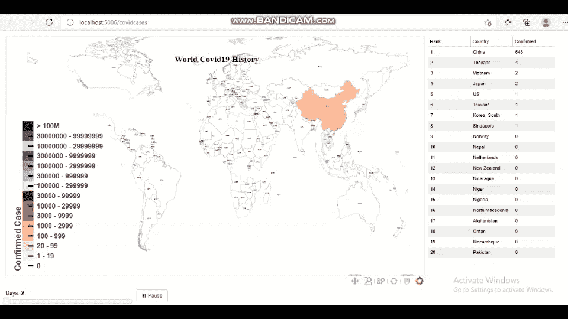
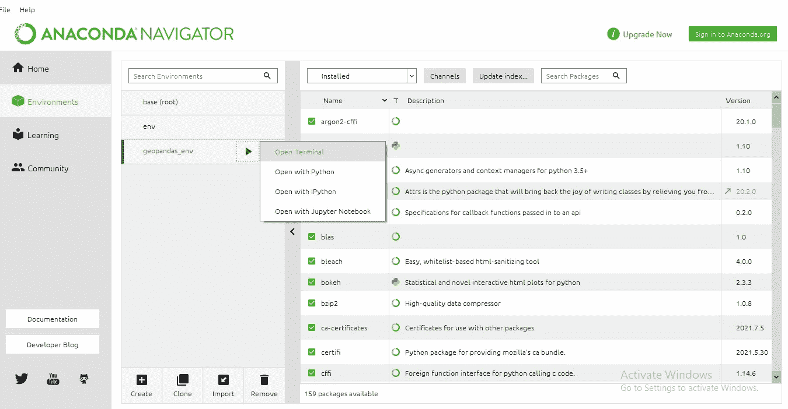

# COVID 19 Interactive Maps Visualization Menggunakan Python Bokeh

> 原文：<https://medium.easyread.co/covid-19-interactive-maps-visualization-menggunakan-python-bokeh-97e80b5701dc?source=collection_archive---------4----------------------->



source : author

Hello Guys, disini gue mau sharing project yang baru gue buat tentang pembuatan maps visualization untuk kasus Covid19 menggunakan library bokeh. Disini gue ga jelasin tentang code nya doang, tapi juga tips — tips berdasarkan problem yang gue alamin selama buat nih project.

Sebelumnya gue akan jelasin apa itu bokeh. Jadi bokeh merupakan library python yang digunakan untuk membuat interactive data visualization seperti update plot berdasarkan value dari slider atau dropdown maupun dari multiple slider dan dropdown. Intinya untuk membuat dashboard seperti tableau atau power BI gitu. Keren ga? keren ga? keren dong masa nggak. Tapi, di project kali ini gue cuma buat satu slider yang bisa update maps dan data tabel berdasarkan data harian kasus. Oke, selanjutnya akan memuat langkah — langkah pembuatan project dan yang terpenting adalah mempersiapkan niat dan mental agar tidak goyah ketika menemukan error.

# ***Install library geopandas dan bokeh***

```
#install library bokeh
pip install bokeh#install library geopandas menggunakan conda
conda install geopandas
```

Untuk menginstall library geopandas cukup rumit dan sulit karena gue sering mengalami kegagalan ketika menggunakan cara diatas. Gue ga pakai pip untuk install geopandas karena lebih rumit, perlu install beberapa library pendukungnya. Nah, kalau lu udah nyoba berbagai cara tapi belum berhasil juga, lu bisa install gepandas di env baru dan pakai env tersebut tiap kali mau menggunakan geopandas. caranya bisa lihat di [tautan](https://medium.com/analytics-vidhya/fastest-way-to-install-geopandas-in-jupyter-notebook-on-windows-8f734e11fa2b) berikut.

# ***Mempersiapkan data***

Data Covid19 gue dapet dari [kaggle](https://www.kaggle.com/gauravduttakiit/covid-19) yang isinya data kasus harian dunia dari 22 Januari 2020 sampai 30 Agustus 2021.


Dataframe covid19

Dataframe diatas akan gue tambahin dua kolom baru yaitu kolom category dan kolom day. Kolom category berfungsi sebagai color mapper pada maps berdasarkan jumlah kasus yang terkonfirmasi, sementara kolom day berfungsi sebagai value slider. Nilai pada kolom day diperoleh dari kolom Date seperti 2020–01–22 merupakan day 1, 2020–01–23 merupakan day 2 dan seterusnya (iterate unique value dari Date).


Dataframe covid19 manipulation

Untuk membuat sebuah maps, maka diperlukan koordinat geometri negara negara didunia yang membentuk kewilayahannya, biasanya berbentuk polygon dan multipolygon.


Geodataframe sf

Geodataframe diatas akan gue tambah kolom **x** dan **y** yang merupakan titik koordinat tengah yang akan digunakan sebagai peletakan label nama — nama tiap negara. Untuk mendapatkan koordinat titik tengah, gunakan fungsi centroid milik geopandas dan simpan kedalam kolom baru. Oleh karena nilai hasil tersebut berbentuk POINT(x,y), maka pisahkan titik x dan y dari point tersebut, kemudian hapus kolom point, kemudian simpan titik x dan titik y ke kolom baru dengan nama x dan y.

```
#mengambil koordinat titik tengah
sf['point']=sf['geometry'].centroid#memisahkan point dan menyimpan titik x dan y
sf['x']=sf['point'].x
sf['y']=sf['point'].y#menghapus kolom point
sf.drop(columns='point', inplace=True)
```


Geodataframe sf manipulation

Geodataframe diatas kemudian diset menjadi CRS epsg:4326 yang berfungsi untuk memberi tahu Python bagaimana koordinat tersebut berhubungan dengan tempat-tempat di Bumi.

```
#setting crs
sf.crs = {'init': 'epsg:4326'}
```

# ***Membuat fungsi***

***Pertama*** , fungsi yang digunakan untuk mengubah dataframe dan geodataframe menjadi GeoJSON agar bokeh dapat merepresentasikan feature geografinya. Fungsi ini dipanggil per kasus harian, karena jika data nya terlalu banyak untuk diconvert dapat menyebabkan error ( *Maximum Recursion Limit* ). Nah, fungsi ini diperlukan sebagai source untuk membuat maps beserta atribut atributnya.

```
def json_data(selectedDay):

    sd = selectedDay
    # Pull selected year
    df_dt = covid19[covid19['day'] == sd]

    # Merge the GeoDataframe object (sf) with the covid19 data
    merge = sf.merge(df_dt,how='left', left_on=['ADMIN'], right_on=['Country']) #remove columns
    merge.dropna(inplace=True)
    merge.drop(columns=['ADMIN'], inplace=True)

    # Bokeh uses geojson formatting, representing geographical   features, with json
    # Convert to json
    merge_json = json.loads(merge.to_json())

    # Convert to json preferred string-like object 
    json_data = json.dumps(merge_json)
    return json_data
```

*Kedua* , fungsi yang digunakan untuk mengubah dataframe menjadi ColumnDataSource sebagai source membuat tabel kasus yang terkonfirmasi untuk 20 negara tertinggi.

```
def columndata(selectedDay):
    cd = selectedDay
    # Pull selected day
    column = covid19[covid19['day'] == cd]
    column=column.sort_values(by='Confirmed', ascending=False)
    rank=[]
    for i in range(column.index.shape[0]):
        rank.append(i+1)
    column['rank']=rank
    most_country=column.head(20)
    source = dict(
        rank=[rank for rank in most_country['rank']],
        country=[country for country in most_country['Country']],
        confirmed=[confirmed for confirmed in most_country['Confirmed']]
    )
    return source
```

***Ketiga*** , fungsi yang digunakan untuk update maps dan tabel berdasarkan value slider yang diinput. Jadi fungsi ini akan memanggil 2 fungsi sebelumnya karena maps dan tabel memiliki source yang berbeda.

```
def update_plot(attr, old, new):
    day = slider.value
    new_data = json_data(day)
    geosource.geojson = new_data
    source.data = columndata(day)
```

***Keempat*** , fungsi yang digunakan untuk membuat animasi yang bisa membuat slidernya jalan sediri dari awal sampai akhir.

```
def animate_update():
    val = slider.value + 1
    if val > 588:
        val = 0
    slider.value = val

def animate():
    global callback_id
    if button.label == '► Play':
        button.label = '❚❚ Pause'
        callback_id = curdoc().add_periodic_callback(animate_update, 200)
    else:
        button.label = '► Play'
        curdoc().remove_periodic_callback(callback_id)
```

# Membuat list kategori color mapper

```
list_category=['0', '1 - 19', '20 - 99', '100 - 999', '1000 - 2999','3000 - 9999','10000 - 29999','30000 - 99999', '100000 - 299999','300000 - 999999','1000000 - 2999999', '3000000 - 9999999', '10000000 - 29999999','30000000 - 99999999','> 100M']
```

List category diatas diperlukan untuk membuat kategori mapper sehingga warna mapsnya akan berubah sesuai jumlah kasus yang terkonfirmasi. Sebenernya ga perlu tulis ulang listnya bisa, pakai fungsi unique lalu simpan ke dalam list. Tapii, nanti ga bisa urut sesuai keinginan. Kalau mau pakai cara diatas, pastikan isi list dengan isi kolom categorynya persis sama tulisannya.

# Membuat maps dan tabel

Setelah semua dipersiapkan, langkah terakhir adalah membuat plotnya yaitu maps dan tabelnya yang bisa diupdate berdasarkan slider dan dianimasikan dari awal hingga akhir. Disini kita tinggal manggil fungsi yang telah dibuat dan mendekorasi tampilannya dengan memberi warna, judul, annotation dan sebagainya yang memuat informasi yang diperlukan.

```
#source informasi untuk maps
geosource = GeoJSONDataSource(geojson = json_data(1))#source informasi untuk tabel
source = ColumnDataSource(columndata(1))#membuat list yang berisi warna 
palet=['#242424', '#5e5b5b', '#d9d9d9', '#6c3778', '#9e5aad', '#cf87e0', '#f3c2ff', 
       '#67000d', '#cb181d', '#ef3b2c', '#fc9272', '#fcbba1', '#f7dada', '#fcf2f2', '#ffffff'] 
palet = palet[::-1]#menggunakan kategorikal color mapper
color_mapper = CategoricalColorMapper(factors=list_category,  palette=palet)#menampilkan legend categorical mapper
color_bar = ColorBar(color_mapper=color_mapper, title='Confirmed Case',
                            #title=color.value.title(),
                            title_text_font_style='bold',
                            title_text_font_size='20px',
                            title_text_align='center',
                            orientation='vertical',
                            major_label_text_font_size='16px',
                            major_label_text_font_style='bold',
                            label_standoff=8,
                            major_tick_line_color='black',
                            major_tick_line_width=3,
                            major_tick_in=12,
                            location=(0,0)) # Create figure object.
r = figure(title ='',
           plot_height = 600 , plot_width = 1000,
           toolbar_location = 'below',
           tools = ['pan, wheel_zoom, box_zoom, reset'])r.title.align = 'center'
r.xaxis.visible = False
r.yaxis.visible = False
r.xgrid.grid_line_color = None
r.ygrid.grid_line_color = None# Add patch renderer to figure.
states=r.patches('xs','ys', source = geosource,
                 fill_color = {'field' :'category', 'transform' : color_mapper},
                 line_color ='gray', 
                 line_width = 0.25,
                 fill_alpha = 1)#menambahkan label nama negara ditiap geografinya
labels = LabelSet(x='x', y='y',text='ISO_A3',text_font_size='3pt',text_font_style='bold', text_align='center',
              x_offset=0, y_offset=0, source=geosource, render_mode='canvas')#membuat hover
r.add_tools(HoverTool(renderers = [states],
                      tooltips = [ ('Country','[@Country](http://twitter.com/Country)'),
                                  ('Confirmed', '[@Confirmed](http://twitter.com/Confirmed){,}'),
                               ('Recovered', '[@Recovered](http://twitter.com/Recovered){,}'),
                               ('Deaths', '[@Deaths](http://twitter.com/Deaths){,}')]))# Make a slider object: slider 
slider = Slider(title = 'Days',start = 1, end = 588, step = 1, value = 1)
slider.on_change('value', update_plot)#membuat tombol animasi
callback_id = None
button = Button(label='► Play', width=60)
button.on_click(animate)#membuat tabel
columns = [
        TableColumn(field='rank', title='Rank'),
        TableColumn(field='country', title='Country'),
        TableColumn(field='confirmed', title='Confirmed'),
    ]
tabel = DataTable(source=source, columns=columns,  width=300, height=600, index_position=None)judul = Label(x=400, y=500, x_units='screen', y_units='screen',
                 text='World Covid19 History', render_mode='css', 
                 text_font_size='15pt',text_color = "black", text_font_style="bold",text_font = "times")# Make a column layout of widgetbox(slider) and plot, and add it to the current document
r.add_layout(color_bar)
r.add_layout(labels)
r.add_layout(judul)layout = layout([
    [r],
    [slider, button],
])
curdoc().add_root(row(layout, tabel))#Display plot inline in Jupyter notebook
output_notebook()output_file("js_on_change.html")
show(layout)
```

Untuk menampilkannya, maka gunakan server bokeh karena plot tersebut menggunakan widget sehingga tidak bisa ditampilkan secara inline di jupyter notebook. Untuk menampilkannya ke server bokeh, berikut langkah — langkahnya :

1.  Simpan file ke folder yang diinginkan
2.  Buka terminal, lalu arahkan ke folder yang berisi kodingan bokeh yang telah dibuat. Jika kamu menginstal geopandas menggunakan env baru, maka gunakan terminal pada env tersebut karena geopandas terinstal pada env tersebut. Jika kamu menggunakan CMD bawaan dan belum menginstall geopandas maka akan menimbulkan error dan plot tidak akan terdisplay



source : author

3\. Lalu tulis script berikut dan tunggu hingga bokeh menampilkan plot pada browser kalian.

```
bokeh serve --show namafile.ipynb
```

Note : Ketika kalian ingin menggunakan server bokeh, jangan menginstall library di jupyter notebook seperti **!pip install pandas** dan jika mengharuskan menginstall library tersebut maka **comment** agar plot dapat terdisplay di browser.