# 利用机器学习预测新冠肺炎疫情病毒的爆发

> 原文：<https://medium.com/edureka/covid-19-outbreak-prediction-using-machine-learning-25ba5ad35897?source=collection_archive---------2----------------------->


Predicting the Outbreak of COVID-19 using Machine Learning— Edureka

第一天，没有一个你认识的人生病。感觉就是平常的一天。但是有一天，你认识的几个人生病了，突然，你看到每个人都生病了，感觉就像是突然发生的一样。一切看起来都很好，直到它不是。这就是流行病的悖论。在本文中，我们将使用机器学习来分析新冠肺炎的爆发。

以下是您今天将要学习的所有内容的大纲:

1.什么是新冠肺炎？

2.疫情是如何工作的？

3.案例研究:使用机器学习分析新冠肺炎病毒的爆发

*   问题陈述
*   第一部分:分析印度的现状
*   第二部分:趋势和意大利、武汉、韩国相似吗？
*   第 3 部分:探索世界范围的数据？
*   第 4 部分:预测全球病例总数

4.结论

# 什么是新冠肺炎？

## ***问题***

冠状病毒病(新冠肺炎)是一种由新发现的病毒引起的传染病，于 2019 年 12 月在中国武汉出现。


大多数感染新冠肺炎病毒的人会经历轻度至中度的呼吸道疾病，无需特殊治疗即可康复。老年人和患有心血管疾病、糖尿病、慢性呼吸系统疾病和癌症等潜在疾病的人更有可能患上严重疾病。

新冠肺炎病毒主要通过感染者咳嗽或打喷嚏时的唾液或鼻涕传播，所以你可能听说过要注意呼吸礼仪(例如，咳嗽时弯曲肘部)。

# 疫情是如何工作的？

为了更好地理解这一点，让我们来看一个小谜语。

显微镜下有一个载玻片，上面有一种特殊的细菌。这种细菌具有每天翻倍的特性。所以第一天有一个，第二天有两个，第三天有四个，第四天有八个，以此类推。


第 60 天，滑梯满了。那么哪一天滑梯是半满的呢？

第 59 天。但是当然，你知道的。


但是哪一天，滑梯是 1%满的？

令人惊讶的是， ***直到第五十四天才出现！***

这意味着载玻片在不到一周的时间内从 1%充满到 100%，因此显示出一种称为 ***指数增长*** 的特性。这也是疫情的工作原理。爆发在开始时是相当不明显的，然后，一旦它达到一个显著值，增长到最大值是极其迅速的。

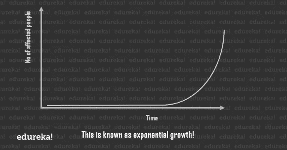

但这不可能永远持续下去。这种病毒最终会停止寻找受感染的人，并最终会减缓死亡人数。这被称为 ***逻辑增长*** 并且该曲线被称为***s 形曲线。***

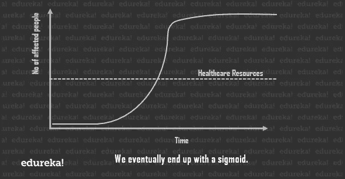

现在，曲线上的每一点都将为您提供当天的运行案例总数。但是如果你稍微研究一下 ***统计*** ，你会发现通过绘制每天的斜率，你会得到每天的新病例。在开始和结束时，新病例较少，在中间阶段急剧上升。

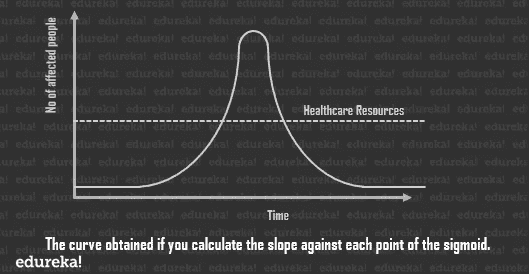

正如你所看到的，曲线的峰值可能会大大超出我们的医疗保健系统，即在任何给定的时间点，我们可用于护理受影响个人的资源数量。

由于我们无法真正帮助受疫情影响的总人数，最好的解决方案是 ***使曲线*** 变平，以便在任何给定的时间点降低病例总数，尽可能接近医疗保健线。

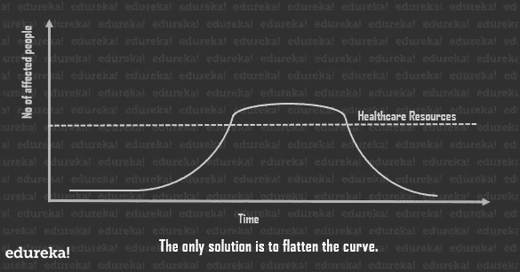

这将整个过程的持续时间延长了一点，但由于医疗保健系统可以在任何给定的时间点处理大量的病例，伤亡人数就会减少。

**解决方案**

社交距离。这里的逻辑是，如果病毒找不到可以感染的身体，它就不能感染身体！

所有受影响国家的世界领导人都宣布隔离和封锁，以确保他们的家人安全，远离可能感染他们的任何东西或任何人，所有大型社会活动都被推迟，所有主要的体育联盟也被取消。

3 月 24 日，印度总理宣布，该国将实行封锁，以防止病毒传播，直到另行通知。意大利、法国、德国、西班牙、英国和美国的感染率正在迅速上升。它对全球经济和股票市场产生了巨大影响

新冠肺炎的爆发正在发展成为一场重大的国际危机，并开始影响日常生活的重要方面。

例如:

*   **旅行:**完全封锁在民航部做出决定之前，印度不允许任何国内或国际航班。
*   杂货店:在受灾严重的地区，人们开始囤积必需品，导致必需品短缺。

# 案例研究:使用机器学习分析 COVID 19 的爆发

## 问题陈述

我们需要一个强大的模型来预测病毒如何在不同的国家和地区传播。此任务的目标是建立一个模型，预测未来 7 天内病毒的传播。

**🔴*注意:该模型建立在 2010 年 4 月更新的测试数据集上。但你可以在“约翰·霍普斯金大学冠状病毒资源中心”访问这些数据集的来源，该中心每天都会更新，所以你可以在你喜欢的日期运行这个模型。***

**要执行的任务:**

1.  印度现状分析
2.  这种趋势和意大利/韩国/武汉类似吗
3.  探索世界范围的数据
4.  利用 Prophet 预测全球新冠肺炎病例

在我们开始建模之前，让我们先导入我们需要的 ***库*** 。如果可以的话，把这看作是**的第 0 步**。

```
# importing the required libraries
import pandas as pd
# Visualisation libraries
import matplotlib.pyplot as plt
%matplotlib inline
import seaborn as sns
import plotly.express as px
import plotly.graph_objects as go
import folium
from folium import plugins
# Manipulating the default plot size
plt.rcParams['figure.figsize'] = 10, 12
# Disable warnings
import warnings
warnings.filterwarnings('ignore')
```

这里我们导入了几个重要的库，我们将在整个模型中使用它们。是一个非常快速和灵活的数据分析和操作工具，并允许您存储和操作表格数据。我们还导入了 ***matplotlib*** 、 ***seaborn、*** 和 ***plotly*** 等可视化库。

最后，我们确定默认的地块大小，并在模块中禁用警告。

# 第一部分:分析印度的现状

那么，它是如何在印度开始的呢？

第一例新冠肺炎病例于 2020 年 1 月 30 日报告，当时一名学生从中国武汉抵达印度喀拉拉邦。就在接下来的两天里，Kerela 又报告了两起病例。在将近一个月的时间里，印度没有报告新的病例，然而，在 2020 年 3 月 2 日，喀拉拉邦再次报告了五例新的冠状病毒病例，从那时起，这些病例一直在上升。

## **1.1 读取数据集**

首先，我们将通过使用 Pandas 创建一个数据框来读取数据集。

```
# Reading the datasets
df= pd.read_excel('/content/Covid cases in India.xlsx')
df_india = df.copy()
df
```

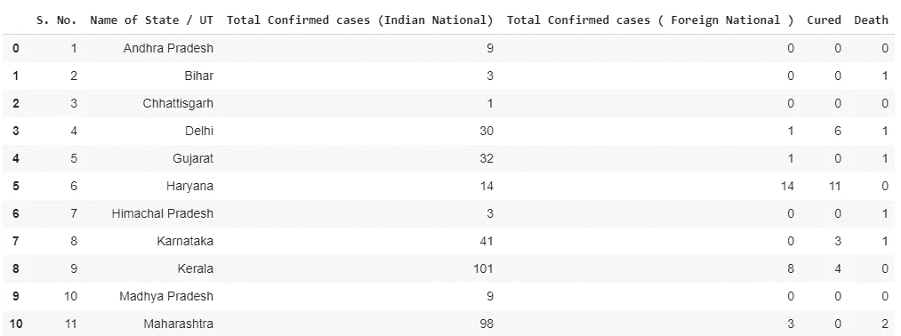

```
# Coordinates of India States and Union Territories
India_coord = pd.read_excel('/content/Indian Coordinates.xlsx')
#Day by day data of India, Korea, Italy and Wuhan
dbd_India = pd.read_excel('/content/per_day_cases.xlsx',parse_dates=True, sheet_name='India')
dbd_Italy=pd.read_excel('/content/per_day_cases.xlsx',parse_dates=True, sheet_name="Italy")
dbd_Korea=pd.read_excel('/content/per_day_cases.xlsx',parse_dates=True, sheet_name="Korea")
dbd_Wuhan=pd.read_excel('/content/per_day_cases.xlsx',parse_dates=True, sheet_name="Wuhan")df.drop(['S. No.'],axis=1,inplace=True) df['Total cases'] = df['Total Confirmed cases (Indian National)'] + df['Total Confirmed cases ( Foreign National )'] total_cases = df['Total cases'].sum() print('Total number of confirmed COVID 2019 cases across India till date (22nd March, 2020):', total_cases)
```

## 1.2 分析印度的 COVID19 病例

因此，在这里，我们将对数据框进行调整，并创建一个名为“总案例”的新属性。

此属性是确诊病例总数(印度国民+外国国民)

```
df.drop(['S. No.'],axis**=**1,inplace**=**True)df['Total cases'] **=** df['Total Confirmed cases (Indian National)'] **+** df['Total Confirmed cases ( Foreign National )']total_cases **=** df['Total cases'].sum()print('Total number of confirmed COVID 2019 cases across India till date (22nd March, 2020):', total_cases)
```

我们还将根据数据在印度的地理位置来突出显示我们的数据。

```
df.style.background_gradient(cmap='Reds')
```

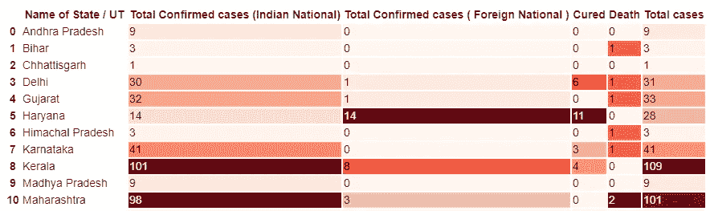

您可能已经猜到，单元格越红，值越大。因此，颜色较深的单元格表示受影响的病例数量较多，颜色较浅的单元格则相反。

## 1.3 受影响邦/中央直辖区内活跃的新冠肺炎病例数

```
#Total Active  is the Total cases - (Number of death + Cured)df['Total Active'] **=** df['Total cases'] **-** (df['Death'] **+** df['Cured'])total_active **=** df['Total Active'].sum()print('Total number of active COVID 2019 cases across India:', total_active)Tot_Cases **=** df.groupby('Name of State / UT')['Total Active'].sum().sort_values(ascending**=**False).to_frame()Tot_Cases.style.background_gradient(cmap**=**'Reds')
```

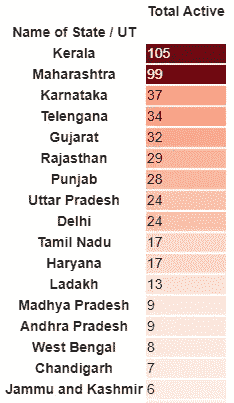

## **1.4 可视化地理分布**

接下来，我们将使用 leav 创建一个对应于不同地理位置的病例数的可缩放地图。

```
df_full **=** pd.merge(India_coord,df,on**=**'Name of State / UT')map **=** folium.Map(location**=**[20, 70], zoom_start**=**4,tiles**=**'Stamenterrain')**for** lat, lon, value, name inzip(df_full['Latitude'], df_full['Longitude'], df_full['Total cases'], df_full['Name of State / UT']):folium.CircleMarker([lat, lon], radius**=**value*****0.8, popup **=** ('<strong>State</strong>: ' **+** str(name).capitalize() **+** '''<strong>Total Cases</strong>: ' **+** str(value) **+** ''),color='red',fill_color='red',fill_opacity**=**0.3 ).add_to(map)map
```

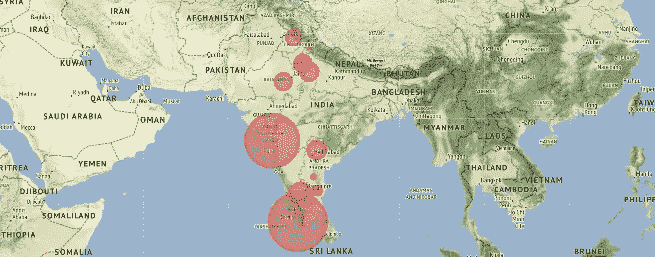

## 1.5 确认与恢复的数字

接下来，我们将使用 Seaborn 进行可视化。

```
f, ax **=** plt.subplots(figsize**=**(12, 8))data **=** df_full[['Name of State / UT','Total cases','Cured','Death']]data.sort_values('Total cases',ascending**=**False,inplace**=**True)sns.set_color_codes("pastel")sns.barplot(x**=**"Total cases", y**=**"Name of State / UT", data**=**data,label**=**"Total", color**=**"r")sns.set_color_codes("muted")sns.barplot(x**=**"Cured", y**=**"Name of State / UT", data**=**data, label**=**"Cured", color**=**"g")**# Add a legend and informative axis label**ax.legend(ncol**=**2, loc**=**"lower right", frameon**=**True)ax.set(xlim**=**(0, 35), ylabel**=**"",xlabel="Cases")sns.despine(left**=**True, bottom**=**True)
```

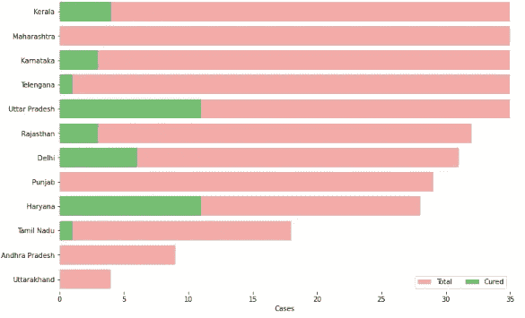

## 1.6 冠状病毒病例的增多

接下来，您将使用 Plotly 获得描绘印度冠状病毒病例上升趋势的图表。

```
#This cell's code is required when you are working with plotly on colab**import** plotlyplotly.io.renderers.default **=** 'colab'# Rise of COVID-19 cases in Indiafig **=** go.Figure()fig.add_trace(go.Scatter(x**=**dbd_India['Date'], y **=** dbd_India['Total Cases'], mode**=**'lines+markers',name**=**'Total Cases'))fig.update_layout(title_text**=**'Trend of Coronavirus Cases in India (Cumulative cases)',plot_bgcolor**=**'rgb(230, 230, 230)')fig.show()**import** plotly.express as pxfig **=** px.bar(dbd_India, x**=**"Date", y**=**"New Cases", barmode**=**'group', height**=**400)fig.update_layout(title_text**=**'Coronavirus Cases in India on daily basis',plot_bgcolor**=**'rgb(230, 230, 230)')fig.show()
```

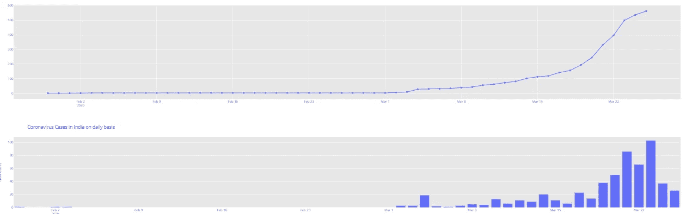

# 第二部分:趋势和意大利、武汉、韩国相似吗？

此时，印度已经跨越了 500 例。在未来几天，控制局势仍然非常重要。在许多国家达到 100 大关后，冠状病毒患者人数开始翻倍，几乎开始呈指数增长。

## 2.1 印度、意大利、韩国和武汉的累积病例

```
# import plotly.express as pxfig **=** px.bar(dbd_India, x**=**"Date", y**=**"Total Cases", color**=**'Total Cases', orientation**=**'v', height**=**600,title**=**'Confirmed Cases in India', color_discrete_sequence **=** px.colors.cyclical.IceFire)'''Colour Scale for plotly[https://plot.ly/python/builtin-colorscales/](https://plot.ly/python/builtin-colorscales/)'''fig.update_layout(plot_bgcolor**=**'rgb(230, 230, 230)')fig.show()fig **=** px.bar(dbd_Italy, x**=**"Date", y**=**"Total Cases", color**=**'Total Cases', orientation**=**'v', height**=**600,title**=**'Confirmed Cases in Italy', color_discrete_sequence **=** px.colors.cyclical.IceFire)fig.update_layout(plot_bgcolor**=**'rgb(230, 230, 230)')fig.show()fig **=** px.bar(dbd_Korea, x**=**"Date", y**=**"Total Cases", color**=**'Total Cases', orientation**=**'v', height**=**600,title**=**'Confirmed Cases in South Korea', color_discrete_sequence **=** px.colors.cyclical.IceFire)fig.update_layout(plot_bgcolor**=**'rgb(230, 230, 230)')fig.show()fig **=** px.bar(dbd_Wuhan, x**=**"Date", y**=**"Total Cases", color**=**'Total Cases', orientation**=**'v', height**=**600,title**=**'Confirmed Cases in Wuhan', color_discrete_sequence **=** px.colors.cyclical.IceFire)fig.update_layout(plot_bgcolor**=**'rgb(230, 230, 230)')fig.show()
```

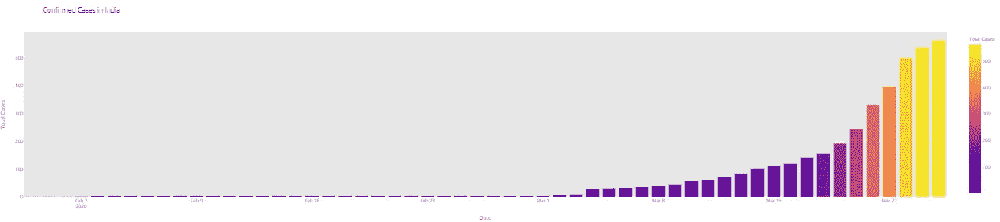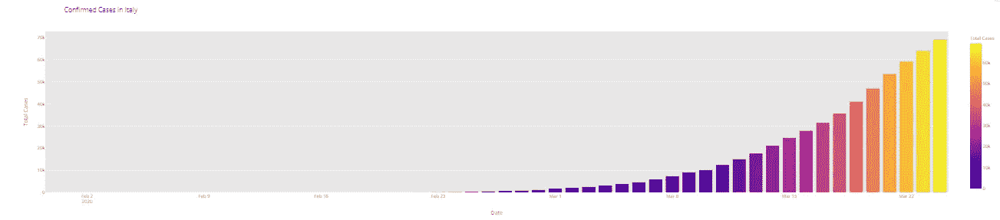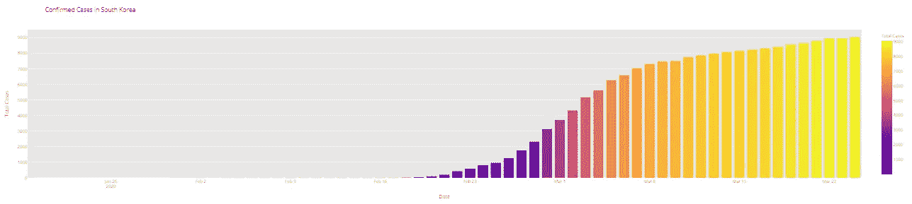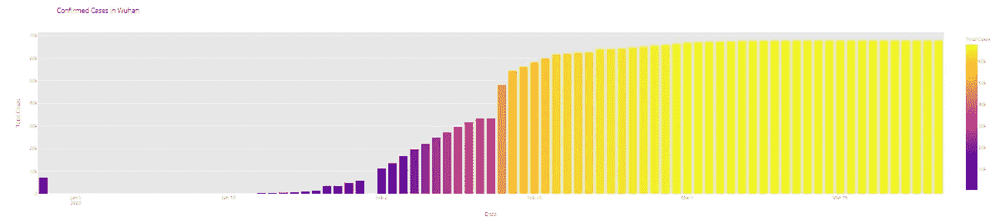

从上面的可视化中，可以推断出以下内容:

*   印度确诊病例呈指数增长，没有固定模式(印度的检测非常少)
*   意大利的确诊病例正以某种固定模式呈指数上升
*   韩国的确诊病例正在逐渐上升
*   武汉一周确诊病例几乎可以忽略不计。

## 2.2 武汉、韩国、意大利和印度病例上升的比较

```
# import plotly.graph_objects as go**from** plotly.subplots **import** make_subplotsfig **=** make_subplots(rows**=**2, cols**=**2,specs**=**[[{}, {}],[{"colspan": 2}, None]],subplot_titles**=**("S.Korea","Italy", "India","Wuhan"))fig.add_trace(go.Bar(x**=**dbd_Korea['Date'], y**=**dbd_Korea['Total Cases'],marker**=**dict(color**=**dbd_Korea['Total Cases'], coloraxis**=**"coloraxis")),1, 1)fig.add_trace(go.Bar(x**=**dbd_Italy['Date'], y**=**dbd_Italy['Total Cases'],marker**=**dict(color**=**dbd_Italy['Total Cases'], coloraxis**=**"coloraxis")),1, 2)fig.add_trace(go.Bar(x**=**dbd_India['Date'], y**=**dbd_India['Total Cases'],marker**=**dict(color**=**dbd_India['Total Cases'], coloraxis**=**"coloraxis")),2, 1)# fig.add_trace(go.Bar(x=dbd_Wuhan['Date'], y=dbd_Wuhan['Total Cases'],#                     marker=dict(color=dbd_Wuhan['Total Cases'], coloraxis="coloraxis")),2, 2)fig.update_layout(coloraxis**=**dict(colorscale**=**'Bluered_r'), showlegend**=**False,title_text**=**"Total Confirmed cases(Cumulative)")fig.update_layout(plot_bgcolor**=**'rgb(230, 230, 230)')fig.show()
```

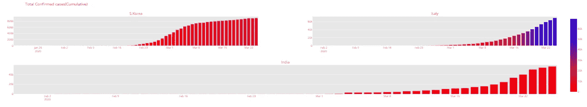

## 2.3 跨越 100 个案例后的趋势

```
# import plotly.graph_objects as gotitle **=** 'Main Source for News'labels **=** ['S.Korea', 'Italy', 'India']colors **=** ['rgb(122,128,0)', 'rgb(255,0,0)', 'rgb(49,130,189)']mode_size **=** [10, 10, 12]line_size **=** [1, 1, 8]fig **=** go.Figure()fig.add_trace(go.Scatter(x**=**dbd_Korea['Days after surpassing 100 cases'],y**=**dbd_Korea['Total Cases'],mode**=**'lines',name**=**labels[0],line**=**dict(color**=**colors[0], width**=**line_size[0]),connectgaps**=**True))fig.add_trace(go.Scatter(x**=**dbd_Italy['Days after surpassing 100 cases'],y**=**dbd_Italy['Total Cases'],mode**=**'lines',name**=**labels[1],line**=**dict(color**=**colors[1], width**=**line_size[1]),connectgaps**=**True))fig.add_trace(go.Scatter(x**=**dbd_India['Days after surpassing 100 cases'],y**=**dbd_India['Total Cases'],mode**=**'lines',name**=**labels[2],line**=**dict(color**=**colors[2], width**=**line_size[2]),connectgaps**=**True))annotations **=** []annotations.append(dict(xref**=**'paper', yref**=**'paper', x**=**0.5, y**=-**0.1,xanchor**=**'center', yanchor**=**'top',text**=**'Days after crossing 100 cases ',font**=**dict(family**=**'Arial',size**=**12,color**=**'rgb(150,150,150)'),showarrow**=**False))fig.update_layout(annotations**=**annotations,plot_bgcolor**=**'white',yaxis_title**=**'Cumulative cases')fig.show()
```

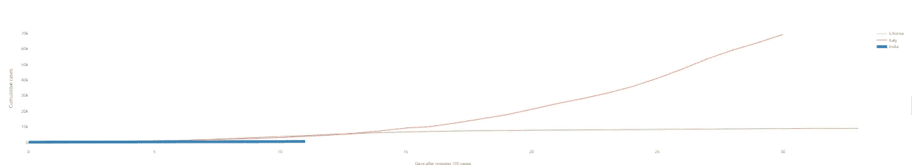

# **第三部分:探索全球数据**

以下代码将按日期为您提供关于确诊病例的位置和状态的表格数据。

```
df **=** pd.read_csv('/content/covid_19_clean_complete.csv',parse_dates**=**['Date'])df.rename(columns**=**{'ObservationDate':'Date', 'Country/Region':'Country'}, inplace**=**True)df_confirmed **=** pd.read_csv("/content/time_series_covid19_confirmed_global.csv")df_recovered **=** pd.read_csv("/content/time_series_covid19_recovered_global.csv")df_deaths **=** pd.read_csv("/content/time_series_covid19_deaths_global.csv")df_confirmed.rename(columns**=**{'Country/Region':'Country'}, inplace**=**True)df_recovered.rename(columns**=**{'Country/Region':'Country'}, inplace**=**True)df_deaths.rename(columns**=**{'Country/Region':'Country'}, inplace**=**True)df_deaths.head()df2 **=** df.groupby(["Date", "Country", "Province/State"])[['Date', 'Province/State', 'Country', 'Confirmed', 'Deaths', 'Recovered']].sum().reset_index()df2.head()
#Overall worldwide Confirmed/ Deaths/ Recovered casesdf.groupby('Date').sum().head()
```

## **可视化:全球新冠肺炎病例**

```
confirmed **=** df.groupby('Date').sum()['Confirmed'].reset_index()deaths **=** df.groupby('Date').sum()['Deaths'].reset_index()recovered **=** df.groupby('Date').sum()['Recovered'].reset_index()fig **=** go.Figure()#Plotting datewise confirmed casesfig.add_trace(go.Scatter(x**=**confirmed['Date'], y**=**confirmed['Confirmed'], mode**=**'lines+markers', name**=**'Confirmed',line**=**dict(color**=**'blue', width**=**2)))fig.add_trace(go.Scatter(x**=**deaths['Date'], y**=**deaths['Deaths'], mode**=**'lines+markers', name**=**'Deaths', line**=**dict(color**=**'Red', width**=**2)))fig.add_trace(go.Scatter(x**=**recovered['Date'], y**=**recovered['Recovered'], mode**=**'lines+markers', name**=**'Recovered', line**=**dict(color**=**'Green', width**=**2)))fig.update_layout(title**=**'Worldwide NCOVID-19 Cases', xaxis_tickfont_size**=**14,yaxis**=**dict(title**=**'Number of Cases'))fig.show()
```

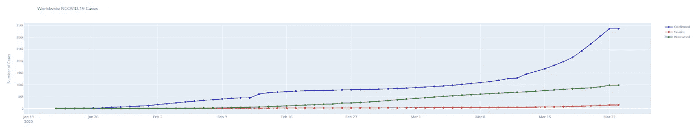

## 第 4 部分:预测全球病例总数

在这一部分中，我们将使用 ***Prophet*** 生成新冠肺炎确诊病例的一周预测，通过创建一个基础模型(调整和不调整季节性相关参数和额外回归变量)来确定具体的预测间隔。

## 先知是什么？

先知是由脸书的核心数据科学团队发布的开源软件。它可以在 CRAN 和 PyPI 上下载。

我们使用 Prophet，这是一种基于加法模型预测时间序列数据的程序，其中非线性趋势符合每年、每周和每天的季节性，加上假日影响。它最适用于具有强烈季节效应的时间序列和几个季节的历史数据。Prophet 对缺失数据和趋势变化非常稳健，通常能够很好地处理异常值。

## 为什么是先知？

*   **准确而快速:** Prophet 在脸书的许多应用中用于为规划和目标设定提供可靠的预测。脸书发现，在大多数情况下，它比任何其他方法都要好。它适合 Stan 中的模型，这样你可以在几秒钟内得到预测。
*   **全自动:**对杂乱的数据进行合理的预测，无需人工干预。先知对异常值、缺失数据和时间序列中的剧烈变化具有很强的鲁棒性。
*   **可调预测:**Prophet 程序包括用户调整预测的多种可能性。您可以通过添加您的领域知识，使用人类可理解的参数来改进您的预测
*   **可用 R 或 Python:** 脸书已经用 R 和 Python 实现了 Prophet 过程。它们共享相同的基础 Stan 代码进行装配。你可以使用任何你觉得舒服的语言来获得预测。

```
from fbprophet import Prophet confirmed = df.groupby('Date').sum()['Confirmed'].reset_index() deaths = df.groupby('Date').sum()['Deaths'].reset_index() recovered = df.groupby('Date').sum()['Recovered'].reset_index()
```

Prophet 的输入始终是一个包含两列的数据帧: **ds** 和 **y** 。 **ds (datestamp)** 列应该是熊猫所期望的格式，理想情况下，日期应该是 YYYY-MM-DD，时间戳应该是 YYYY-MM-DD HH:MM: SS。y 列必须是数字，代表我们希望预测的测量值。

```
confirmed.columns **=** ['ds','y']#confirmed['ds'] = confirmed['ds'].dt.dateconfirmed['ds'] **=** pd.to_datetime(confirmed['ds'])confirmed.tail()
```

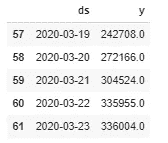

## 4.1 使用 Prophet(基础模型)预测全球确诊的新冠肺炎病例

使用 Prophet 生成新冠肺炎确诊病例的一周预测，通过创建一个没有调整季节性相关参数和额外回归变量的基础模型，预测间隔为 95%。

```
m **=** Prophet(interval_width**=**0.95)m.fit(confirmed)future **=** m.make_future_dataframe(periods**=**7)future.tail()
```

**预测**方法将为未来的每一行分配一个预测值，并将其命名为**和**。如果您传递历史日期，它将提供样本内拟合。这里的**预测对象**是一个新的数据框，包括一个预测列，以及组件和不确定性区间列。

```
#predicting the future with date, and upper and lower limit of y valueforecast **=** m.predict(future)forecast[['ds', 'yhat', 'yhat_lower', 'yhat_upper']].tail()
```

你可以打电话给预言家来预测天气。绘图方法和传入您的预测数据框架。

```
confirmed_forecast_plot **=** m.plot(forecast)
```

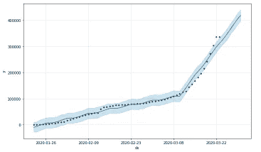

```
confirmed_forecast_plot **=** m.plot(forecast)
```

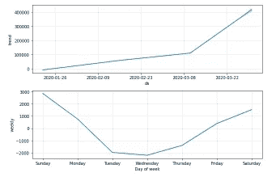

## 4.2 使用 Prophet(基本模型)预测全球死亡人数

使用机器学习库 Prophet 生成新冠肺炎确诊病例的一周预测，通过创建一个没有调整季节性相关参数和额外回归变量的基础模型，预测间隔为 95%。

```
deaths.columns **=** ['ds','y']deaths['ds'] **=** pd.to_datetime(deaths['ds'])m **=** Prophet(interval_width**=**0.95)m.fit(deaths)future **=** m.make_future_dataframe(periods**=**7)future.tail()forecast **=** m.predict(future)forecast[['ds', 'yhat', 'yhat_lower', 'yhat_upper']].tail()deaths_forecast_plot **=** m.plot(forecast)
```

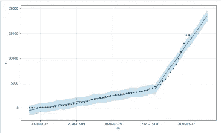

```
deaths_forecast_plot **=** m.plot_components(forecast)
```

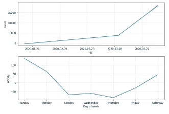

## 4.3 使用 Prophet 预测全球康复病例(基础模型)

使用 Prophet 生成新冠肺炎确诊病例的一周预测，通过创建一个没有调整季节性相关参数和额外回归变量的基础模型，预测间隔为 **95%** 。

```
recovered.columns **=** ['ds','y']recovered['ds'] **=** pd.to_datetime(recovered['ds'])m **=** Prophet(interval_width**=**0.95)m.fit(recovered)future **=** m.make_future_dataframe(periods**=**7)future.tail()forecast **=** m.predict(future)forecast[['ds', 'yhat', 'yhat_lower', 'yhat_upper']].tail()recovered_forecast_plot **=** m.plot(forecast)
```


```
recovered_forecast_plot **=** m.plot_components(forecast)
```


# 结论

这是对我们所有学习者的一个谦卑的要求。

不要对你的咳嗽和感冒掉以轻心。如果你看看数据，印度的病例数正在上升，就像意大利、武汉、韩国、西班牙或美国一样。我们已经处理了 10 万起案件。不要让较低的认知度和较少的检测数量毁掉我们这个世界的健康。

目前，印度是一个危险的地区，因为只有很少的新冠肺炎考试中心。试想有多少感染者还在你身边，并且在不知不觉中感染着别人。

让我们帮助抗击疫情，至少通过呆在室内隔离我们自己，保护我们自己和我们周围的人。

*原载于 2020 年 5 月 22 日 https://www.edureka.co**的* [*。*](https://www.edureka.co/blog/covid-19-outbreak-prediction-using-machine-learning/)