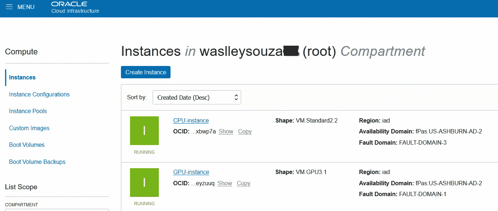
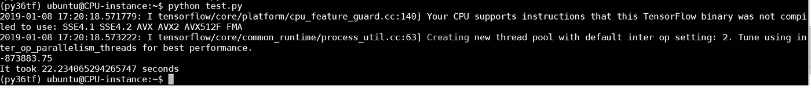
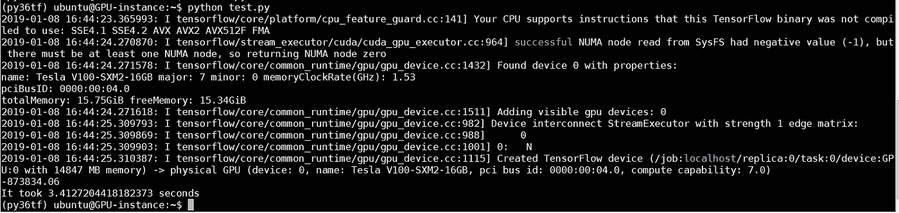

# Oracle 云中的 CPU 与 GPU

> 原文：<https://medium.com/oracledevs/cpu-vs-gpu-in-oracle-cloud-314e2d202b20?source=collection_archive---------0----------------------->

如果您阅读了我的名为“[优化用于 CPU 的 TensorFlow](https://waslleysouza.com.br/en/2018/07/optimizing-tensorflow-for-cpu/)”的博客文章，您会了解到您可以通过选择正确的发行版来改进用于 CPU 的 tensor flow，在本例中是 Anaconda 发行版。

CPU 实例将为简单的 AI 项目做工作，但如果你需要更多的计算能力来减少项目的执行或训练时间，你需要使用 GPU 实例。

由于许多人要求我使用 GPU 实例运行相同的测试，在这篇文章中，你将看到这个测试的结果！

对于这个测试，我使用了 Oracle 云基础设施，而不是上一篇博文中使用的 Oracle 云基础设施经典版。Oracle 云基础设施是 Oracle IaaS 的新一代产品，因此它是现在可以使用的正确解决方案。

这些是实例:

*   CPU 实例(虚拟机。标准 2.2) = 2 个 ocpu+30GB 内存
*   GPU 实例(虚拟机。GPU3.1) = 1 个 GPU V100 + 90GB 内存



Instances

在 CPU 实例中，我使用以下代码创建了 Anaconda 环境:

```
conda create -n py36tf tensorflow python=3.6
```

在 GPU 实例中，我使用以下代码创建了 Anaconda 环境:

```
conda create -n py36tf tensorflow-gpu python=3.6
```

为了评估 CPU 和 GPU 实例之间的性能，我使用 TensorFlow 运行了以下矩阵乘法脚本:

```
import tensorflow as tf
import time

tf.set_random_seed(42)
A = tf.random_normal([10000,10000])
B = tf.random_normal([10000,10000])

def check():
    start_time = time.time()
    with tf.Session() as sess:
        print(sess.run(tf.reduce_sum(tf.matmul(A,B))))
    print("It took {} seconds".format(time.time() - start_time))

check()
```

结果如下:

在 CPU 实例中，花费了 22.23 秒。



CPU instance

在 GPU 实例中，耗时 3.41 秒。



GPU instance

CPU 和 GPU 实例之间的差异接近 650%！

这篇文章的主要目的是展示你需要考虑你的人工智能项目的需求，选择合适的工具和环境，以最佳的性能和预算运行它！

玩得开心！

*原载于 2019 年 1 月 9 日*[*【waslleysouza.com.br】*](https://waslleysouza.com.br/en/2019/01/cpu-vs-gpu-in-oracle-cloud/)*。*