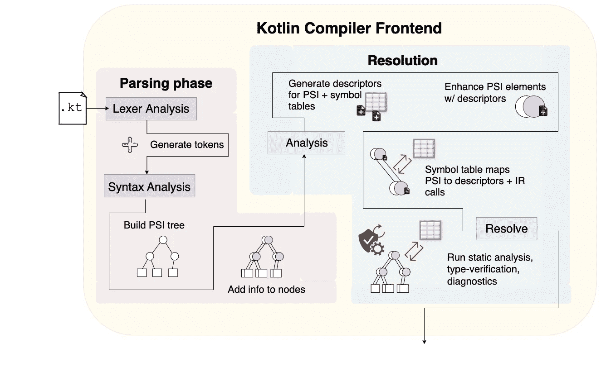
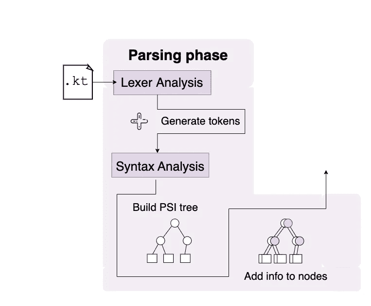
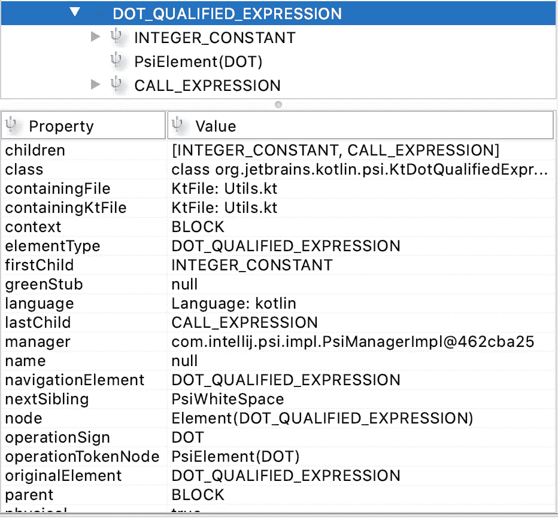
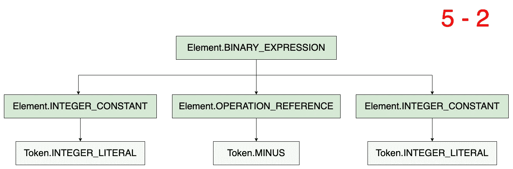
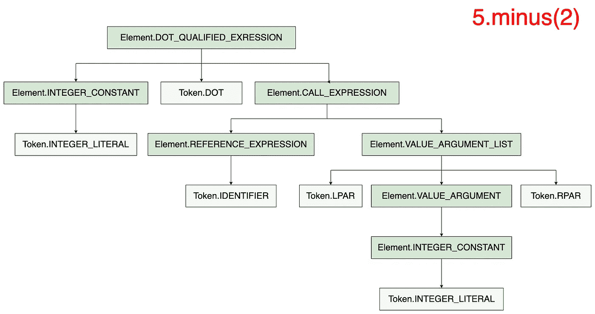
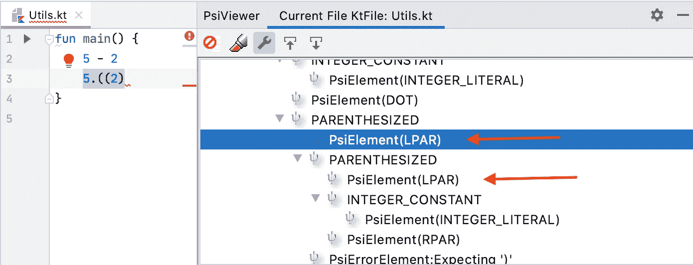

# Kotlin 编译器速成班| 1。前端:解析阶段

> 原文：<https://medium.com/google-developer-experts/crash-course-on-the-kotlin-compiler-1-frontend-parsing-phase-9898490d922b?source=collection_archive---------3----------------------->

## 词法分析器、解析器、PSI、AST v. CST 和其他帮助理解编写 IDE/编译器插件的基本概念

作为程序员，我们喜欢谈论技术是一个“黑匣子”。不管是好是坏，Kotlin 编译器感觉有点像。有关于 Kotlin [PSI](https://plugins.jetbrains.com/docs/intellij/psi-elements.html) use for IDE 插件的文档，但是除了源代码中留下的注释之外，没有太多其他的了。我希望我能帮助其他人学到足够的信息，让他们自己动手(甚至鼓励其他人分享他们的发现)。

这部迷你剧将分两部分发行:

*   [1。前端:解析阶段](https://hinchman-amanda.medium.com/crash-course-on-the-kotlin-compiler-1-frontend-parsing-phase-9898490d922bhttps://hinchman-amanda.medium.com/crash-course-on-the-kotlin-compiler-1-frontend-parsing-phase-9898490d922b)
*   2.前端:解决阶段*(即将推出)*

Kotlin 编译器是独一无二的，因为它的前端是建立在它之上的，这使得它很容易与编译器插件和 IDE 插件共享前端。对于 Kotlin 来说，前端的目标是解析编写的代码并分析其解释的结构，以便生成*中间表示(IR)。*然后，这个 IR 连同生成的附加信息被馈送到编译器的后端，编译器在 IR 最终成为机器代码之前进一步分析、扩充和优化它。



Frontend portion of the Kotlin compiler. A Kotlin file is fed into the compiler, which is then analyzed and broken down into AST/PSI so that it can be further analyzed in the resolution for correctness.

本系列观察了通过 Kotlin 编译器输入代码时会发生什么:这是理解编译器在每个阶段做什么的最简单的方法。这篇文章涵盖了前端的第一部分，即*解析阶段。*

# 解析阶段

当源代码编译时，编译器必须做的第一件事就是找出开发者到底写了什么。假设我们通过编译器发送以下文件:

```
fun main() {
    1 + 2
    1.plus(2)
}
```

编译器可以“理解”开发人员写的东西，方法是解析人类可读的代码，然后将其翻译成编译器自己可以理解的格式。在下图中，一个 Kotlin 文件首先进入解析阶段。创建一个 lexer 来最初解析源文件并生成令牌。然后，这些标记通过语法分析，进而创建一个 PSI 结构(在*语法分析*阶段有更多解释和限定)。



A Kotlin file is first fed into the Parsing phase in the compiler. Lexer analysis generates KtTokens and Kt. Those tokens are then fed through Syntax Analysis, which creates an AST

此时，编译器并不关心*代码是否工作*——它只关心计算出*文件中写了什么*。**解析阶段**负责创建语法树，以便编译器能够稍后在**解析阶段分析和验证代码。**

解析的基础可以在下面的两阶段过程中看到:

1.  *词法分析:*文本文件被解析成记号。
2.  *语法分析:*对标记进行解析并组织成语法树。

## 词汇分析

在词法分析期间，Kotlin 解析器首先创建一个 [KotlinLexer](https://github.com/JetBrains/kotlin/blob/92d200e093c693b3c06e53a39e0b0973b84c7ec5/compiler/psi/src/org/jetbrains/kotlin/lexer/KotlinLexer.java) 。这个 lexer 扫描 Kotlin 文件并将文本分解成一组名为 [KtTokens](https://github.com/JetBrains/kotlin/blob/master/compiler/psi/src/org/jetbrains/kotlin/lexer/KtTokens.java) 的*标记*。例如， [KtTokens](https://github.com/JetBrains/kotlin/blob/master/compiler/psi/src/org/jetbrains/kotlin/lexer/KtTokens.java) 将符号`(`和`)`表示为:

```
KtSingleValueToken LPAR = new KtSingleValueToken("LPAR", "(");
KtSingleValueToken RPAR = new KtSingleValueToken("RPAR", ")");
```

[KotlinExpressionParsing](https://github.com/gigliovale/kotlin/blob/master/compiler/frontend/src/org/jetbrains/kotlin/parsing/KotlinExpressionParsing.java)将设置一个访问者来将这些令牌排列成表达式节点集。然后通过 [ASTNode](https://github.com/JetBrains/intellij-community/blob/master/platform/core-api/src/com/intellij/lang/ASTNode.java) 将这些表达式节点追加到 PSI 树中。

[*编程结构接口* ( *PSI)*](https://plugins.jetbrains.com/docs/intellij/psi-elements.html#how-do-i-get-a-psi-element) 是 JetBrains 搭建的一个抽象。它有点像一棵重量级的通用语法树，在 ide 中处理文本/代码/语言。这些树是在语法分析期间生成的内存中的表示形式，编译器需要它们来生成额外的数据并递归地分析自身，以便在后面的阶段进行代码验证。PSI 对于编译器插件*和* IDEA 插件都很有用，因为你可以过滤 PSI 来截取特定的代码片段。

简而言之，Kotlin 解析器创建了以层次关系连接节点的结构。例如，如果[KotlinExpressionParsing](https://github.com/gigliovale/kotlin/blob/master/compiler/frontend/src/org/jetbrains/kotlin/parsing/KotlinExpressionParsing.java)选择关键字`throw`，那么另一个元素将被解析并转换为 PSI 元素，以添加到树中:

```
/*
 * : "throw" element
 */
**private** **void** **parseThrow() {**
    assert _at(THROW_KEYWORD) PsiBuilder.Marker marker = mark(); advance(); // THROW_KEYWORD parseExpression();    marker.done(THROW);
**}**
```

在下一节中，语法分析将创建一个 PSI 解析器，它将标记包装为`PsiElements`。每个节点都有一个递归描述源代码语法结构的描述。

## 语法分析

生成的 PSI 文件描述了构建语法和语义代码模型的`PsiElements`(所谓的 *PSI 树*)的层次结构。PSI 树更像是*抽象语法树* *(AST)* 还是*具体语法树(CST)* ？嗯，看起来生成的 PSI 树具有两种*的特征。*

Eli Bendersky 关于 [*抽象 vs .具体语法树*](https://eli.thegreenplace.net/2009/02/16/abstract-vs-concrete-syntax-trees/) 的博客很好地解释了两者之间的区别。像 CST 树一样，PSI 结构包含了书写内容的更正式的表示，包括符号。然而，像 AST 一样，PSI 树在每个节点本身中保存额外的有用信息。

在 IntelliJ IDEA 中，你可以下载插件 [PSIViewer](https://www.jetbrains.com/help/idea/psi-viewer.html?source=google&medium=cpc&campaign=9731470771&gclid=CjwKCAjwloCSBhAeEiwA3hVo_cQTYJhHEDWhh_ccKnmyMvMlRSJExE3lJ9KpDSx0rzHyY-CyZ9fBwhoCEnMQAvD_BwE) 来检查你写的代码的 PSI。您还可以突出显示您的部分代码，以查看 PSIViewer 在其渲染树中选择了什么。

下图显示了 [PSIViewer](https://www.jetbrains.com/help/idea/psi-viewer.html?source=google&medium=cpc&campaign=9731470771&gclid=CjwKCAjwloCSBhAeEiwA3hVo_cQTYJhHEDWhh_ccKnmyMvMlRSJExE3lJ9KpDSx0rzHyY-CyZ9fBwhoCEnMQAvD_BwE) 如何将`5.minus(2)`解释为`DOT_QUALIFIED_EXPRESSION`，其第一个孩子是`INTEGER_CONSTANT`为`5`，第二个孩子`DOT`为`.`，第三个孩子`CALL_EXPRESSION`为`minus(2)`。



PSIViewer allows you to inspect the properties a PSI node holds.

这些 PSI 元素包含标记，并且能够保存可能与之相关的子元素和父元素的信息。这些 PSI 结构变得更加复杂，因为编译器会构建并从中生成额外的信息。PSI 结构具有 CST 和 AST 的共同特征，尽管它们的结构随着时间的推移变得更像 AST。为了讨论和方便起见，我们用 AST 来指代这些树。

考虑一下表达式`5 — 2`。生成的 AST 如下，其中树中较暗的节点表示为元素，较亮的节点表示为标记。



The tool PSIViewer renders a similar tree right in your IntelliJ IDE, where all elements are defined as PsiElement types. For simplicity, this image differentiates *tokens* with lighter nodes denoted “Token.${psiElement}” and elements with darker nodes denoted “Element.${psiElement)”.

表达式`5 – 2`可以分解成一个二进制表达式，由两个整数常量作为操作数和一个`OPERATION_REFERENCE`作为运算符组成。但是表达式`5.minus(2)`，即使它的结果与`5 — 2`相同，也会有完全不同的 AST 结构。



Unlike a BINARY_EXRPRESSION that defines 5–2, a DOT_QUALITIFIED EXPRESSION found in 5.minus(2) contains a CALL_EXPRESSION, whose REFERENCE_EXPRESSION is “minus” and VALUE_ARGUMENT_LIST is “(2)”

PSI 树告诉我们最终用户是如何编写代码的，但是在这个阶段没有太多其他的信息。这意味着此时，编译器只能告诉我们*代码是如何编写的*，但不知道*代码是否编译。*

无论代码是否正确，都可以构建 PSI 树。考虑下面 IntelliJ 想法的截图。窗格的左边部分显示了 **Utils.kt** 中的代码。在`main`函数内部，有两条语句，函数的第二行是`5.((2)`而不是`5.minus(2)`。我们知道(IDE 也知道)像`5.((2)`这样的语句不会被编译。但是记住，PSI 树不需要知道这些。不管怎样，它都会生成元素，尽管它可能无法准确地解释内部的层次关系。



PSIViewer Captures the LPAR LPAR elements.

IDE 如何能够在屏幕截图的左侧窗格中显示红色曲线？这正是**解决阶段**所负责的，这为我们下一篇文章的主题提供了完美的继续。下一篇文章将研究**解析阶段**，它创建必要的分析来帮助判断代码是否可以编译。敬请期待！


In the next section, we cover the “Resolution” portion of the frontend of the Kotlin compiler.

*非常感谢*[*Leland Richardson*](https://medium.com/u/41a8b1601c59?source=post_page-----9898490d922b--------------------------------)*为他的评论提供了围绕编译器细节的反馈以及*[*Louis CAD*](https://medium.com/u/9862bd834329?source=post_page-----9898490d922b--------------------------------)*为他的评论和围绕文章/图表的反馈。*

然后后端获取这个 IR，优化它，再次优化它，并将其全部生成为字节码。这将在下一篇文章中讨论。