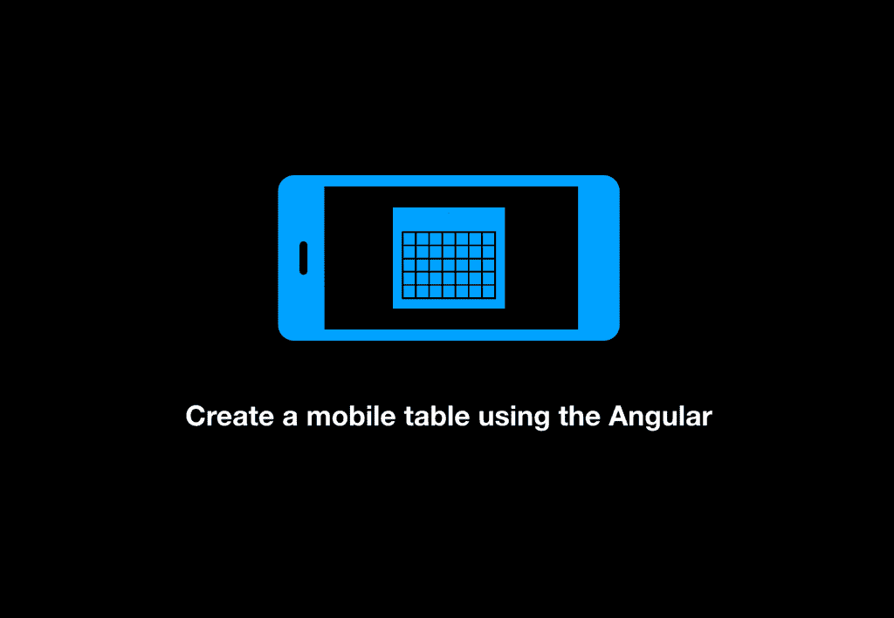
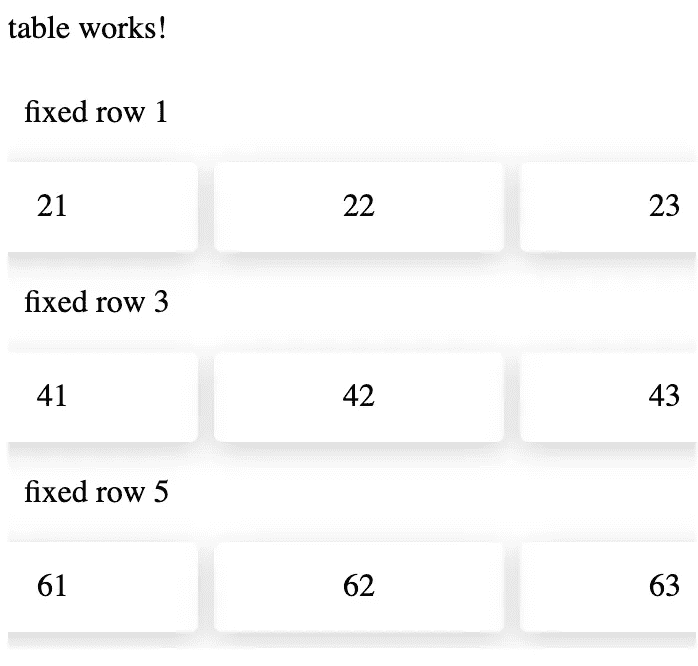
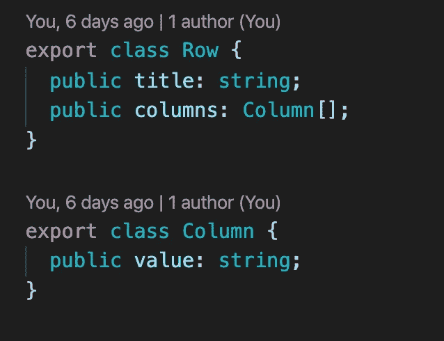
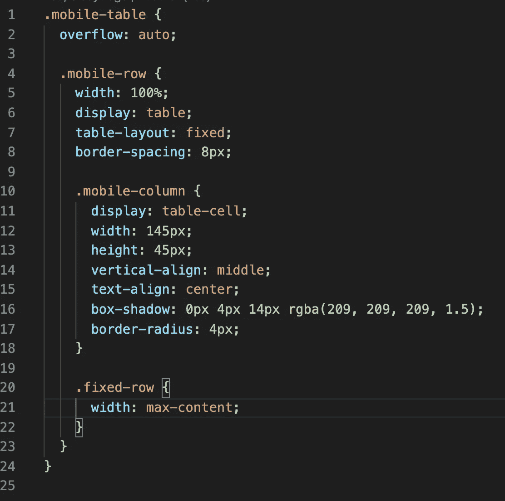
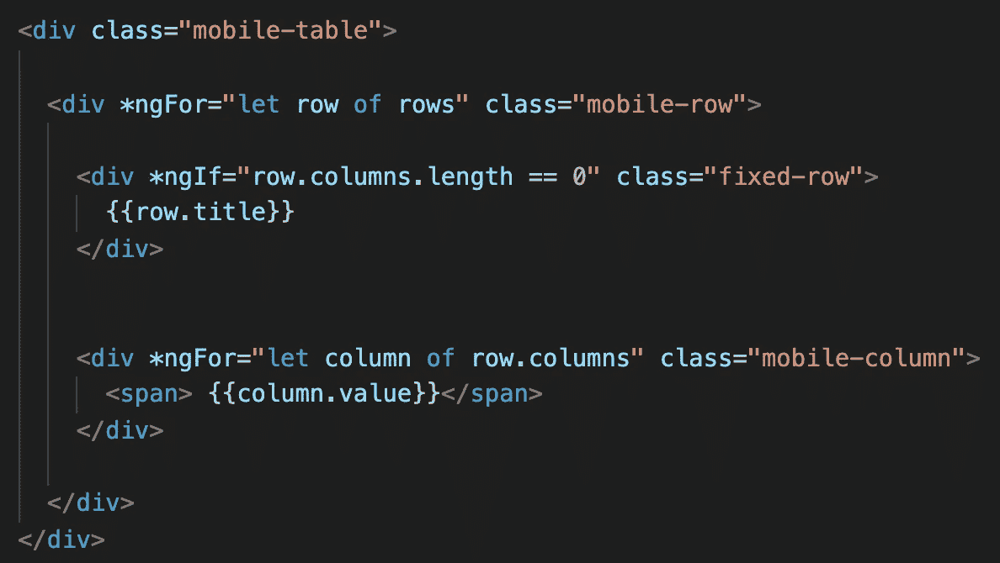
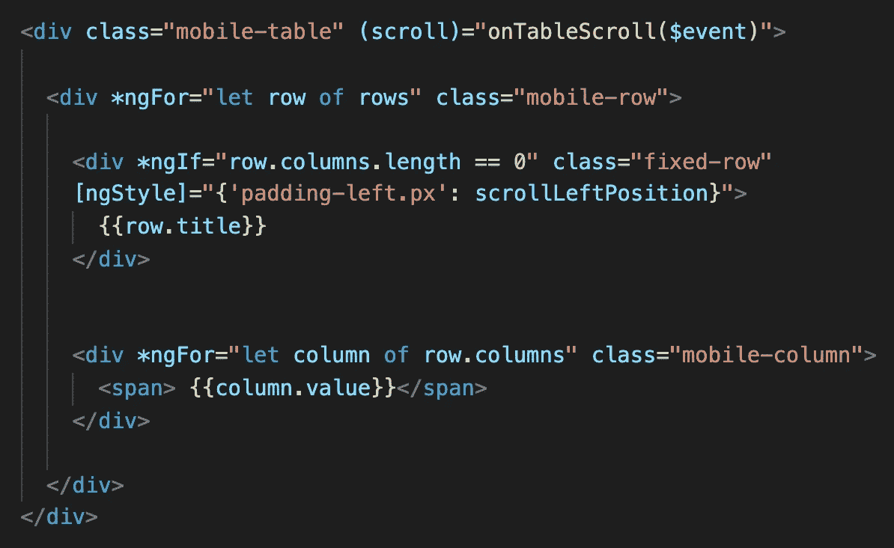
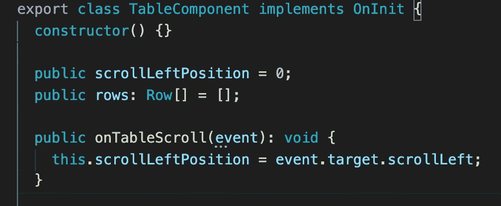

# 使用角度创建一个移动表格

> 原文：<https://medium.com/quick-code/create-a-mobile-table-using-the-angular-73ca74db5adc?source=collection_archive---------0----------------------->

## 角度示例

## 负责任的移动工作台

与平板电脑或显示器相比，移动设备的屏幕要小得多。因此，很难将表格应用于移动设备并保存用户在 PC 上的体验。

今天，我们有很多工具可以帮助为不同的屏幕尺寸制作一个响应性的标记，但是它们不能帮助为移动屏幕制作一个表格。

它只给了我们一个解决方案——专门为移动设备制作一个新表。

我们将做不同的设计，而不是使用普通的桌子。

**设计**

Table design

用户可以做水平滚动所有块将根据用户的行动，但行的标题是固定的，他们不移动。

**表款**

对于这个表，我们只需要创建两个小类。

Table models

**款式**

我们的表格的主要样式是“溢出:自动”、“显示:表格”(对于行)、“显示:表格单元格”(对于列)。其他风格只是让我们的桌子更漂亮。

Table styles

**HTML**

在表格的标记中，我们使用了一对“div”标签和一对“ngFor”。

请注意，行只能显示标题或列。

Markup

**角帮**

我们的表几乎准备好了，除了一件事，固定标题。为此，我们需要一个角度的帮助。我们需要绑定我们的函数来滚动事件到主 div。在该函数中，我们需要定义滚动位置，我们需要将该位置绑定到行标题。关键是标题会随着水平滚动改变位置，当滚动移动时，标题会随之移动，用户会产生标题是固定的错觉。

New markup

ts file

移动设备表已准备好。如果你需要仔细看看项目[，这里有链接。](https://github.com/8Tesla8/mobile-table)

*原载于 2020 年 2 月 9 日 http://tomorrowmeannever.com***。**