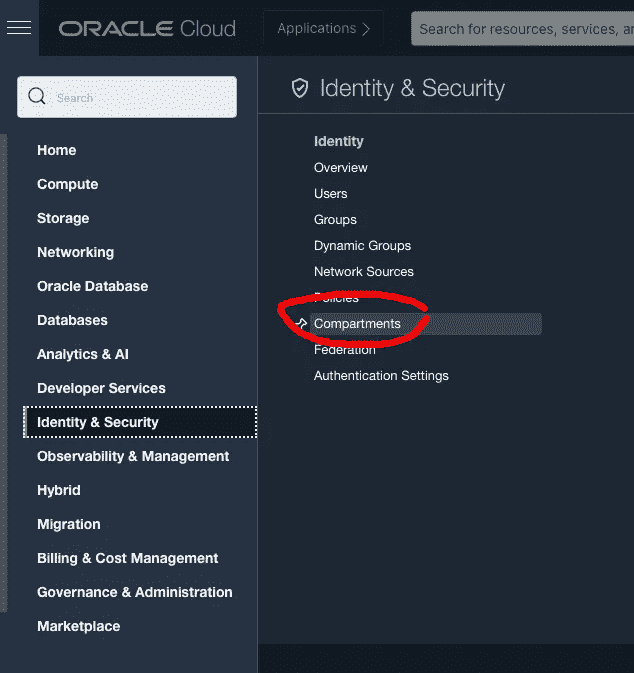
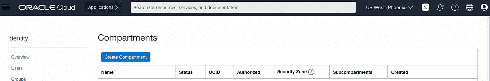
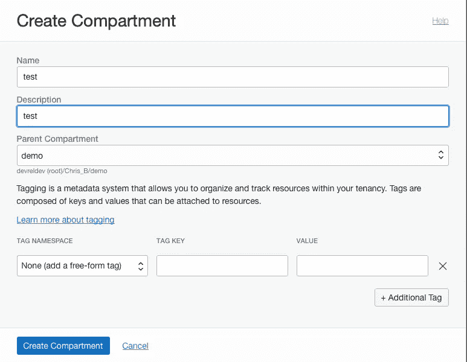

# 创建 Oracle 云隔离专区

> 原文：<https://medium.com/oracledevs/create-a-oracle-cloud-compartment-22b090100914?source=collection_archive---------0----------------------->

克里斯·本森

如果你愿意，你可以在 GitHub [这里](https://github.com/chrisbensen/chris-blogs/blob/main/HowTo/CreateCompartment/CreateCompartment.md)阅读这篇博文。

当你想要组织和隔离你的云资源时，一个[隔间](https://docs.cloud.oracle.com/iaas/Content/Identity/Tasks/managingcompartments.htm?source=:so:bl:or:awr:odv:::RC_WWMK220120P00034:&SC=:so:bl:or:awr:odv:::RC_WWMK220120P00034:&pcode=WWMK220120P00034)是有用的。这和你在家里放盒子和抽屉，或者把东西放在背包里一样。把它想象成计算机文件系统中的一个文件夹。

本教程需要一个 Oracle 云帐户。您今天就可以注册一个[免费等级账户](https://signup.cloud.oracle.com/?language=en)！

1.  单击左上角的菜单图标。
2.  滚动到底部，在 Identity 下，单击 **Compartments** (或在搜索栏中，键入 Compartments):

3.点击**创建隔间**。

4.填充**名称**和**描述**字段。

5.除非您希望隔离专区成为子隔离专区，否则请将父隔离专区设置为(根)。

6.点击**创建隔间**。

7.单击 Oracle Cloud 徽标返回控制面板。

很简单，对吧？

# 加入对话！

如果你对甲骨文开发人员在他们的自然栖息地发生的事情感到好奇，请加入我们的[公共休闲频道](https://oracledevrel.slack.com/join/shared_invite/zt-uffjmwh3-ksmv2ii9YxSkc6IpbokL1g#/shared-invite/email)！我们不介意成为你的鱼缸🐠