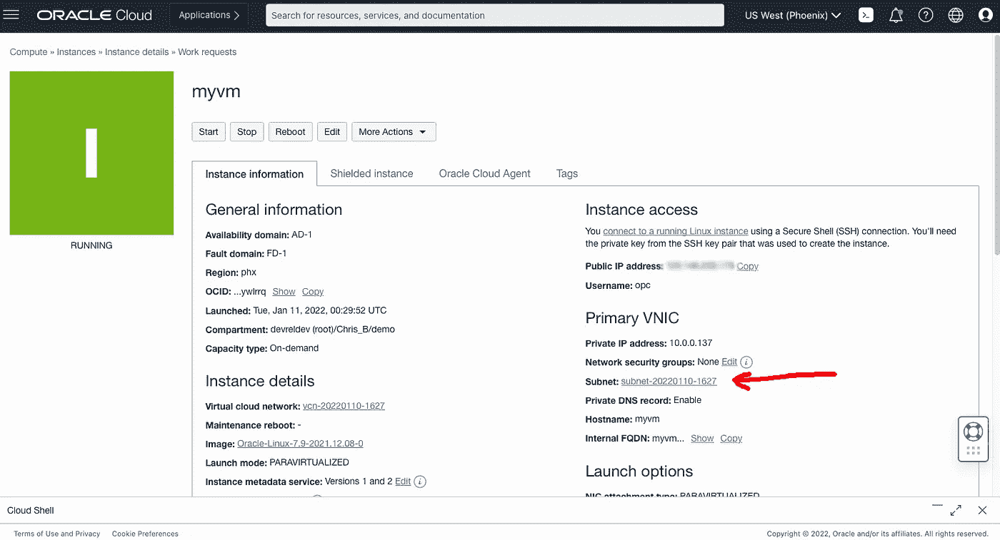
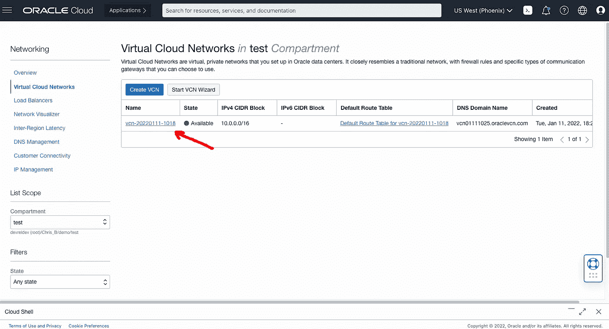
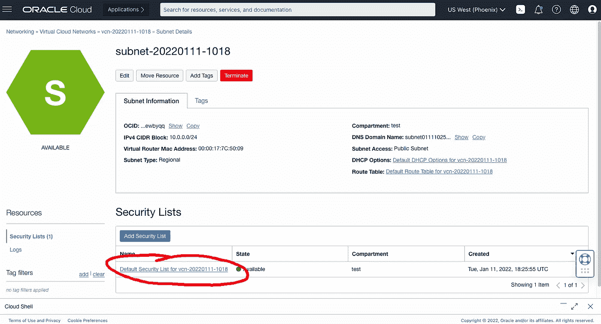
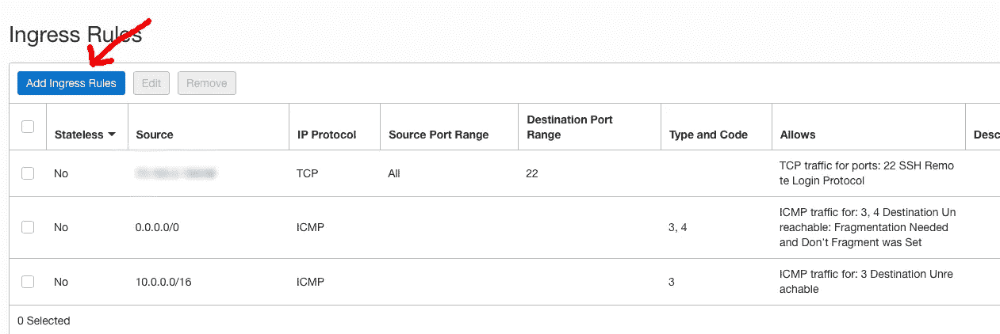
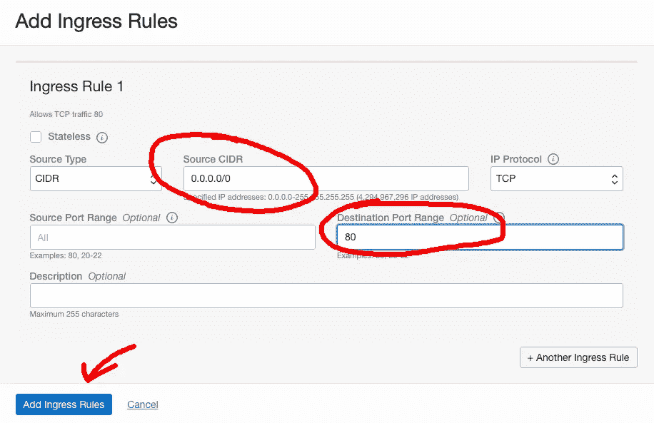
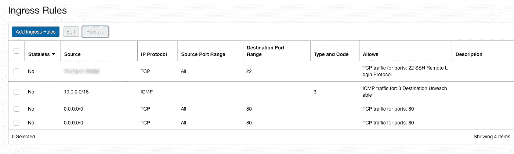

# 在 OCI 上创建一个简单的 Python Web 服务器

> 原文：<https://medium.com/oracledevs/create-a-simple-python-web-server-on-oci-1d3634a1d7c2?source=collection_archive---------2----------------------->

克里斯·本森


Photo by [Jan Kopřiva](https://www.pexels.com/@koprivakart?utm_content=attributionCopyText&utm_medium=referral&utm_source=pexels) from [Pexels](https://www.pexels.com/photo/photo-of-snake-3281127/?utm_content=attributionCopyText&utm_medium=referral&utm_source=pexels)

如果你愿意，你可以在 GitHub [这里](https://github.com/chrisbensen/chris-blogs/blob/main/HowTo/WebServer/WebServer.md)阅读这篇博文。

这篇文章对一些人来说似乎是显而易见的，但其他人需要知道如何开始。拥有一台全天候运行在云中的服务器是一件好事，但很有可能你真的想用它做点什么。这就是本文中的步骤出现的地方。

# 先决条件

1.  您拥有一个 OCI 账户或一个[自由级账户](/oracledevs/create-an-oracle-always-free-cloud-account-bc6aa82c1397)。
2.  您已经创建了一个[计算实例](https://chrisbensen.medium.com/create-an-oci-compute-instance-493d10e2e6a6)。
3.  你已经把你电脑上的 ssh 锁定在你的电脑上。

点击了解更多关于[计算](https://docs.oracle.com/en-us/iaas/Content/Compute/home.htm?source=:so:bl:or:awr:odv:::RC_WWMK220120P00034:&SC=:so:bl:or:awr:odv:::RC_WWMK220120P00034:&pcode=WWMK220120P00034)和其他[甲骨文云文档](https://docs.oracle.com/en-us/iaas/Content/GSG/Concepts/baremetalintro.htm?source=:so:bl:or:awr:odv:::RC_WWMK220120P00034:&SC=:so:bl:or:awr:odv:::RC_WWMK220120P00034:&pcode=WWMK220120P00034) [。要获得交互式支持和社区，请查看甲骨文面向开发者的公共](https://docs.oracle.com/en-us/iaas/Content/GSG/Concepts/baremetalintro.htm?source=:so:bl:or:awr:odv:::RC_WWMK220120P00034:&SC=:so:bl:or:awr:odv:::RC_WWMK220120P00034:&pcode=WWMK220120P00034) [Slack 频道](https://oracledevrel.slack.com/join/shared_invite/zt-uffjmwh3-ksmv2ii9YxSkc6IpbokL1g#/shared-invite/email)。

# 构建 Web 服务器

现在，让我们创建 web 服务器。我们会活得很危险，开放一个端口，这样任何人都可以访问端口 80 上的服务器。这应该没问题，因为其他一切都被锁定了，但这不是您想要在生产环境中运行的方式。然后我们将创建一个简单的 HTML 文件和一个简单的 Python 脚本来充当一个糟糕的 web 服务器。我说糟糕是因为你不可能想在生产中运行它。这只是一个例子和测试。但这是一个很好的起点。

1.单击“子网”字段旁边的链接，这将带您进入虚拟云网络列表:



2.单击 VCN:



3.点击“默认安全列表”:



4.在“入口规则”下，您可以看到 SSH(端口 22)。单击“添加入口规则”:



5.在“添加入口规则”对话框中，将源 CIDR 设置为“0.0.0.0/0”，并将目标端口范围设置为“80”:



6.规则现在看起来是这样的:



7.打开虚拟机的防火墙。所以 SSH 进入你的 VM:

`ssh -i ~/.ssh/oci_id_rsa opc@${INSTANCE_IP}`

8.然后运行以下命令打开 80 端口:

`sudo firewall-cmd --permanent --zone=public --add-port=80/tcp
sudo firewall-cmd --permanent --zone=public --add-port=80/udp
sudo firewall-cmd --reload`

9.创造**index.html**:

`<!DOCTYPE html>
<html>
<body>
Hello World
</body>
</html>`

10.创建 **server.py** :

```
#!/usr/bin/python3
 from http.server import BaseHTTPRequestHandler, HTTPServer
 import time
 import json
 from socketserver import ThreadingMixIn
 import threadinghostName = “0.0.0.0”
 serverPort = 80class Handler(BaseHTTPRequestHandler):
 def do_GET(self):
 # curl http://<ServerIP>/index.html
 if self.path == “/”:
 # Respond with the file contents.
 self.send_response(200)
 self.send_header(“Content-type”, “text/html”)
 self.end_headers()
 content = open(‘index.html’, ‘rb’).read()
 self.wfile.write(content)else:
 self.send_response(404)returnclass ThreadedHTTPServer(ThreadingMixIn, HTTPServer):
 “””Handle requests in a separate thread.”””if __name__ == “__main__”:
 webServer = ThreadedHTTPServer((hostName, serverPort), Handler)
 print(“Server started http://%s:%s" % (hostName, serverPort))try:
 webServer.serve_forever()
 except KeyboardInterrupt:
 passwebServer.server_close()
 print(“Server stopped.”)
```

11.运行 web 服务器:

`sudo python3 server.py`

12.现在，从任何计算机使用网络浏览器并访问网址 http://

还有维奥拉。享受你的网络服务器。请继续，因为我刚刚创建了构建模块。下周我有一些真正有趣的事情！

这需要一个 Oracle 云帐户。您可以免费获得一个名为[免费等级账户](/oracledevs/create-an-oracle-always-free-cloud-account-bc6aa82c1397)的账户。