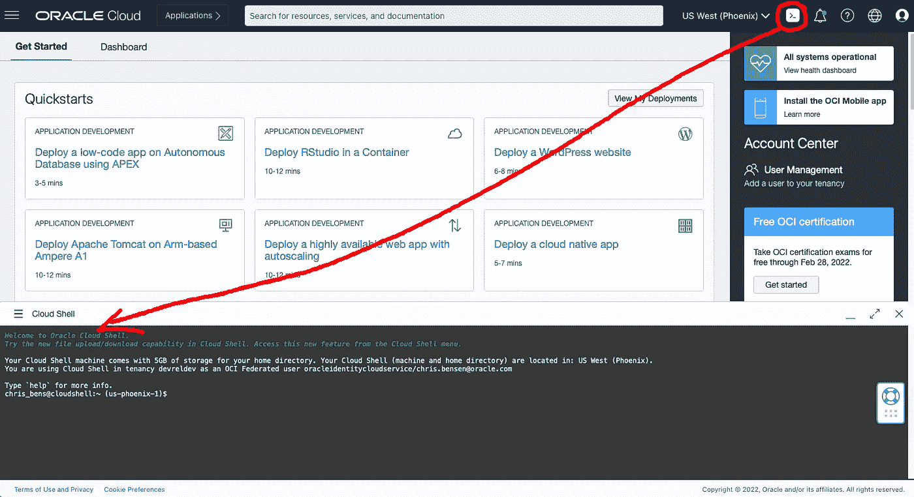
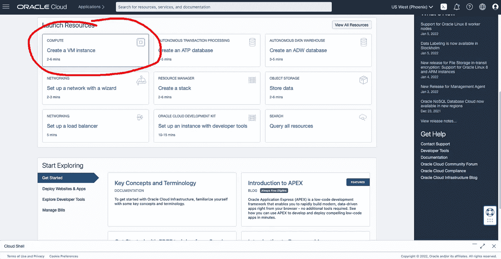
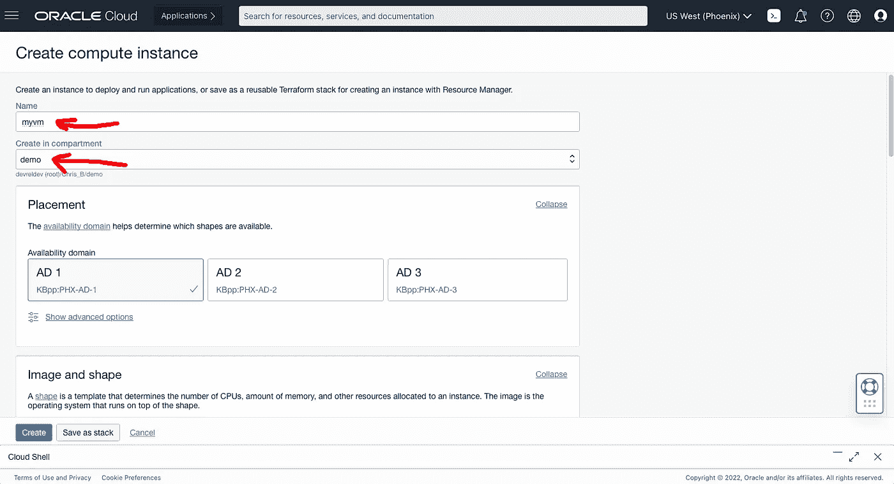
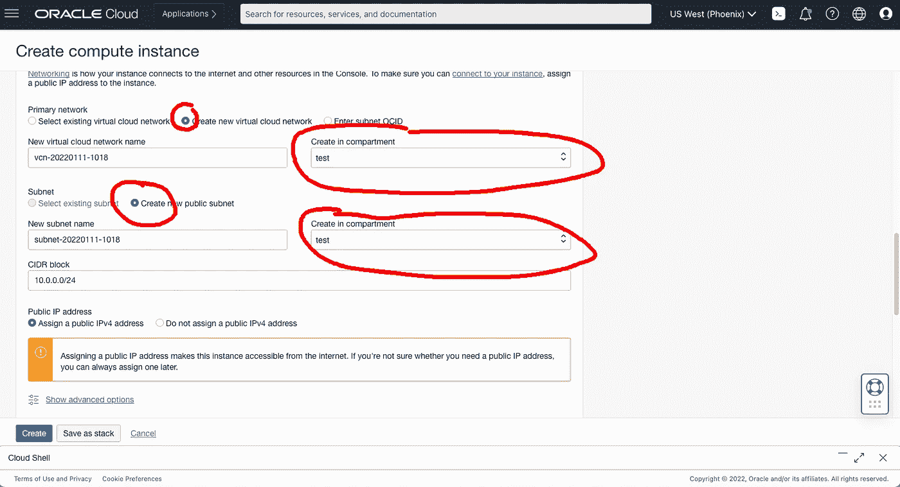
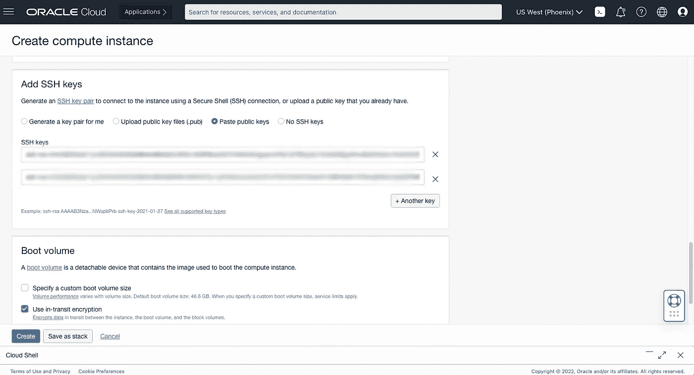
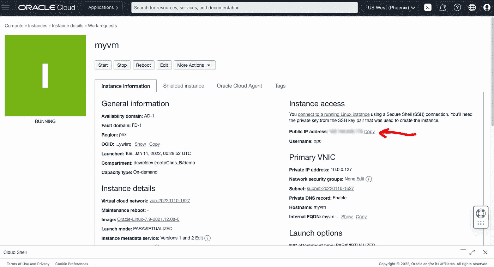

# 创建 OCI 计算实例

> 原文：<https://medium.com/oracledevs/create-an-oci-compute-instance-493d10e2e6a6?source=collection_archive---------0----------------------->

克里斯·本森

如果你愿意，你可以在 GitHub [这里](https://github.com/chrisbensen/chris-blogs/blob/main/HowTo/CreateInstance/CreateInstance.md)阅读这篇博文。

Oracle 计算实例是云中的一个虚拟机，您可以使用它作为远程计算机来执行您可以想象的任何任务；托管个人投件箱，与朋友安全地共享文件，运行[《我的世界》服务器](https://recursive.codes/blog/post/1946)，在数据库中存储天气数据[，通过互联网远程控制汽车](https://www.youtube.com/playlist?list=PLPIzp-E1msrZ0WAvm20TkXtm7Hm5JnHxc)可能性是无限的:

1.首先创建一个[自由层账户](/oracledevs/create-an-oracle-always-free-cloud-account-bc6aa82c1397)，然后回到这里继续这些步骤。

2.单击右上角的云壳图标。这将打开一个预配置的虚拟机，您将使用它来访问您的实例。云 Shell 已经配置了 OCI 命令行工具。您可以在本地安装这些工具，但这是一个简单的方法。

3.生成新的 RSA 密钥对。

`ssh-keygen -t rsa -N ""-b 2048 -C "cloud_shell" -f ~/.ssh/oci_id_rsa`

4.显示公钥并复制它。

`cat ~/.ssh/oci_id_rsa.pub`

5.现在，您可以最小化云壳窗口并向下滚动一点。单击“计算”框中的“创建虚拟机实例”。我们将设置通过 SSH 从云 Shell 和本地终端访问实例。

6.用 **myvm** 填充名称

**注意:**在本文档中，您可以用您的名字替换 **myvm** 来选择您想要的任何名字。

7.将“在隔离专区中创建”字段更改为您选择的隔离专区。我正在选择**测试**去这里学习如何[创建一个隔间](https://chrisbensen.medium.com/create-a-oracle-cloud-compartment-22b090100914)。

8.向下滚动到网络。在本例中，我们将创建一个新的虚拟云网络(VCN)。将车厢更改为与您在上面选择的相同。

9.向下滚动“添加 SSH 密钥”部分。

10.选择“粘贴 SSH 密钥”,并粘贴之前在云 shell 中创建的公共 SSH 密钥。

11.您可能希望从本地终端访问此虚拟机实例，请按“+另一个密钥”
a .从本地终端生成新的 RSA 密钥对。

`ssh-keygen -t rsa -N “” -b 2048 -C “oci_instance” -f ~/.ssh/oci_id_rsa`

b .显示公钥并复制它。

`cat ~/.ssh/oci_id_rsa.pub`

c .在**创建计算表单**中，将公钥粘贴到 SSH KEYS 框中。​ ​ ​​

如果您打算从任何其他机器将 SSH 引入您的实例，您可以单击“+另一个密钥”按钮，并输入该机器的公钥。
(您可能还想保存一份 Cloud Shell 私钥' ~/。本地计算机上的 ssh/id_rsa。)**不要共享您的私钥**。该键允许访问您的实例。

12.单击屏幕底部的“创建”。

13.实例运行后，找到“公共 IP 地址”并单击“复制”。
将此 IP 地址放在手边，它将被称为 **\ <您的公共 IP >** 。

14.在您的**云外壳**中，创建一个环境变量来存储 IP。

`export INSTANCE_IP=<YourPublicIP>`

15.在您的本地终端中，创建一个环境变量来存储 IP。

`export INSTANCE_IP=<YourPublicIP>`

16.使用 SSH 访问您的实例。
您可以选择从 Cloud Shell 或本地终端连接到您的实例。

`ssh -i ~/.ssh/oci_id_rsa opc@${INSTANCE_IP}`

您现在在云中有一个虚拟机，它具有可以访问的凭据，并且一直在运行，可以使用您的所有工具进行设置。

本教程需要一个 Oracle 云帐户。您今天就可以通过注册 OCI [免费等级账户](/oracledevs/create-an-oracle-always-free-cloud-account-bc6aa82c1397)获得一个。

# 加入对话！

如果您对 Oracle Developers 在自然环境中的活动感到好奇，请通过我们的[公共休闲频道](https://oracledevrel.slack.com/join/shared_invite/zt-uffjmwh3-ksmv2ii9YxSkc6IpbokL1g#/shared-invite/email)加入我们吧！我们不介意做你的鱼缸🐠