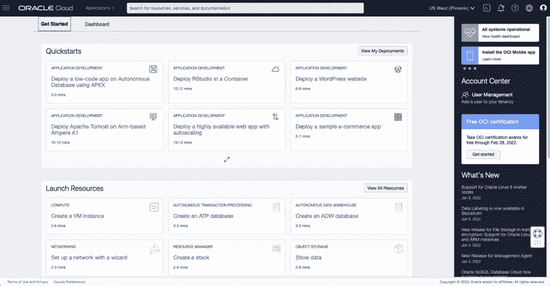

# 创建 Oracle 永远免费的云帐户

> 原文：<https://medium.com/oracledevs/create-an-oracle-always-free-cloud-account-bc6aa82c1397?source=collection_archive---------0----------------------->

克里斯·本森

如果你愿意，你可以在 GitHub [这里](https://github.com/chrisbensen/chris-blogs/blob/main/HowTo/FreeTier/FreeTier.md)阅读这篇博文。

您是否曾经想要一台 24–7 全天候免费运行的服务器！抱歉，那应该是个问题。您是否曾经想要一台 24–7 全天候免费运行的服务器？什么！是的，你可以设置一个免费运行的 Linux 服务器。是的事情！它会做你想做的任何事情。而且是免费的！有什么条件？嗯，你必须注册它，然后它需要一些工作，使它做一件事。但就在几天前，我与某人完全安全地共享了一个文件，而不是通过电子邮件发送。所以，想出一个主意，按照以下四个步骤注册一个免费账户:

1.  去 https://www.oracle.com/cloud/free 的。
2.  点击“免费开始”。
3.  填写表格并创建一个帐户。**注意:**有些地区不具备所有功能。特性矩阵*(这听起来像是来自* [*变形金刚电影*](https://en.wikipedia.org/wiki/Transformers_(film)) *)* 显示了每个地区所有可用特性的列表。
4.  创建您的帐户后，[登录](https://www.oracle.com/cloud/sign-in.html)并转到仪表板。

**注意:**注册时你需要一张信用卡，但是除非你升级你的免费等级账户，否则不会被扣费。您必须将您的帐户更改为付费帐户才能收费。

现在你有一个免费层帐户。关于您的新 Oracle 云帐户，请阅读一些[文档](https://docs.oracle.com/en-us/iaas/Content/FreeTier/freetier_topic-Always_Free_Resources.htm)。