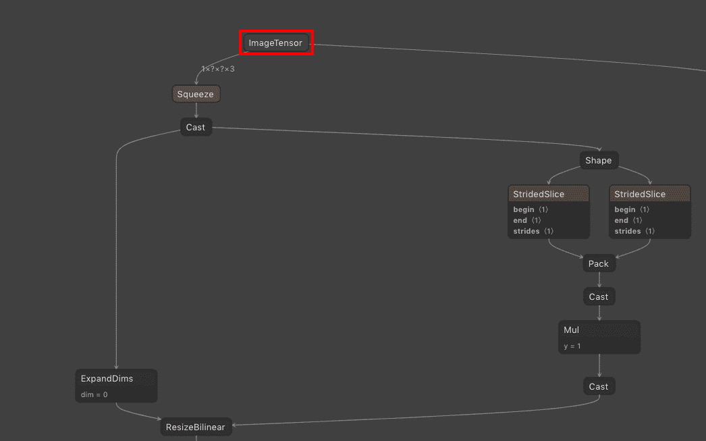
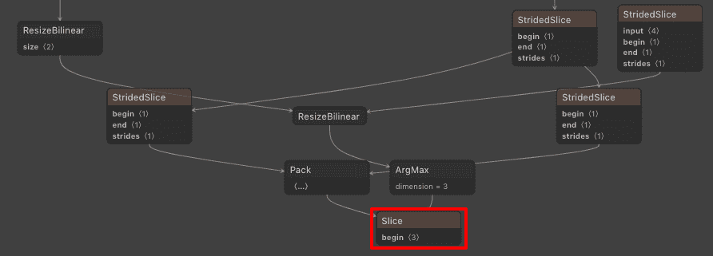
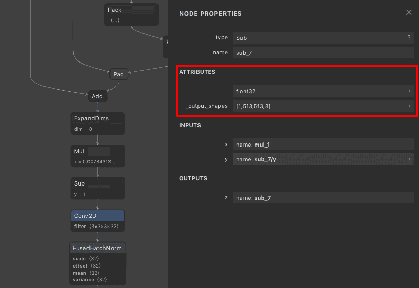
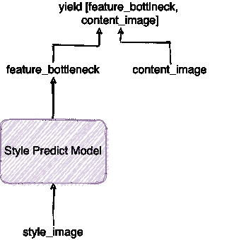
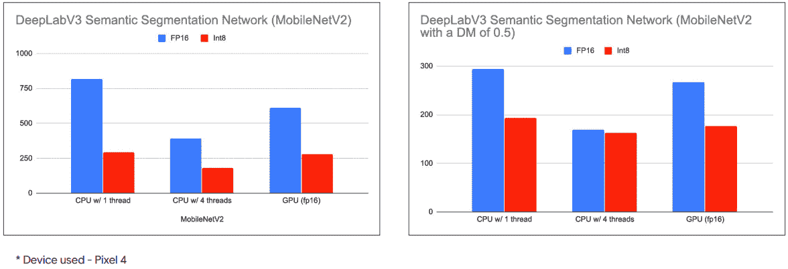
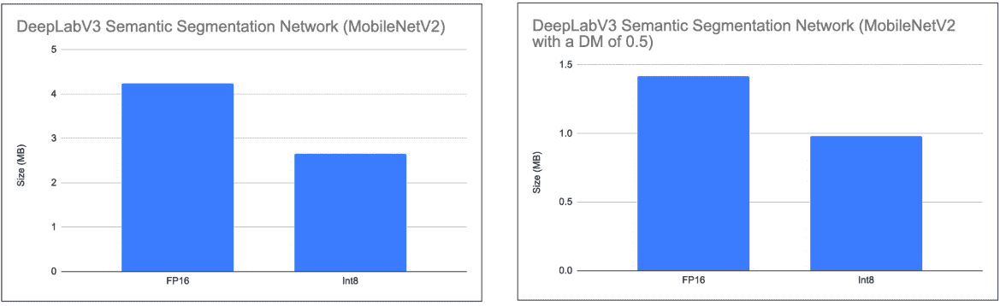
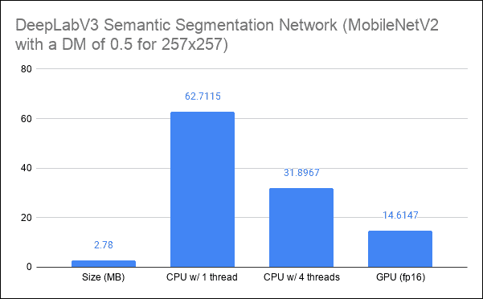
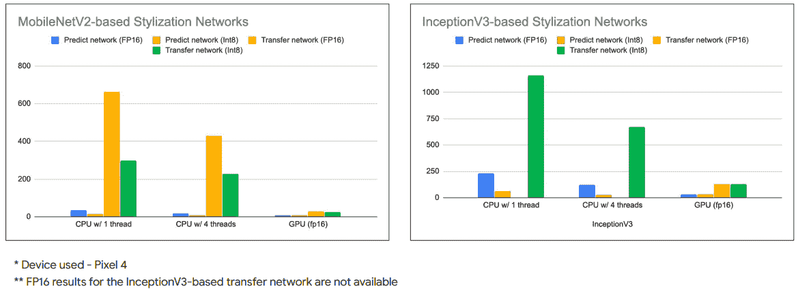
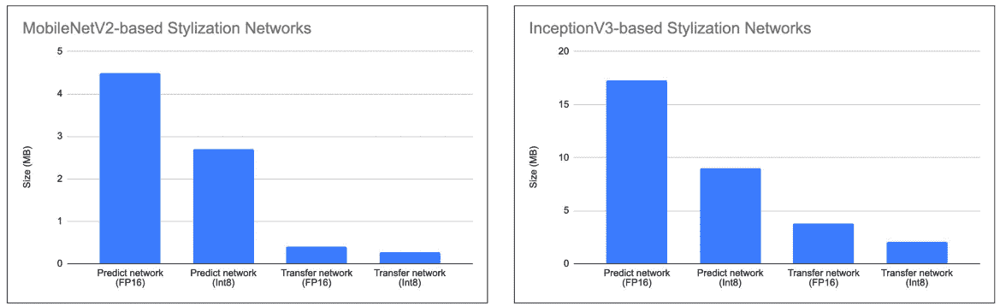

# 通过风格化图像背景创造艺术效果第 2 部分:TensorFlow Lite 模型

> 原文：<https://medium.com/google-developer-experts/create-artistic-effect-by-stylizing-image-background-part-2-tensorflow-lite-models-e614af91944d?source=collection_archive---------1----------------------->

在的[上一篇文章](/@margaretmz/image-background-stylizer-part-1-project-intro-d68c4547e7e3)中，Margaret 介绍了该项目，该项目涵盖了可能有用的不同场景以及其他技术目标。

在本帖中，我们将提供更多关于我们使用的模型的细节，TensorFlow Lite (TFLite)中转换过程的一些主要部分，以及模型的基准测试结果。你可以在这里跟随材料[。](https://github.com/margaretmz/segmentation-style-transfer/tree/master/ml)

> 这个项目的全部代码可以在这个 [GitHub 库](https://github.com/margaretmz/segmentation-style-transfer)中找到。如果你想直接跳到项目的 Android 实现部分，请参考这里的。

# 模型转换

该项目包括两种类型的模型(语义分割模型和风格化模型)，如 intro 博客帖子(TODO: update 链接)中所述。对于细分和风格化模型，我们有许多不同的模型变量可以从 TensorFlow Hub 的模型库中选择([细分模型](https://tfhub.dev/s?deployment-format=lite&module-type=image-segmentation)和[风格化模型](https://tfhub.dev/s?deployment-format=lite&module-type=image-style-transfer))。在本节中，我们将讨论转换过程中的一些主要位。

# 转换语义分割模型

本节介绍的所有代码都在[这个 Colab 笔记本](https://colab.research.google.com/github/sayakpaul/Adventures-in-TensorFlow-Lite/blob/master/DeepLabV3/DeepLab_TFLite_COCO.ipynb)中演示过。语义分割模型基于 [DeepLabV3](https://github.com/tensorflow/models/tree/master/research/deeplab) 。为了执行转换，我们将使用 DeepLab 作者提供的[预训练检查点](https://github.com/tensorflow/models/blob/master/research/deeplab/g3doc/model_zoo.md)。

每个不同的 DeepLab 模型文件都附带以下文件-

*   `frozen_inference_graph.pb`
*   `model.ckpt.data-00000-of-00001`，`model.ckpt.index`

我们将只使用`frozen_inference_graph.pb`，它是一个冻结的推理图。DeepLabV3 检查点分布在三个不同的数据集上——PASCAL VOC 2012、CityScapes 和 ADE20k。你可以从[这里](https://github.com/tensorflow/models/blob/master/research/deeplab/g3doc/model_zoo.md)找到所有可用产品的更多信息。让我们从与 PASCAL VOC 2012 数据集相关联的`mobilenetv2_coco_voctrainval`模型开始。

模型文件可以从这个[链接](http://download.tensorflow.org/models/deeplabv3_pascal_trainval_2018_01_04.tar.gz)下载。文件解压缩后，下面的代码清单生成 TFLite 模型

这里有几件重要的事情需要注意。如果我们检查 [Netron](https://github.com/lutzroeder/netron) 中的`frozen_inference_graph.pb`文件来检查图形的输入和输出张量，我们会看到以下内容

Fig 1: Input tensor of the frozen graph

Fig 2: Output tensor of the frozen graph

正如我们可以看到的，我们在上面的代码清单中指定的输入(`sub_7`)和输出(`ResizeBilinear_2`)张量在我们的 SavedModel 中与原始图不同。为什么会这样？

如果你在`sub_7` 之前看到图形的一部分，实际上是做了预处理步骤，允许原始模型图形处理动态形状的图像。目前(截至 2020 年 11 月)，TFLite 模型不支持在 GPU 代理上处理动态形状。因此，为了加快转换后的 TFLite 模型的执行速度，输入张量是这样选择的。这也是我们在将输入图像/视频帧输入到 TFLite 模型之前必须执行这些预处理步骤的原因。下图中，我们可以看到`sub_7` 有一个固定的输出形状——

Fig 3: Input tensor of the SavedModel with a fixed output shape

同样的原因也适用于我们为什么以那种方式选择 TFLite 模型的输出张量。在这种情况下，同样，我们需要实现在`ResizeBilinear_2` 张量之后的原始模型图中执行的步骤(后处理)。此外，正如我们在图 2 中看到的，原始模型图的输出张量通过了一个`ArgMax`操作，该操作还不被 TF Lite 的 GPU 代理所支持。总之，在准备 TFLite 模型时，我们确保了以下几点:

*   排除不能在 TFLite 委托上运行的操作。
*   排除具有动态输出形状的操作。

再次，*注意，在将输入图像/视频帧馈送到 TFLite 模型*之前，我们需要对它们执行 TFLite 模型图中没有包括的操作。

到目前为止，我们应该已经生成了一个反映上述考虑事项的 TFLite 模型文件。DeepLab 模型的 MobileNet 变体在转换为完全可用于移动应用程序的 TFLite 时，大小约为 **2.3 MB** 。

# 转换图像风格化模型

在风格化的例子中，实际上有两种模式在起作用

*   **风格预测模型**，该模型从风格图像(您想要提取其风格的图像)中计算特征瓶颈。
*   **风格转移模型**，从风格图像中提取内容图像和预先计算的特征瓶颈，并实际生成最终的风格化图像。

TensorFlow Lite 主要为模型转换提供三种[训练后量化策略](https://www.tensorflow.org/lite/performance/post_training_quantization)—动态范围、浮点 16 和整数。对于大多数器件，转换过程非常简单，除了整数量化。它要求您提供一个代表性数据集，以便 TFLiteConverter 可以校准动态激活范围。

*你可以参考这个* [*Colab 笔记本*](https://colab.research.google.com/github/sayakpaul/Adventures-in-TensorFlow-Lite/blob/master/Magenta_arbitrary_style_transfer_model_conversion.ipynb) *跟随下面讨论的代码片段。*

对于**风格的预测模型**，这大致转化为下面的代码清单

我们在输入形状前加上前缀，以限制模型接受动态形状。更重要的是，因为我们的最终目标是将这些模型部署到手机上，固定形状的输入通常会带来更好的性能。

对于**风格转移模型**，事情可能看起来更复杂，因为它需要两个不同的输入。这些输入中的一个应该直接从风格预测模型中计算出来。为了在这种情况下执行整数量化，我们需要考虑如何生成代表性数据集。在下图中，我们给出了代表性数据集生成的简要示意图

Fig 4: Schematic of the representative dataset generation process for the style transfer model

在代码中，这看起来像这样-

现在，我们已经有了生成器，我们可以开始实际的模型转换过程-

正如我们所看到的，我们需要为我们的模型将要处理的两个不同的输入指定指数。这些索引是在模型加载时动态生成的。因此，在转换过程中相应地指定它们是很重要的。

*为了在 Python 中使用* `*TFLiteInterpreter*` *对讨论的模型进行推理，您可以跟随笔记本上提到的* [*这里的*](https://github.com/margaretmz/segmentation-style-transfer/tree/master/ml) *。*

# 标杆管理

将模型转换为。tflite，我们使用了[基准测试工具](https://www.tensorflow.org/lite/performance/measurementhttps://www.tensorflow.org/lite/performance/measurement)来获得关于这些 TensorFlow Lite 模型的不同设备特定的统计数据，例如平均推断时间、峰值内存使用量等等。

下图比较了不同细分模型的平均推断时间(毫秒)

Fig 5: Inference latency of the segmentation models

从上图中，我们可以了解该模型在特定设备的不同计算能力下的性能。现在，因为我们的最终目标是在移动应用程序中使用这些模型，所以模型大小非常重要。接下来，我们比较它们的大小-

Fig 6: Model sizes of the segmentation models

此外，我们对用于执行语义分割的官方 TensorFlow Lite 模型进行了基准测试[。该模型基于深度乘数为 0.5 的 MobileNetV2 主干网，但经过 257x257 图像分辨率的训练-](https://tfhub.dev/tensorflow/lite-model/deeplabv3/1/metadata/2)

Fig 7: Model size and inference latency of an official TFLite segmentation model

在对风格化模型进行基准测试后，我们得到了-

Fig 8: Inference latency of the stylization models (click [here](https://i.ibb.co/GpJ6SKZ/Benchmarks-Stylization.png) to see an enlarged version)

Fig 9: Model sizes of the stylization models (click [here](https://i.ibb.co/2ZwSv8T/Model-Sizes.png) to see an enlarged version)

Float16 模型具有在 GPU 上执行更快的明显优势，尽管它们的大小几乎是其他变体的两倍。

为您的应用选择模型时，总是要在*“大小(vs)精度(vs)延迟”*之间进行权衡。但是由于我们的目标运行时间主要是移动电话，我们希望在那里快速生成有趣的艺术图像*我们决定使用最快的型号*

*   *对于语义分割，我们使用了[DeepLabV3](https://tfhub.dev/tensorflow/lite-model/deeplabv3/1/metadata/2)(`mobilenetv2_dm05_coco_voc_trainaug`)的这个变种。*
*   *对于风格化，使用了以下几种——[预测模型](https://tfhub.dev/google/lite-model/magenta/arbitrary-image-stylization-v1-256/fp16/prediction/1)(基于 MobileNetV2 的主干网)[传输模型](https://tfhub.dev/google/lite-model/magenta/arbitrary-image-stylization-v1-256/fp16/transfer/1)(基于 MobileNetV2 的主干网)。*

*如果你有兴趣看看我们是如何使用这些模型的，可以参考这篇由 [George](https://www.linkedin.com/in/george-soloupis/) 撰写的讨论 [Android 实现](https://farmaker47.medium.com/android-part-of-create-artistic-effect-by-stylizing-an-image-segment-2a646da2d39a)的博文，或者这篇讨论 iOS 实现的博文(即将发布)。*

*感谢 Margaret Maynard-Reid 对这篇文章的评论。感谢 TFLite 团队的 [Khanh LeViet](https://twitter.com/khanhlvg) 和 [Meghna Natraj](https://twitter.com/natrajmeghna) 的技术支持。*