# 如何用亚马逊 EMR 创建 Hadoop 集群？

> 原文：<https://medium.com/edureka/create-hadoop-cluster-with-amazon-emr-f4ce8de30fd?source=collection_archive---------0----------------------->

How To Create a Hadoop Cluster with Amazon EMR? -Edureka

在这篇关于如何使用 Amazon EMR 创建 Hadoop 集群的文章中，我们将看到如何轻松运行和扩展 Hadoop 和大数据应用程序。本文将涉及以下几点:

*   如何用亚马逊 EMR 创建 Hadoop 集群？
*   演示:在 AWS 中创建 EMR 集群

继续讨论如何使用 Amazon EMR 创建 Hadoop 集群？

# 如何用亚马逊 EMR 创建 Hadoop 集群？

当我们在谷歌或雅虎上搜索某样东西时，我们确实能在几分之一秒内得到回应。谷歌、雅虎和其他搜索引擎怎么可能如此快速地从不断增长的网络中返回结果呢？搜索引擎在互联网上爬行，下载网页并创建索引，如下所示。对于我们的任何查询，他们使用索引来找出包含我们正在搜索的文本的所有网页。通过查看下面右侧的索引，我们可以清楚地知道 Hadoop 是有网页 1、2 和 3 的。

如果你想查看更多关于人工智能、DevOps、道德黑客等市场最热门技术的文章，你可以参考 Edureka 的官方网站。

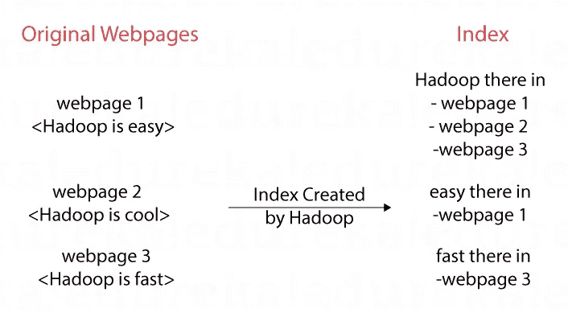

然后，使用基于页面连接方式的 PageRank 算法来计算哪个页面显示在顶部，哪个页面显示在底部。在下面的场景中，W1 是“最受欢迎的”,因为每个人都链接到它，而 W4 是“最不受欢迎的”,因为没有人链接到它。因此，在搜索结果中，W1 显示在顶部，W4 显示在底部。

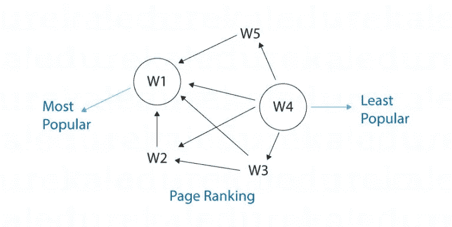

随着网页的爆炸式增长，这些搜索引擎在创建索引和进行网页排名计算方面遇到了挑战。这就是 Hadoop 在雅虎诞生的地方，后来成为 ASF(阿帕奇软件基金会)旗下的 FOSS(自由开源软件)。在 ASF 下，许多公司开始对 Hadoop 感兴趣，并开始致力于改进它。Hadoop 是开启大数据革命的一个软件，但许多其他软件，如 Spark、Hive、Pig、Sqoop、Zookeeper、HBase、Cassandra、Flume 都开始发展，以解决 Hadoop 中的限制和差距。

网络搜索引擎是第一批使用 Hadoop 的，但是后来随着越来越多的数据产生，许多用例开始演变。让我们以一个用于向用户推荐书籍的电子商务应用程序为例。如下图所示，用户 1 购买了图书 1、图书 2 和图书 3，用户 2 购买了一些图书等等。仔细观察，我们可以观察到用户 1 和用户 2 的口味相似，因为他们已经购买了图书 1 和图书 2。因此，可以向用户 2 推荐图书 3，向用户 1 推荐图书 4。这被称为协同过滤，一种机器学习算法。我们可以翻转下图，得到类似的书籍。

在上面的例子中，我们创建了一个索引 PageRank 并推荐给用户，数据的大小很小，所以我们能够可视化数据并从中推断出一些结果。随着数据的规模日益增大并失去控制，这就是 Hadoop 等大数据工具的用武之地。

Hadoop 解决了很多问题，但是安装 Hadoop 和其他大数据软件从来都不是一件容易的事情。有很多配置参数需要调整，比如集成、安装和配置问题。这正是 Cloudera、MapR 和 Databricks 等公司可以提供帮助的地方。他们使安装大数据软件变得更容易，并提供商业支持，例如，假设生产中发生了一些事情。Amazon EMR (Elastic MapReduce)使得使用 Hadoop 等变得更加容易。弹性 MapReduce 这个名字有点用词不当，因为 EMR 也支持其他分布式计算模型，如弹性分布式数据集，而不仅仅是 MapReduce。

在本教程中，我们将探索如何在 AWS 云上设置 EMR 集群，在接下来的教程中，我们将探索如何在其上运行 Spark、Hive 和其他程序。

继续讨论如何使用 Amazon EMR 创建 Hadoop 集群？

# 演示:在 AWS 中创建 EMR 集群

**步骤 1:** 进入 EMR 管理控制台，点击“创建集群”。在控制台中，已终止集群的元数据也可以免费保存两个月。这允许克隆和再次创建终止的集群。

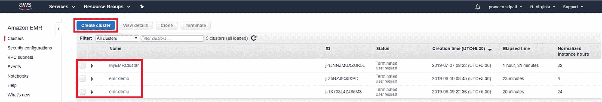

**第二步**:在快捷选项屏幕中，点击“进入高级选项”来指定更多关于集群的细节。

**第三步:**在“高级选项”选项卡中，我们可以选择不同的软件安装在 EMR 集群上。对于 SQL 接口，可以选择配置单元。对于数据流语言接口，可以选择 Pig。对于分布式应用协调，可以选择 ZooKeeper 等等。该选项卡还允许我们添加步骤，这是一项可选任务。步骤是使用 MapReduce、Pig、Hive 等的大数据处理作业。它们可以在此选项卡中添加，也可以在创建集群后添加。单击“下一步”选择 EMR 集群所需的硬件。

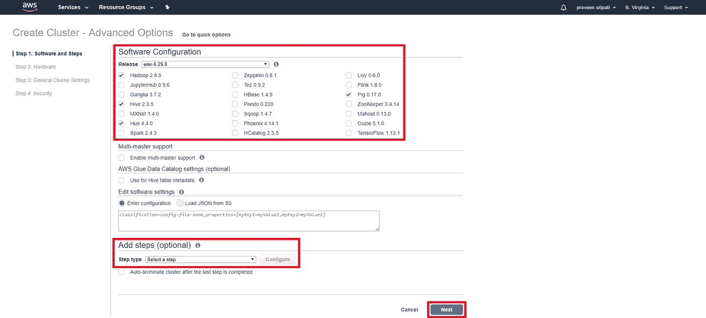

**第 4 步:** Hadoop 遵循主-工架构，其中主节点完成所有协调工作，如调度和分配工作并检查其进度，而工人节点完成处理和存储数据的实际工作。一个主服务器就是一个单点故障(SPOF)。Amazon EMR 支持多主高可用性(HA)。上一步允许在 EMR 中设置多主集群。

EMR 允许两种类型的节点，核心和任务。核心节点用于处理和存储数据，任务节点仅用于处理数据。对于本教程，我们可以只选择一个核心，不选择任务节点，因为这对我们来说成本更低。此外，选择 Spot 实例而不是按需实例，因为 Spot 实例更便宜。Spot 实例的问题在于，它们可以由 AWS 在两分钟的通知后自动终止。这对于实践来说是很好的，在一些实际场景中也是如此。点实例会自动终止，因为它们的优先级低于其他实例类型。点击“下一步”。

**第五步:**指定集群名称。然后点击“下一步”。请注意，“终止保护”在默认情况下是打开的，这可以确保在终止群集时不会通过引入一些步骤来意外删除 EMR 群集。

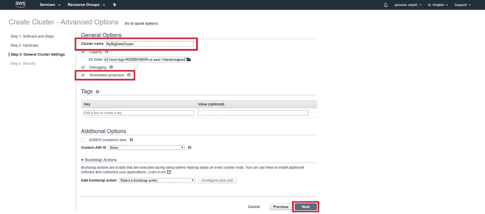

**步骤 6:** 在选项卡中，为 EMR 集群指定不同的安全选项。需要选择密钥对来登录 EC2 实例。EMR 将自动创建适当的角色和安全组，并将它们附加到主 EC2 节点和工作 EC2 节点。点击“创建集群”。

创建集群需要几分钟时间，因为必须购买 EC2 实例，并且必须安装和配置不同的大数据软件。最初，群集状态将处于“正在启动”状态，然后进入“等待”状态。在“等待”状态下，EMR 集群只是在等待我们提交不同的大数据处理作业，如 MR、Spark、Hive 等。

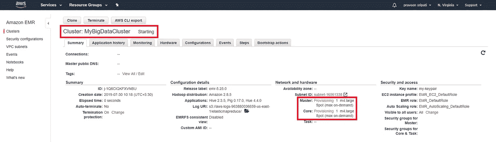

另外，请注意 EC2 管理控制台，主 EC2 实例和工作 EC2 实例应该处于运行状态。这些是作为 EMR 集群创建的一部分而创建的 Spot 实例。同样的 EC2 也可以从 EMR 管理控制台的硬件选项卡中观察到。请注意，在硬件选项卡中，Spot EC2 实例的价格为 0.032 美元/小时。Spot 实例的价格随着时间不断变化，并且比按需 EC2 定价低得多。

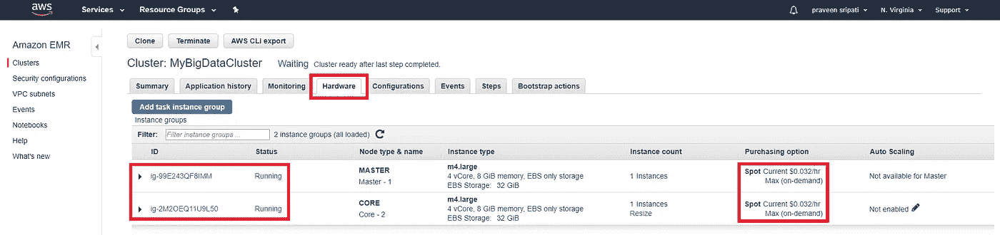

**步骤 7:** 现在已经成功添加了 EMR 集群，可以添加步骤或大数据处理作业了。转到步骤选项卡，点击“添加步骤”并选择步骤的类型(MR、Hive、Spark 等)。我们将在接下来的教程中探讨同样的问题。现在，点击取消。

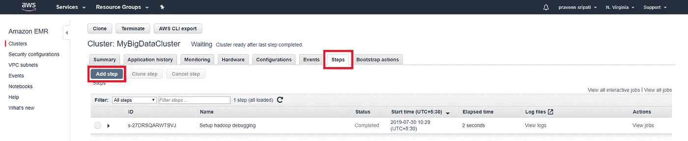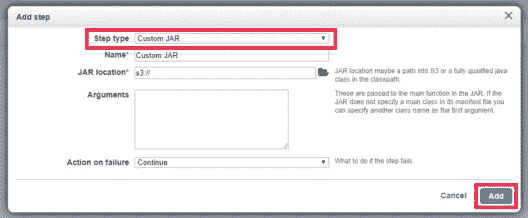

**第 8 步:**现在我们已经看到了如何启动 EMR，让我们看看如何停止它。

**步骤 8.1:** 点击终止。

**步骤 8.2:** 如前所述，EMR 集群的“终止保护”开启，终止按钮被禁用。点击更改。

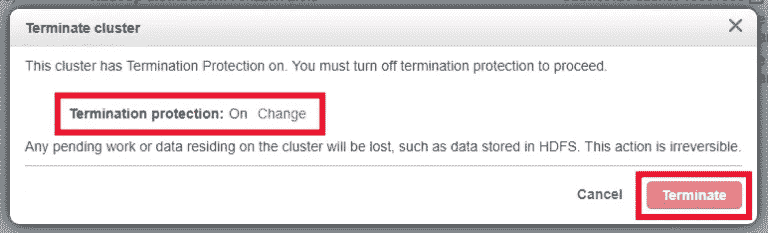

**第 8.3 步:**选择“关闭”单选按钮并点击勾选标记。现在，终止按钮应该被启用。这是 EMR 引入的额外步骤，只是为了确保我们不会意外删除 EMR 集群。

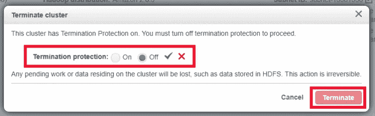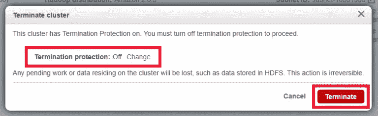

请注意，EMR 集群将处于终止状态，EC2s 将被终止。最后，EMR 集群将被转移到终止状态，我们与 AWS 的计费从此停止。确保终止集群，以免产生额外的 AWS 成本。

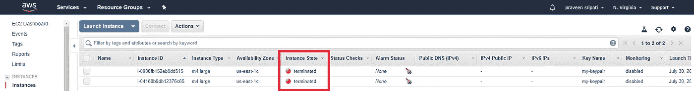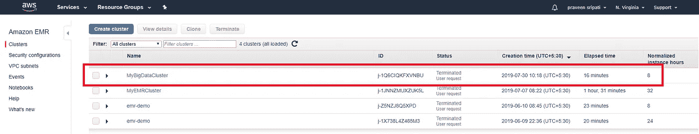

**结论**

在本教程中，我们已经了解了如何在几分钟内从 web 控制台(浏览器)启动 EMR 集群，同样可以使用 AWS CLI、AWS SDK 或使用 AWS CloudFormation 实现自动化。如前所述，设置 EMR 集群只需几分钟，大数据处理可以立即开始，一旦处理完成，输出可以存储在 S3 或 DynamoDB 中，因此集群会关闭以停止计费。由于这种定价模式和易用性，EMR 在那些从事大数据处理的人当中大受欢迎。不需要购买大量的服务器，获得大数据软件的许可证并维护它们。'

伙计们，这就把我们带到了这篇关于如何使用 Amazon EMR 创建 Hadoop 集群的文章的结尾。

如果你想查看更多关于人工智能、Python、道德黑客等市场最热门技术的文章，你可以参考 Edureka 的官方网站。

请留意本系列中解释大数据其他各方面的其他文章。

> 1. [Hadoop 教程](/edureka/hadoop-tutorial-24c48fbf62f6)
> 
> 2.[蜂巢教程](/edureka/hive-tutorial-b980dfaae765)
> 
> 3.[养猪教程](/edureka/pig-tutorial-2baab2f0a5b0)
> 
> 4.[地图缩小教程](/edureka/mapreduce-tutorial-3d9535ddbe7c)
> 
> 5.[h 基础教程](/edureka/hbase-tutorial-bdc36ab32dc0)
> 
> 6. [HDFS 教程](/edureka/hdfs-tutorial-f8c4af1c8fde)
> 
> 7. [Hadoop 3](/edureka/hadoop-3-35e7fec607a)
> 
> 8. [Sqoop 教程](/edureka/apache-sqoop-tutorial-431ed0af69ee)
> 
> 9.[水槽教程](/edureka/apache-flume-tutorial-6f7150210c76)
> 
> 10. [Oozie 教程](/edureka/apache-oozie-tutorial-d8f7bbbe1591)
> 
> 11. [Hadoop 生态系统](/edureka/hadoop-ecosystem-2a5fb6740177)
> 
> 12.[HQL 顶级配置单元命令及示例](/edureka/hive-commands-b70045a5693a)
> 
> 13. [Hadoop 集群搭配亚马逊 EMR？](/edureka/create-hadoop-cluster-with-amazon-emr-f4ce8de30fd)
> 
> 14.[大数据工程师简历](/edureka/big-data-engineer-resume-7bc165fc8d9d)
> 
> 15. [Hadoop 开发人员-工作趋势和薪水](/edureka/hadoop-developer-cc3afc54962c)
> 
> 16. [Hadoop 面试问题](/edureka/hadoop-interview-questions-55b8e547dd5c)

*原载于 2019 年 8 月 5 日*[*www.edureka.co*](https://www.edureka.co/blog/create-hadoop-cluster-with-amazon-emr/)*。*