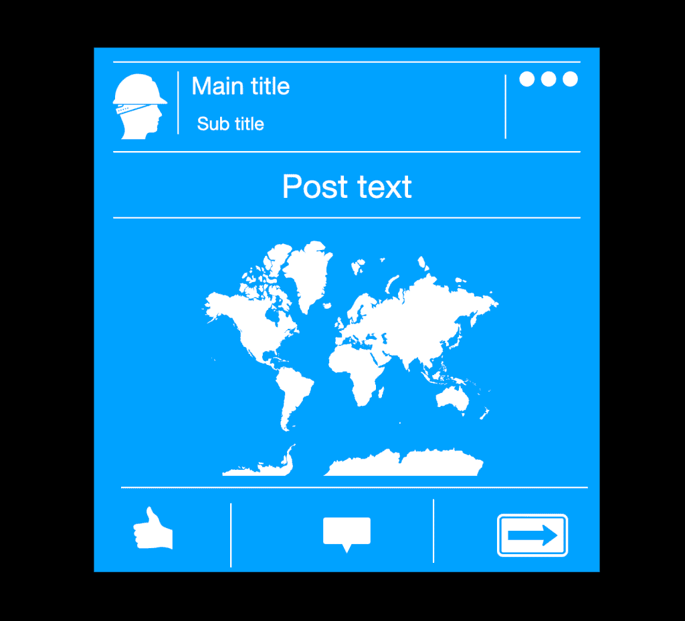

# 用 Angular 为自己的社交网络创建新闻源。

> 原文：<https://medium.com/quick-code/create-news-feed-for-own-social-network-with-angular-a206762827e?source=collection_archive---------0----------------------->

## 社交网络的再造。

**分析**

首先，我们需要分析文章在新闻提要中的外观。每个帖子都有图片，文字，作者，日期和按钮，如评论，分享。如果我们把这些东西分成小块，我们会看到一个网格。

Post schema

基本上每个帖子都是一个小表格，新闻提要是一行表格。

**自举**

因为我们想要一个响应表，所以我们要使用 bootstrap。为此，我们需要在 visual studio 代码的终端编写一个命令*‘NPM install bootstrap’*，并在配置文件“ *angular.json* ”中添加一个引导 css 文件的路径。

angular.json

**表**

我们需要制作 2 个组件:新闻订阅和发布。在新闻提要组件中，我们将传递一组帖子。post 组件中的表格将有 4–5 行和 3 列。有些单元格有几行，我们将在单元格内制作一个小表格。

对于发电组件，我们将使用 angular CLI。在终端中，我们编写了两个命令' *ng g c news-feed* '、*ng g c news-feed/post-feed*'。下一步是制作一个表的原型，为此我们需要使用引导类' *row* '、 *col* '、 *container* '。

Table prototype

**型号**

模型包含我们帖子的信息。我们只需要将它作为一个组件传入并绑定它。

在' *AppComponent* '中，我们将创建一个帖子模型数组，并将其传递到新闻提要中。

app component

新闻订阅组件有一个发布周期。我喜欢有几个组件，因为每个组件都有不同的职责。

news feed component

**最后一个细节**

我们已经有了骨架，剩下的只是添加肌肉。我说的肌肉是指设置额外的风格。

Bootstrap 库非常强大。它包含按钮、填充和图标的样式。

First part of post with bootstrap styles

Second part of post with bootstrap styles

为了让头像变圆，我们会创造自己的风格。

Styles for avatar photo

最后一步是用测试数据创建一个模型。

Test data

**结果**

从社交网络创建新闻源并不困难。

如果你需要仔细看看项目[，这里有链接。](https://github.com/8Tesla8/news-feed)

*原载于 2020 年 11 月 22 日 http://tomorrowmeannever.com***。**