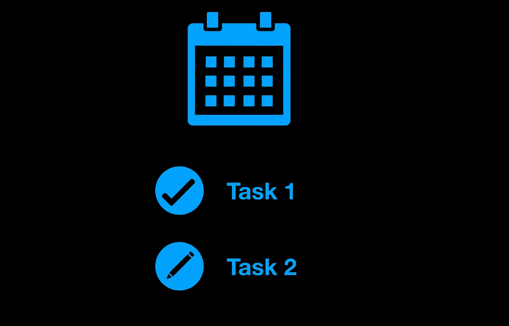

# 用 Angular 创建自己的任务管理器很简单

> 原文：<https://medium.com/quick-code/create-own-task-manager-with-angular-is-simple-d0fde1b39d56?source=collection_archive---------0----------------------->

## 角度示例

## 简单任务管理器

创建任务管理器是一项大任务。我们需要把这个大任务分成几个小任务。

我们将制作几个模型，服务和组件。

每个任务管理器都有一个日历。日历有周，周有天，天有任务。那将是我们的模型。

task.ts

day.ts

week.ts

month.ts

现在我们有了项目的所有模型。下一步是创建一个服务，它将创建包含周和天的月。

calendarCreator.service.ts

类'日期'给我们所有需要的信息开始，如当月指数和今年。我们将把主逻辑放入方法“getMonth(monthNumber: number，year: number)”

在这个方法的开始，我们需要创建一个新的月份并初始化它，设置月份号，年份，月份中的天数。

Creation of new Month

接下来，我们需要为周创建一个循环(61 行)。在周而复始中我们需要再放一个周而复始的日子(76 行)。

大多数月份不是从星期六开始的。我们需要输入上个月的第一周，这发生在第 67 行。在第 68 行，我们定义了一个月的第一天，然后我们使用了函数' getDay()'，这个函数给了我们一个工作日的索引，之后我们进行了一个循环，在这个循环中我们创建了上个月的空的几天。

我们的模型已经建立，给我们一个月的服务也准备好了。是时候制作一个组件并向用户显示日历了。

分量不会很大。在其中，我们只需在选定的日期和切换月份中创建一个新任务。当前实现不能在几天内保存任务，为此我们可以创建一个“TaskSaver”服务，将任务保存在 json 文件中，然后加载。

calendar.component.ts

我认为展示日历的最好方式是使用表格。每个单元格代表一天的任务。

calendar.component.html

Result

因此，我们用日历制作了一个非常好的任务管理器。这个项目非常容易扩展和更改，因为它被划分为不同的部分，如模型、服务和组件。

如果你需要仔细看看项目[，这里有链接](https://github.com/8Tesla8/angular-calendar)。

*原载于 2019 年 12 月 8 日*[*【http://tomorrowmeannever.wordpress.com】*](https://tomorrowmeannever.wordpress.com/2019/12/08/create-own-task-manager-with-angular-is-simple/)*。*