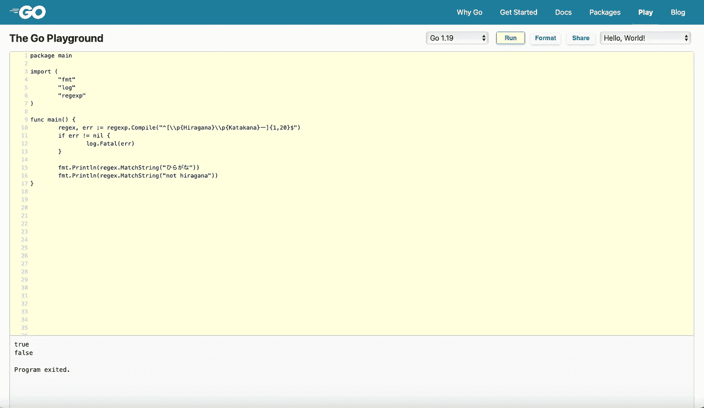
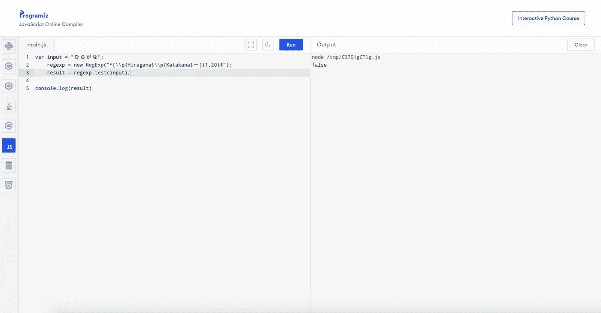

# 创建脚本来检查 JavaScript 和 Golang 正则表达式

> 原文：<https://medium.easyread.co/create-script-to-check-javascript-and-golang-regex-1bfa047586a7?source=collection_archive---------3----------------------->


Golang & JavaScript Regex Compability

# 介绍

大家好！还是跟我分享一些软件工程领域中关于技术相关的经验，想法，或者看法。在本文中，我想分享如何使用 Golang 创建一个脚本来检查 JavaScript 和 Golang 的正则表达式！

# 背景问题

我有一个使用 Golang 作为后端服务的项目经验，在前端，我们使用 JavaScript。我们有一个使用正则表达式来验证一些输入的特性。正则表达式存储在数据库中，后端和前端都使用相同的正则表达式来验证输入。

但是我们有时发现正则表达式对双方都不起作用。就像它在后端工作，但在前端不工作。例如，这个正则表达式:

```
^[\p{Hiragana}\p{Katakana}ー]{1,20}$
```

这是使用 Go 运行时的结果(工作正常):



Regex test using Go

然而，使用 JavaScript 会产生相反的结果:



Regex test using JavaScript

# 解决办法

那么如何检查它的解决方案是创建一个脚本来验证两种语言的兼容性。

在 Golang 中，有一个运行 JavaScript 代码的库叫做 otto。包 otto 是一个用 Go 原生编写的 JavaScript 解析器和解释器。因此，我们可以在 Golang 中创建一个脚本，并对两者进行验证！

如果您想了解更多关于 otto 的信息，请查看以下链接:

[](https://github.com/robertkrimen/otto) [## GitHub-robertkrimen/Otto:Go(golang)中的 JavaScript 解释器

### Go (golang)中的一个 JavaScript 解释器。在 GitHub 上创建一个帐户，为 robertkrimen/otto 开发做贡献。

github.com](https://github.com/robertkrimen/otto) 

下面是我用来检查正则表达式的脚本:

当使用一些输入参数运行脚本时，我们可以像这样检查:

```
go run main.go -regex='^[\p{Hiragana}\p{Katakana}ー]{1,20}$' -input='ひらがな'
2022/10/28 17:47:21 [PASS][Golang] input: "ひらがな" regex: "^[\p{Hiragana}\p{Katakana}ー]{1,20}$"
2022/10/28 17:47:21 [FAIL][JavaScript] input: "ひらがな" regex: "^[\p{Hiragana}\p{Katakana}ー]{1,20}$"
2022/10/28 17:47:21 ### Found some failed check on a regex!! ###
exit status 1
```

耶！成功了！然后我们使用上面的代码来检查我们拥有的每个正则表达式。

# 关闭

这种情况下的 otto 实现只是一小段代码。所以如果你想用这个库探索更多的想法，请随意！

基本上，这个实验的结论是，如果我们需要验证 Golang 和 JavaScript 的一些代码，我们可以很容易地使用 Golang 和库在 Golang 代码中运行 JS 代码。

感谢您的阅读！希望这篇文章对你有用！！