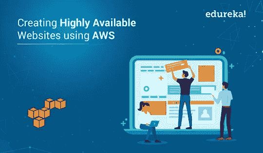
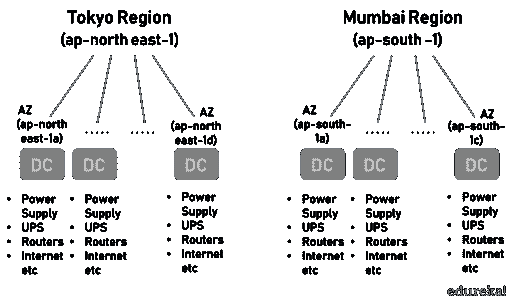
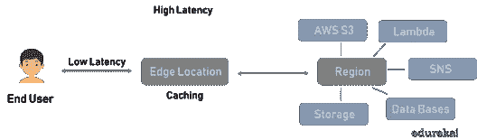
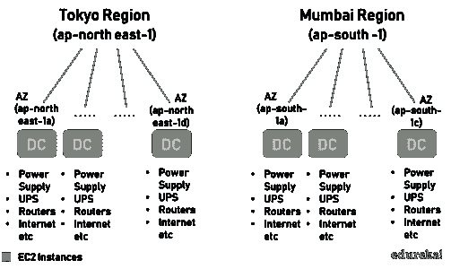

# 使用 AWS 基础设施创建高可用性网站

> 原文：<https://medium.com/edureka/create-websites-using-aws-1577a255ea36?source=collection_archive---------0----------------------->

在这个时代，向电子商务的转变正在以非常快的速度发生。这些电子商务公司，无论大小，都希望他们的网站能够一年 365 天 24 小时正常运行，不会失去客户和业务。例如，想象一下 Amazon.com 下沉了几个小时。

这就是云计算的用武之地。云提供了构建高可用性(HA)和容错应用程序的灵活性，这是内部数据中心所无法实现的。云供应商在多个地理位置拥有冗余数据中心，以帮助我们构建高可用性网站。这同样适用于任何需要一直运行的业务关键型应用程序。目前， [AWS 全球基础设施](https://aws.amazon.com/about-aws/global-infrastructure/)覆盖 21 个地理区域，有 66 个可用区域(AZ ),在不久的将来会有更多的区域和 AZ 出现。在本文中，我们将重点关注在云中构建 HA 应用程序。

# AWS 全球基础设施

AWS 全球基础设施具有:

*   区域和可用区域(AZ)
*   AZs 中的数据中心
*   边缘位置

让我们详细讨论其中的每一个。

# 区域和可用性区域

每个区域都是一个地理区域，有一个以上的孤立位置，称为可用区(AZ)。每个 AZ 可以是一个或多个数据中心的组合。例如，北弗吉尼亚是一个代码为 us-east-1 的地区，有 6 个 AZ。你可以在 [AWS 文档](https://docs.aws.amazon.com/AWSEC2/latest/UserGuide/using-regions-availability-zones.html)中了解更多关于地区的信息。

如上图所示，有多个 AWS 区域。每个区域至少有两个 az。每个 AZ 都有多个数据中心。

***注:****AWS 中的一些资源是全球性的，而一些则是区域性的。当我们创建 IAM 用户时，它是全局的，而当我们创建 EC2 实例时，它是区域性的。在创建 EC2 实例时，我们可以选择区域和 AZ。这与 IAM 用户不同，因为它是全局的。*

# 可用性区域中的数据中心

亚马逊对 DC 的选址非常保密，但 AZs 的情况并非如此。

**例如**，孟买 AZ ap-south-1a 可能在孟买的东部，ap-south-1c 可能在西部。这样，如果一个 az 周围发生了洪水或火灾之类的自然灾害，也不会影响到其他 az。此外，每个数据中心(DC)都有自己的冗余电源、UPS、路由器、互联网连接等，以避免任何单点故障。两个 DC 之间没有公共基础设施，DC 通过高速互联网连接进行连接，以实现低延迟。

在创建资源时，AWS 为我们提供了一个选择区域和 AZs 的选项，但不能选择其中的 DC。以下因素用于选择 AWS 区域。

*   定价(北弗吉尼亚地区是最古老和最便宜的地区)
*   安全性和合规性要求
*   用户/客户位置
*   服务可用性
*   潜伏

***注:*** *对于学习 AWS 来说，北弗吉尼亚州是最好的，因为它是最便宜的 AWS 地区之一，并且通常是第一个支持任何新的 AWS 功能供我们尝试的地区。*

# 边缘位置

在 AWS 全球基础设施中，[边缘位置](https://aws.amazon.com/cloudfront/features/)用于缓存静态和流数据。目前，在 30 个国家的 69 个城市中有 187 个存在点(176 个边缘位置和 11 个区域边缘缓存)的全球网络。与 AZs 相比，边缘位置的数量几乎是其三倍，并且靠近最终用户。这使得边缘位置非常适合缓存数据，而区域则适合托管 web 服务器、数据库等。

与这些区域相比，这些边缘位置提供了更低的延迟。当用户发出请求时，边缘位置检查数据是否在本地，如果不在，则从适当的区域获取数据，将其存储在本地，然后将其传递给用户。

边缘位置是由 AWS CloudFront 服务提供的 AWS 术语。AWS 边缘位置一般被称为 PoP(存在点)。Akamai、Cloudflare 等内容分发网络(CDN)提供商也提供类似的服务。这些 CDN 提供商在直播比赛期间缓存数据，如流媒体视频，为最终用户提供更好的体验。下表比较了 AWS 和通用术语。

# 使用 AWS 全球基础设施创建高度可用的应用程序

AWS 全球基础设施提供了一组区域、az 和边缘位置，以创建高可用性和容错应用程序。

## 例子

如果 web 服务器托管在一个 AZ 中，那么该 AZ 的任何问题都会导致网站不可用。为了解决这个问题，web 服务器可以部署在同一个区域内的多个 az 中，如下所示。同样，任何地区的问题也会使网站不可用。为了使网站更加可用，我们可以让 web 服务器跨多个地区，这样网站的可用性就不依赖于单个地区的可用性。

HA 网站和应用程序是通过使用冗余创建的，但冗余的问题是它是有成本的。我们需要在多个地点运行同一个网站。同样，同一个 web 服务器可以部署在其他云中，比如 GCP 或 Azure。在这里，我们在不同的云中运行相同的 web 服务器，因此这种配置称为多云配置。Google Anthos 使用 Kubernetes 帮助构建混合和多云应用程序。

当我们有跨多个位置的 web 服务器时，流量是如何在它们之间分配的？我们不能让他们无所事事。这就是 AWS 弹性负载平衡器发挥作用的地方。AWS ELB 接收来自最终用户的请求，并将其分发到多个 web 服务器。

# 结论

虽然建立我们自己的 DC 可以灵活地设计我们的硬件和软件，但这需要时间和金钱。通过利用 AWS，通过几次点击或 API 调用，我们可以创建一个高度可用、安全、容错、可靠、高性能的应用程序。谷歌、亚马逊、微软等不同的云供应商已经花费数十亿美元在不同的地理位置建立新的 DC。

如果你想查看更多关于人工智能、DevOps、道德黑客等市场最热门技术的文章，你可以参考 Edureka 的官方网站。

请留意本系列中的其他文章，它们将解释 AWS 的各个方面。

> *1。* [*AWS 教程*](/edureka/amazon-aws-tutorial-4af6fefa9941)
> 
> *2。* [*AWS EC2*](/edureka/aws-ec2-tutorial-16583cc7798e)
> 
> *3。*[*AWS Lambda*](/edureka/aws-lambda-tutorial-cadd47fbd39b)
> 
> *4。* [*AWS 弹性豆茎*](/edureka/aws-elastic-beanstalk-647ae1d35e2)
> 
> *5。* [*AWS S3*](/edureka/s3-aws-amazon-simple-storage-service-aa71c664b465)
> 
> *6。* [*AWS 控制台*](/edureka/aws-console-fd768626c7d4)
> 
> *7。* [*AWS RDS*](/edureka/rds-aws-tutorial-for-aws-solution-architects-eec7217774dd)
> 
> *8。* [*AWS 迁移*](/edureka/aws-migration-e701057f48fe)
> 
> *9。*[*AWS Fargate*](/edureka/aws-fargate-85a0e256cb03)
> 
> 10。 [*亚马逊 Lex*](/edureka/how-to-develop-a-chat-bot-using-amazon-lex-a570beac969e)
> 
> 11。 [*亚马逊光帆*](/edureka/amazon-lightsail-tutorial-c2ccc800c4b7)
> 
> *12。* [*AWS 定价*](/edureka/aws-pricing-91e1137280a9)
> 
> *13。* [*亚马逊*](/edureka/amazon-athena-tutorial-c7583053495f)
> 
> 14。[*AWS CLI*](/edureka/aws-cli-9614bf69292d)
> 
> 15。 [*亚马逊 VPC 教程*](/edureka/amazon-vpc-tutorial-45b7467bcf1d)
> 
> 15。T38*AWS vs Azure*
> 
> *17。* [*内部部署 vs 云计算*](/edureka/on-premise-vs-cloud-computing-f9aee3b05f50)
> 
> *18。* [*亚马逊迪纳摩 DB 教程*](/edureka/amazon-dynamodb-tutorial-74d032bde759)
> 
> *19。* [*如何从快照恢复 EC2？*](/edureka/restore-ec2-from-snapshot-ddf36f396a6e)
> 
> *20。* [*AWS 代码提交*](/edureka/aws-codecommit-31ef5a801fcf)
> 
> *21。* [*顶级 AWS 架构师面试问题*](/edureka/aws-architect-interview-questions-5bb705c6b660)
> 
> *22。* [*如何从快照恢复 EC2？*](/edureka/restore-ec2-from-snapshot-ddf36f396a6e)
> 
> *23。* [*亚马逊路线 53*](/edureka/amazon-route-53-c22c470c22f1)
> 
> *24。* [*用 AWS WAF 保护 Web 应用*](/edureka/secure-web-applications-with-aws-waf-cf0a543fd0ab)
> 
> 25. [*亚马逊简历*](/edureka/aws-resume-7453d9477c74)

*原载于 2019 年 8 月 27 日*[*www.edureka.co*](https://www.edureka.co/blog/creating-highly-available-ha-websites-using-aws-global-infrastructure/)*。*