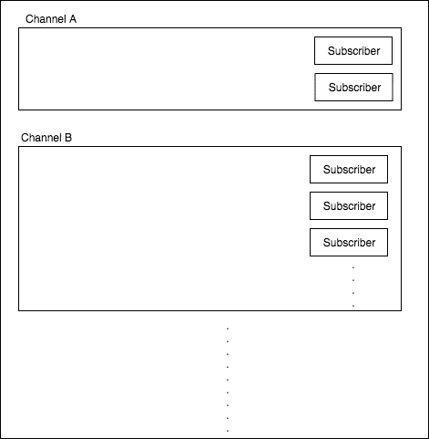
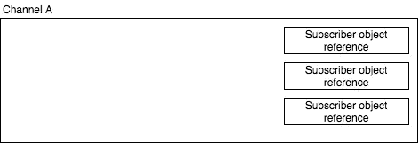
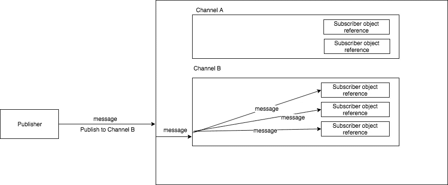

# 创建自己的 Java PubSub 库

> 原文：<https://medium.easyread.co/create-your-own-java-pubsub-library-fbee21d0bb44?source=collection_archive---------0----------------------->


你听说过发布-订阅模式吗？你试过使用它吗？
在[软件架构](https://en.wikipedia.org/wiki/Software_architecture)、**发布-订阅**是一种消息传递模式，消息的发送者(称为发布者)不将消息直接发送给特定的接收者(称为订阅者)，而是将发布的消息分类，而不知道可能有哪些订阅者(如果有的话)。类似地，订阅者表达对一个或多个类别的兴趣，并且仅接收感兴趣的消息，而不知道存在哪些发布者(如果有的话)。我知道你一定对所有这些解释感到厌烦。因此，让我们立即讨论实施。


People said Mark Zuckerberg drink alcohol while creating facebook

# 编码时间

所以我们想建立一个简单的 pubsub 库。
在此之前，我要解释一些术语:

*   **Channel** :表示可调用的订户集合的概念。
*   **订阅者:**代表消息的接收者
*   **发布者:**代表消息的发送者

这里我没有介绍多线程和消息队列。

感谢等待，这是我们强大而简单的 pubsub:

```
import java.lang.ref.WeakReference;
import java.util.concurrent.ConcurrentHashMap;

public class Event {
    static {
        *init*();
    }

    static Operation *operation*;

    static ConcurrentHashMap<String, ConcurrentHashMap<Integer, WeakReference<Object>>> *channels*;

    static void init() {
        *channels* = new ConcurrentHashMap<>();
        *operation* = new Operation();
    }
}
```

```
import java.lang.annotation.Annotation;
import java.lang.ref.WeakReference;
import java.lang.reflect.Method;
import java.util.Map;
import java.util.concurrent.ConcurrentHashMap;

public class Operation extends Event {
    void subscribe(String channelName, Object subscriber) {
        if (!*channels*.containsKey(channelName)) {
            *channels*.put(channelName, new ConcurrentHashMap<>());
        }

        *channels*.get(channelName).put(subscriber.hashCode(), new WeakReference<>(subscriber));
    }

    void publish(String channelName, Post message) {
        for(Map.Entry<Integer, WeakReference<Object>> subs : *channels*.get(channelName).entrySet()) {
            WeakReference<Object> subscriberRef = subs.getValue();

            Object subscriberObj = subscriberRef.get();

            for (final Method method : subscriberObj.getClass().getDeclaredMethods()) {
                Annotation annotation = method.getAnnotation(OnMessage.class);
                if (annotation != null) {
                    deliverMessage(subscriberObj, method, message);
                }
            }
        }
    }

    <T, P extends Post> boolean deliverMessage(T subscriber, Method method, Post message) {
        try {
            boolean methodFound = false;
            for (final Class paramClass : method.getParameterTypes()) {
                if (paramClass.equals(message.getClass())) {
                    methodFound = true;
                    break;
                }
            }
            if (methodFound) {
                method.setAccessible(true);
                method.invoke(subscriber, message);
            }

            return true;
        } catch (Exception e) {
            e.printStackTrace();
        }

        return false;
    }
}
```

```
import java.lang.annotation.ElementType;
import java.lang.annotation.Retention;
import java.lang.annotation.RetentionPolicy;
import java.lang.annotation.Target;

@Retention(RetentionPolicy.*RUNTIME*)
@Target(ElementType.*METHOD*)
public @interface OnMessage {
}
```

```
abstract class Post {
    String message;

    Post(String message) {
        this.message = message;
    }
}
```

如何使用所有这些代码？下面是用法示例:

您应该创建一个订户类。这样你就能收到发布的消息。非常简单，只需将 OnMessage 注释放在方法上。

```
class Subscriber {
    int id;
    public Subscriber(int id) {
        this.id = id;
    }

    @OnMessage
    private void onMessage(Message message) {
        System.*out*.println(message.message);
    }
}
```

然后，您需要创建一个表示您发送的消息的类。

```
class Message extends Post {
    String message;

    public Message(String message) {
        super(message);
    }
}
```

初始化 subscriber 类，这样就可以拥有一个 subscriber 对象。

```
Subscriber subscriber = new Subscriber(1);
Subscriber subscriber2 = new Subscriber(2);

Subscriber subscriber3 = new Subscriber(3);
Subscriber subscriber4 = new Subscriber(4); 
```

使用 subscriber 对象订阅特定的频道。假设您订阅了 3 个不同频道，每个频道有不同的订户。

```
Event.*operation*.subscribe("action#create", subscriber);
Event.*operation*.subscribe("action#create", subscriber2);

Event.*operation*.subscribe("action#update", subscriber3);
Event.*operation*.subscribe("action#delete", subscriber4); 
```

然后创建一个消息对象并发布它。

```
Message message = new Message("Create Action");
Message message2 = new Message("Update Action");

Event.*operation*.publish("action#create", message);
Event.*operation*.publish("action#update", message2);
```

# 魔法是如何运作的？

我只是使用一个简单的 ConcurrentHashMap 来存储频道。每个频道将包含不止一个用户。



The illustration of ConcurrentHashMap of channel and subscriber

当您订阅特定频道时，订阅者对象引用将与该频道配对。假设您将 3 个 subscribe 对象订阅到通道 a 中，情况如下:



When you try to subscribe into a Channel with 3 subscriber object

Publish 是一个功能，它通过查找存储在特定通道中的所有订户对象，并使用订户对象引用来调用它。假设你在 b 频道发布了一条消息，大概是这样的:



When you try to publish into specific channel

上图与该类相关:

```
import java.lang.annotation.Annotation;
import java.lang.ref.WeakReference;
import java.lang.reflect.Method;
import java.util.Map;
import java.util.concurrent.ConcurrentHashMap;

public class Operation extends Event {
    .........
    void publish(String channelName, Post message) {
        for(Map.Entry<Integer, WeakReference<Object>> subs : *channels*.get(channelName).entrySet()) {
            WeakReference<Object> subscriberRef = subs.getValue();

            Object subscriberObj = subscriberRef.get();

            for (final Method method : subscriberObj.getClass().getDeclaredMethods()) {
                Annotation annotation = method.getAnnotation(OnMessage.class);
                if (annotation != null) {
                    deliverMessage(subscriberObj, method, message);
                }
            }
        }
    }

    <T, P extends Post> boolean deliverMessage(T subscriber, Method method, Post message) {
        try {
            boolean methodFound = false;
            for (final Class paramClass : method.getParameterTypes()) {
                if (paramClass.equals(message.getClass())) {
                    methodFound = true;
                    break;
                }
            }
            if (methodFound) {
                method.setAccessible(true);
                method.invoke(subscriber, message);
            }

            return true;
        } catch (Exception e) {
            e.printStackTrace();
        }

        return false;
    }
}
```

# **结论**

构建一个真正简单的发布-订阅模式真的很容易，你甚至可以毫不费力地扩展它。事实上，我创造了这个。我把它叫做 [jnrx](https://github.com/jonathannatanaelsiahaan/jnrx) 。运行在 android 平台上。将来我会让它在 iOS 和 JavaScript 平台上运行。

# 由于

感谢我的猫和我的两个朋友， [Hierony](https://www.facebook.com/hierony.manurung) 和 [Pandu](https://www.facebook.com/pandu.siregar) ，他们总是支持我开源项目的每一项工作。