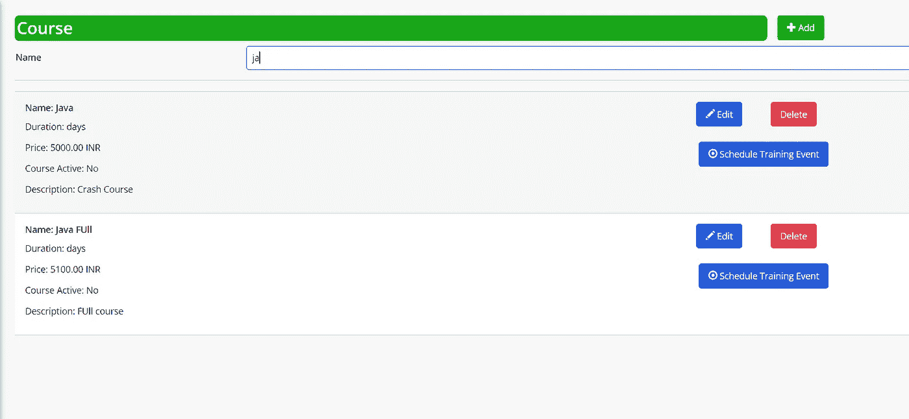

# 在 Mendix 中创建自定义数据过滤器

> 原文：<https://medium.com/mendix/create-your-own-way-of-filter-by-npe-non-persistant-entity-and-microflow-4ffd11e52fb0?source=collection_archive---------0----------------------->

## 仅使用非持久实体和微流。


Creating Custom Data Filters in Mendix

Mendix Marketplace 包含许多小部件，可以用来过滤您的列表视图或数据网格。但是，有时可用的解决方案不能满足您的应用程序的要求，您需要创建自己的定制解决方案。今天我们将学习一种新的方法，通过这种方法，我们可以使用**非持久**实体和一些微流轻松地过滤掉数据。

## 为什么**非持久性实体**？

使用非持久实体(或简称为 **NPE** )，我们可以利用尽可能多的搜索字段，而不必担心数据库中存储的任何数据。在这种情况下，NPE 就派上了用场。此外，您不需要担心任何安全问题，因为您保存在该实体中的任何内容都只能在会话中使用。

## 我们如何实现这一目标？

假设在我们的例子中，我们的系统中有一个很长的课程列表，我们想根据名字对它进行过滤。


## 第一步

转到您的域模型并**创建一个 NPE** ，给它一个合适的名称(*例如 Filter* ，并添加一个您想要过滤列表的属性，在我们的例子中是****Name(String)***。*

> *注意:如果适用，请配置实体访问权限*

**

## *第二步*

*现在，在使用列表视图显示数据的页面上，放置一个数据视图，并将其 source 设置为' *microflow'* (记住将微流命名为适当的名称，如 *ACT_GetFilter)。*通过这种方式，我们可以删除上下文错误，并能够获得我们刚刚创建的 NPE 对象。*

*在我们新创建的微流( *ACT_GetFilter* )，**添加一个创建对象活动**，选择' $ *Filter 【T27 ')，不要忘记从微流中返回对象。**

****

## *第三步*

*从“连接器”选项卡(位于“工具栏”选项卡旁边)，将“名称”属性的文本框添加到数据视图中。*

*这样，我们定制过滤器的基本框架就准备好了。不过，为了实现我们的目标，我们还需要添加一些东西。*

## *第四步*

*在刚刚添加的文本框中，**对其应用一个 on-change 事件**。*

> *注意:有两种行为可以触发 on-change 事件，“当用户离开输入时”和“当用户输入数据时”*
> 
> *对于我们的例子，我们将使用“当用户输入数据时”。*

*双击文本框，切换到对话框中的事件选项卡。*

**

*点击 on-change 事件，**调用一个微流**，将其命名为类似于***ACT _ refresh filter***的东西，这个微流将在文本框内的字符发生变化时刷新过滤器对象。*

## *配置我们的微流程，*

*在微流中，' *ACT_RefreshFilte* r '添加一个更新 NPE 的变更活动。*

*您的微流现在应该是这样的:*

**

*现在，将您的列表视图放入我们新配置的数据视图中，并将列表视图的 d **数据源**设置为 m **微流**。*

*将其命名为 *ACT_GetCourseData* 。在微流程中，**添加一个检索活动**并从数据库中选择课程实体，然后**应用一个 XPath 约束***

```
 ***[contains(Name,$Filter/Name)]***
```

*点击 OK，不要忘记**将新检索的列表设置为返回值**。*

*您当前的页面和微流应该如下所示:*

**

*Final Page design*

**

*Xpath Constaint applied in microflow*

## *全部完成！*

*这样，我们的过滤器功能就完成了！我们可以运行我们的应用程序并测试功能。当我们进入屏幕时，我们可以看到我们的新过滤器，当我们开始在文本框中键入内容时，它应该会开始过滤结果。*

**

*我希望你在即将到来的项目中发现它的有趣和有用之处！！*

## *阅读更多*

 *[## 持久性

### 1 简介域模型中实体的持久属性定义了一个对象是否可以被提交给…

docs.mendix.com](https://docs.mendix.com/refguide/persistability/)*  *[## 非持久对象和垃圾收集

### 本页将解释持久化和非持久化对象的生命周期，以及它们如何通过…

docs.mendix.com](https://docs.mendix.com/refguide/transient-objects-garbage-collecting/)*  *[## XPath

### 通过提供函数和示例来描述如何在 Mendix 中使用 XPath 查询语言。

docs.mendix.com](https://docs.mendix.com/refguide/xpath/)* 

**来自发布者-**

**如果你喜欢这篇文章，你可以在我们的* [*中页*](https://medium.com/mendix) *找到更多喜欢的。对于精彩的视频和直播会话，您可以前往*[*MxLive*](https://www.mendix.com/live/)*或我们的社区*[*Youtube PAG*](https://www.youtube.com/c/MendixCommunity/community)*e .**

**希望入门的创客可以注册一个* [*免费账号*](https://signup.mendix.com/link/signup/?source=direct) *，通过我们的* [*学苑*](https://academy.mendix.com/link/home) *获得即时学习。**

*有兴趣加入我们的社区吗？加入我们的 [*Slack 社区频道*](https://join.slack.com/t/mendixcommunity/shared_invite/zt-hwhwkcxu-~59ywyjqHlUHXmrw5heqpQ) *。**