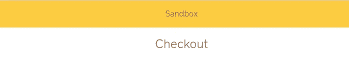
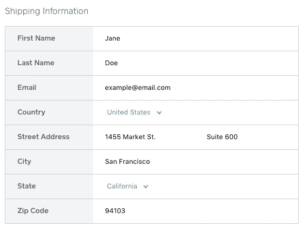
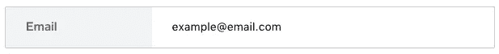

# CreateCheckout 选项说明。

> 原文：<https://medium.com/square-corner-blog/createcheckout-options-explained-278a3093c28c?source=collection_archive---------7----------------------->

> 注意，我们已经行动了！如果您想继续了解 Square 的最新技术内容，请访问我们的新家[https://developer.squareup.com/blog](https://developer.squareup.com/blog)

我们[发布了 Square Checkout](/square-corner-blog/introducing-square-checkout-2991fc713c5c) 作为开发者接受支付的一种方式，而不必处理卡 nonce 或构建支付表单用户界面。在本帖中，我们将深入探讨生成结账表单时可用的不同选项。

*   **访问令牌&位置 ID** 这些可能看起来不像是“选项”本身，但确保您生成的方形结帐表单与正确的位置相关联是很重要的，无论它是否是沙盒位置。如果您使用沙盒访问令牌，您会在顶部看到一个横幅，如下所示:

*   `**idempotency_key**` 幂等是 Square 用来帮助开发人员避免意外收费两次的工具，还有其他一些功能。用同一个幂等键发出的请求将总是重放原来的结果，而不是做任何新的事情。
*   `**order**`订单描述了在结账过程中向买家显示的商品和金额。您可以在[文档](https://docs.connect.squareup.com/api/connect/v2#type-createorderrequest)中阅读更多关于 CreateOrderRequest 可用的所有字段的信息。
*   `**ask_for_shipping_address**` 如果您不送货或服务，那么您可能不需要送货地址，但如果您需要，将此字段设置为`true`将显示一个表单，要求送货地址，如下所示:

*   `**pre_populate_shipping_address**`这个字段非常类似:如果你已经有了你的用户的送货地址，你可以预先填充它的地址框，这样你的用户就不必多次输入。
*   `**merchant_support_email**` 这是买家在订单确认页面完成结账后看到的电子邮件。虽然此字段是可选的，但显示电子邮件不是可选的。如果您没有设置，那么将使用您帐户的默认设置。
*   `**pre_populate_buyer_email**` 如果你设置了这个，那么你的买家在结账时会看到这样一个电子邮件字段:

*   `**redirect_url**` *这是你可以在结账表单中设置的最重要的选项之一*，因为它会在交易后将用户重定向回你的网站。有用的交易细节如`checkoutID`、`orderId`、`referenceId`、`transactionId`将作为查询参数附加在 url 上。如果你不设置这个属性，买家会看到一个结帐确认屏幕，但永远不会被重定向回你的网站。

如果你想看到更多这样的提示，请务必遵循 Medium 上的[角](https://medium.com/square-corner-blog)！