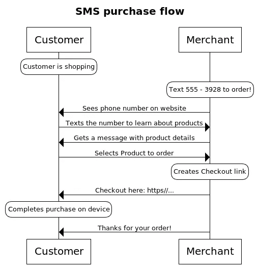
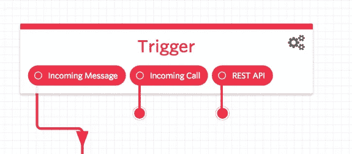
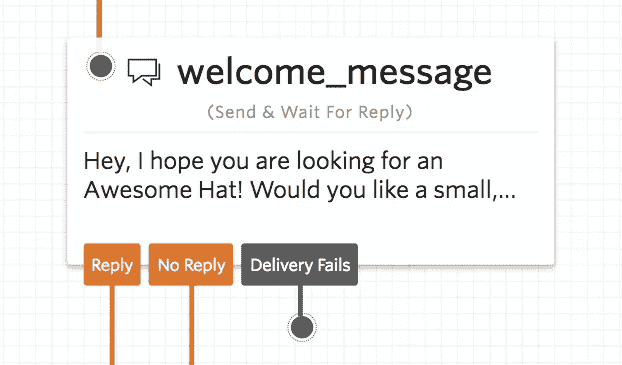
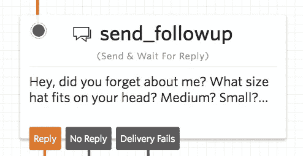
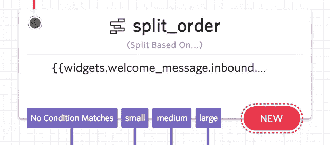
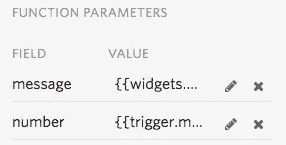
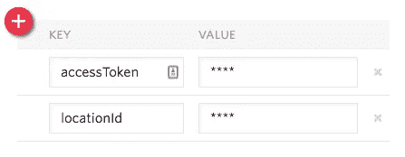
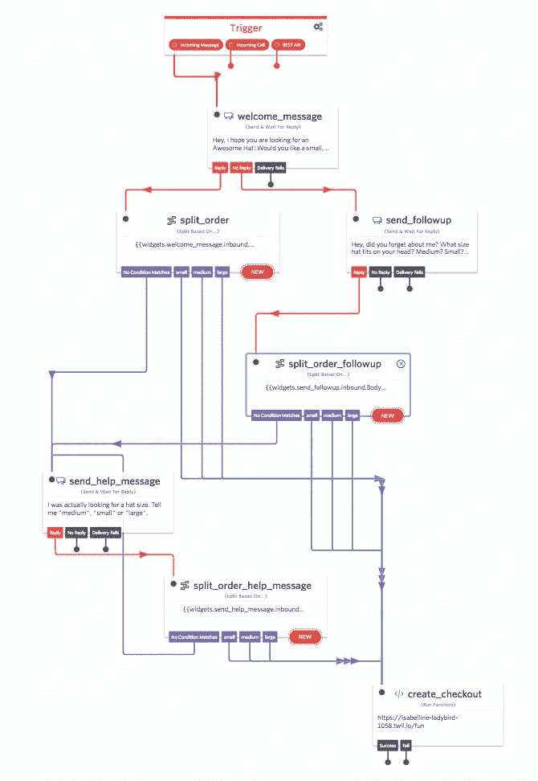

# 创建一个带有 Square Checkout 和 Twilio Studio 的聊天机器人

> 原文：<https://medium.com/square-corner-blog/creating-a-chatbot-with-square-checkout-and-twilio-studio-750c8bddb1f5?source=collection_archive---------5----------------------->

## 了解如何创建一个机器人来与您的客户交谈并帮助销售！

> 注意，我们已经行动了！如果您想继续了解 Square 的最新技术内容，请访问我们的新家[https://developer.squareup.com/blog](https://developer.squareup.com/blog)


# 试试吧！文本(479)-888–5188 与机器人交谈📲

从语音命令到聊天机器人，消费者正在以全新的方式参与(和购买)事物。但这不仅仅是价值数十亿美元的科技公司的事情。新工具使得聊天机器人对于最小的开发者来说也是可行的，因此任何人都可以利用它来提供独特的购买和订购体验。让我们通过短信创建一个基本的基于对话的购买体验，您可以将它用作您自己的基于消息的购买体验的模板。

# 💡这个想法💡

我们最初的目标是一个网上商店，广告一个号码，你可以发短信完成你的购物。当客户发送号码信息时，他们会收到一条脚本信息，其中包含他们可以购买的不同产品。从那里，他们可以选择一个项目，并获得一个链接到一个结帐页面，以完成购买。



为此，我们将构建一个示例聊天机器人来帮助人们从我的虚拟商店 Tristan's Awesome Hats 订购假帽子。我们出售三种尺寸的帽子(小号、中号和大号)，我在我虚构的网站上宣传我的聊天机器人号码`(479)-888–5188`:这个博客帖子。

# Twilio 工作室

我为这个项目选择了 SMS，因为它是美国和世界上最普遍的通信形式之一，但它应该很容易移植到任何其他交易消息平台。Twilio 碰巧发布了一款测试版的新产品，可能非常适合这种用例: [Twilio Studio](https://www.twilio.com/studio) ，这是一款可视化工具，利用了 Twilio 提供的许多其他消息和电话服务，但简化了设置和配置。这是一个很好的选择，因为许多发送和接收逻辑可以用 studio 流直接处理，不需要太多的开发时间。

# 实施流程:

## 扳机



SMS’s will go through the flow, but voice calls and HTTP requests will fail by design.

Twilio Studio 中的单个项目称为流。每个流都有一个触发器，在这种情况下，它将接收一条传入的 SMS 消息。这是我的客户如何进入与机器人的对话:通过发送我附加到这个流的号码。

## **发送欢迎消息**



客户发送号码信息后，就是推销时间了！Tristan's Awesome Hats 只卖一种帽子，但在欢迎词中，我会问一个基本问题来确认订单的尺寸。我将使用一个预制的`Send & Wait For Reply`小部件来完成这项工作。连接到我的传入消息触发器，此小部件将向我的客户发送:

```
Hey, I hope you are looking for an Awesome Hat! Would you like a small, medium, or large hat?
```

## 处理响应

发送消息并等待响应有三种可能的结果:得到回复、没有得到回复和消息失败。

*   如果消息失败，我会认为有可疑的事情在发生&只要结束这个流。
*   如果我没有得到回应，可能是我的顾客分心了，所以我会在一段时间后发送另一条消息，要求他们确认尺寸。



If your memories are leaking out of your head, you might want to buy two!

*   如果他们对此没有回应，那么我会认为他们不再感兴趣——我们可以结束流程。

如果我们确实得到了回复，无论是来自后续跟进，还是来自第一条消息，我们都需要弄清楚客户是否真的订购了一顶帽子，或者他们是否随机回复了一些东西。为了对消息进行一些基本的条件评估，我们可以使用基于… 小部件的 **Split。这个小部件为我们提供了相当多的条件操作符，用于客户的消息正文，比如`equal to`、`contains`，甚至是一个正则表达式。在这种情况下，我们将使用三个“**包含**”转换来查找消息中的词语`small`、`medium`或`large`。**



如果消息中没有指定的大小，我们可以用另一个**Send&Wait For Reply Widget**发送一个要求更清晰的响应:

```
I was actually looking for a hat size. Tell me your size, either  "medium", "small" or "large".
```

如果我们得到了一个尺寸，那么结帐魔术就该发生了。我们将为此使用一个新的小部件，即 **Run 函数**。这将使我们的流程执行我们已经设置好的 [Twilio 函数](https://www.twilio.com/functions)。


Wow! Serverless really is easy!

## 结账功能

Twilo 函数是一个相当新的无服务器环境，可以用 JavaScript 编程。我们不需要建立一个只会等着别人发信息的服务器，Twilo 可以处理更多的认证和运行时设置。我不会去创建函数，因为 Twilio 有很棒的文档，我在之前已经[谈到过它们，但是有一点一定要记住，你需要在](/square-corner-blog/text-for-your-sales-using-twilio-functions-and-square-e30d6537b720) [Twilio 控制台](https://www.twilio.com/console/runtime/functions/manage)中的>配置下添加`square-connect`包，以访问 [Square 的 Javascript SDK](https://github.com/square/connect-javascript-sdk) 。



Twilio Studio 中的 function 小部件允许您将流中的额外数据传递给函数，所以我将传递消息的文本，该消息是客户指定的帽子尺寸和他们发送短信的号码，这样我就可以将它们与 Square 中的事务一起存储。

下面是我的完整函数代码:

让我们来看一些不同的部分:

```
var SquareConnect = require('square-connect');
var Twilio = require('twilio');

var accessToken = context.accessToken;
var locationId = context.locationId;

var messageBody = event.message;
var number = event.number;
```

在第一部分中，我们首先初始化 Square 的 Javascript SDK 和 Twilio 的，然后设置几个变量，稍后我们将在位置和访问令牌中使用这些变量。为了更好的安全性，这些凭证作为环境变量存储在我的函数的 config 页中。它们在运行时通过`context`参数传递给函数。



My environment configuration for the checkout function.

您可以看到，我正在使用我的沙盒访问令牌和位置，因为我不想实际上向任何人收费，也不必获得任何帽子来发货！我从 Studio 流中传入的数据也被分配给一对变量。

```
var defaultClient = SquareConnect.ApiClient.instance;
var oauth2 = defaultClient.authentications['oauth2'];
oauth2.accessToken = accessToken;
var checkoutApi = new SquareConnect.CheckoutApi();
```

在这里，我们完成 SDK 设置的其余部分，设置身份验证并初始化 Square Checkout 的代码。

```
var orderRequest ={
  idempotency_key: new Date().getTime().toString(),
  line_items: [{
    quantity: '1',
    base_price_money:{
      amount: 1500,
      currency: 'USD'
    },
    note:"Ordered via SMS: " + number,
  }]
};
```

这个`orderRequest`保存将为结帐表单创建的[订单](https://docs.connect.squareup.com/articles/orders-api-overview)的数据。此订单只有一个项目，我们是临时创建项目，而不是从我们的目录中指定一个项目。这个机器人的一个很好的扩展可能是从我的商店的项目目录中列出项目，或者让客户通过短信搜索他们想要的项目和变化。

```
var itemName;
if (messageBody.toLowerCase().includes("small")) {
  itemName = "Awesome Hat (small)";
} else if (messageBody.toLowerCase().includes("medium")) {
  itemName = "Awesome Hat (medium)";
} else if (messageBody.toLowerCase().includes("large")) {
  itemName = "Awesome Hat (large)";
} else {
  console.error("Something has gone wrong!");
  callback(null, twiml);
}
```

一个简单的 if-else 块动态设置顺序中项目的名称。如果客户使用`small`、`medium`或`large`指定了一个项目，那么他们应该会看到订单上有所反映。我们也可以很容易地使用这样的逻辑从时间目录中选择特定的项目。

设置好订单后，我们可以用一个幂等键和另一个要求送货地址的选项来充实结帐请求的其余部分，格式如下:

```
var checkoutRequest = {
      idempotency_key: new Date().getTime().toString(),
      order: orderRequest,
      ask_for_shipping_address: true
    }
```

然后，我们将结帐请求(包括上面创建的订单)传递给我们的`checkoutApi`对象的`createCheckout`方法，如下所示:

```
checkoutApi.createCheckout(locationId, checkoutRequest)
```

`createCheckout`函数(以及 SDK 中发出 http 请求的所有函数)返回一个[承诺](https://developer.mozilla.org/en-US/docs/Web/JavaScript/Reference/Global_Objects/Promise)，帮助我们控制执行流程。我们希望向客户发送一条消息，其中包含一个支付产品的链接，但只有在我们创建了指向结账页面的链接之后。为此，我们在链接到`createCheckout()`调用的`then()`中包含了发送消息的逻辑:

因为这个函数运行在 Twilio 的环境中，它已经可以访问核心的 Twilio 功能，所以响应消息所需要的只是将一些带有消息体的 TwiML 传递给回调函数。顾客应该会收到一条带有结帐链接的消息，他们可以用它来购买我的一顶漂亮的帽子。

## 完整的流程

所有组件就绪后，以下是完整的工作室流程:



顾客可以与我的商店交谈，选择帽子尺寸，并通过舒适的信息完成购买。你自己试试！text**(479)-888–5188**来聊聊进入流量说不定还能买到假帽子！(别担心，你肯定不会被收费，而且你几乎肯定不会得到一顶帽子😉。)

我希望你对这篇文章感兴趣！你可以通过[注册](https://www.workwithsquare.com/developer-newsletter.html?channel=Online%20Social&sqmethod=Blog)我们每月的开发者通讯来保持联系。请尝试这一流程，尝试创建您的 one messaging 订购体验，并与 Twitter 上的 [@SquareDev](https://twitter.com/squaredev) 或我们的 [Slack 社区](http://squ.re/slack)分享。