# 用 YOLOv5 在 OCI 上创建一个掩膜检测模型:用 RoboFlow 进行数据标记

> 原文：<https://medium.com/oracledevs/creating-a-cmask-detection-model-on-oci-with-yolov5-data-labeling-with-roboflow-5cff89cf9b0b?source=collection_archive---------0----------------------->

# 介绍

我一直对在我的一些项目中使用 Vision ML 很好奇。我梦想知道特斯拉自动驾驶仪内部是如何工作的，以及我是否可以在人生的某个时刻制作自己的人工智能系统。我厌倦了做梦，所以决定以身作则(动手)学习。

我把重点放在重新学习我所知道的关于视觉 ML 的一切(这就是我所说的以某种方式与机器学习相关的图像/视频处理)。

我认为像这样的文章会让像你这样的人进入这些话题——有时被认为“太难”的话题。通过这几篇文章，我会让你知道自己做这件事并没有那么难(而且也不贵！).

计算机视觉自提出以来一直是一个不断发展的产业，视觉 ML 是计算机视觉的众多组成部分之一。如果您对这样的内容感兴趣，请务必关注我，并继续关注第 2 部分(更多信息在最后)。

今天，我们将学习如何在多媒体中检测不同的面具佩戴状态，包括:

*   一个带着面具的人，我们将其标记为`mask`。
*   一个戴着面具的人，但是*戴错了*(见下面的例子)，我们将其标记为`incorrect`。
*   一个完全没有面具的人，我们称之为`no mask`。

我已经附上了我的模型和相应的结果的一些图像的例子。

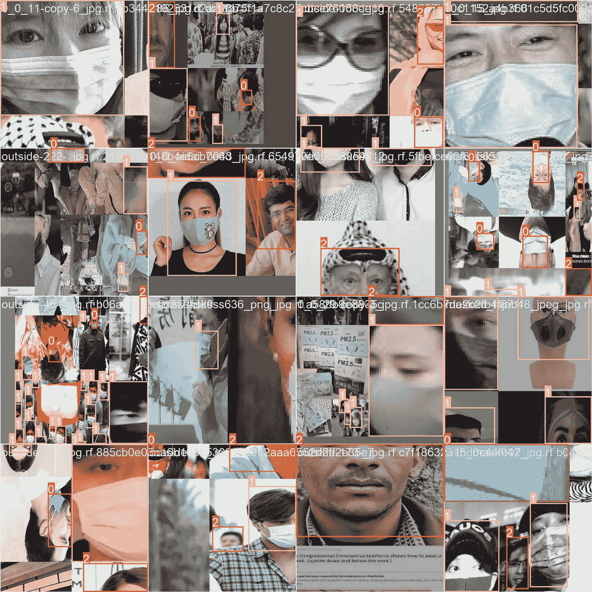

请注意，我们为每个案例标记了这些数据:

*   ‘0’代表`incorrect`。
*   ‘1’代表`mask`。
*   ‘2’代表`no mask`。

我们将在文章中更深入地讨论细节。

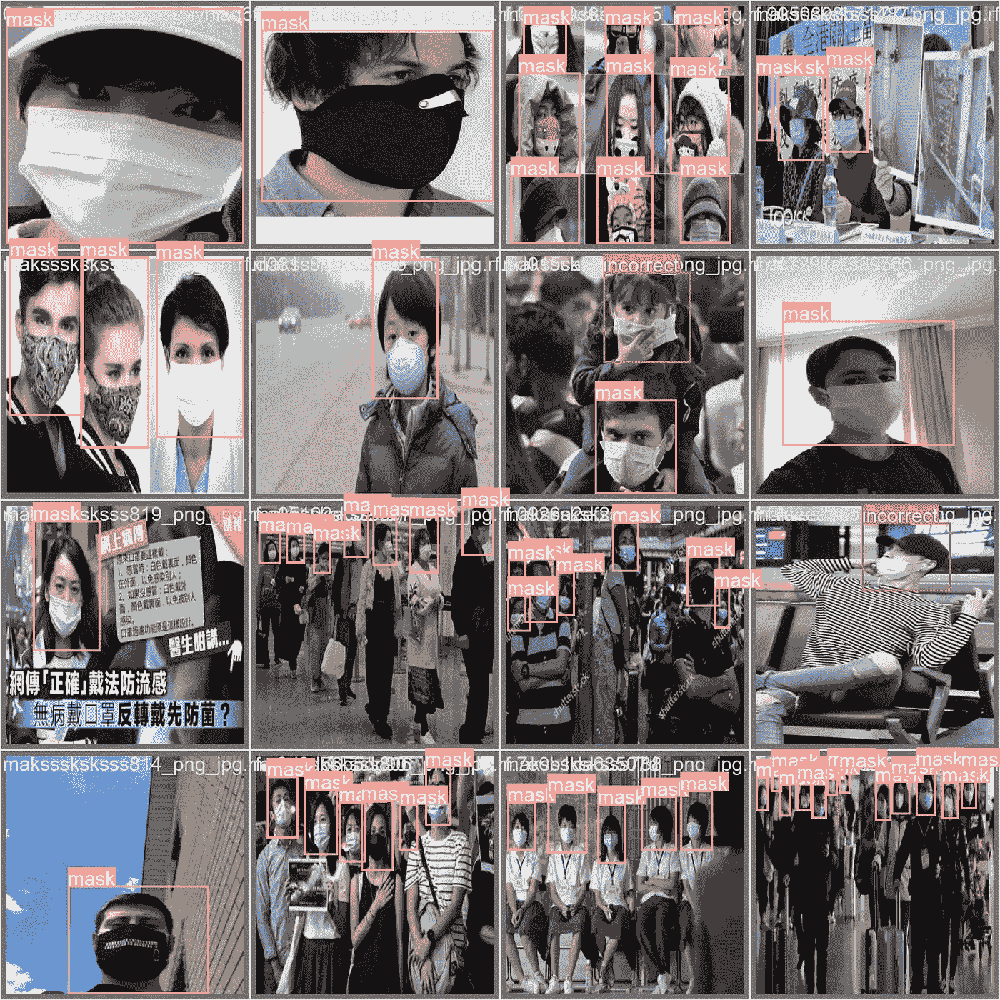

***Note****:* as you can see, the little girl on the second row, third column is wearing the mask with their nose showing, which is *incorrect*. We want our custom model to detect cases like these, which are also the hardest to represent, as there are a lot of pictures of people with and without masks, but there aren’t as many of people wearing masks incorrectly on the Internet; which causes our dataset to be imbalanced. We’ll talk about how to fix an imbalanced dataset in the next article.

我们将对大量图像遵循这一过程，希望我们的计算机成为我们的“第三只眼”，最终使用 CPU 或 GPU 资源来进行这些预测。

在今天的教程中，我们将特别关注如何标注这些数据。为了让机器学习(ML)模型正常工作，我们需要*教会*一个人戴着面具、没有戴面具以及面具戴错的时候是什么样子。我们将需要每个类的多个例子，我们将告诉计算机每个对象在图像中的位置，使用**边界框**(也就是我们试图检测的对象顶部的矩形)。

我将使用 [RoboFlow](https://roboflow.com) 来标记和收集数据。我发现这个平台明显比 CVAT、Label Studio 或其他任何“竞争对手”的标签工具要好。

我还可以选择使用通用模型或定制检测模型。我决定使用定制模型来解决这个挑战。

最后，我将使用 OCI (Oracle Cloud Infrastructure)来手动训练我的模型(在下一篇文章中会详细介绍)，并作为存储模型的最佳执行版本的地方。

所以，让我们开始吧！

# 为什么是定制型号？

定制检测机器学习(ML)模型可以在各种应用中提供许多好处。

*   当我们将这些模型与*通用*模型进行比较时，一个主要的好处是提高了准确性和性能。定制检测模型是专门为任务和手头的数据定制的，允许它们学习和适应数据中的特定特征和模式。这可以导致比前面提到的通用模型更高的精度和更好的性能，通用模型不是为任务定制的。
*   此外，定制的检测模型将需要较少的资源来*训练*它，以及在模型被训练后进行预测。
*   最后，没有一个通用的模型能够检测遮罩的位置，所以我们必须使用自定义模型。

# YOLOv5 是什么？

YOLO(你只看一次)是一个流行的实时对象检测系统，由约瑟夫·雷德蒙和阿里·法尔哈迪开发。这是 YOLO 系统的最新版本之一，于 2021 年发布。

和其他版本的 YOLO 一样， [YOLOv5](https://github.com/ultralytics/yolov5) 是为快速、准确、**实时**的物体检测而设计的。它使用*单*卷积神经网络(CNN)来预测图像或视频中对象的边界框和分类概率。该模型被训练来预测输入图像中对象的位置，并将它们分配给预定义的类别，例如“汽车”、“人”或“建筑物”

根据我的个人经验，尽管 YOLOv5 不是最新的检测系统，但它是具有最低*开放问题与关闭问题比率*的系统，这意味着，对于每个开放问题，超过 25 个问题已经被关闭。

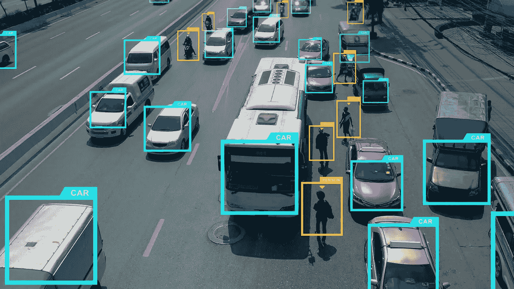

YOLOv5 通过使用更高效的网络架构和优化技术对以前的版本进行了改进，从而实现了更快、更准确的对象检测。它还包括在低功耗设备上运行的能力。

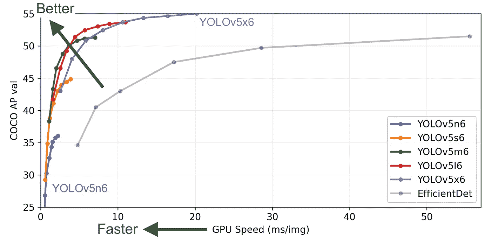

***Note****: this is a figure detailing the performance and accuracy of YOLOv5 compared to EfficientDet, and the* [*different variations of YOLOv5*](https://github.com/ultralytics/yolov5#why-yolov5) *(these are different checkpoints).*

YOLOv5 已被广泛采用，用于各种应用，包括自动驾驶汽车、机器人和安全系统，这就是为什么我决定从这个检测系统开始，而不是其他任何系统。

你可能会问自己:“为什么是 YOLOv5 而不是其他的？”嗯，我将 YOLOv5 与 YOLOv7 进行了比较，yolov 7 是在今年(2022 年)开发的，比 YOLOv5 更新。但目前其开/闭发行比 [3.59](https://github.com/WongKinYiu/yolov7/issues) ，*比 YOLOv5* 高 87 倍！。因此，我推荐 YOLOv5 入门，因为它是完整的，而且开源社区更多地基于这个项目。

# 创建数据集

当我开始从事这个项目时，我首先寻找的是数据。我需要数百张(如果不是数千张的话)以不同方式戴着面具的人的照片，并给他们贴上标签。但是，在没有任何帮助的情况下，从头开始创建这个数据集将需要我自己花费数十个小时来标记数据。

因此，我决定寻找一些有相同想法的项目，并试图将所有这些图像“协调”成一个单一的模型(希望是我的)。

我进入了 [RoboFlow Universe](https://universe.roboflow.com/) (他们的开源视觉 ML 数据集和 API 的集合)寻找一些已经标记的数据。

我发现这两个项目看起来非常有趣:

*   [拼接干净的计算机视觉项目](https://universe.roboflow.com/features-dataset/incorrect-mask-outside-mosiac-clean)外蒙片不正确，有 346 张图像准备训练，
*   [面罩计算机视觉项目](https://universe.roboflow.com/ditworkspace/face-mask-jk4nr)，3660 张图像(2800 张用于训练，800 张用于验证，75 张用于测试)

然而，第一个问题出现了:每个数据集的类都有*不同的标签*，这是我们不希望的:我们希望我们的模型只预测三个类。让我来演示一下:

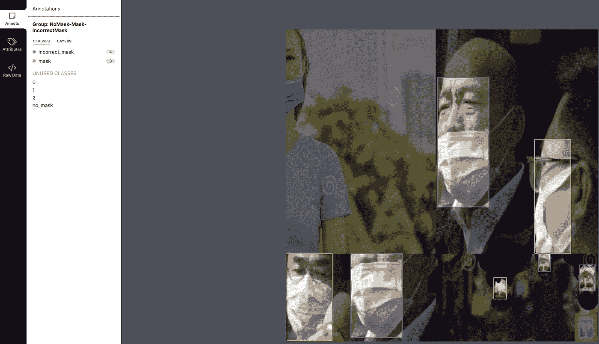

***Note****: example of an image from the first dataset. The corresponding labels were:* NoMask*,* Mask*,* IncorrectMask*.*

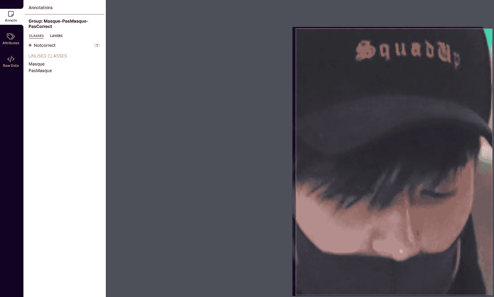

***Note****: example of an image from the second dataset. The corresponding labels were:* Masque*,* PasMasque*,* NotCorrect*.*

为了解决这个标签不匹配的问题，我将两个存储库都克隆到我的计算机上，并提取它们:

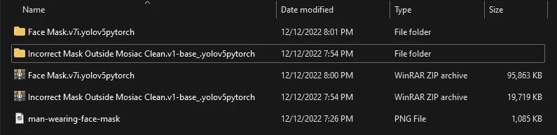

理论上，我们应该已经从数据集中下载了所有图像，这些图像被分成`train`、`test`和`validation`组。

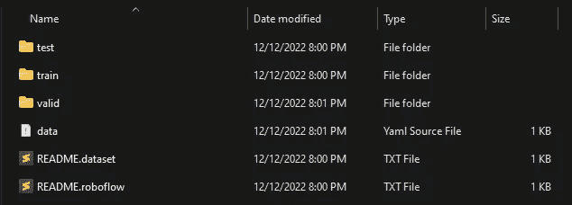

此外，我们有一个名为`data.yaml`的文件，其结构如下:

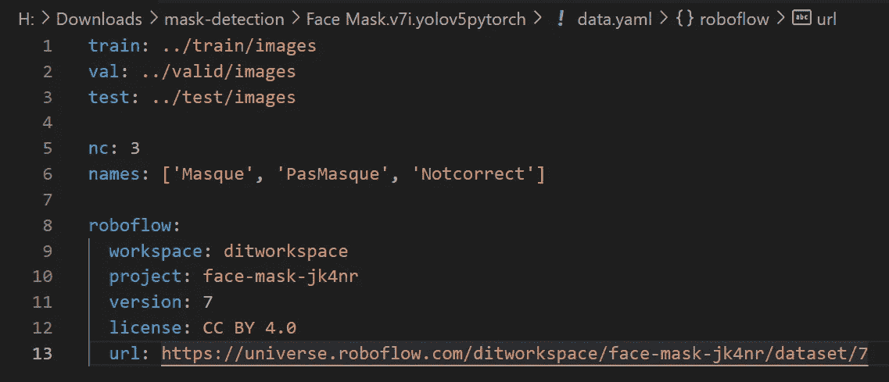

因此，我修改了 YAML 文件，以包含我想要的类名，确保标签的顺序也得以保留。我看了一些图片，确定 *PasMasque* 实际上代表了面具的缺失，其他的职业也正确的代表了。

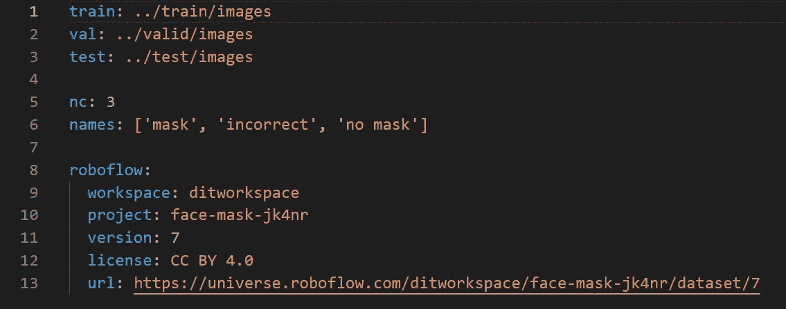

***Note****: modified YAML file. Also note that if the number of classes varies, we also have to modify the variable* ***nc*** *accordingly, which represents the total number of classes that the dataset is trained to recognize.*

我对第二个数据集做了同样的修改，一旦我的类的名字协调好了，我就进入 RoboFlow 并导入两个数据集。现在我们有了相同的数据集标签，它们工作得完美无缺，我的数据集已经增加到大约 2800 张图片。

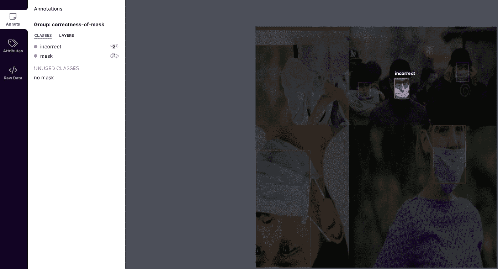

***Note****: after importing, I see all my images have been labeled correctly and are ready for training.*

# 扩充数据集

现在所有的数据标注都已经完成，我想提一下 RoboFlow 提供的另一个很棒的功能，那就是自动**数据集扩充**。

我访问了[我的 RoboFlow 公共项目](https://universe.roboflow.com/jasperan/public-mask-placement)，在 **Generate** 选项卡下生成了一个新的数据集版本:

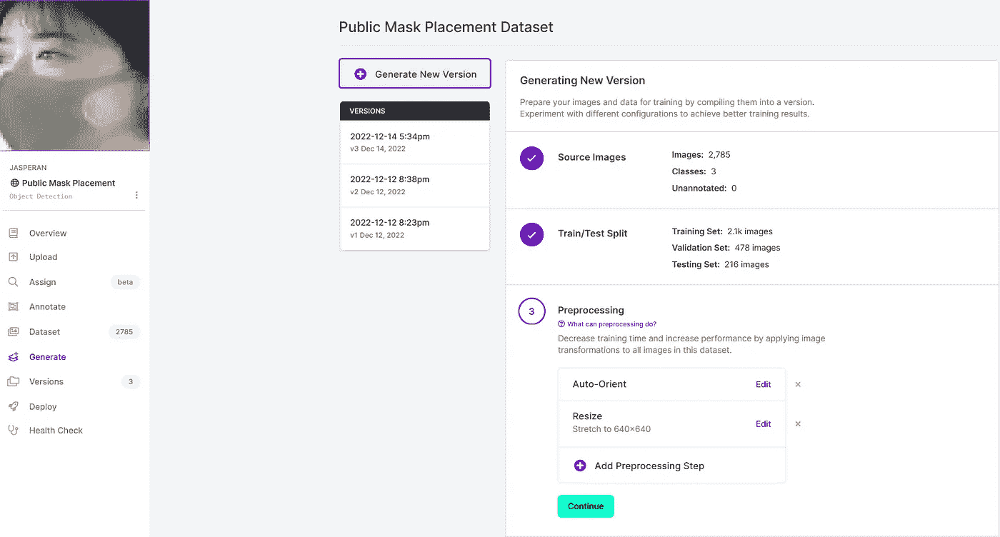

增强为您的模型创建新的训练示例以供学习。在第四步中，为了生成新的数据集，我选择了以下扩展:

*   **灰度**(应用于我 10%的训练数据):通过这个，我的目标是用旧的摄像机/硬件设备复制来自 CCTV 摄像机或视频源的可能的未来输入。希望在用灰度代替彩色训练了 10%的数据后，我还会允许 B & W 相机测试我的模型。
*   **虚化**(高达 1.25px):训练模型很好地对抗戴口罩的失焦人群。1.25 像素不是一个极端的变换，但它平滑边缘。
*   边界框**噪声**:这将噪声*添加到我的训练数据集中的边界框*内，并生成变化以帮助我的模型对相机伪影更有弹性。我还想在直接从 Twitch 流或类似的直播流源分析视频时“模拟”低比特率。

以下是不使用增强和使用增强之间的区别:

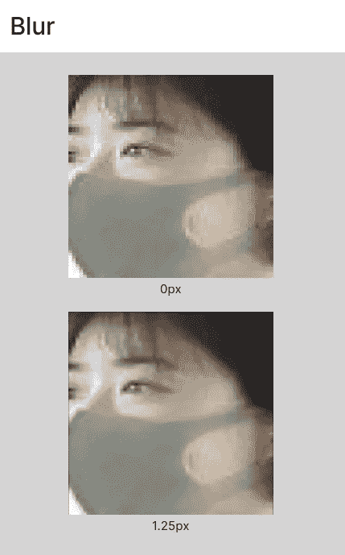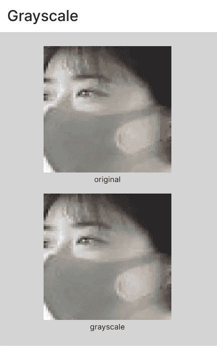

我发现的另一个非常有用的增强功能是**马赛克**增强功能，特别是如果你正在努力检测*小物体*的话，它将把几幅图像放在一起模拟马赛克，这样当这些物体占据屏幕的一小部分时，模型就会学习检测我们想要的物体。

最后，在应用了所有这些数据集增强之后，是时候让 RoboFlow 能够生成这些增强的图像了。感谢他们*惊人的*支持(谢谢 RoboFlow 团队！)，他们免费给了我一些训练积分，并允许我生成高达 *5x* 的增强(训练数据集中每幅图像 5 次增强):

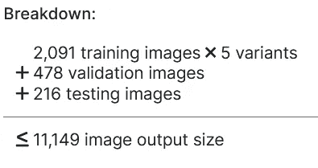

在生成这个新版本一段时间后，我们可以使用 RoboFlow 自动训练模型，并检查每个类的[平均精度(mAP)](https://learnopencv.com/mean-average-precision-map-object-detection-model-evaluation-metric/) ，包括一些其他有趣的统计数据，这些数据将有助于以后迭代我们的模型:

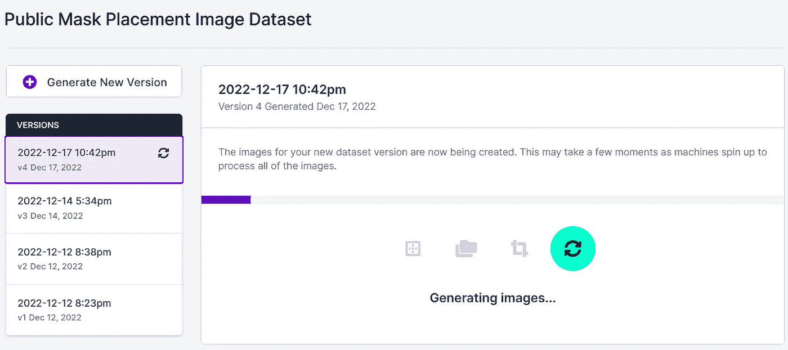

Generating Images

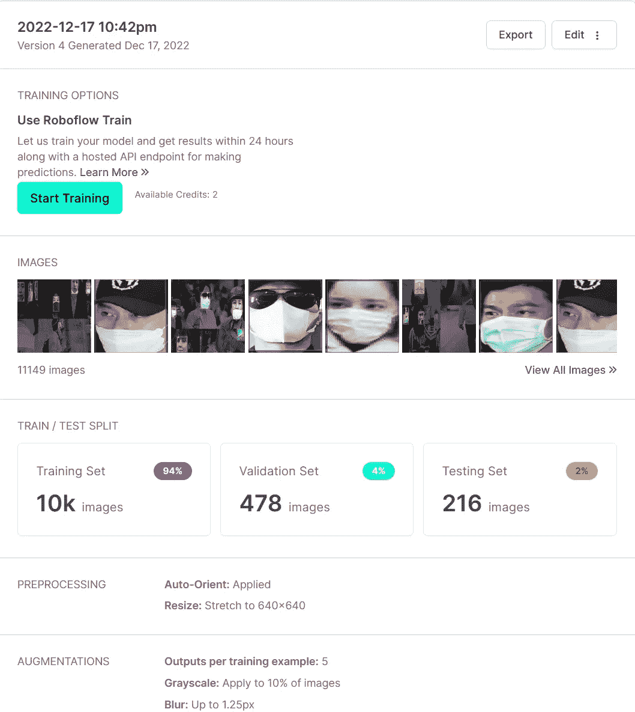

Generated Version

# 使用 RoboFlow 进行训练

因为我有一些免费的培训学分，所以我决定用其中一个来看看我的模型最初的表现如何:

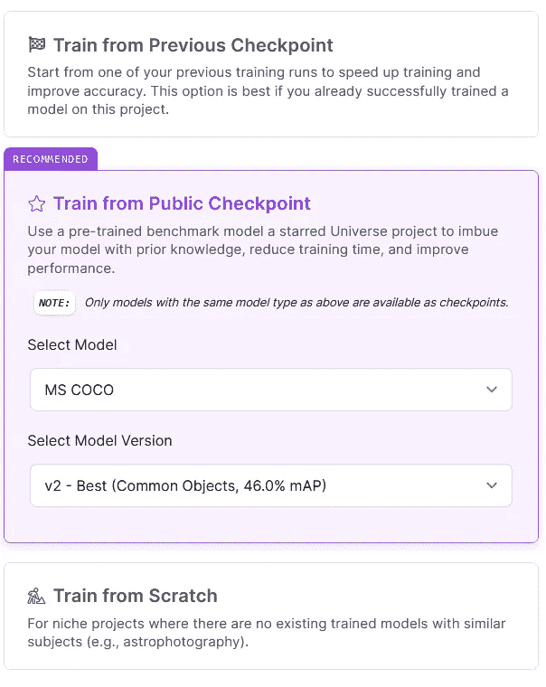

我决定从检查点开始训练，因为 COCO 数据集(具有 46.7%的地图)是一个非常著名的数据集，它已经用真实世界的数据进行了训练，这意味着参与检测元素的卷积神经网络将“知道”(至少以基本的方式)检测与人相对应的边缘和元素。

神经网络的最后一个时期将被我的定制模型教导来检测元素。

经过培训，我看到了以下内容:

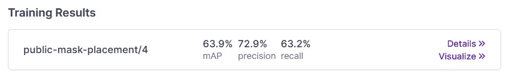

更详细地说，我们得到了按验证和测试集细分的平均精度:

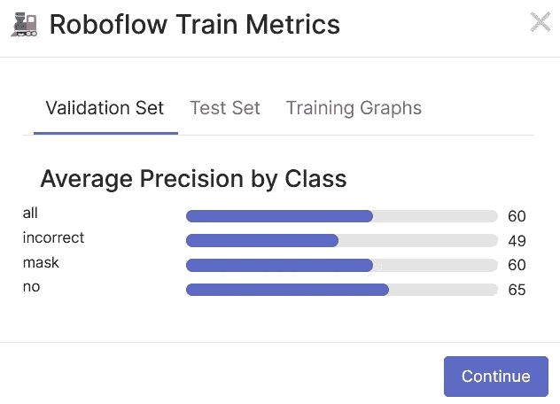

***Note****:* since the validation set had fewer pictures than the test set, and the validation set has a lower precision, this leads me to believe that the lower precision on the validation set is caused by having too few pictures, and not by the model being inaccurate on detections. We will fix this in the next article, where we will make a more balanced split for our dataset.

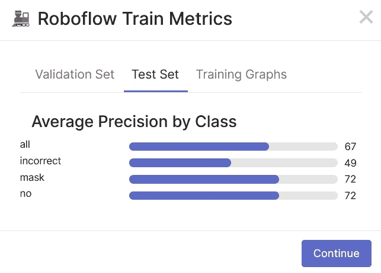

***Note****:* also note that — across validation and test set — the “incorrect” label has a constant precision of 49%. This makes sense, as it’s the hardest class to predict of the three — it’s very easy to see the difference between someone with our without a mask, but incorrectly-placed masks are harder to detect even for us. Thus, some pictures we may fail to be recognized as humans. We take note of this and we’ll find a way to try and improve the precision for this specific class in the future.

# 结论

训练之后，我们有了数据集的最终初始版本。这是培训期间所有指标的完整细节，由 RoboFlow 自动提供，但我将在下一篇文章中教您如何自己生成这些数据:

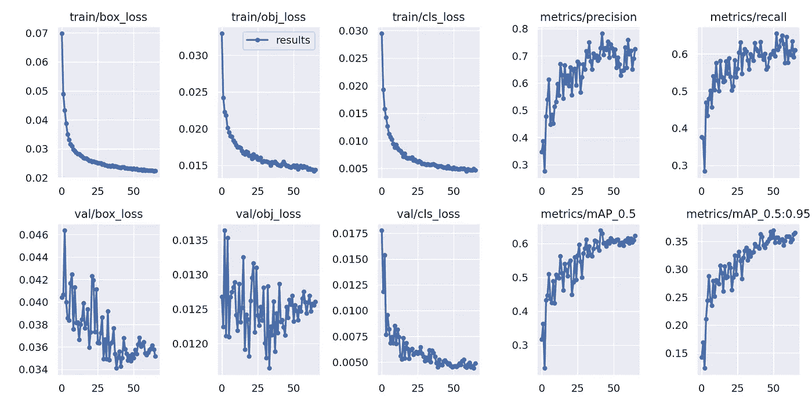

***Note****:* the lower the loss, the better. Loss is a metric that represents the inverse of accuracy. So the lower the accuracy, the higher the loss, and vice versa. We can also observe that the training loss decreases correctly; never increases, which is good, and both training and validation losses follow the same curve, which also means that overfitting or underfitting isn’t happening in our case.

最后，我通常喜欢检查一些东西，以查看我的模型是否经过适当的训练，这些东西是:

*   [ ]我的培训损失是否高于测试损失？->这将表明**不符合**。
*   [ ]我的培训损失是否低于测试损失？->这将表明**过度拟合**。

由于两个损失非常相似，我们可以得出结论，我们的模型非常适合，我们将努力改善每个类别的地图。

在下一篇文章中，我们将学习如何:

*   用图形处理器在 OCI 上从头开始训练这个面具检测模型的改进版本。
*   如何扩展/改进数据集并生成改进的 v2。
*   实时使用模型(通过摄像头、YouTube 之类的视频、标准视频或逐个图像)。

现在轮到你准备一些你想从头开始检测的东西了(我很感谢对我的数据集做出贡献的人)，并按照我在本教程中的步骤为 2023 年即将到来的事情做准备。

如果你像我一样对甲骨文开发人员在他们的自然栖息地发生的事情感到好奇，来加入我们公共 Slack 频道的[！](https://bit.ly/odevrel_slack)我们不介意成为你的鱼缸:热带鱼:

敬请关注…

# 感谢

*   **作者** — Nacho Martinez，数据科学倡导者@ Oracle DevRel
*   **最后更新时间/日期**—2022 年 12 月 22 日