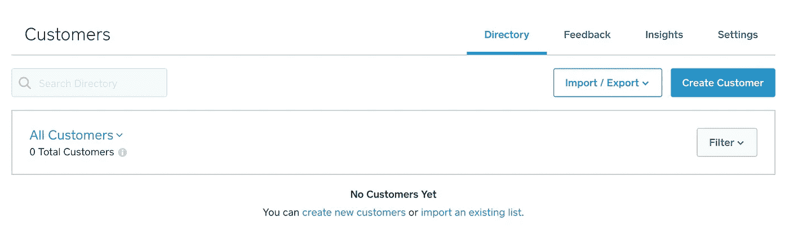
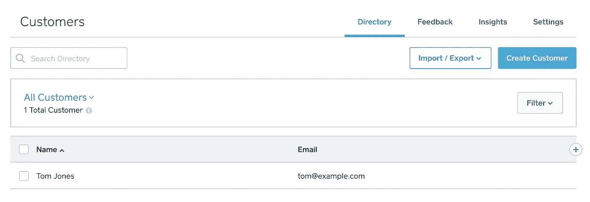

# 用 Ruby 创建客户

> 原文：<https://medium.com/square-corner-blog/creating-a-customer-with-ruby-48d15570d98f?source=collection_archive---------0----------------------->

## 用一个简单的 ruby 脚本就可以轻松地将客户添加到您的 Square 帐户中。

> 注意，我们已经行动了！如果您想继续了解 Square 的最新技术内容，请访问我们的新家[https://developer.squareup.com/blog](https://developer.squareup.com/blog)

No Customers Yet ☹️

当与其他系统同步、自动化营销任务等时，通过 API 进行客户管理非常有用。如果您的[客户目录](https://squareup.com/dashboard/customers/directory/all)看起来是空的，并且您想添加到其中，请看下面的 ruby 脚本:

这个脚本相当简单，因为 [Square 的 Ruby SDK](https://github.com/square/connect-ruby-sdk) 通过认证和解析从 API 返回的数据完成了大部分繁重的工作。你甚至可以用`ruby CreateCustomer.rb`从命令行轻松运行它。通过对脚本进行一些修改，您可以循环执行客户创建，从不同的数据库甚至是您过去创建的备份文件中导入您的客户。

就是这样！如果您有任何问题或评论，请随时通过 twitter 上的@ [SquareDev](https://twitter.com/SquareDev) 联系我们，或者查看[官方文档](https://docs.connect.squareup.com/api/connect/v2#endpoint-createcustomer)。

First customer ready to go!🥇