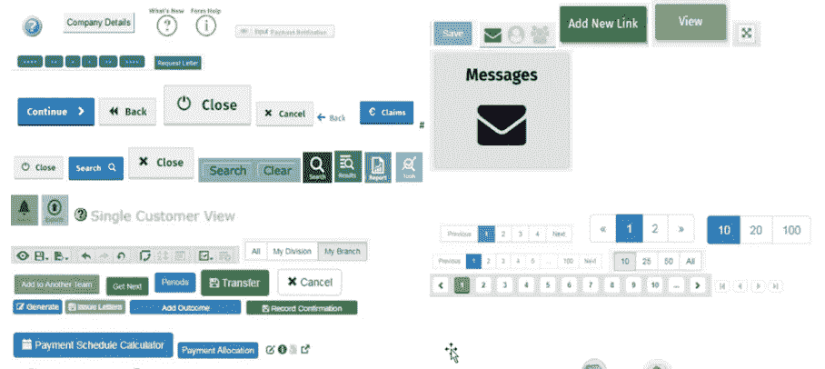
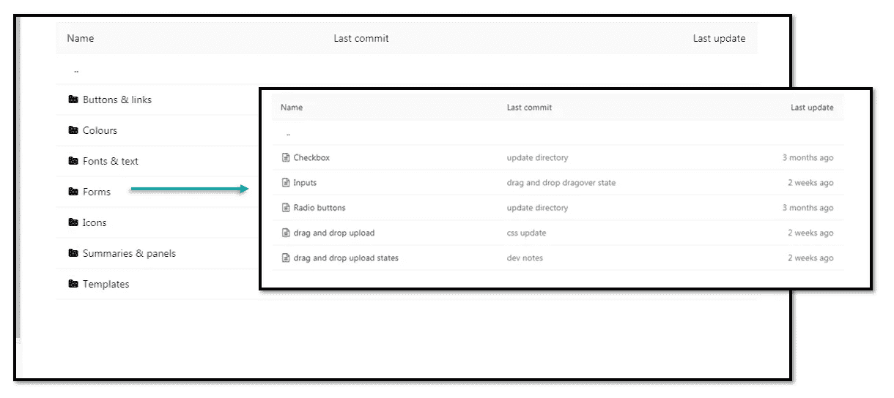
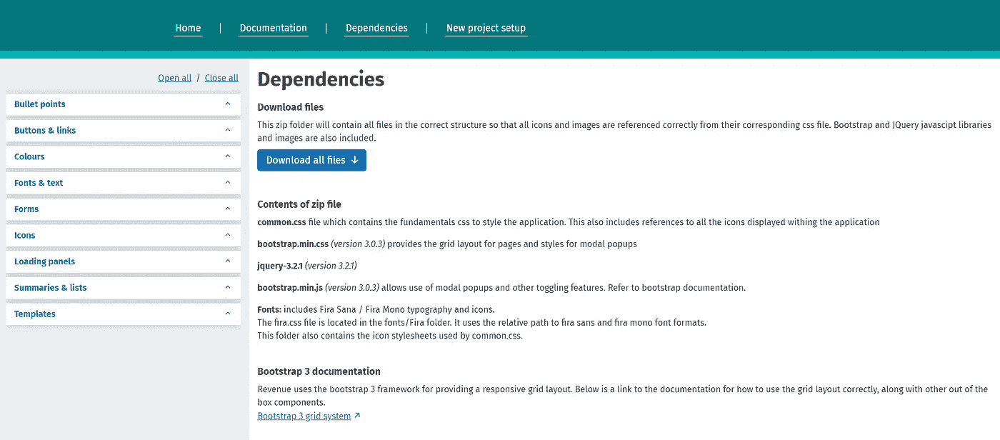
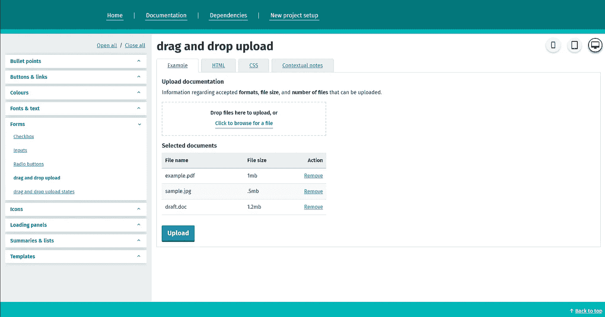
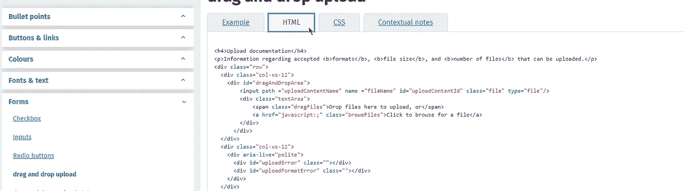
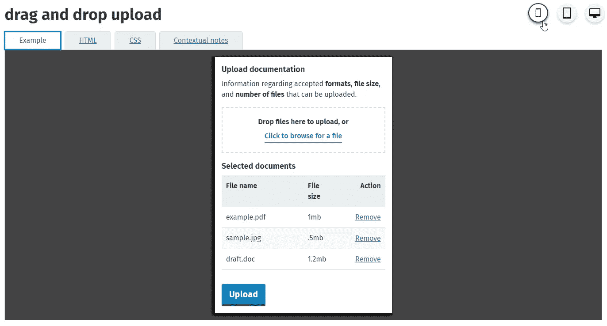
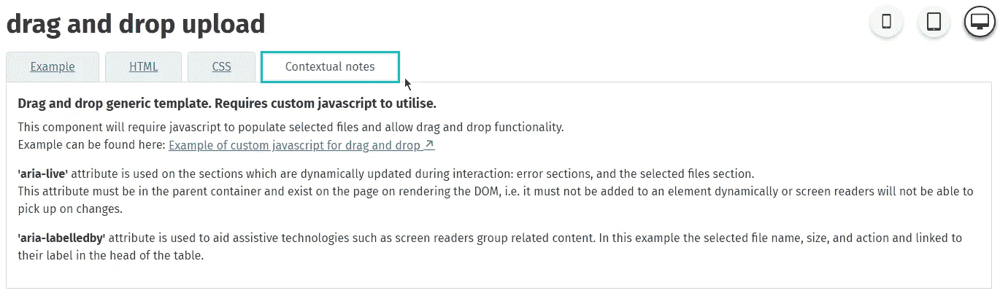

# 为公共部门创造一个设计系统

> 原文：<https://medium.com/version-1/creating-a-design-system-for-the-public-sector-3e25ababc274?source=collection_archive---------3----------------------->

Photo by [UX Store](https://unsplash.com/@uxstore?utm_source=medium&utm_medium=referral) on [Unsplash](https://unsplash.com?utm_source=medium&utm_medium=referral)

当涉及到确保一致的用户体验时，为包含不同应用程序和部门的大型公共部门客户工作会带来许多挑战。这对于我目前工作的客户来说尤其明显。

如下图所示，即使是最简单的项目(如按钮)缺乏一致性，会增加用户的认知负担，但也会增加开发人员不必要的开发工作和维护。

*Snippet from UX audit — multiple solutions for buttons*

该图像来自对客户系统的内部 UX 审计，所有应用程序都普遍存在类似问题。对于最终用户来说，当您在页面上的主要操作每一步都跳转到不同的位置时，复杂的过程会变得更加困难。对于开发人员来说，缺乏清晰的指导会导致含糊不清和浪费精力。当我们连最基本的都做不好的时候，我们怎么能建立一个顺畅高效的工作流程呢？

# 一个人能做些什么来改变呢？

我在多个敏捷团队中工作，改进一套相关应用程序的 UX，并为开发人员提供前端开发支持。我开始看到相同的问题和难题重复出现，所以我开始寻找可以改进以促进更好实践的更小的增量过程。

解决这些问题不仅仅是无私的。我想从重复中节省时间，但我也觉得我能给我的团队和其他人带来真正的价值。版本 1 积极追求“增值”计划，其客户直接关注这些类型的问题，即抓住日常痛点并提供解决方案。

下面，我强调了我每天遇到的一些关键问题，不仅仅是我自己，还有我团队中的其他开发人员:

*   现有的 UI 管理过程是 pdf 的传播，它没有提供如何实现代码的指导
*   没有设计师对开发人员的指导，团队就不会评估或迎合正确的 UI 实现
*   新的应用程序会从现有的 CSS 中复制并继承不必要的代码，这通常会导致编写更多的代码来覆盖它
*   没有适当的指导或治理，分歧和不一致就会出现，导致开发人员的困惑。
*   跨浏览器兼容性和可访问性通常在开发阶段的末尾进行测试，这可能为时已晚，无法进行更改。
*   用户体验和用户界面通常被认为是主观的，各个团队决定对一个需求稍有不同的解决方案。
*   屏幕之间的不一致看起来很糟糕，也没有很好地反映出客户的声誉

**如果你发现自己对这些问题点头附和**也许评估一下你的工作场所中围绕 UI/UX 治理的文化，**下面的解决方案也是你可以向你的团队提出的。**

# 设计系统的开端。

公司采用的一种解决方案是设计系统，将 UI 组件文档化到不同程度的可访问性、文档和代码。这是有价值的，但是可量化的时间节省通常很难证明其使用的合理性。我没有试图得到管理层的认可，而是开始从头开始解决问题，反复记录现有的组件，关注 HTML 和 CSS 的关键领域；可达性；UI/ UX 最佳实践；开发者指南。

开发人员的时间是一种宝贵的商品，所以我知道任何方法都需要无缝地适应现有的工作流程，让他们参与进来，同时保持简单，便于业务用户和新加入者使用。我继续使用大多数应用程序开发人员熟悉的技术。

Gitlab，被所有开发人员在客户端网站上用于版本控制，被用作我们的数据库。它将包含所有记录每个组件的静态 HTML 页面，包括必要的 HTML、带有特定于组件的 CSS 的样式标签，以及指南注释。这些页面中没有什么过于复杂的内容，只有 HTML、CSS 和 notes，每一个都包装在一个定制的标记中，供调用应用程序稍后解析。

*Gitlab directory of components. This would be used by our angular application to generate the navigation pane of our design system.*

前端是使用 Angular 构建的，它调用 GitLab API 来获取按类别分类的所有组件的列表，以创建导航窗格。任何额外的文档和研究以及依赖项都可以存储在一个中心位置进行分发。版本、权限和质量控制都由 GitLab 管理。GitLab 也可以用来分配和跟踪特性的状态，这样对启动和运行感兴趣但来自项目管理学科的人就可以参与进来，为更多的输入和牵引开辟道路。

## 通过应用程序的截图可以更容易地解释设计系统是如何工作的。

Along with sections for static documentation, a file with dependencies containing CSS and JavaScript could be downloaded with everything needed to import the components into an application.

*Users can navigate to view in detail any of the components. This navigation is created by the directory of content in GitLab*

*As well seeing a visual rendering of the component, users can get the code to implement it and review the associated CSS. Although the CSS would be provided in the dependencies download, this aids with developers’ understanding and is particularly useful for new joiners.*

*Responsive components are fundamental to modern web application and I built in functionality to preview how they would look on different screen sizes*

*Critically, additional information has been provided to inform users of the design system the ‘why’ and improve accessibility standards. This benefitted developers, testers, and business users with requirements for new functionality and best practices.*

# **团队和客户的利益**

总的来说，这给我的团队带来的好处是立竿见影的，客户的反馈总结如下:

> *“这使得团队中的开发人员能够保持一致的外观，同时减少前端开发和设计概念所花费的时间，并标准化任何新功能的用户体验。在某些情况下，它也被其他开发团队所采用，为如何使用设计系统来衡量所有部门的收益指明了方向。*

重要的是，除了基本的概念验证之外，我还找到了预算来增强它的功能，我可以每周分配一定的时间来开发设计系统。

我的团队体验到的显著和切实的好处包括:

*   开发人员对前端开发任务的估计更加准确
*   测试评估也得到了改进，预期行为的模糊性减少了
*   作为一个敏捷团队，我们可以“左移”很多开发和测试，比如跨浏览器测试和基本的可访问性
*   企业成员可以浏览现有的问题解决方案，更好地了解他们的需求
*   重复工作的减少和为新需求开发 UI 的速度加快
*   部门范围的样式、图标、字体、依赖项和文档集中在一个位置
*   CSS 的主文件没有任何膨胀，质量得到了保证
*   记录并重构了新组件，以便为开发人员提供最佳实践和指南
*   相关应用程序在动作和意义上的一致性
*   帮助加强 AA 无障碍标准

# **接下来的步骤**

在好处变得明显之后，对额外特性的需求开始了，这不是一个开发人员(我自己)能完成的。例如，与 Adobe XD 等设计工具的紧密集成、可导入 angular 应用程序的组件，以及其他部门的文档和审计。

正在开发一套新的应用程序，目的是将设计系统作为其设计、实施和管理的一个组成部分。这已经开始了组织向更好的 UI/ UX 治理的文化转变。理想情况下，我希望看到一个类似于 [GOVUK](https://design-system.service.gov.uk/) 的举措，对政府网络应用程序采用一种通用的、有凝聚力的方法，但迄今为止，从我第一次开始以来，这已经是一个巨大的飞跃。现在，随着客户的认可，以及之前从我的设计系统中获得的动力，这些将是令人兴奋的下一步。

**关于作者**

*Ian Slattery 目前是 Version 1 的爱尔兰数字和云实践的业务应用顾问。*