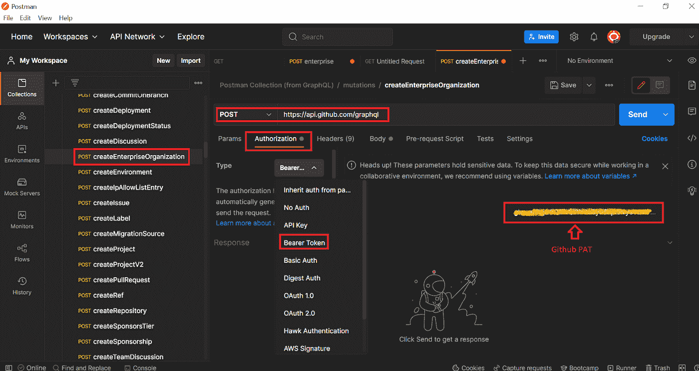

# 使用 GraphQL API 创建 GitHub 组织

> 原文：<https://medium.com/globant/creating-a-github-organization-using-graphql-api-ed407dc45b45?source=collection_archive---------0----------------------->

几周前，我偶然发现了一个利用 API 端点创建 GitHub 组织的目标。经过一番努力，终于找到了一个考虑 GraphQL API 的解决方案，并认为这是一个回报技术社区的好机会。

# **简介**

本文将回顾以下部分:

*   **GraphQL API**
*   **为什么使用 GraphQL API 而不是 REST API？**
*   **GraphQL 查询和变异操作**
*   **graph QL 端点**
*   **动手实验**
*   **结论**
*   **参考文献**

**GraphQL API**

GraphQL 是一种用于 API 的查询语言，通过使用我们现有的数据来完成查询，满足了当今前端应用程序的苛刻要求。作为 REST 的替代方案，GraphQL 允许开发人员在一个 API 调用中构造从多个数据源提取数据的请求。

**为什么使用 GraphQL API 而不是 REST API？**

GitHub 没有使用 REST API 创建组织的规定；但是，它有一个 GraphQL-endpoint 来执行同样的任务。GitHub GraphQL API 提供了比 REST API 更精确和灵活的查询，因此 GraphQL 成为了选择。

**GraphQL 查询和变异操作**

GitHub 的 GraphQL API 允许两种类型的操作

1.  **查询** —类似于 REST API 中的 GET 请求。
2.  **突变** —突变名称决定执行哪一个修改。它的操作类似于 REST API 中的 POST/PATCH/DELETE。

**graph QL 端点**

GitHub GraphQL API 有一个单一端点[**https://api.github.com/graphql**](https://api.github.com/graphql)

## **事不宜迟，我们开始吧！**

# 先决条件

在开始动手实验之前，我们应该确保以下先决条件列表。

1.  **GitHub 企业账户**
2.  **Postman 工具**—API 客户端
3.  **授权机制** — **具有管理员权限的 GitHub PAT** 【个人访问令牌】

# 动手实验

> **第一步**:登录 **GitHub 企业账号**，记下你的 GitHub 企业的 **Slug-Name** 。这里我的账号是“ **Glob-EMU** ”。其中 **slug** 是存储库名称的 URL 友好版本。

Capture Slug-name of GitHub Enterprise

> **步骤 2** :从下面提供的链接下载 GitHub GraphQL 的**公共模式— [公共模式— GitHub 文档](https://docs.github.com/en/graphql/overview/public-schema)**

Download public schema for GitHub GraphQL API

> **第三步:**将**公共模式**导入到 **Postman** 中，这是一个 API 客户端工具。
> 
> 打开 Postman 并点击“**导入**选项卡

Import Public schema into Postman

> **上传**在**步骤 2** 中下载的**公共模式文件**。

关闭提示，观察一个名为“**邮递员集合(来自 GraphQL)** 的集合。请扩展它，您将看到 GraphQL 查询和变体出现在您的 postman-collection 中。

> **第四步**:使用 **GraphQL 查询**操作检索 **GitHub Enterprise-ID** 。
> 
> 转到我们集合内的**查询**，点击“**企业**”。
> 
> 在授权**部分**中，将授权机制更新为**“无记名令牌**”，并输入 **GitHub PAT** 作为值。

Retrieve GitHub Enterprise ID

> 更新我们在**步骤 1 中捕获的企业的**Slug-name**,**主体**部分中的**，由**向**发送请求。

API 响应将显示为“ **200 OK** ”，这是成功的 HTTP 请求的标准响应。从 API 响应中捕获 **enterprise-ID** ，我们稍后将需要它。

> **第五步**:现在，让我们**使用**变异**创建一个 GitHub 组织**。
> 
> 转到我们集合中的**突变**并点击“**createEnterpriseOrganization”。**
> 
> 在授权**部分**中，将授权机制更新为**“无记名令牌**，并输入 **GitHub PAT** 作为值。

Create GitHub Organization

> 导航到**主体**部分，更新**图表变量**，如下所述
> 
> **“adminLogins”**—我们通过其创建 GitHub PAT[个人访问令牌]的管理员帐户。
> 
> **“账单邮件”**:管理员账户的邮件 ID
> 
> **"enterpriseId** ":拥有该组织的企业的 Id。
> 
> **“log in**”和“ **profileName** ”:要创建的组织的名称。
> 
> **向**发送请求。

API 响应将显示为“ **200 OK** ”。名为“**的 GitHub 组织 GlobPocOrganization** 应该已经在 GitHub 企业账户中创建了。

> **第六步**:确认在我们的企业账户中创建的 GitHub 组织，名称为“ **GlobPocOrganization** ”。

GitHub Organization Created

# 结论

GraphQL API 帮助我们系统地解决复杂的 API 场景，因此在创建 GitHub 组织中起着至关重要的作用，因此所有者和管理员可以更好地控制成员对组织数据和项目的访问，并具有复杂的安全性。

# 参考

**GitHub 组织**——[https://docs.github.com/en/organizations](https://docs.github.com/en/organizations)

**GitHub graph QL API**——[https://docs.github.com/en/graphql](https://docs.github.com/en/graphql)

> ***“不胫而走！”***