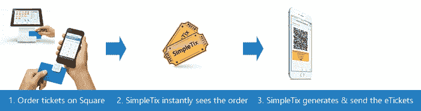
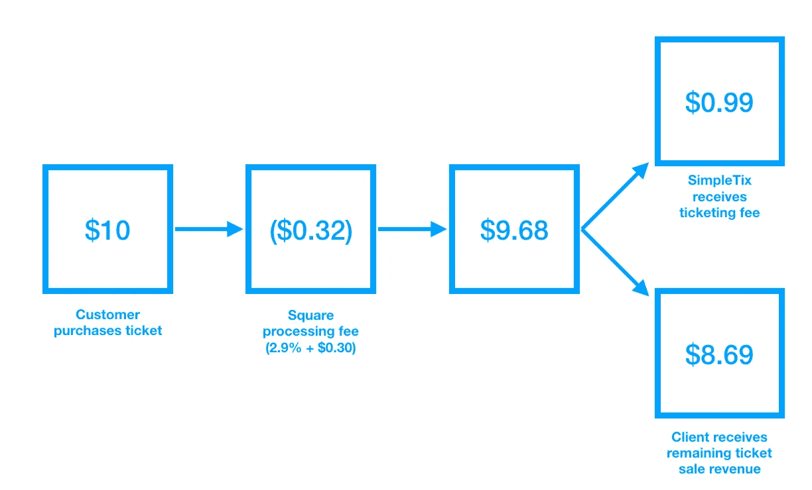

# 借助 Square APIs，为任何企业打造个性化的专业票务体验

> 原文：<https://medium.com/square-corner-blog/creating-a-personalized-professional-ticketing-experience-for-any-business-powered-by-square-apis-15108a2bf318?source=collection_archive---------5----------------------->

## SimpleTix 正在通过差异化的体验发展他们的平台，并通过 Square 的电子商务 API 利用新的多方结算功能。

> 注意，我们已经行动了！如果您想继续了解 Square 的最新技术内容，请访问我们在 https://developer.squareup.com/blog[的新家](https://developer.squareup.com/blog)

**打造独一无二的产品**

十多年前，SimpleTix 创始人 Aron Kansal 在大学时开始尝试一种活动票务解决方案。他最初在 Adobe Dreamweaver 中为加拿大的一个小剧院创建了一个售票页面，现在已经发展成为一个灵活的、为成千上万个场馆提供全面服务的售票平台。

坎萨尔在谈到创办 SimpleTix 时说:“作为一名自由网页设计师，我从自己的工作中了解到，许多场馆需要一种负担得起的方式来创造专业的活动票务体验。“随着 SimpleTix 的发展，我们推出了一款能够针对每个客户进行个性化定制的产品。”

与采用标准化方法的竞争对手相比，SimpleTix 将客户的品牌放在前端和中心，使售票页面看起来像是内部构建的。他们可以为[单个](http://katfishcornmaze.simpletix.com/)活动和节日创建一个单独的活动页面，或者为一个有全部活动的场所创建一个完整的[活动列表页面](https://filson.simpletix.com/Event-List/)。后一种选择看起来与客户网站上的任何其他页面完全一样，为最终客户创造一致的体验。他们还可以创建定制的座位表——这是出售指定座位活动门票的场馆的关键。

**与正方形整合**

SimpleTix 的客户是 Kansal 将其产品与 Square 集成的主要驱动力。他告诉我们:“纽约市的一家剧院真的促使我们将 Square 作为支付合作伙伴。他找到了[我们的电子商务 API](https://squareup.com/developers#ecommerce) ，很快就有了一个解决方案并开始运行。

Kansal 特别指出了 Square integration 的两个特点(除了满足日益流行的客户要求！).

首先，他喜欢 [oauth](https://docs.connect.squareup.com/api/oauth#navsection-oauth) 许可流程，这是一种无缝的入职体验。他的客户不需要复制和粘贴任何密钥或配置任何东西。Oauth 简单、安全且快速。此外，任何没有 Square 账户的人都可以在 SimpleTix 入职期间在几分钟内建立一个账户——比典型的支付注册过程简单得多。

其次，Square 的独特之处在于，它使他的场馆既可以在线销售(通过 SimpleTix)也可以面对面销售(通过 [Square 销售点](https://squareup.com/pos)),从而创建了一个集成的多渠道销售解决方案。他的许多客户使用 Square POS 在门口卖票，SimpleTix 能够将票直接发送到客户的手机上。

In addition to providing online ticket booking powered by Square, SimpleTix also enables its clients to use Square’s hardware and POS app to sell tickets at the door.

与 Square 的整合也为 SimpleTix 带来了新的业务:“我们从 Square 获得的线索比我们从任何其他合作伙伴那里获得的都多，”Kansal 说。“我们的大多数客户对我们的产品和广场整合非常满意，所以他们会将我们推荐给其他剧院经理、会议组织者和节日组织者。”仅仅几个月，他就有一波客户注册并使用 Square 作为他们的 SimpleTix 账户。

**多方交易实现**

随着通过 Square 的电子商务 API 推出多方交易功能，SimpleTix 增加了一种向客户收取统一的每张门票费用的方式，作为支付流程的一部分。这为 SimpleTix 提供了一个与客户增长相一致的收入流。当一项活动表现良好时，SimpleTix 也从他们提供的帮助客户成功的服务中受益。

他们的多方结算实现非常简单:

*(注:要了解更多有关实施您自己的在线支付多方结算解决方案的信息，请参见* [*公告博文*](/square-corner-blog/a-new-way-for-developers-to-monetize-on-squares-platform-5186a8109b9e) *中的说明)。)*

**接下来是什么？**

SimpleTix 希望下一步通过建立一个通过 Square 处理的 SimpleTix 销售点应用程序来亲自使用他们的平台。这将使他们能够利用 Square 的支付处理和硬件，为客户创造更具凝聚力的多渠道体验。